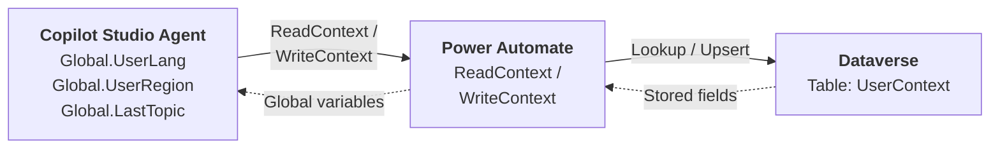
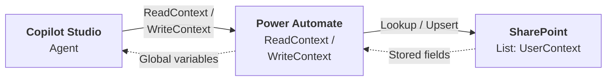
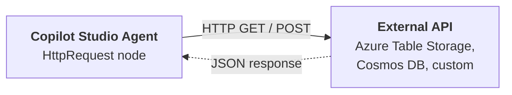

# Gem 001: Persisting User Context Across Sessions

*Remember who your users are and what they've done — even after the conversation ends.*

## Classification

| Attribute | Value |
| - | - |
| **Category** | Context & State |
| **Complexity** | ⭐⭐⭐ (Moderate — Power Automate or HTTP integration required) |
| **Channels** | All (with caveats for initialization — see Platform Gotchas) |
| **Prerequisite Gems** | None |

## The Problem

Copilot Studio conversations are **stateless by default**. Every time a user starts a new conversation, the agent has amnesia. Global variables, topic variables, conversation history — everything resets to empty.

This creates a frustrating experience for users who interact with the agent repeatedly:

- **Repetitive questions**: "What department are you in?" — asked every single session, even though the user answered it last week.
- **Lost preferences**: A user configured the agent to respond in French, but the next conversation defaults back to English.
- **No continuity**: "Last time I asked about the refund status for order #12345" — the agent has no idea what "last time" refers to.
- **Cold-start routing**: In multi-agent architectures, the orchestrator must re-detect the user's region or role every session (via Graph API or questions), even if it was already established yesterday.

The fundamental challenge is that Copilot Studio has **no built-in persistence mechanism between conversations**. Global variables live only within a single conversation session. Once the session ends, everything is gone.

You need to build your own persistence layer — and the way you do it depends on your infrastructure, licensing, and performance requirements.

## The Ideal Outcome

A persistence mechanism that gives the agent memory across conversation sessions:

- [ ] **Cross-session recall**: Data stored in conversation N is available in conversation N+1 for the same user
- [ ] **Automatic loading**: User context is loaded at conversation start without the user needing to do anything
- [ ] **Selective persistence**: The builder controls which data is persisted (not everything — just what matters)
- [ ] **User-scoped**: Each user's context is isolated from other users
- [ ] **Read and write**: Context can be both loaded at start and updated during conversation
- [ ] **Reasonable latency**: Context loading adds <3 seconds to conversation start

## Approaches

### Approach A: Dataverse Table via Power Automate

**Summary**: Store user context as rows in a Dataverse table, with a Power Automate flow that reads at conversation start and writes at key moments.  
**Technique**: Dataverse custom table, two Power Automate cloud flows (Read + Write), global variables for in-conversation access.

#### How It Works



At conversation start, the agent calls a "ReadContext" flow that looks up the user by their `System.User.Id` (or email) in the Dataverse table. The flow returns stored fields — preferred language, region, last topic, etc. — and the agent loads them into global variables.

During the conversation, when significant context changes (user updates a preference, completes a milestone), the agent calls a "WriteContext" flow that upserts the row in Dataverse.

#### Implementation

##### Step 1: Create the Dataverse table

In Power Apps → Tables → New Table:

| Column | Type | Description |
| - | - | - |
| `UserId` | Single line of text (Primary) | `System.User.Id` or UPN |
| `DisplayName` | Single line of text | User's name for personalization |
| `PreferredLanguage` | Choice (EN/FR/DE/...) | Language preference |
| `Region` | Single line of text | Detected or chosen region |
| `LastTopicName` | Single line of text | Last topic interacted with |
| `LastInteraction` | Date and Time | Timestamp of last conversation |
| `CustomData` | Multiple lines of text | JSON blob for extensible storage |

Set `UserId` as the **Alternate Key** for fast lookups.

##### Step 2: Create the ReadContext Power Automate flow

Trigger: *When an HTTP request is received* (or *Run a flow from Copilot*)

```Text
Trigger: Run a flow from Copilot
  Input: userId (Text)

Action: List Rows (Dataverse)
  Table: UserContext
  Filter: cr_userid eq '{userId}'
  Top Count: 1

Condition: length(outputs('List_Rows')?['body/value']) > 0
  Yes → Respond to Copilot:
    preferredLanguage: first(outputs('List_Rows')?['body/value'])?['cr_preferredlanguage']
    region: first(outputs('List_Rows')?['body/value'])?['cr_region']
    lastTopicName: first(outputs('List_Rows')?['body/value'])?['cr_lasttopicname']
    displayName: first(outputs('List_Rows')?['body/value'])?['cr_displayname']
    customData: first(outputs('List_Rows')?['body/value'])?['cr_customdata']
  No → Respond to Copilot:
    (return empty/default values — this is a new user)
```

##### Step 3: Create the WriteContext Power Automate flow

```Text
Trigger: Run a flow from Copilot
  Inputs: userId, displayName, preferredLanguage, region, lastTopicName, customData (all Text)

Action: List Rows (Dataverse)
  Table: UserContext
  Filter: cr_userid eq '{userId}'
  Top Count: 1

Condition: length(outputs('List_Rows')?['body/value']) > 0
  Yes → Update Row (Dataverse)
    Row ID: first(outputs('List_Rows')?['body/value'])?['cr_usercontextid']
    Set all fields from inputs
    LastInteraction: utcNow()
  No → Add Row (Dataverse)
    Set all fields from inputs
    LastInteraction: utcNow()
```

##### Step 4: Load context in agent instructions (M365 Copilot compatible)

Because `ConversationStart` topic doesn't fire in M365 Copilot (see [Gotchas Compendium — Channel Limitations](../appendices/gotchas-compendium.md#channel-limitations)), the safest approach is to load context via **agent instructions**:

```yaml
kind: GptComponentMetadata
displayName: My Agent
instructions: |+
  # Agent Behavior
  
  ## CRITICAL: Load User Context
  At the START of every new conversation, BEFORE answering the user's first question,
  you MUST call the "ReadUserContext" action with the current user's ID.
  
  Use the returned values to personalize your responses:
  - If `preferredLanguage` is set, respond in that language
  - If `region` is set, use it for routing decisions
  - If `lastTopicName` is set, you can reference their previous interaction
  
  ## Saving Context
  Whenever the user:
  - Expresses a language preference → call "WriteUserContext" to save it
  - Completes a significant task → call "WriteUserContext" with the topic name
  - Provides profile information → call "WriteUserContext" to persist it
```

##### Step 5: Alternative — Load context in ConversationStart topic (non-M365 channels)

For channels that support `ConversationStart` (Web Chat, Teams), you can also use a topic:

```yaml
kind: AdaptiveDialog
beginDialog:
  kind: OnConversationStart
  id: main
  actions:
    # Call ReadContext flow
    - kind: InvokeFlow
      id: loadUserContext
      flowId: "@environmentVariables('ReadContextFlowId')"
      inputs:
        userId: =System.User.Id
      outputVariable: Topic.StoredContext

    # Populate global variables from stored context
    - kind: SetVariable
      id: setLanguage
      variable: Global.PreferredLanguage
      value: =Topic.StoredContext.preferredLanguage

    - kind: SetVariable
      id: setRegion
      variable: Global.UserRegion
      value: =Topic.StoredContext.region

    - kind: SetVariable
      id: setLastTopic
      variable: Global.LastTopicName
      value: =Topic.StoredContext.lastTopicName

    - kind: SetVariable
      id: setDisplayName
      variable: Global.UserDisplayName
      value: =Topic.StoredContext.displayName

    # Personalized greeting
    - kind: ConditionGroup
      id: checkReturning
      conditions:
        - id: isReturning
          condition: =!IsBlank(Global.UserDisplayName)
          actions:
            - kind: SendActivity
              id: greetReturning
              activity:
                text:
                  - "Welcome back, {Global.UserDisplayName}! 👋"
      elseActions:
        - kind: SendActivity
          id: greetNew
          activity:
            text:
              - "Hello! I'm your assistant. How can I help you today?"

    # Save context update to log the new session
    - kind: InvokeFlow
      id: updateLastInteraction
      flowId: "@environmentVariables('WriteContextFlowId')"
      inputs:
        userId: =System.User.Id
        displayName: =Global.UserDisplayName
        preferredLanguage: =Global.PreferredLanguage
        region: =Global.UserRegion
        lastTopicName: =Global.LastTopicName
        customData: ""
```

##### Step 6: Write context at key moments

In any topic where meaningful context changes, call the WriteContext flow:

```yaml
    # After user selects a language preference
    - kind: InvokeFlow
      id: saveLanguagePref
      flowId: "@environmentVariables('WriteContextFlowId')"
      inputs:
        userId: =System.User.Id
        displayName: =Global.UserDisplayName
        preferredLanguage: =Topic.SelectedLanguage
        region: =Global.UserRegion
        lastTopicName: "LanguagePreference"
        customData: =Global.CustomData
```

#### Evaluation

| Criterion | Rating | Notes |
| - | - | - |
| Ease of Implementation | 🟡 | Requires Dataverse table + 2 Power Automate flows. Straightforward but multiple components. |
| Maintainability | 🟢 | Dataverse is well-tooled — schema changes via UI, built-in admin. Flows are simple read/write. |
| Channel Compatibility | 🟢 | Works in all channels. Use agent instructions (not ConversationStart) for M365 Copilot. |
| Scalability | 🟢 | Dataverse handles millions of rows. Built for enterprise workloads. |
| Cross-session Recall | 🟢 | Persistent by design — data survives indefinitely. |
| Latency | 🟢 | Dataverse reads are fast (<1 second). Power Automate adds ~1-2s overhead. |

#### Limitations

- **Dataverse license required**: Requires a Power Platform environment with Dataverse. Not available in all tenant configurations — particularly restrictive for personal/trial environments.
- **Power Automate dependency**: Two cloud flows to maintain. Flow run quotas apply (10K runs/month on standard license).
- **Schema rigidity**: Adding new fields means updating the table schema, both flows, and the agent's variable mapping. The `CustomData` JSON blob mitigates this for ad-hoc fields.
- **No real-time sync**: If a user has two simultaneous conversations (rare but possible), writes from one won't be visible in the other until next session.

---

### Approach B: SharePoint List via Power Automate

**Summary**: Use a SharePoint list as a lightweight key-value store for user context. Read/write via Power Automate flows.  
**Technique**: SharePoint Online list, two Power Automate cloud flows, global variables for in-conversation access.

#### How It Works

The architecture is identical to Approach A, but replaces Dataverse with a SharePoint list. This matters because SharePoint is available to virtually every Microsoft 365 tenant — no additional licensing is needed.



#### Implementation

#### Step 1: Create the SharePoint list

On any SharePoint site accessible to your Power Automate connections:

| Column | Type | Description |
| - | - | - |
| `Title` | Single line of text (built-in) | Used as `UserId` — user's UPN or System.User.Id |
| `DisplayName` | Single line of text | User's name |
| `PreferredLanguage` | Choice (EN/FR/DE/...) | Language preference |
| `Region` | Single line of text | Detected or chosen region |
| `LastTopicName` | Single line of text | Last topic interacted with |
| `LastInteraction` | Date and Time | Timestamp of last conversation |
| `CustomData` | Multiple lines of text (Plain) | JSON blob for extensible storage |

Create an **indexed column** on `Title` for fast lookups.

#### Step 2: Create the ReadContext Power Automate flow

```Text
Trigger: Run a flow from Copilot
  Input: userId (Text)

Action: Get Items (SharePoint)
  Site: [Your SharePoint site]
  List: UserContext
  Filter Query: Title eq '{userId}'
  Top Count: 1

Condition: length(outputs('Get_Items')?['body/value']) > 0
  Yes → Respond to Copilot:
    preferredLanguage: first(outputs('Get_Items')?['body/value'])?['PreferredLanguage']?['Value']
    region: first(outputs('Get_Items')?['body/value'])?['Region']
    lastTopicName: first(outputs('Get_Items')?['body/value'])?['LastTopicName']
    displayName: first(outputs('Get_Items')?['body/value'])?['DisplayName']
    customData: first(outputs('Get_Items')?['body/value'])?['CustomData']
  No → Respond to Copilot:
    (return empty/default values)
```

#### Step 3: Create the WriteContext Power Automate flow

```Text
Trigger: Run a flow from Copilot
  Inputs: userId, displayName, preferredLanguage, region, lastTopicName, customData

Action: Get Items (SharePoint)
  Filter Query: Title eq '{userId}'
  Top Count: 1

Condition: length(outputs('Get_Items')?['body/value']) > 0
  Yes → Update Item (SharePoint)
    ID: first(outputs('Get_Items')?['body/value'])?['ID']
    Set all columns from inputs
    LastInteraction: utcNow()
  No → Create Item (SharePoint)
    Title: userId
    Set all columns from inputs
    LastInteraction: utcNow()
```

#### Step 4: Agent integration

Identical to Approach A — use agent instructions for M365 Copilot, or ConversationStart topic for other channels. The YAML is the same; only the flow backing changes.

#### Evaluation

| Criterion | Rating | Notes |
| - | - | - |
| Ease of Implementation | 🟢 | SharePoint lists are familiar to most M365 users. No special setup or licensing. |
| Maintainability | 🟢 | Schema changes via SharePoint UI. List is visible, editable, exportable. |
| Channel Compatibility | 🟢 | Same as Approach A — all channels via agent instructions. |
| Scalability | 🟡 | SharePoint lists handle up to ~30M items, but queries slow down past ~5,000 items without indexed columns. Fine for most scenarios. |
| Cross-session Recall | 🟢 | Persistent — SharePoint data survives indefinitely with versioning. |
| Latency | 🟡 | SharePoint reads are slower than Dataverse (~1-3 seconds). Acceptable but noticeable. |

#### Limitations

- **SharePoint query performance**: Without indexed columns, queries degrade past ~5,000 rows. For large organizations (10K+ users), this becomes problematic. Create indexed columns on `Title`.
- **List threshold**: SharePoint's 5,000 item list view threshold can affect flow queries. Use OData filters to stay below the threshold.
- **No relational data**: SharePoint lists are flat. If you need relationships between context records (e.g., per-agent preferences), you'll need multiple lists or JSON in `CustomData`.
- **Concurrent write risk**: SharePoint doesn't have row-level locking. Simultaneous writes for the same user could cause data loss (last-write-wins). Rare in practice.
- **Power Automate dependency**: Same flow quota considerations as Approach A.

---

### Approach C: External REST API via HTTP Request Node

**Summary**: Use the `HttpRequest` node to call an external API (Azure Table Storage, Cosmos DB, or any REST endpoint) directly — no Power Automate needed.  
**Technique**: `HttpRequest` node in topic YAML, environment variables for API keys, external persistence store.

#### How It Works



No Power Automate in the loop. The agent calls the API directly. This removes a dependency and can reduce latency, but it requires the external API to exist and be reachable.

#### Implementation

#### Step 1: Set up the external store

The simplest option is **Azure Table Storage** (serverless, ~$0.01/month for small workloads):

Create a table `UserContext` with:

- **PartitionKey**: `"agent"` (or agent name, for multi-agent scenarios)
- **RowKey**: User ID (email or System.User.Id)
- **Columns**: `PreferredLanguage`, `Region`, `LastTopicName`, `DisplayName`, `LastInteraction`, `CustomData`

You'll need a small **Azure Function** (or API Management policy) as a facade to handle authentication and expose clean REST endpoints. Alternatively, use Azure Table Storage's REST API directly with a SAS token.

Example Azure Function endpoints:

- `GET /api/context/{userId}` — Returns stored context
- `PUT /api/context/{userId}` — Upserts context

#### Step 2: Store API credentials in environment variables

In the Copilot Studio solution, define environment variables:

```xml
<environmentvariabledefinition schemaname="agent_ContextApiBaseUrl">
  <defaultvalue>https://my-context-api.azurewebsites.net/api</defaultvalue>
</environmentvariabledefinition>

<environmentvariabledefinition schemaname="agent_ContextApiKey">
  <defaultvalue>[stored securely]</defaultvalue>
</environmentvariabledefinition>
```

#### Step 3: Read context via HTTP node

In the ConversationStart topic (or called from agent instructions via an explicit topic):

```yaml
    # Read stored user context
    - kind: HttpRequest
      id: http_readContext
      method: GET
      url: =Concatenate(Env.agent_ContextApiBaseUrl, "/context/", EncodeUrl(System.User.Id))
      headers:
        - key: "x-api-key"
          value: =Env.agent_ContextApiKey
        - key: "Accept"
          value: "application/json"
      responseType: json
      responseVariable: Topic.StoredContext
      errorHandling:
        continueOnError: true
        statusCodeVariable: Topic.HttpStatus
        errorResponseVariable: Topic.HttpError
      timeout: 5000

    # Check if context was loaded successfully
    - kind: ConditionGroup
      id: checkContextLoaded
      conditions:
        - id: success
          condition: =Topic.HttpStatus >= 200 && Topic.HttpStatus < 300 && !IsBlank(Topic.StoredContext)
          actions:
            - kind: SetVariable
              id: setLang
              variable: Global.PreferredLanguage
              value: =Topic.StoredContext.preferredLanguage

            - kind: SetVariable
              id: setRegion
              variable: Global.UserRegion
              value: =Topic.StoredContext.region

            - kind: SetVariable
              id: setName
              variable: Global.UserDisplayName
              value: =Topic.StoredContext.displayName

            - kind: SetVariable
              id: setLastTopic
              variable: Global.LastTopicName
              value: =Topic.StoredContext.lastTopicName
      elseActions:
        # First-time user or API error — proceed with defaults
        - kind: SetVariable
          id: setDefaultLang
          variable: Global.PreferredLanguage
          value: "EN"
```

#### Step 4: Write context via HTTP node

```yaml
    # Save updated user context
    - kind: HttpRequest
      id: http_writeContext
      method: PUT
      url: =Concatenate(Env.agent_ContextApiBaseUrl, "/context/", EncodeUrl(System.User.Id))
      headers:
        - key: "x-api-key"
          value: =Env.agent_ContextApiKey
        - key: "Content-Type"
          value: "application/json"
      body: |
        {
          "displayName": "{Global.UserDisplayName}",
          "preferredLanguage": "{Global.PreferredLanguage}",
          "region": "{Global.UserRegion}",
          "lastTopicName": "LanguagePreference",
          "customData": "{Global.CustomData}"
        }
      responseType: json
      responseVariable: Topic.WriteResult
      errorHandling:
        continueOnError: true
        statusCodeVariable: Topic.WriteStatus
      timeout: 5000
```

#### Step 5: Agent instructions for M365 Copilot

Same pattern as Approach A — instruct the agent to call a "LoadContext" topic before answering:

```yaml
instructions: |+
  ## CRITICAL: Load User Context
  At the START of every conversation, call the "LoadUserContext" topic 
  to retrieve the user's stored preferences and history.
```

#### Evaluation

| Criterion | Rating | Notes |
| - | - | - |
| Ease of Implementation | 🔴 | Requires building and hosting an external API. Most effort upfront. |
| Maintainability | 🟡 | External API is a separate codebase to maintain. But schema changes don't require Power Automate edits. |
| Channel Compatibility | 🟢 | HTTP nodes work in all channels. |
| Scalability | 🟢 | Azure Table Storage / Cosmos DB scale to billions of rows. Best scalability of all approaches. |
| Cross-session Recall | 🟢 | Persistent in external store. Fully controlled retention and backup. |
| Latency | 🟢 | Direct HTTP call eliminates Power Automate overhead. Fastest option (~200-500ms for Azure Table Storage). |

#### Limitations

- **External infrastructure required**: You must build, deploy, and maintain an API. This is overkill for simple agents.
- **Security complexity**: API keys, SAS tokens, or Managed Identity configuration. More attack surface than Dataverse/SharePoint.
- **No Power Platform integration**: Data isn't visible in Power Apps, Model-driven apps, or Power BI without additional integration.
- **Cold start latency**: Azure Functions on Consumption plan may have cold start delays (~2-5 seconds for first call). Use Premium plan or keep-alive pings to mitigate.
- **Cost**: Small but nonzero — Azure Functions + Table Storage. Negligible for low-volume, but scales with usage.

---

## Comparison Matrix

| Dimension | Approach A: Dataverse | Approach B: SharePoint | Approach C: HTTP API |
| - | - | - | - |
| **Implementation Effort** | 🟡 Medium (2-3 hours) | 🟢 Low (1-2 hours) | 🔴 High (4+ hours) |
| **Licensing Requirements** | 🔴 Dataverse license | 🟢 M365 only | 🟡 Azure subscription |
| **Query Performance** | 🟢 Fast (<1s) | 🟡 Moderate (1-3s) | 🟢 Fast (<500ms) |
| **Scalability (users)** | 🟢 Millions | 🟡 Thousands (indexed) | 🟢 Billions |
| **Power Platform Integration** | 🟢 Native (Power Apps, BI) | 🟡 Via connectors | 🔴 None built-in |
| **External Dependencies** | 🟡 Power Automate flows | 🟡 Power Automate flows | 🟡 External API/infra |
| **Schema Flexibility** | 🟡 Table schema + JSON blob | 🟡 List columns + JSON blob | 🟢 Fully flexible |
| **Data Visibility** | 🟢 Power Apps admin | 🟢 SharePoint UI | 🟡 Custom tooling |
| **Channel Support** | 🟢 All | 🟢 All | 🟢 All |
| **Best When...** | Power Platform-native org with Dataverse | M365-only org, small-medium user base | Pro-dev team with Azure, maximum performance |

## Recommended Approach

**For most scenarios**: **Approach A (Dataverse)** — if your organization has Dataverse available.

Dataverse is the canonical Power Platform persistence layer. It integrates naturally with Power Apps (for admin views), Power BI (for analytics), and Power Automate. Query performance is excellent, and the tooling for schema management is mature. If you're already in the Power Platform ecosystem, this is the path of least resistance long-term.

**Choose Approach B (SharePoint) when**: Your organization doesn't have Dataverse licenses, or you're building a prototype/internal tool where the simplest possible setup wins. SharePoint lists are available to every M365 tenant. Just watch for the 5,000-item threshold if you have many users — create indexed columns from the start.

**Choose Approach C (HTTP API) when**: You have a pro-dev team with Azure expertise and need maximum flexibility — custom schemas, sub-second latency, or integration with non-Microsoft systems. This is also the right choice if your agent persists data for a non-Power-Platform audience (e.g., context shared with a custom web app, mobile app, or other agents outside Copilot Studio).

**A practical default**: Start with **Approach B (SharePoint)** for prototyping (zero licensing friction), then graduate to **Approach A (Dataverse)** for production if your Power Platform environment supports it.

## Platform Gotchas

> [!WARNING]
> **ConversationStart topic does NOT fire in M365 Copilot** (see [Gotchas Compendium](../appendices/gotchas-compendium.md#channel-limitations)).  
> If you load context in `OnConversationStart`, it will work in Web Chat and Teams but silently fail in M365 Copilot. **Always implement context loading in agent instructions as the primary mechanism.** Use ConversationStart as a supplementary path for channels that support it (e.g., to show a personalized greeting).

> [!WARNING]
> **`System.User.Id` format varies by channel.**  
> In Teams, it's an AAD Object ID. In Web Chat, it may be a session-specific ID. In M365 Copilot, it's typically the AAD Object ID. Always test which identifier you receive in your target channel and use a stable, consistent key (UPN via Graph API is the safest universal identifier).

> [!WARNING]
> **Global variables reset between conversations — that's the whole point of this Gem.**  
> Don't assume `Global.PreferredLanguage` persists. If the context-loading flow fails silently, the agent will run with empty globals. Always set sensible defaults in the `elseActions` branch of your context-loading logic.

> [!NOTE]
> **Power Automate flow runs count against your quota.**  
> Each conversation start triggers at least one flow run (ReadContext). If your agent has 1,000 conversations/day, that's 1,000 flow runs just for loading context. Plan your flow licensing accordingly. Approach C (HTTP) avoids this entirely.

> [!NOTE]
> **SharePoint list indexing is not automatic.**  
> You must manually create indexed columns on your lookup field (e.g., `Title`). Without indexing, queries degrade sharply past 5,000 items. Go to List Settings → Indexed Columns → Create New Index.

## Related Gems

- **[Gem 002](GEM-002-persona-adaptive-agent-instructions.md)**: Persona-Adaptive Agent Instructions — Builds on persisted user context to dynamically adjust agent behavior (language, tone, expertise level)
- **[Gem 004](GEM-004-debug-mode-for-m365-copilot.md)**: Debug Mode for M365 Copilot Channel — The `Global.DebugMode` preference could be persisted across sessions using the patterns in this Gem, so admins don't re-enable debug mode every conversation

## References

- [Microsoft Learn: Use Dataverse with Copilot Studio](https://learn.microsoft.com/en-us/microsoft-copilot-studio/advanced-connectors)
- [Microsoft Learn: Power Automate cloud flows in Copilot Studio](https://learn.microsoft.com/en-us/microsoft-copilot-studio/advanced-flow)
- [Microsoft Learn: SharePoint connector in Power Automate](https://learn.microsoft.com/en-us/connectors/sharepointonline/)
- [Microsoft Learn: HTTP Request node](https://learn.microsoft.com/en-us/microsoft-copilot-studio/authoring-http-node)
- [Microsoft Learn: System variables (System.User)](https://learn.microsoft.com/en-us/microsoft-copilot-studio/authoring-variables#system-variables)
- [Azure Table Storage pricing](https://azure.microsoft.com/en-us/pricing/details/storage/tables/)

---

*Gem 001 | Author: Sébastien Brochet | Created: 2026-02-17 | Last Validated: 2026-02-17 | Platform Version: current*
