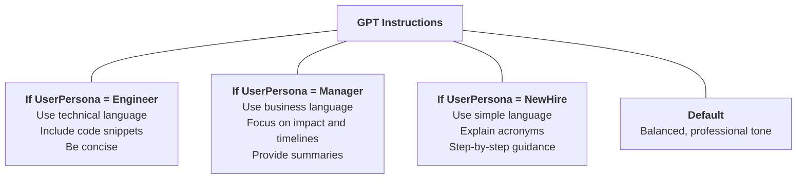
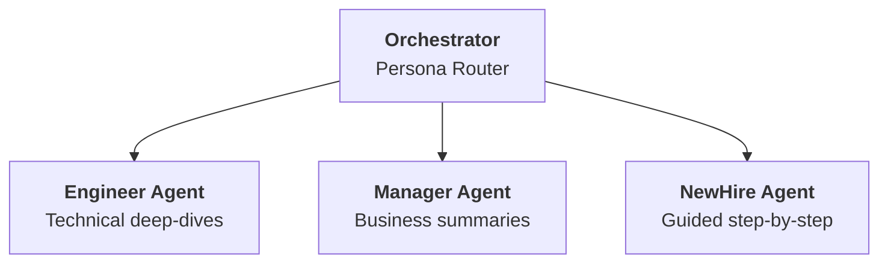
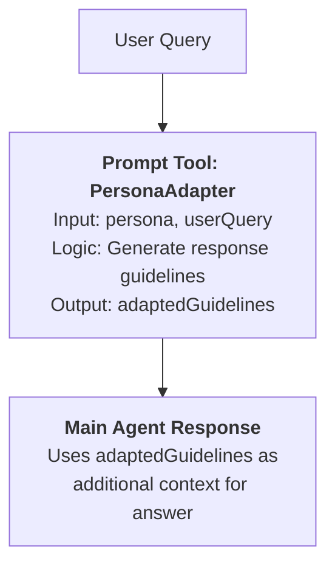

# Gem 002: Persona-Adaptive Agent Instructions

*Make your agent a chameleon — adjusting tone, depth, language, and behavior based on who it's talking to.*

## Classification

| Attribute | Value |
| - | - |
| **Category** | Personalization |
| **Complexity** | ⭐⭐⭐ (Moderate — persona detection + conditional instructions) |
| **Channels** | All (with M365 Copilot caveats for initialization) |
| **Prerequisite Gems** | [Gem 001](GEM-001-persisting-user-context-across-sessions.md) (for persistent persona across sessions) |

## The Problem

A single set of agent instructions is a one-size-fits-all experience. But real users are diverse:

- **A senior engineer** asks "What's the deployment pipeline architecture?" and expects a precise, technical deep-dive. The same agent should not explain what CI/CD means.
- **A new hire** asks "How do I deploy my code?" and needs step-by-step guidance with context. The agent should not respond with "Run `az pipelines run --name release-prod`" and assume they know what that means.
- **An HR manager** asks about the PTO policy and expects a concise, authoritative answer. Not a developer-oriented response full of caveats about engineering sprint schedules.
- **A French employee** expects the agent to respond in French by default. Not to be asked "What language do you prefer?" every single time.

The core challenge: **Copilot Studio agent instructions are static**. They're defined once in the GPT component YAML and apply identically to every user in every conversation. There's no built-in mechanism to say "if the user is an engineer, behave like this; if they're from HR, behave like that."

You need to make the instructions effectively dynamic — injecting persona-specific behavior at runtime while keeping the architecture maintainable as the number of personas grows.

## The Ideal Outcome

An agent that adapts its behavior based on the user's persona:

- [ ] **Automatic detection**: The user's persona is identified without asking (or with minimal questions on first interaction)
- [ ] **Behavioral adaptation**: The agent adjusts tone, vocabulary, detail level, and response language per persona
- [ ] **Maintainable configuration**: Adding a new persona doesn't require rewriting the entire instruction set
- [ ] **Graceful fallback**: If persona detection fails, the agent defaults to a reasonable "general user" behavior
- [ ] **Transparent to the user**: The adaptation feels natural — users shouldn't feel like they're being "categorized"

## Approaches

### Approach A: Persona-Branched Instructions in GPT Component

**Summary**: Define all persona variations directly in the main agent instructions (GPT component), using conditional Markdown sections. The agent selects the right behavioral section at runtime based on a global variable.  
**Technique**: GPT `instructions` field with persona sections, Power Automate or Graph API for persona detection, global variables.

#### How It Works

The agent's system prompt contains a "behavioral router" — multiple persona profiles written inline. A global variable (`Global.UserPersona`) is set at conversation start (via Graph API, persisted context from [Gem 001](GEM-001-persisting-user-context-across-sessions.md), or user selection). The agent follows the instructions matching that persona.



The LLM reads the entire instruction set but follows the section matching the current persona. This works because LLMs are excellent at conditional instruction following.

#### Implementation

##### Step 1: Detect the user's persona

Use one or more of these signals (in priority order):

| Signal | Source | Reliability | Setup |
| - | - | - | - |
| Persisted preference | [Gem 001](GEM-001-persisting-user-context-across-sessions.md) (Dataverse/SharePoint) | 🟢 High (user-confirmed) | Requires [Gem 001](GEM-001-persisting-user-context-across-sessions.md) |
| Job title / department | Graph API via Power Automate | 🟡 Medium (may be stale) | Power Automate flow |
| User's Entra ID groups | Graph API group membership | 🟢 High (admin-managed) | Power Automate flow |
| Explicit user choice | Question node at start | 🟢 High (direct) | Simple but adds friction |

**Graph API persona detection flow** (extend the ReadContext flow from [Gem 001](GEM-001-persisting-user-context-across-sessions.md)):

```Text
Action: HTTP to Microsoft Graph
  Method: GET
  URI: https://graph.microsoft.com/v1.0/users/{userId}?$select=jobTitle,department

Action: Map to Persona (Switch)
  jobTitle contains "Engineer|Developer|Architect" → "Engineer"
  jobTitle contains "Manager|Director|VP"         → "Manager"
  department equals "Human Resources"              → "HR"
  department equals "Legal"                        → "Legal"
  default                                          → "General"
  
Output: persona (string)
```

##### Step 2: Set the global variable

In agent instructions (M365 Copilot compatible):

```yaml
kind: GptComponentMetadata
displayName: Adaptive Agent
instructions: |+
  # Agent Behavior
  
  ## CRITICAL: Detect User Persona
  At the START of every conversation, call the "GetUserContext" action.
  Store the returned `persona` value. Use it to select your behavioral profile below.
  
  If the action fails or returns no persona, use the "General" profile.
```

Or via ConversationStart topic (non-M365 channels):

```yaml
kind: AdaptiveDialog
beginDialog:
  kind: OnConversationStart
  id: main
  actions:
    - kind: InvokeFlow
      id: getUserPersona
      flowId: "@environmentVariables('GetUserContextFlowId')"
      inputs:
        userId: =System.User.Id
      outputVariable: Topic.UserContext

    - kind: SetVariable
      id: setPersona
      variable: Global.UserPersona
      value: =If(IsBlank(Topic.UserContext.persona), "General", Topic.UserContext.persona)
```

##### Step 3: Write persona-branched instructions

The key is structuring instructions so the LLM follows only the matching section:

```yaml
kind: GptComponentMetadata
displayName: Adaptive Agent
instructions: |+
  # Adaptive Agent Instructions
  
  You are an intelligent assistant for Contoso employees. Your behavior adapts
  based on the user's persona (stored in the conversation context).
  
  ## Persona Profiles
  
  ### When the user's persona is "Engineer"
  - **Tone**: Direct, technical, peer-to-peer
  - **Vocabulary**: Use technical terms freely (API, CI/CD, latency, throughput)
  - **Detail level**: High — include configuration examples, code snippets, CLI commands
  - **Response format**: Prefer code blocks and bullet points over paragraphs
  - **Assumptions**: User understands the tech stack. Don't explain basic concepts.
  - **Example**: "To trigger a pipeline re-run: `az pipelines run --name release-prod --branch main`"
  
  ### When the user's persona is "Manager"
  - **Tone**: Professional, outcome-focused
  - **Vocabulary**: Business language — impact, timeline, risk, stakeholders
  - **Detail level**: Medium — summaries with option to drill down
  - **Response format**: Start with the bottom line, then provide context
  - **Assumptions**: User cares about WHAT and WHEN, less about HOW
  - **Example**: "The deployment will be ready by Thursday. Two items are blocking: security review and load testing."
  
  ### When the user's persona is "NewHire"
  - **Tone**: Friendly, supportive, encouraging
  - **Vocabulary**: Simple language — define acronyms on first use
  - **Detail level**: Maximum — step-by-step with screenshots/links where available
  - **Response format**: Numbered steps, explain WHY each step matters
  - **Assumptions**: User may not know internal tools or processes
  - **Example**: "CI/CD (Continuous Integration/Continuous Deployment) is how we automatically test and deploy code. Here's how to use it: 1. First, go to..."
  
  ### When the user's persona is "HR"
  - **Tone**: Formal, policy-oriented
  - **Vocabulary**: HR terminology — compliance, policy, leave entitlement
  - **Detail level**: Cite specific policy documents and sections
  - **Response format**: Structured with policy references
  - **Assumptions**: User wants authoritative, citable answers
  - **Example**: "Per Policy HR-2024-PTO, Section 3.2: Employees with 2+ years tenure are entitled to 25 days PTO."
  
  ### Default (persona is "General" or unknown)
  - **Tone**: Balanced, professional, approachable
  - **Vocabulary**: Avoid jargon — explain technical terms if used
  - **Detail level**: Medium — provide enough context without overwhelming
  - **Response format**: Clear paragraphs with key points highlighted
  - **Assumptions**: Mixed expertise — provide context but don't over-explain
  
  ## Universal Rules (apply to ALL personas)
  - Always cite sources when referencing policies or documentation
  - Never fabricate information — say "I don't have that information" if unsure
  - Offer to clarify or provide more detail if the response might not match the user's level
  - Respect confidentiality — never share one user's data with another
```

##### Step 4: Persist the detected persona (link to [Gem 001](GEM-001-persisting-user-context-across-sessions.md))

After detecting the persona, save it via [Gem 001](GEM-001-persisting-user-context-across-sessions.md)'s WriteContext pattern so it persists across sessions:

```yaml
    - kind: InvokeFlow
      id: savePersona
      flowId: "@environmentVariables('WriteContextFlowId')"
      inputs:
        userId: =System.User.Id
        preferredLanguage: =Global.PreferredLanguage
        region: =Global.UserRegion
        lastTopicName: =Global.LastTopicName
        customData: ="{""persona"": """ & Global.UserPersona & """}"
```

#### Evaluation

| Criterion | Rating | Notes |
| - | - | - |
| Ease of Implementation | 🟢 | Once persona detection exists, the instructions are just Markdown sections. No code, no flows for the behavioral part. |
| Maintainability | 🟡 | All personas in one instruction block. Easy to read, but the instructions grow large (token cost) as personas increase. |
| Channel Compatibility | 🟢 | Works in all channels. Instructions are channel-agnostic. |
| Scalability | 🟡 | Works well for 3-6 personas. Beyond 8-10, the instruction block becomes unwieldy and may exceed effective token window. |
| Automatic Detection | 🟡 | Depends on Graph API data quality. Job titles are inconsistent across organizations. |
| Graceful Fallback | 🟢 | Default persona section guarantees sensible behavior when detection fails. |

#### Limitations

- **Token saturation**: Every persona's instructions are included in every conversation, even though only one is used. With 8+ personas, the system prompt becomes very long, potentially reducing response quality.
- **LLM compliance is probabilistic**: The model *usually* follows the right section, but complex or ambiguous queries may cause bleed between personas. The more clearly sections are delineated, the better.
- **No runtime instruction changes**: If the user's role changes mid-conversation (e.g., "Actually, I'm asking as a manager, not an engineer"), the persona is already set. Handling mid-conversation persona switches requires additional logic.
- **Job title inconsistency**: "Sr. Software Engineer," "Software Developer III," "Platform Engineer" — all map to "Engineer" but require fuzzy matching in the detection flow.

---

### Approach B: Multi-Agent Persona Routing

**Summary**: Create separate specialist agents per persona, each with tailored instructions and knowledge sources. An orchestrator routes to the right specialist based on the detected persona.  
**Technique**: Multiple child agents (one per persona), orchestrator agent with routing logic, per-agent knowledge and instructions.

#### How It Works



Each child agent has:

- Its own tailored instructions (tone, vocabulary, detail level)
- Optionally, its own knowledge sources (e.g., Engineer agent can access API docs; Manager agent focuses on project status docs)
- A focused system prompt that stays within the effective token window

The orchestrator detects the persona and routes all queries to the matching specialist for the entire conversation.

#### Implementation

##### Step 1: Create persona-specific child agents

Each agent is a standalone `AgentDialog` component:

**Engineer Agent:**

```yaml
kind: AgentDialog
beginDialog:
  kind: OnToolSelected
  id: main
  description: Technical assistant for engineers and developers. Routes here when the user has an Engineering persona.

settings:
  instructions: |
    # Engineer Assistant
    
    ## Your Identity
    You are a senior technical advisor speaking peer-to-peer with engineers.
    
    ## Communication Style
    - Be direct and technical. No hand-holding.
    - Use code examples, CLI commands, and configuration snippets freely.
    - Reference API documentation and architecture diagrams.
    - Prefer precision over friendliness.
    
    ## Response Format
    - Lead with the answer, then provide context
    - Use code blocks for commands and config
    - Use tables for comparisons
    - Link to source documentation
    
    ## Knowledge Focus
    - Architecture documentation
    - API references
    - CI/CD pipeline configuration
    - Infrastructure and deployment guides

inputType: {}
outputType: {}
```

**Manager Agent:**

```yaml
kind: AgentDialog
beginDialog:
  kind: OnToolSelected
  id: main
  description: Business-focused assistant for managers and directors. Routes here when the user has a Manager persona.

settings:
  instructions: |
    # Manager Assistant
    
    ## Your Identity
    You are a business advisor who translates technical topics into executive language.
    
    ## Communication Style
    - Lead with the bottom line: what, when, impact
    - Use business vocabulary: risk, timeline, stakeholders, ROI
    - Summarize first, offer details on request
    - Avoid technical jargon — translate it when necessary
    
    ## Response Format
    - Start with 1-2 sentence executive summary
    - Follow with key points (3-5 bullets maximum)
    - Offer "Would you like more detail on any of these?"
    - Use timelines and status indicators
    
    ## Knowledge Focus
    - Project status and timelines
    - Team capacity and resource allocation
    - Policy summaries and compliance
    - Budget and cost information

inputType: {}
outputType: {}
```

**NewHire Agent:**

```yaml
kind: AgentDialog
beginDialog:
  kind: OnToolSelected
  id: main
  description: Onboarding assistant for new employees. Routes here when the user is a recent hire or has limited organizational context.

settings:
  instructions: |
    # New Employee Guide
    
    ## Your Identity
    You are a friendly onboarding buddy who helps new colleagues navigate the organization.
    
    ## Communication Style
    - Warm and encouraging — starting a new job is overwhelming
    - Define EVERY acronym on first use: "PTO (Paid Time Off)"
    - Never assume they know internal tools, processes, or people
    - Provide context for WHY things are done a certain way
    
    ## Response Format
    - Numbered step-by-step instructions
    - Include "💡 Tip:" callouts for non-obvious things
    - Link to onboarding documentation
    - End with "Is there anything else about [topic] you'd like to know?"
    
    ## Knowledge Focus
    - Onboarding documentation and checklists
    - HR policies explained in plain language
    - Tool setup guides
    - Team structure and key contacts

inputType: {}
outputType: {}
```

##### Step 2: Configure the orchestrator to route by persona

```yaml
kind: GptComponentMetadata
displayName: Persona-Adaptive Orchestrator
instructions: |+
  # Orchestrator Agent
  
  ## CRITICAL: Detect User Persona
  At the START of every conversation, call the "GetUserContext" action 
  to retrieve the user's persona.
  
  ## Routing Rules
  Based on the detected persona, delegate ALL queries to the matching specialist:
  
  - **persona = "Engineer"** → Route to Engineer Agent
  - **persona = "Manager"** → Route to Manager Agent
  - **persona = "NewHire"** → Route to NewHire Agent
  - **persona = "HR"** → Route to HR Agent
  - **persona = "General" or unknown** → Answer directly using balanced, professional tone
  
  ## IMPORTANT
  - Do NOT answer questions yourself when a specialist is available
  - Route the ENTIRE conversation to one specialist (don't switch mid-conversation)
  - If the user explicitly requests a different style ("explain this more simply"), 
    tell them: "I can switch to a more guided mode. Would you like that?" 
    Then re-route to the appropriate specialist.
```

##### Step 3: Leverage Copilot Studio's generative orchestration

Generative orchestration automatically routes to child agents based on their name and description (see [Gotchas Compendium — Agent Instructions](../appendices/gotchas-compendium.md#agent-instructions)). This means the orchestrator instructions + well-written agent descriptions may be sufficient — no explicit routing topics needed.

The key is writing clear agent descriptions that include persona keywords:

```yaml
# Engineer Agent description (in OnToolSelected)
description: Technical assistant for engineers and developers. 
             Routes here when the user has an Engineering persona.

# Manager Agent description
description: Business-focused assistant for managers and directors. 
             Routes here when the user has a Manager persona.
```

The orchestrator's instructions tell it to use the persona value for routing, and the agent descriptions provide the matching criteria.

#### Evaluation

| Criterion | Rating | Notes |
| - | - | - |
| Ease of Implementation | 🟡 | Multiple agents to create and maintain. More setup than Approach A. |
| Maintainability | 🟢 | Each agent is independent — editing Engineer instructions doesn't affect Manager. Clear separation of concerns. |
| Channel Compatibility | 🟢 | Child agent routing works in all channels. |
| Scalability | 🟢 | Adding a new persona = adding a new agent. No impact on existing personas. Each agent's instructions stay lean. |
| Automatic Detection | 🟡 | Same detection mechanism as Approach A. |
| Graceful Fallback | 🟢 | Orchestrator answers directly for unknown personas. |

#### Limitations

- **Multi-agent complexity**: More components to deploy, test, and maintain. Each persona is a separate bot component in the solution.
- **Knowledge duplication risk**: If agents share the same knowledge sources but with different interpretation styles, you're duplicating knowledge configuration.
- **Cold routing**: The orchestrator decides the persona once. If the routing is wrong, the user is stuck with the wrong specialist's tone for the entire conversation.
- **Licensing impact**: Multiple agents within one Copilot Studio agent don't incur extra licensing, but deploying separate top-level agents would.
- **Overkill for tone-only adaptation**: If the only difference between personas is tone (not knowledge source or capabilities), full agent separation is heavyweight machinery for a lightweight problem.

---

### Approach C: Dynamic Instruction Injection via Prompt Tool

**Summary**: Use a Prompt Tool (AI prompt) to dynamically generate persona-tailored instructions as a pre-processing step before the main response.  
**Technique**: Prompt Tool that takes user persona + raw query, returns a persona-adapted system context that the main agent then uses.

#### How It Works



Instead of static per-persona sections (Approach A) or separate agents (Approach B), a Prompt Tool dynamically generates tailored response guidelines for each query. This keeps the main instructions lean and defers persona logic to a purpose-built AI step.

#### Implementation

##### Step 1: Create the PersonaAdapter prompt tool

```yaml
kind: PromptTool
id: prompt_personaAdapter
displayName: "Persona Response Adapter"
description: "Generates persona-tailored response guidelines for a given query"
instructions: |
  You are an instruction generator. Given a user's persona and their question,
  generate SPECIFIC response guidelines for an AI assistant.
  
  User Persona: {persona}
  User Question: {userQuery}
  
  Generate response guidelines that include:
  1. **Tone**: How should the response sound?
  2. **Vocabulary level**: Technical, business, simple?
  3. **Detail depth**: High-level summary or step-by-step?
  4. **Format**: Code blocks, bullet points, numbered steps, executive summary?
  5. **What to include**: Key aspects to cover for THIS persona asking THIS question
  6. **What to avoid**: Things this persona wouldn't want or need
  
  Persona profiles for reference:
  - Engineer: Technical peer, wants code, commands, architecture details
  - Manager: Business-focused, wants impact, timeline, bottom line
  - NewHire: Beginner-friendly, wants step-by-step, acronym definitions, encouragement
  - HR: Policy-focused, wants citations, formal tone, compliance language
  - General: Balanced professional tone, moderate detail
  
  Output ONLY the guidelines as a concise instruction block (5-8 lines max).
  Do NOT answer the user's question — only generate guidelines for the assistant.
  
model:
  provider: ManagedModel
  modelNameHint: GPT4Mini
inputs:
  - name: persona
    type: string
    required: true
    description: "The user's detected persona"
  - name: userQuery
    type: string
    required: true
    description: "The user's question"
outputs:
  - name: guidelines
    type: string
    description: "Tailored response guidelines"
```

##### Step 2: Integrate into the agent's main instructions

```yaml
kind: GptComponentMetadata
displayName: Adaptive Agent
instructions: |+
  # Adaptive Agent
  
  ## CRITICAL: Persona Adaptation
  Before answering ANY user question:
  1. Call "GetUserContext" to retrieve the user's persona
  2. Call "PersonaAdapter" with the persona and the user's question
  3. Follow the returned guidelines when crafting your response
  
  ## Universal Rules
  - Always cite sources
  - Never fabricate information
  - Respect confidentiality
```

##### Step 3: Topic-level integration (alternative to agent instructions)

If you prefer explicit control, use a wrapper topic:

```yaml
kind: AdaptiveDialog
beginDialog:
  kind: OnUnknownIntent
  id: main
  priority: -1
  actions:
    # Get persona-tailored guidelines
    - kind: InvokePrompt
      id: getGuidelines
      promptId: prompt_personaAdapter
      inputs:
        persona: =If(IsBlank(Global.UserPersona), "General", Global.UserPersona)
        userQuery: =System.Activity.Text
      outputVariable: Topic.ResponseGuidelines

    # Use SearchAndSummarize with custom instructions that include guidelines
    - kind: SearchAndSummarizeContent
      id: adaptedSearch
      variable: Topic.FinalResponse
      userInput: =System.Activity.Text
      customInstructions: =Topic.ResponseGuidelines
```

This is powerful: the `customInstructions` field of `SearchAndSummarizeContent` is set dynamically from the prompt tool's output. Each query gets persona-tailored generation instructions.

#### Evaluation

| Criterion | Rating | Notes |
| - | - | - |
| Ease of Implementation | 🟡 | Prompt Tool definition is simple. Integration with main flow requires careful sequencing. |
| Maintainability | 🟢 | Persona profiles are centralized in the prompt tool. Adding a persona = editing one prompt. |
| Channel Compatibility | 🟢 | Prompt Tools work in all channels. |
| Scalability | 🟢 | New personas just need a line in the prompt tool's reference list. No architectural changes. |
| Automatic Detection | 🟡 | Same detection as other approaches. |
| Graceful Fallback | 🟢 | "General" persona generates balanced guidelines. |

#### Limitations

- **Double LLM call**: Every user query hits the LLM twice — once for guideline generation, once for the actual response. This adds latency (~1-3 seconds) and token cost.
- **Guideline quality dependency**: The quality of the response depends on the quality of the generated guidelines. If the Prompt Tool generates vague guidelines, the main response won't be well-adapted.
- **Debugging complexity**: When the response tone is wrong, is it the Prompt Tool's guidelines that are off, or the main agent's interpretation? Two-stage diagnosis.
- **Token cost**: Roughly 2x token usage per query compared to Approach A. At scale, this matters.
- **Non-deterministic**: Guidelines vary slightly per call (LLM temperature), so the same persona + query may produce subtly different response styles across conversations.

---

## Comparison Matrix

| Dimension | Approach A: Branched Instructions | Approach B: Multi-Agent | Approach C: Prompt Tool |
| - | - | - | - |
| **Implementation Effort** | 🟢 Low (1-2 hours) | 🟡 Medium (3-4 hours) | 🟡 Medium (2-3 hours) |
| **Adding New Persona** | 🟡 Edit main instructions | 🟢 Add new agent | 🟢 Add line to prompt |
| **Instruction Token Cost** | 🔴 All personas in every call | 🟢 Only one persona per call | 🟢 Dynamic, lean per call |
| **Response Latency** | 🟢 No extra latency | 🟢 No extra latency | 🟡 +1-3s (double LLM call) |
| **Per-Persona Knowledge** | 🔴 Same knowledge for all | 🟢 Separate knowledge per agent | 🟡 Can vary via customInstructions |
| **Separation of Concerns** | 🔴 All in one file | 🟢 Fully isolated agents | 🟡 Centralized but decoupled |
| **Debugging** | 🟢 One place to check | 🟡 Multiple agents to check | 🔴 Two-stage diagnosis |
| **Best When...** | 3-5 personas, tone-only adaptation | 5+ personas OR per-persona knowledge | Highly dynamic, query-specific adaptation |

## Recommended Approach

**For most scenarios**: **Approach A (Branched Instructions)** — simplest, fastest, and sufficient for the majority of persona adaptation needs.

If your personas differ only in **tone, vocabulary, and detail level** (not in which knowledge sources they access), Approach A handles this elegantly with zero additional infrastructure. The LLM is excellent at conditional instruction following, and the entire configuration lives in one file.

**Choose Approach B (Multi-Agent) when**: Personas need **different knowledge sources** (e.g., Engineers see API docs, Managers see project status docs) or **different tool access** (e.g., Engineers can trigger deployments, Managers can only view status). The extra architecture cost pays for itself when persona separation extends beyond tone into capabilities.

**Choose Approach C (Prompt Tool) when**: You need **query-specific adaptation** — not just "be technical" but "for THIS specific question asked by THIS persona, here's exactly how to frame the answer." This is the most flexible approach but the most expensive in latency and tokens. Best for high-value, low-volume scenarios (e.g., executive-facing agents where response quality justifies the cost).

**Practical escalation path**:

```Text
Start with   →  Approach A (tone/vocabulary adaptation)
Graduate to  →  Approach B (if you need per-persona knowledge or tools)
Consider     →  Approach C (if query-level adaptation quality is critical)
```

## Platform Gotchas

> [!WARNING]
> **Agent instructions have a practical token limit.**  
> While Copilot Studio doesn't enforce a hard character limit on instructions, the LLM's context window is finite. If your Approach A instructions exceed ~4,000 words (with all persona sections), the model may lose focus on later sections. Test with your most complex persona and longest query to verify quality doesn't degrade.

> [!WARNING]
> **Generative orchestration routes by description, not by explicit rules** (see [Gotchas Compendium](../appendices/gotchas-compendium.md#agent-instructions)).  
> In Approach B, the orchestrator may not always follow your explicit routing rules. It uses agent descriptions + its own judgment. Write descriptions that clearly include the persona keyword: "Routes here when the user has an **Engineering** persona." Test routing with ambiguous queries.

> [!WARNING]
> **ConversationStart doesn't fire in M365 Copilot** (see [Gotchas Compendium](../appendices/gotchas-compendium.md#channel-limitations)).  
> If you load persona in `ConversationStart`, it won't work in M365 Copilot. Always use agent instructions as the primary persona-loading mechanism: "Before answering, call GetUserContext to retrieve the user's persona."

> [!NOTE]
> **Graph API job titles are wildly inconsistent.**  
> "Engineer," "Software Engineer," "Sr. Developer III," "Platform Eng." — all mean "Engineer." Your persona mapping needs fuzzy matching. Consider using Entra ID groups instead of job titles for more reliable persona assignment (e.g., "Engineering" group → Engineer persona).

> [!NOTE]
> **Users may want to switch persona mid-conversation.**  
> A manager might say "Explain this to me like I'm an engineer." Approach A handles this naturally (the LLM adapts to the explicit request, overriding the persona section). Approach B requires re-routing to a different agent (harder). Build in an explicit "Switch mode" escape hatch if your users are likely to do this.

## Related Gems

- **[Gem 001](GEM-001-persisting-user-context-across-sessions.md)**: Persisting User Context Across Sessions — Provides the persistence layer to remember persona across sessions (so detection doesn't repeat every conversation)
- **[Gem 004](GEM-004-debug-mode-for-m365-copilot.md)**: Debug Mode for M365 Copilot Channel — Debug mode can reveal which persona was detected and which behavioral profile is active, invaluable for testing persona adaptation

## References

- [Microsoft Learn: Agent instructions and custom prompts](https://learn.microsoft.com/en-us/microsoft-copilot-studio/nlu-generative-ai)
- [Microsoft Learn: Prompt tools overview](https://learn.microsoft.com/en-us/microsoft-copilot-studio/prompts-overview)
- [Microsoft Learn: Child agents and orchestration](https://learn.microsoft.com/en-us/microsoft-copilot-studio/advanced-generative-actions)
- [Microsoft Graph API: User resource](https://learn.microsoft.com/en-us/graph/api/user-get)
- [Microsoft Learn: Entra ID groups for access control](https://learn.microsoft.com/en-us/entra/fundamentals/concept-learn-about-groups)

---

*Gem 002 | Author: Sébastien Brochet | Created: 2026-02-17 | Last Validated: 2026-02-17 | Platform Version: current*
