# Gem 003: Tracing Agent Progress Before Response

*Show the user what your agent is doing while it's thinking — not just what it concluded.*

## Classification

| Attribute | Value |
|---|---|
| **Category** | Observability |
| **Complexity** | ⭐⭐ to ⭐⭐⭐ (depends on approach) |
| **Channels** | All (with rendering differences — see Platform Gotchas) |
| **Prerequisite Gems** | None ([Gem 004](GEM-004-debug-mode-for-m365-copilot.md) is complementary, not required) |

## The Problem

When a user asks a Copilot Studio agent a complex question, the agent may take 5-15 seconds to respond. During that time, the user sees... nothing. Maybe a typing indicator. Maybe not even that. The experience feels like talking to a wall.

This is especially painful in these scenarios:

- **Multi-step orchestration**: The orchestrator analyzes the query, selects a specialist agent, the specialist searches a knowledge source, assembles context, calls the LLM, and returns a response. Each step takes time. The user sees none of it.
- **Power Automate flow calls**: A flow retrieves data from an external API, processes it, and returns results. The flow might take 5-10 seconds. The user waits in silence.
- **Knowledge-heavy queries**: The agent searches multiple knowledge sources, ranks results, and synthesizes an answer. The user doesn't know if the agent is working or frozen.
- **Multi-agent routing**: In a hub-and-spoke architecture, the orchestrator routes to a specialist who then does its own processing. The total chain can take 10+ seconds with zero feedback.

Modern AI interfaces (ChatGPT, Copilot in Edge, Claude) have trained users to expect **visible progress** — streaming tokens, "Searching the web...", "Analyzing code..." indicators. Copilot Studio's default experience falls short of this expectation.

The fundamental constraint: Copilot Studio does not support **token streaming** (progressive word-by-word display). Responses arrive as complete messages. But you can simulate progress by sending intermediate messages at key decision points in your topic flow.

## The Ideal Outcome

A progress experience that keeps users informed while the agent processes their request:

- [ ] **Perceived responsiveness**: Users see activity within 1-2 seconds of sending a message, even if the full response takes 10+ seconds
- [ ] **Meaningful progress**: Updates reflect actual work being done (not generic spinners) — "Searching knowledge base..." then "Found 3 relevant documents..." then the answer
- [ ] **Non-intrusive**: Progress indicators don't clutter the conversation or make scrolling painful after the response arrives
- [ ] **Channel-consistent**: Works acceptably across M365 Copilot, Teams, and Web Chat
- [ ] **Low implementation overhead**: Shouldn't require major refactoring of existing topics

## Approaches

### Approach A: Sequential Progress Messages in Topics

**Summary**: Insert `SendActivity` nodes before each long-running action in your topic flow. Each message describes what the agent is about to do. The user sees a breadcrumb trail of activity.  
**Technique**: `SendActivity` nodes with progress text, placed before `InvokeFlow`, `HttpRequest`, `SearchAndSummarizeContent`, and other slow actions.

#### How It Works

```Text
User: "What's our Q4 revenue vs Q3?"

Agent sends: "📊 Looking up Q4 revenue data..."          ← immediate (< 1s)
  [Agent calls Power Automate flow to query data]
Agent sends: "📊 Found Q4 data. Now pulling Q3..."       ← after flow returns (2-3s)
  [Agent calls second flow or knowledge search]
Agent sends: "📊 Comparing quarters..."                   ← after second call (2-3s)
  [Agent formats the response]
Agent sends: "Here's the comparison:                      ← final response (1-2s)
  Q4: $2.4M | Q3: $2.1M | Growth: +14%"
```

The user sees 4 messages in sequence. The first arrives within a second. Each subsequent message confirms the agent is making progress. The final message is the actual answer.

#### Implementation

**Step 1: Identify slow actions in your topic**

Any action that takes >2 seconds warrants a progress message:

| Action Type | Typical Latency | Progress Message |
|---|---|---|
| `InvokeFlow` (Power Automate) | 2-10 seconds | "⚡ Running [description]..." |
| `HttpRequest` (external API) | 1-5 seconds | "🔗 Calling [service name]..." |
| `SearchAndSummarizeContent` | 3-8 seconds | "🔍 Searching knowledge base..." |
| Agent routing (multi-agent) | 2-5 seconds | "🤖 Consulting [specialist name]..." |

**Step 2: Insert progress messages before slow actions**

```yaml
kind: AdaptiveDialog
beginDialog:
  kind: OnRecognizedIntent
  id: main
  intent:
    displayName: Revenue Comparison
    triggerQueries:
      - "compare revenue"
      - "Q4 vs Q3 revenue"
  actions:
    # Progress: Step 1
    - kind: SendActivity
      id: progress_step1
      activity:
        text:
          - "📊 Looking up Q4 revenue data..."

    - kind: InvokeFlow
      id: getQ4Data
      flowId: "@environmentVariables('GetRevenueFlowId')"
      inputs:
        quarter: "Q4"
      outputVariable: Topic.Q4Revenue

    # Progress: Step 2
    - kind: SendActivity
      id: progress_step2
      activity:
        text:
          - "📊 Found Q4 data. Now pulling Q3 for comparison..."

    - kind: InvokeFlow
      id: getQ3Data
      flowId: "@environmentVariables('GetRevenueFlowId')"
      inputs:
        quarter: "Q3"
      outputVariable: Topic.Q3Revenue

    # Progress: Step 3
    - kind: SendActivity
      id: progress_step3
      activity:
        text:
          - "📊 Comparing quarters..."

    # Calculate and respond
    - kind: SetVariable
      id: calcGrowth
      variable: init:Topic.Growth
      value: =Round(((Topic.Q4Revenue - Topic.Q3Revenue) / Topic.Q3Revenue) * 100, 1)

    - kind: SendActivity
      id: sendResult
      activity:
        text:
          - "Here's the comparison:\n\n| Quarter | Revenue |\n|---|---|\n| **Q4** | ${Topic.Q4Revenue} |\n| **Q3** | ${Topic.Q3Revenue} |\n| **Growth** | {Topic.Growth}% |"
```

**Step 3: Standardize progress message format**

Adopt a consistent visual pattern so users recognize progress messages instantly:

```Text
[Emoji] [Present participle verb] [object]...
```

Examples:

- "🔍 Searching the knowledge base..."
- "⚡ Retrieving your account details..."
- "🤖 Consulting the HR policy specialist..."
- "📊 Analyzing the data..."
- "✍️ Composing your answer..."

**Step 4: Add progress to generative answer flows**

For `SearchAndSummarizeContent` (the generative answers node), wrap it with progress messages:

```yaml
    # Before knowledge search
    - kind: SendActivity
      id: progress_searching
      activity:
        text:
          - "🔍 Searching our knowledge base for relevant information..."

    - kind: SearchAndSummarizeContent
      id: genAnswers
      variable: Topic.Answer
      userInput: =System.Activity.Text

    # After search — conditional on having results
    - kind: ConditionGroup
      id: checkAnswer
      conditions:
        - id: hasAnswer
          condition: =!IsBlank(Topic.Answer)
          actions:
            - kind: SendActivity
              id: sendAnswer
              activity:
                text:
                  - "{Topic.Answer}"
      elseActions:
        - kind: SendActivity
          id: noResults
          activity:
            text:
              - "I searched our knowledge base but couldn't find relevant information for that question. Could you rephrase or provide more context?"
```

**Step 5: Multi-agent progress (orchestrator → specialist)**

In multi-agent architectures, the orchestrator can announce which specialist it's routing to:

```yaml
# In orchestrator instructions:
instructions: |+
  ## Progress Communication
  When routing to a specialist agent, ALWAYS tell the user which specialist 
  you're consulting before transferring:
  
  - If routing to Engineer Agent: say "🤖 Consulting our technical specialist..."
  - If routing to HR Agent: say "🤖 Connecting you with our HR policy expert..."
  - If routing to Finance Agent: say "📊 Checking with our finance specialist..."
  
  Send this message BEFORE invoking the specialist agent.
```

#### Evaluation

| Criterion | Rating | Notes |
|---|---|---|
| Ease of Implementation | 🟢 | Just `SendActivity` nodes — no new components, flows, or infrastructure. |
| Maintainability | 🟢 | Progress messages are plain text. Easy to add, edit, or remove. |
| Channel Compatibility | 🟢 | Plain text works in all channels. No rendering dependencies. |
| Scalability | 🟢 | Add progress messages only where needed. No global overhead. |
| Perceived Responsiveness | 🟢 | First message appears within 1 second. Users see continuous activity. |
| Non-intrusive | 🟡 | Messages persist in the conversation. Multiple progress lines can clutter scroll history. |

#### Limitations

- **Conversation clutter**: Each progress message is a permanent chat bubble. A 4-step process creates 4 messages before the answer — that's 5 bubbles total. In long conversations, this creates visual noise when scrolling back.
- **No streaming**: This simulates progress with discrete steps, not continuous streaming. Users still see messages appear as complete blocks, not word-by-word.
- **Manual placement**: You must identify slow actions and manually insert progress messages. No automatic instrumentation.
- **Orchestrator limitations**: In generative orchestration mode, you can't easily inject progress messages between the orchestrator's internal steps (intent detection → agent selection → response). Progress is only possible in manually-authored topics or via agent instructions.
- **Cannot retract**: Once a progress message is sent, it stays in the conversation. You can't "replace" "Searching..." with "Found 3 results" — both messages remain visible.

---

### Approach B: LLM Self-Narration via Agent Instructions

**Summary**: Instruct the agent to narrate its reasoning process within its response — showing the chain of thought as part of the answer itself.  
**Technique**: Agent instructions that mandate visible reasoning steps before the final answer. The LLM includes its process in the response text.

#### How It Works

```Text
User: "Should we use Azure Functions or Container Apps for our new microservice?"

Agent responds (single message):
  🔍 **Analyzing your question...**
  I'm comparing two Azure compute options for microservices.

  📋 **Evaluating Azure Functions:**
  - Serverless, event-driven, consumption billing
  - Best for: short-lived, stateless operations
  - Limitation: cold start latency, execution timeout (10 min default)

  📋 **Evaluating Container Apps:**
  - Managed Kubernetes, supports long-running processes
  - Best for: microservices needing persistent connections, background jobs
  - Limitation: minimum instance cost, more configuration

  ✅ **Recommendation:**
  For a new microservice with HTTP endpoints and background processing,
  **Container Apps** gives you more flexibility. Use Azure Functions if your
  workload is purely event-driven with short execution times.
```

The entire narration arrives as one message (no streaming), but the included reasoning steps make the response feel more transparent than a bare conclusion.

#### Implementation

**Step 1: Add self-narration instructions to the GPT component**

```yaml
kind: GptComponentMetadata
displayName: Transparent Agent
instructions: |+
  # Agent Behavior
  
  ## Response Structure
  For EVERY response, structure your answer with visible reasoning steps:
  
  1. **Start with analysis** (1-2 sentences):
     Begin with "🔍 **Analyzing...**" followed by a brief restatement of what 
     you're evaluating. This shows you understood the question.
  
  2. **Show your work** (key findings):
     Use "📋 **[Finding/Step]:**" headers for each major element of your analysis.
     Include the key facts, sources, or comparisons you considered.
     Cite specific documents or data sources when available.
  
  3. **Deliver the conclusion**:
     Use "✅ **[Recommendation/Answer]:**" for the final answer.
     This should be the most prominent part of the response.
  
  ## When to Show Reasoning
  - **Complex questions** (comparisons, analysis, multi-factor decisions): ALWAYS show full reasoning
  - **Simple factual questions** ("What's the PTO policy?"): Skip analysis, go straight to answer
  - **Follow-up questions**: Abbreviated reasoning (reference previous analysis)
  
  ## Formatting Rules
  - Use emoji prefixes for each phase (🔍 📋 ✅) for visual scanning
  - Bold the phase headers
  - Keep analysis sections concise (3-5 bullet points each)
  - The conclusion should be actionable and direct
```

**Step 2: Add topic-level narration for manual flows**

For manually-authored topics with explicit actions, combine Approach A's progress messages with summarized findings:

```yaml
    # Progress message (sent before flow call)
    - kind: SendActivity
      id: progress_lookup
      activity:
        text:
          - "🔍 Looking up your account details..."

    - kind: InvokeFlow
      id: getAccount
      flowId: "@environmentVariables('GetAccountFlowId')"
      inputs:
        userId: =System.User.Id
      outputVariable: Topic.AccountData

    # Response with visible reasoning
    - kind: SendActivity
      id: respondWithContext
      activity:
        text:
          - "📋 **Account Found:**\n- Plan: {Topic.AccountData.plan}\n- Status: {Topic.AccountData.status}\n- Renewal: {Topic.AccountData.renewalDate}\n\n✅ **Summary:** Your {Topic.AccountData.plan} plan is **{Topic.AccountData.status}** and renews on {Topic.AccountData.renewalDate}."
```

**Step 3: Control narration depth per persona (link to [Gem 002](GEM-002-persona-adaptive-agent-instructions.md))**

Combine with [Gem 002](GEM-002-persona-adaptive-agent-instructions.md)'s persona adaptation to vary narration depth:

```yaml
instructions: |+
  ## Narration Depth by Persona
  
  ### Engineer persona
  Show full technical reasoning: compare options, cite metrics, show trade-offs.
  Include technical details in analysis sections.
  
  ### Manager persona
  Abbreviated reasoning: 1-line analysis, focus on the conclusion.
  Start with the bottom line, offer "Here's why:" as optional detail.
  
  ### NewHire persona
  Extended reasoning: explain your thought process as teaching moments.
  Add "💡 Tip:" callouts to help them learn from the analysis.
```

#### Evaluation

| Criterion | Rating | Notes |
|---|---|---|
| Ease of Implementation | 🟢 | Instructions only — zero infrastructure. Add to existing agent in 15 minutes. |
| Maintainability | 🟢 | Narration rules live in instructions. One place to edit. |
| Channel Compatibility | 🟢 | Plain text with Markdown formatting. Works everywhere. |
| Scalability | 🟢 | Applies to all generative responses automatically via instructions. |
| Perceived Responsiveness | 🟡 | The entire response still arrives as one block. Users wait for the full message, but the structured content *feels* more thorough. |
| Non-intrusive | 🟢 | It's one message with internal structure. No extra chat bubbles. |

#### Limitations

- **No real-time progress**: The user still waits for the complete response. The narration is visible only once everything arrives. This doesn't solve the "5 seconds of silence" problem — it makes the eventual response feel more valuable.
- **Token cost**: Self-narration makes responses 30-50% longer. More tokens = more cost per response + slightly longer generation time.
- **LLM compliance variability**: The model follows narration instructions *most* of the time, but may skip reasoning steps for simple questions or deviate from the exact format. Regular testing is needed.
- **Not applicable to non-generative responses**: If a topic uses only manual `SendActivity` nodes (no LLM generation), self-narration doesn't apply. You'd need Approach A's sequential messages instead.
- **Formatting limitations**: Markdown rendering varies by channel. M365 Copilot renders Markdown well; some Web Chat implementations may not. Bold and emoji are universally safe.

---

### Approach C: Typing Indicator with Staged Adaptive Cards

**Summary**: Send an initial "processing" Adaptive Card immediately, showing the agent is working. Follow with the actual response when ready. The card provides structured visual feedback.  
**Technique**: Immediate `SendActivity` with an Adaptive Card showing status, followed by the final response message.

#### How It Works



```mermaid
flowchart TB
    A["👤 User: Find the latest architecture<br/>review for Project Atlas"] --> B
    B["🔄 <b>Progress Card</b> sent immediately<br/>▪ Identifying relevant knowledge sources<br/>▫ Searching documentation<br/>▫ Composing response<br/>⏱ Estimated: 5-10 seconds"] --> C
    C["Agent processes request<br/>(knowledge search, LLM generation)"] --> D
    D["✅ Final answer sent as text message"]
```

The card acts as a visual "working" indicator. It arrives instantly, reassuring the user. The final response follows as a separate message.

> **Important limitation**: Copilot Studio cannot update a sent Adaptive Card in-place. The card is static once sent. You cannot change "▫ Searching documentation" to "▪ Searching documentation ✓" without sending a new card. This makes true progress bars impossible — the card is a static "I'm working" signal.

#### Implementation

**Step 1: Create a reusable progress card pattern**

```yaml
    # Send immediately before any slow operation
    - kind: SendActivity
      id: sendProgressCard
      activity:
        attachments:
          - contentType: application/vnd.microsoft.card.adaptive
            content:
              type: AdaptiveCard
              "$schema": http://adaptivecards.io/schemas/adaptive-card.json
              version: "1.5"
              body:
                - type: ColumnSet
                  columns:
                    - type: Column
                      width: auto
                      items:
                        - type: TextBlock
                          text: "🔄"
                          size: large
                    - type: Column
                      width: stretch
                      items:
                        - type: TextBlock
                          text: "Working on your request..."
                          weight: bolder
                          size: medium
                        - type: TextBlock
                          text: "This may take a few seconds."
                          isSubtle: true
                          size: small
                          spacing: none
                - type: ColumnSet
                  separator: true
                  spacing: medium
                  columns:
                    - type: Column
                      width: stretch
                      items:
                        - type: FactSet
                          facts:
                            - title: "🔍"
                              value: "Searching knowledge sources"
                            - title: "📊"
                              value: "Analyzing results"
                            - title: "✍️"
                              value: "Composing response"
```

**Step 2: Create specialized progress cards per topic type**

For different topic categories, customize the card to show relevant steps:

**Knowledge search topic:**

```yaml
    - kind: SendActivity
      id: sendSearchProgress
      activity:
        attachments:
          - contentType: application/vnd.microsoft.card.adaptive
            content:
              type: AdaptiveCard
              "$schema": http://adaptivecards.io/schemas/adaptive-card.json
              version: "1.5"
              body:
                - type: TextBlock
                  text: "🔍 Searching Knowledge Base"
                  weight: bolder
                - type: TextBlock
                  text: "Looking through documentation, policies, and FAQs for your answer..."
                  wrap: true
                  isSubtle: true
                - type: TextBlock
                  text: "⏱ Usually takes 3-8 seconds"
                  size: small
                  isSubtle: true
```

**Multi-agent routing topic:**

```yaml
    - kind: SendActivity
      id: sendRoutingProgress
      activity:
        attachments:
          - contentType: application/vnd.microsoft.card.adaptive
            content:
              type: AdaptiveCard
              "$schema": http://adaptivecards.io/schemas/adaptive-card.json
              version: "1.5"
              body:
                - type: TextBlock
                  text: "🤖 Connecting to Specialist"
                  weight: bolder
                - type: FactSet
                  facts:
                    - title: "Query"
                      value: "{System.Activity.Text}"
                    - title: "Specialist"
                      value: "{Topic.TargetAgent}"
                    - title: "Region"
                      value: "{Global.UserRegion}"
                - type: TextBlock
                  text: "⏱ Preparing your response..."
                  size: small
                  isSubtle: true
```

**Step 3: Follow with the actual response**

After the slow operation completes, send the response as a regular message:

```yaml
    # Progress card (sent immediately)
    - kind: SendActivity
      id: sendProgressCard
      activity:
        attachments:
          - contentType: application/vnd.microsoft.card.adaptive
            content:
              # ... card definition from above ...

    # Slow operation
    - kind: SearchAndSummarizeContent
      id: searchKnowledge
      variable: Topic.Answer
      userInput: =System.Activity.Text

    # Actual response
    - kind: SendActivity
      id: sendFinalAnswer
      activity:
        text:
          - "{Topic.Answer}"
```

**Step 4: Combine with Approach A for multi-step flows**

For flows with multiple slow operations, send the card first, then use Approach A's text progress messages between steps, then the final answer:

```yaml
    # 1. Initial progress card
    - kind: SendActivity
      id: progressCard
      activity:
        attachments:
          # ... Adaptive Card ...

    # 2. First slow operation
    - kind: InvokeFlow
      id: step1
      # ...

    # 3. Text progress update
    - kind: SendActivity
      id: progress_step2
      activity:
        text:
          - "📊 Data retrieved. Analyzing trends..."

    # 4. Second slow operation
    - kind: InvokeFlow
      id: step2
      # ...

    # 5. Final response
    - kind: SendActivity
      id: finalResponse
      activity:
        text:
          - "Here are the results: ..."
```

#### Evaluation

| Criterion | Rating | Notes |
|---|---|---|
| Ease of Implementation | 🟡 | Adaptive Card JSON is verbose. Requires card design per topic category. |
| Maintainability | 🟡 | Card JSON in YAML is hard to read. Changes require careful JSON editing. |
| Channel Compatibility | 🟡 | Cards render in Teams and Web Chat. M365 Copilot renders cards but styling may differ. |
| Scalability | 🟡 | Reusable card patterns help, but each topic category may need its own card design. |
| Perceived Responsiveness | 🟢 | Instant visual feedback — the card appears within 1 second. More polished than plain text. |
| Non-intrusive | 🟡 | The progress card remains in chat history after the response. Takes up visual space. |

#### Limitations

- **Cards cannot be updated in-place**: Once sent, the card is static. You cannot show a progress bar filling up or check off completed steps. The card is a snapshot, not a live indicator.
- **Visual space**: The progress card + the actual response = 2 messages. The card takes up significant visual space (especially on mobile) and remains in scroll history.
- **Channel rendering differences**: Adaptive Cards look great in Teams, acceptable in Web Chat, and vary in M365 Copilot. `FactSet` rendering and column layouts may differ.
- **Overkill for simple queries**: Showing a progress card for a 2-second response feels heavy-handed. You need to selectively apply cards only to known-slow operations.
- **No fallback for non-card channels**: If deployed to a channel that doesn't render Adaptive Cards, the progress card is invisible. Always include a text fallback.

---

## Comparison Matrix

| Dimension | Approach A: Sequential Messages | Approach B: LLM Self-Narration | Approach C: Adaptive Card |
|---|---|---|---|
| **Implementation Effort** | 🟢 Low (30 min) | 🟢 Low (15 min) | 🟡 Medium (1-2 hours) |
| **Real-time Progress** | 🟢 Yes — messages appear between steps | 🔴 No — one message at the end | 🟡 Partial — card appears immediately, static after |
| **Conversation Clutter** | 🔴 Multiple messages per interaction | 🟢 One structured message | 🟡 Card + response = 2 messages |
| **Generative Responses** | 🔴 Doesn't apply to LLM-generated answers | 🟢 Built for generative responses | 🟡 Card before, generative after |
| **Manual Topics** | 🟢 Full control over placement | 🔴 Doesn't apply (no LLM involved) | 🟢 Works before any slow action |
| **Token Cost** | 🟢 None (static text) | 🟡 +30-50% per response | 🟢 None (static card) |
| **Visual Polish** | 🟡 Plain text with emoji | 🟢 Structured reasoning in answer | 🟢 Professional card UI |
| **Best When...** | Manual topics with slow actions (flows, APIs) | Generative responses needing transparency | High-polish experiences, brand-conscious deployments |

## Recommended Approach

**For most scenarios**: **Combine Approaches A + B** — they're complementary, not competing.

Use **Approach A** (sequential messages) in **manually-authored topics** with explicit slow actions. Before every `InvokeFlow` or `HttpRequest` that takes >2 seconds, insert a progress message. This gives real-time feedback where you have full control over the flow.

Use **Approach B** (self-narration) for **generative responses** where the LLM generates the answer. Add narration instructions to your GPT component so every generative answer shows its reasoning. This doesn't provide real-time progress (the response still arrives as one block), but the structured content feels transparent and builds trust.

```Text
Manual topics (flows, APIs)  →  Approach A: Sequential progress messages
Generative answers (LLM)     →  Approach B: Self-narration instructions
High-polish deployments      →  Approach C: Add initial progress card
```

**Choose Approach C when**: Visual presentation matters — stakeholder-facing agents, customer support, or brand-conscious deployments where a "Working on it..." Adaptive Card feels more professional than plain text. Combine it with A (card first, then text updates, then answer).

**Skip Approach C when**: You're building internal tools where function beats polish. The card JSON overhead isn't worth it for developer-facing agents.

## Platform Gotchas

> [!WARNING]
> **Copilot Studio native generative answers do NOT support token streaming.**  
> Unlike ChatGPT or Copilot in Edge, Copilot Studio's built-in generative answers (`SearchAndSummarizeContent`, agent instructions) send complete messages. You cannot show text appearing word-by-word. All approaches in this Gem are workarounds — discrete messages or structured single responses — not true streaming. **Note**: Custom engine agents built with Bot Framework SDK CAN stream responses in Teams (informative updates → token-by-token response → final message), but this requires building outside Copilot Studio's native authoring experience.

> [!WARNING]
> **Generative orchestration is a black box for progress.**  
> When using generative orchestration (the AI automatically routes to topics/agents), you cannot insert progress messages between the orchestrator's internal steps. Progress messages only work in **manually-authored topics** or via **agent instructions** (for LLM self-narration). If your agent is 100% generative orchestration, only Approach B applies.

> [!WARNING]
> **Adaptive Cards cannot be updated after sending.**  
> Once `SendActivity` delivers a card, it's immutable. There's no "update card" or "replace message" API in Copilot Studio. True progress bars or step-by-step checkmarks are not possible. The card is a static "I'm working" signal.

> [!NOTE]
> **M365 Copilot may batch messages.**  
> In some M365 Copilot rendering scenarios, rapidly-sent sequential messages (Approach A) may appear as a batch rather than one-by-one. The progress effect is reduced. This is a rendering behavior, not a Copilot Studio limitation. Test in your target channel.

> [!NOTE]
> **Emoji rendering is channel-dependent.**  
> The emoji in progress messages (🔍 📊 ✍️ 🤖) render natively in Teams and M365 Copilot. In custom Web Chat deployments, rendering depends on the browser/OS. Emoji are universally safe, but their visual prominence varies.

> [!NOTE]
> **Self-narration adds ~30-50% token cost.**  
> Approach B generates longer responses by design. If you're on a consumption-based LLM pricing model, factor this into your cost estimates. For most agents, the improved user experience justifies the cost. For high-volume agents (100K+ conversations/month), test the cost impact.

## Related Gems

- **[Gem 004](GEM-004-debug-mode-for-m365-copilot.md)**: Debug Mode for M365 Copilot Channel — [GEM-004](GEM-004-debug-mode-for-m365-copilot.md) shows diagnostic information *to administrators*; this Gem shows progress *to all users*. Approach A's progress messages and [GEM-004](GEM-004-debug-mode-for-m365-copilot.md)'s debug blocks can coexist in the same topic (progress for everyone, debug for admins).
- **[Gem 002](GEM-002-persona-adaptive-agent-instructions.md)**: Persona-Adaptive Agent Instructions — Self-narration depth can be adjusted per persona (engineers get full analysis, managers get bottom-line-first).

## References

- [Microsoft Learn: Message nodes in Copilot Studio](https://learn.microsoft.com/en-us/microsoft-copilot-studio/authoring-send-message)
- [Microsoft Learn: Adaptive Cards in Copilot Studio](https://learn.microsoft.com/en-us/microsoft-copilot-studio/authoring-send-message#adaptive-cards)
- [Microsoft Learn: Generative orchestration](https://learn.microsoft.com/en-us/microsoft-copilot-studio/advanced-generative-actions)
- [Adaptive Cards Designer](https://adaptivecards.io/designer/)
- [Chain-of-Thought prompting techniques](https://learn.microsoft.com/en-us/azure/ai-services/openai/concepts/prompt-engineering)

---

*Gem 003 | Author: Sébastien Brochet | Created: 2026-02-17 | Last Validated: 2026-02-17 | Platform Version: current*
