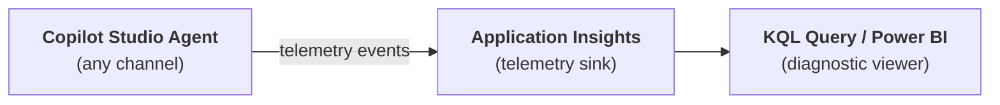

# Gem 004: Debug Mode for M365 Copilot Channel

*Replicate the Test Canvas diagnostic experience inside M365 Copilot — where the built-in Test panel doesn't exist.*

## Classification

| Attribute | Value |
|---|---|
| **Category** | Observability |
| **Complexity** | ⭐⭐⭐ (Moderate — multiple components, conditional logic) |
| **Channels** | M365 Copilot, Teams, Web Chat (designed for channels where Test Canvas is unavailable) |
| **Prerequisite Gems** | None |

## The Problem

Copilot Studio's **Test Canvas** is the primary debugging tool during development. It shows rich diagnostic information: which topic was triggered, variable values at each step, knowledge search results, error codes, and timing. It's indispensable during development.

But the Test Canvas only exists **inside Copilot Studio's authoring environment**. The moment your agent is published to M365 Copilot, Teams, or a custom website, all of that diagnostic visibility vanishes. The agent becomes a black box: you see the final response, but nothing about how it got there.

This creates real problems:

- **Troubleshooting production issues**: A user reports an incorrect answer. Was it a routing error? A knowledge source gap? A variable not set? Without diagnostics, you're guessing.
- **Validating behavior in-channel**: Agents behave differently across channels (see Platform Gotchas). What works in the Test Canvas may fail in M365 Copilot — and you can't debug it in-place.
- **Multi-agent architectures**: When an orchestrator routes to specialist agents, you need visibility into which agent was selected and why. In the Test Canvas you see this; in M365 Copilot you don't.
- **Stakeholder demos**: During UAT or demos, when something goes wrong, "let me check in the authoring tool" is a poor answer. Having in-channel diagnostics builds confidence.

The built-in `System.Conversation.InTestMode` variable is `true` only inside the Test Canvas — it's always `false` in every deployed channel. So you cannot conditionally show debug output using the platform's own test detection. You need to build your own debug mechanism.

## The Ideal Outcome

A debug mode that mirrors key Test Canvas diagnostics, available in any deployed channel:

- [ ] **Channel-agnostic**: Works in M365 Copilot, Teams, and Web Chat — not just the Test Canvas
- [ ] **Toggleable per-user**: Can be activated and deactivated during a conversation without redeploying the agent
- [ ] **Access-controlled**: Regular users never see debug output, even accidentally
- [ ] **Diagnostic coverage**: Shows topic routing, variable state, knowledge search info, and errors
- [ ] **Low overhead**: Minimal performance impact when debug mode is off

## Approaches

### Approach A: Keyword-Triggered Inline Debug Messages

**Summary**: A "magic keyword" topic toggles a global debug flag; topics conditionally emit extra text messages with diagnostic info when the flag is on.  
**Technique**: Global variable (`Global.DebugMode`), `OnRecognizedIntent` trigger topic, `ConditionGroup` nodes checking the flag, `SendActivity` with diagnostic output.

#### How It Works

```Text
User: "xdebug on"
  → ToggleDebug topic fires
  → Sets Global.DebugMode = true
  → Confirms: "🔧 Debug mode enabled"

User: "What's the PTO policy in France?"
  → Orchestrator routes to France Specialist
  → France Specialist searches knowledge source
  → Response: "In France, employees get 25 days..."
  → Debug check: Global.DebugMode = true → emit debug message
  → Debug: "🔧 Topic: FrancePolicies | Agent: FranceHR | Search: 3 results | Time: 1.2s"

User: "xdebug off"
  → ToggleDebug topic fires
  → Sets Global.DebugMode = false
  → Confirms: "Debug mode disabled"
```

The debug output is a regular text message sent conditionally. It appears in the conversation stream right after the agent's actual response. The keyword `xdebug` is deliberately obscure — regular users won't accidentally type it.

#### Implementation

**Step 1: Create the Toggle Debug topic**

This topic listens for the debug keyword and flips the global variable:

```yaml
kind: AdaptiveDialog
beginDialog:
  kind: OnRecognizedIntent
  id: main
  intent:
    displayName: Toggle Debug Mode
    includeInOnSelectIntent: false
    triggerQueries:
      - "xdebug on"
      - "xdebug off"
      - "xdebug"
      - "enable debug mode"
      - "disable debug mode"
  actions:
    # Detect if user wants ON or OFF
    - kind: ConditionGroup
      id: detectDirection
      conditions:
        - id: wantsOn
          condition: =Contains(Lower(System.Activity.Text), "on") || Contains(Lower(System.Activity.Text), "enable")
          actions:
            - kind: SetVariable
              id: setDebugOn
              variable: Global.DebugMode
              value: =true
            - kind: SendActivity
              id: confirmOn
              activity:
                text:
                  - "🔧 Debug mode **enabled**. Diagnostic info will appear after each response.\n\nSay **xdebug off** to disable."
        - id: wantsOff
          condition: =Contains(Lower(System.Activity.Text), "off") || Contains(Lower(System.Activity.Text), "disable")
          actions:
            - kind: SetVariable
              id: setDebugOff
              variable: Global.DebugMode
              value: =false
            - kind: SendActivity
              id: confirmOff
              activity:
                text:
                  - "Debug mode **disabled**."
      elseActions:
        # Plain "xdebug" toggles current state
        - kind: SetVariable
          id: toggleDebug
          variable: Global.DebugMode
          value: =If(Global.DebugMode, false, true)
        - kind: SendActivity
          id: confirmToggle
          activity:
            text:
              - "🔧 Debug mode is now **{If(Global.DebugMode, \"enabled\", \"disabled\")}**."
```

**Step 2: Add debug output blocks to your topics**

After key actions (knowledge search, API call, routing decision), insert a conditional debug block. This is a reusable pattern you'll repeat in every topic that needs diagnostics:

```yaml
    # === DEBUG OUTPUT BLOCK (copy to any topic) ===
    - kind: ConditionGroup
      id: debugOutput_afterSearch
      conditions:
        - id: isDebugOn
          condition: =Global.DebugMode = true
          actions:
            - kind: SendActivity
              id: debugMsg_search
              activity:
                text:
                  - "🔧 **Debug Trace**\n- **Topic**: PasswordReset\n- **Step**: Knowledge Search\n- **Query**: {System.Activity.Text}\n- **Result found**: {If(IsBlank(Topic.SearchResult), \"No\", \"Yes\")}\n- **Conversation**: {System.Conversation.Id}\n- **Time (UTC)**: {Text(Now(), DateTimeFormat.UTC)}"
```

**Step 3: Add debug output to the OnError topic**

Enhance the standard error handler to include debug-level detail even in production channels:

```yaml
kind: AdaptiveDialog
startBehavior: UseLatestPublishedContentAndCancelOtherTopics
beginDialog:
  kind: OnError
  id: main
  actions:
    - kind: SetVariable
      id: setTimestamp
      variable: init:Topic.CurrentTime
      value: =Text(Now(), DateTimeFormat.UTC)

    - kind: ConditionGroup
      id: debugOrNormal
      conditions:
        # Show full details in Test Canvas OR when debug mode is on
        - id: showDetails
          condition: =System.Conversation.InTestMode = true || Global.DebugMode = true
          actions:
            - kind: SendActivity
              id: sendDetailedError
              activity:
                text:
                  - "🔧 **Error Details**\n- **Message**: {System.Error.Message}\n- **Code**: {System.Error.Code}\n- **Conversation**: {System.Conversation.Id}\n- **Time (UTC)**: {Topic.CurrentTime}"
      elseActions:
        - kind: SendActivity
          id: sendUserError
          activity:
            text:
              - "I'm sorry, something went wrong. Please try again.\n\nIf the issue persists, reference conversation **{System.Conversation.Id}** (at {Topic.CurrentTime} UTC)."

    - kind: LogCustomTelemetryEvent
      id: logError
      eventName: AgentError
      properties: "={ErrorMessage: System.Error.Message, ErrorCode: System.Error.Code, ConversationId: System.Conversation.Id, TimeUTC: Topic.CurrentTime, DebugMode: Global.DebugMode}"

    - kind: CancelAllDialogs
      id: cancelAll
```

**Step 4 (Optional): Role-based access control**

For stricter security, check the user's role before allowing the debug toggle. This requires a Power Automate flow that queries the user's group membership:

```yaml
    # In the ToggleDebug topic, BEFORE setting the variable:
    - kind: ConditionGroup
      id: checkUserRole
      conditions:
        - id: isAdmin
          condition: =Global.UserRole = "Admin" || Global.UserRole = "Developer"
          actions:
            # ... proceed with toggle logic ...
      elseActions:
        - kind: SendActivity
          id: denyAccess
          activity:
            text:
              - "Sorry, debug mode is only available to administrators."
```

#### Evaluation

| Criterion | Rating | Notes |
|---|---|---|
| Ease of Implementation | 🟢 | Simple YAML — global variable + ConditionGroup. No external dependencies. |
| Maintainability | 🟡 | Debug blocks must be manually added to each topic. Risk of inconsistency as topics grow. |
| Channel Compatibility | 🟢 | Plain text works everywhere — M365 Copilot, Teams, Web Chat. |
| Scalability | 🟡 | Works well up to ~15 topics. Beyond that, maintaining debug blocks in every topic becomes tedious. |
| Diagnostic Coverage | 🟡 | Shows what you explicitly instrument. No automatic coverage — you only see what you code. |
| Low Overhead (debug off) | 🟢 | A single boolean check per topic. Negligible performance impact. |

#### Limitations

- **Manual instrumentation**: You must add debug blocks to every topic and every step you want to trace. There's no "auto-trace everything."
- **Conversation clutter**: Debug messages are visible as regular messages. In a long conversation, they can make the chat noisy.
- **No persistent record**: Debug output is ephemeral — once the conversation ends, the trace is gone (unless you also telemetry-log it).
- **Security through obscurity**: The keyword approach relies on users not guessing `xdebug`. For regulated environments, role-based gating (Step 4) is necessary.

---

### Approach B: Application Insights Telemetry Pipeline

**Summary**: Instrument topics with `LogCustomTelemetryEvent` nodes at every key decision point. Query the telemetry out-of-band via Application Insights and KQL.  
**Technique**: `LogCustomTelemetryEvent` nodes, Application Insights connected to the agent, KQL queries, optional Power BI dashboard.

#### How It Works



Every topic emits structured telemetry events at key decision points: topic entry, knowledge search, API call, routing decision, error. These events flow to Application Insights where they can be queried, filtered, and visualized — completely outside the conversation.

The user never sees debug output. The developer queries Application Insights separately, filtering by conversation ID, timestamp, or user.

#### Implementation

**Step 1: Connect Application Insights to your agent**

In Copilot Studio:

1. Go to **Settings** → **Advanced** → **Application Insights**
2. Enter your Application Insights **Connection String**
3. Save — telemetry starts flowing immediately

**Step 2: Instrument topics with telemetry events**

Add `LogCustomTelemetryEvent` nodes at key points. Use a consistent event naming scheme:

```yaml
    # At topic entry
    - kind: LogCustomTelemetryEvent
      id: log_topicEntry
      eventName: AgentTrace
      properties: "={TracePoint: \"TopicEntry\", TopicName: \"PasswordReset\", UserQuery: System.Activity.Text, ConversationId: System.Conversation.Id, Timestamp: Text(Now(), DateTimeFormat.UTC)}"

    # After knowledge search
    - kind: LogCustomTelemetryEvent
      id: log_afterSearch
      eventName: AgentTrace
      properties: "={TracePoint: \"KnowledgeSearch\", TopicName: \"PasswordReset\", HasResults: !IsBlank(Topic.SearchResult), ConversationId: System.Conversation.Id, Timestamp: Text(Now(), DateTimeFormat.UTC)}"

    # At routing decision (multi-agent)
    - kind: LogCustomTelemetryEvent
      id: log_routing
      eventName: AgentTrace
      properties: "={TracePoint: \"AgentRouting\", SelectedAgent: Topic.TargetAgent, UserRegion: Global.UserRegion, RoutingReason: Topic.RoutingReason, ConversationId: System.Conversation.Id, Timestamp: Text(Now(), DateTimeFormat.UTC)}"

    # Before response
    - kind: LogCustomTelemetryEvent
      id: log_response
      eventName: AgentTrace
      properties: "={TracePoint: \"ResponseSent\", TopicName: \"PasswordReset\", ResponseLength: Len(Topic.ResponseText), ConversationId: System.Conversation.Id, Timestamp: Text(Now(), DateTimeFormat.UTC)}"
```

**Step 3: Define a standard telemetry schema**

Consistency across all topics makes querying reliable. Use these standard properties:

| Property | Type | Description | Example |
|---|---|---|---|
| `TracePoint` | string | Where in the flow this event fires | `TopicEntry`, `KnowledgeSearch`, `AgentRouting`, `ResponseSent`, `Error` |
| `TopicName` | string | Name of the current topic | `PasswordReset` |
| `ConversationId` | string | Unique conversation identifier | `System.Conversation.Id` |
| `Timestamp` | string | UTC timestamp | `Text(Now(), DateTimeFormat.UTC)` |
| `UserQuery` | string | The user's message (at entry points) | `System.Activity.Text` |
| `SelectedAgent` | string | Which agent was routed to (multi-agent) | `FranceHRSpecialist` |
| `HasResults` | boolean | Whether knowledge search returned results | `true` / `false` |

**Step 4: Query with KQL**

Open Application Insights → Logs and run:

```kusto
// Full conversation trace (ordered timeline)
customEvents
| where name == "AgentTrace"
| where tostring(customDimensions.ConversationId) == "<paste-conversation-id>"
| extend TracePoint = tostring(customDimensions.TracePoint)
| extend TopicName = tostring(customDimensions.TopicName)
| extend UserQuery = tostring(customDimensions.UserQuery)
| extend SelectedAgent = tostring(customDimensions.SelectedAgent)
| project timestamp, TracePoint, TopicName, UserQuery, SelectedAgent
| order by timestamp asc
```

```kusto
// Error summary (last 24 hours)
customEvents
| where name == "AgentTrace"
| where tostring(customDimensions.TracePoint) == "Error"
| where timestamp > ago(24h)
| extend ErrorMessage = tostring(customDimensions.ErrorMessage)
| extend TopicName = tostring(customDimensions.TopicName)
| summarize ErrorCount = count() by TopicName, ErrorMessage
| order by ErrorCount desc
```

```kusto
// Routing decisions analysis (multi-agent)
customEvents
| where name == "AgentTrace"
| where tostring(customDimensions.TracePoint) == "AgentRouting"
| where timestamp > ago(7d)
| extend SelectedAgent = tostring(customDimensions.SelectedAgent)
| extend UserRegion = tostring(customDimensions.UserRegion)
| summarize RouteCount = count() by SelectedAgent, UserRegion
| render barchart
```

**Step 5 (Optional): Power BI dashboard**

Connect Power BI to Application Insights for a live trace dashboard:

1. Use the `customEvents` table as data source
2. Filter by `name == "AgentTrace"`
3. Create visuals: conversation timeline, error rates, routing distribution
4. Share with team for real-time monitoring

#### Evaluation

| Criterion | Rating | Notes |
|---|---|---|
| Ease of Implementation | 🟡 | Requires App Insights setup + learning KQL. Once set up, adding events is straightforward. |
| Maintainability | 🟢 | Consistent schema makes queries reusable. Easy to add new trace points. |
| Channel Compatibility | 🟢 | Works identically in all channels — telemetry flows regardless of deployment target. |
| Scalability | 🟢 | Handles any number of topics. Built for enterprise-scale logging. |
| Diagnostic Coverage | 🟡 | Same manual instrumentation as Approach A. But data is persistent and queryable. |
| Low Overhead (debug off) | 🟡 | Telemetry is always-on — every conversation is traced. Small but constant performance cost. |

#### Limitations

- **Not real-time in conversation**: You see diagnostics in Application Insights, not in the chat. There's a delay of ~2-5 minutes before events appear.
- **Requires Application Insights**: Additional Azure resource with associated costs (though the free tier covers most development scenarios).
- **KQL learning curve**: Writing effective queries requires familiarity with Kusto Query Language.
- **No interactive debugging**: You can't "step through" a conversation. You reconstruct what happened after the fact.
- **Always-on cost**: Unlike Approach A (which does nothing when debug is off), telemetry events fire for every user, every conversation. At high scale, this may cost more.

---

### Approach C: Adaptive Card Debug Panel

**Summary**: Render diagnostic information in a structured, collapsible Adaptive Card that appears after the agent's response — only when debug mode is active.  
**Technique**: Global variable (`Global.DebugMode`) from Approach A + `SendActivity` with Adaptive Card attachment containing expandable sections.

#### How It Works

```Text
User: "xdebug on"
  → Debug mode enabled (same as Approach A)

User: "What's the refund policy?"
  → Agent responds normally: "Our refund policy is..."
  → Debug check: Global.DebugMode = true → emit Adaptive Card
  → Card appears with collapsible sections:
     [📍 Routing]  → Topic: RefundPolicy, Agent: SupportSpecialist
     [📊 Variables] → Global.UserRegion: US, Topic.SearchHits: 3
     [🔍 Knowledge] → Query: "refund policy", Sources: 2 SharePoint docs
     [⏱ Timing]    → Total: 1.8s
```

The card renders as a single message with expandable sections using `Action.ShowCard`. When collapsed, it's a compact "🔧 Debug Panel" header. When expanded, it shows structured diagnostics in `FactSet` format.

#### Implementation

**Step 1: Reuse the Toggle Debug topic from Approach A**

(Same `ToggleDebug` topic — see Approach A, Step 1)

**Step 2: Build the debug card in topic actions**

After the main response, add a conditional debug card. This example captures routing, variables, and timing:

```yaml
    # === ADAPTIVE CARD DEBUG PANEL ===
    - kind: ConditionGroup
      id: debugPanel
      conditions:
        - id: isDebugOn
          condition: =Global.DebugMode = true
          actions:
            # Capture timing
            - kind: SetVariable
              id: setDebugTimestamp
              variable: init:Topic.DebugTimestamp
              value: =Text(Now(), DateTimeFormat.UTC)

            - kind: SendActivity
              id: sendDebugCard
              activity:
                attachments:
                  - contentType: application/vnd.microsoft.card.adaptive
                    content:
                      type: AdaptiveCard
                      "$schema": http://adaptivecards.io/schemas/adaptive-card.json
                      version: "1.5"
                      body:
                        - type: TextBlock
                          text: "🔧 Debug Panel"
                          weight: bolder
                          size: medium
                          color: accent
                        - type: TextBlock
                          text: "Conversation {System.Conversation.Id}"
                          size: small
                          isSubtle: true
                      actions:
                        - type: Action.ShowCard
                          title: "📍 Routing"
                          card:
                            type: AdaptiveCard
                            body:
                              - type: FactSet
                                facts:
                                  - title: "Topic"
                                    value: "RefundPolicy"
                                  - title: "Trigger"
                                    value: "OnRecognizedIntent"
                                  - title: "Agent"
                                    value: "SupportSpecialist"
                        - type: Action.ShowCard
                          title: "📊 Variables"
                          card:
                            type: AdaptiveCard
                            body:
                              - type: FactSet
                                facts:
                                  - title: "Global.DebugMode"
                                    value: "{Global.DebugMode}"
                                  - title: "Global.UserRegion"
                                    value: "{Global.UserRegion}"
                                  - title: "Topic.SearchHits"
                                    value: "{Topic.SearchHits}"
                        - type: Action.ShowCard
                          title: "🔍 Knowledge"
                          card:
                            type: AdaptiveCard
                            body:
                              - type: FactSet
                                facts:
                                  - title: "User Query"
                                    value: "{System.Activity.Text}"
                                  - title: "Results Found"
                                    value: "{If(IsBlank(Topic.SearchResult), \"None\", \"Yes\")}"
                        - type: Action.ShowCard
                          title: "⏱ Timing"
                          card:
                            type: AdaptiveCard
                            body:
                              - type: FactSet
                                facts:
                                  - title: "Timestamp (UTC)"
                                    value: "{Topic.DebugTimestamp}"
```

**Step 3: Create a reusable debug card pattern**

Since the card structure repeats across topics, standardize it. Each topic only needs to customize the topic-specific facts (topic name, agent name, and topic variables):

```yaml
    # Template: replace the values marked with [CUSTOMIZE] per topic
    # Routing section:     [CUSTOMIZE] Topic name, trigger type, agent name
    # Variables section:   [CUSTOMIZE] Topic-specific variables
    # Knowledge section:   Keep as-is (uses System.Activity.Text)
    # Timing section:      Keep as-is (auto-generated timestamp)
```

**Step 4: Handle channels without Adaptive Card support**

Some channels render Adaptive Cards poorly or not at all. Add a fallback text representation:

```yaml
    # After the Adaptive Card send, add a text fallback for limited channels
    - kind: SendActivity
      id: debugFallbackText
      activity:
        text:
          - "🔧 Debug | Topic: RefundPolicy | Agent: SupportSpecialist | Results: {If(IsBlank(Topic.SearchResult), \"None\", \"Yes\")} | {Topic.DebugTimestamp}"
```

> **Note**: In practice, M365 Copilot and Teams both support Adaptive Cards (schema 1.5), so the fallback is mainly for custom website channels with minimal card rendering.

#### Evaluation

| Criterion | Rating | Notes |
|---|---|---|
| Ease of Implementation | 🟡 | Moderate — Adaptive Card JSON is verbose. Initial setup takes more effort than plain text. |
| Maintainability | 🟡 | Same manual instrumentation as Approach A, but card JSON is harder to read/edit than plain text. |
| Channel Compatibility | 🟡 | Works in Teams and Web Chat. M365 Copilot renders cards but `Action.ShowCard` collapsibility may vary. Test carefully. |
| Scalability | 🟡 | Same topic-by-topic effort as Approach A. Card JSON is bulkier in YAML files. |
| Diagnostic Coverage | 🟡 | Same as Approach A — you see what you instrument. But the structured layout makes it easier to scan. |
| Low Overhead (debug off) | 🟢 | Same boolean check as Approach A. No card rendered when debug is off. |

#### Limitations

- **Adaptive Card rendering varies**: `Action.ShowCard` (the collapsible sections) works well in Teams and Web Chat but may render differently in M365 Copilot. Always test the actual target channel.
- **Schema version ceiling**: Teams requires schema 1.5. Some advanced card features (e.g., `Action.Execute`) are not available.
- **Verbose YAML**: The card JSON embedded in YAML makes topic files significantly larger and harder to read.
- **Static content**: Unlike Approach A's simple text (which can use any Power Fx expression inline), Adaptive Cards have more limited data binding. Complex expressions may need intermediate `SetVariable` steps.
- **No data export**: The card is visual only. Unlike Approach B, there's no persistent record to query later.

---

## Comparison Matrix

| Dimension | Approach A: Keyword Inline | Approach B: App Insights | Approach C: Adaptive Card |
|---|---|---|---|
| **Implementation Effort** | 🟢 Low (30 min) | 🟡 Medium (2-3 hours) | 🟡 Medium (1-2 hours) |
| **Channel Support** | 🟢 All channels | 🟢 All channels | 🟡 Card-capable channels |
| **Real-time Feedback** | 🟢 Instant, in-chat | 🔴 Delayed (2-5 min) | 🟢 Instant, in-chat |
| **Visual Quality** | 🟡 Plain text | 🟢 Rich dashboards | 🟢 Structured cards |
| **Persistent Record** | 🔴 Ephemeral | 🟢 Queryable, permanent | 🔴 Ephemeral |
| **Conversation Noise** | 🔴 Adds text messages | 🟢 Zero noise | 🟡 Adds card messages |
| **Maintenance Burden** | 🟡 Per-topic blocks | 🟡 Per-topic events | 🔴 Per-topic card JSON |
| **Production Monitoring** | 🔴 Not suitable | 🟢 Built for this | 🔴 Not suitable |
| **Cost** | 🟢 Free | 🟡 App Insights costs | 🟢 Free |
| **Best When...** | Quick debugging during development & UAT | Production monitoring & post-incident investigation | Stakeholder demos & visual debugging sessions |

## Recommended Approach

**For most scenarios**: **Combine Approaches A + B**.

Use **Approach A** (keyword inline) for interactive debugging during development, UAT, and channel-specific testing. It's fast to implement, works everywhere, and gives instant feedback. This is your "developer console."

Use **Approach B** (Application Insights) for production monitoring and post-incident investigation. It runs silently for all users, creates permanent records, and enables trend analysis across conversations. This is your "production telemetry."

Together, they cover both the interactive and asynchronous debugging needs:

```Text
Development & UAT  →  Approach A (keyword inline): instant, in-chat feedback
Production         →  Approach B (App Insights): silent, persistent, queryable
Stakeholder demos  →  Approach C (Adaptive Card): visually polished debugging
```

**Choose Approach C instead of A when**: You need visually structured diagnostics for stakeholder demos or when non-technical team members need to read debug output. The collapsible card sections are much easier to scan than plain text — but the implementation cost is higher.

**Skip Approach B when**: You're building a prototype or internal tool where production monitoring isn't needed. The App Insights setup and KQL learning curve aren't justified for throwaway agents.

## Platform Gotchas

> [!WARNING]
> **`System.Conversation.InTestMode` is useless outside the Test Canvas.**  
> This built-in variable is `true` ONLY in the Copilot Studio authoring Test panel. In every deployed channel (M365 Copilot, Teams, Web Chat), it's always `false`. Do not rely on it for production debug logic — you must create your own `Global.DebugMode` flag.

> [!WARNING]
> **M365 Copilot does NOT support the ConversationStart topic** (see [Gotchas Compendium](../appendices/gotchas-compendium.md#channel-limitations)).  
> If you planned to initialize debug settings in `ConversationStart`, it won't fire in M365 Copilot. The `ToggleDebug` topic (triggered by user keyword) avoids this issue entirely since it's user-initiated. If you need automatic initialization, use agent instructions instead: *"Before answering, check if Global.DebugMode has been initialized."*

> [!WARNING]
> **Adaptive Card `Action.ShowCard` rendering varies by channel.**  
> In Teams, `Action.ShowCard` renders as a collapsible section. In M365 Copilot, the rendering may differ — some users report that show/hide toggles work inconsistently. Always test your debug card in the actual target channel before relying on the collapsible UX.

> [!NOTE]
> **Application Insights telemetry has a ~2-5 minute ingestion delay.**  
> Events sent via `LogCustomTelemetryEvent` are not instantly queryable. For real-time debugging, use Approach A. For post-incident analysis, the delay is irrelevant.

> [!NOTE]
> **Global variables persist within a conversation but reset between conversations.**  
> `Global.DebugMode` resets to `false` when a new conversation starts. Users must re-enable debug mode each session. This is actually a security benefit — debug mode doesn't accidentally leak into future conversations.

## Related Gems

- **[Gem 001](GEM-001-persisting-user-context-across-sessions.md)**: Persisting User Context Across Sessions — Could be used to persist a user's debug preference across conversations (so admins don't have to type `xdebug on` every session)
- **[Gem 003](GEM-003-tracing-agent-progress-before-response.md)**: Tracing Agent Progress Before Response — Focuses on streaming/real-time progress indicators while the agent is still thinking, complementing the post-response diagnostics in this Gem

## References

- [Microsoft Learn: Application Insights for Copilot Studio](https://learn.microsoft.com/en-us/microsoft-copilot-studio/advanced-bot-framework-composer-fundamentals)
- [Microsoft Learn: Test your agent](https://learn.microsoft.com/en-us/microsoft-copilot-studio/authoring-test-bot)
- [Microsoft Learn: Adaptive Cards schema 1.5](https://adaptivecards.io/explorer/)
- [Microsoft Learn: System variables reference](https://learn.microsoft.com/en-us/microsoft-copilot-studio/authoring-variables#system-variables)
- [Microsoft Learn: LogCustomTelemetryEvent](https://learn.microsoft.com/en-us/microsoft-copilot-studio/advanced-custom-analytics)
- [KQL Quick Reference](https://learn.microsoft.com/en-us/kusto/query/kql-quick-reference)

---

*Gem 004 | Author: Sébastien Brochet | Created: 2026-02-17 | Last Validated: 2026-02-17 | Platform Version: current*
