# Gem 005: Multi-Language Agent Response

*Detect your user's language and respond in kind — without asking every time.*

## Classification

| Attribute | Value |
|---|---|
| **Category** | Personalization |
| **Complexity** | ⭐⭐⭐ (Moderate — detection logic + instruction adaptation) |
| **Channels** | All (detection method varies by channel) |
| **Prerequisite Gems** | [Gem 001](GEM-001-persisting-user-context-across-sessions.md) (for persisting language preference across sessions) |

## The Problem

Enterprise organizations are global. A Copilot Studio agent deployed to 5,000 employees across France, the US, and Japan will receive queries in French, English, and Japanese — sometimes mixed within a single conversation.

The default Copilot Studio experience handles this poorly:

- **Agent instructions are monolingual**: The system prompt is written in one language. If the instructions say "respond professionally," the LLM defaults to the language of the instructions — usually English.
- **No built-in language detection**: There's no `System.User.Language` variable. The platform doesn't tell you what language the user typed in.
- **Repeated friction**: Asking "What language do you prefer?" every session is wasteful. For a French employee who always writes in French, this should be automatic.
- **Knowledge source language mismatch**: If your knowledge base is in English but the user asks in French, the generative answer may respond in English, French, or an awkward mix — depending on how the LLM processes the retrieved context.
- **Mid-conversation switching**: A user starts in English, then switches to French when asking about French-specific policies. The agent should follow seamlessly.

The core challenge: **determining the user's language reliably, applying it consistently, and persisting it across sessions** — with minimal user friction and maximum accuracy.

## The Ideal Outcome

An agent that responds in the user's language naturally:

- [ ] **Automatic detection**: Language is identified without explicitly asking the user
- [ ] **Accurate matching**: Detection works correctly >95% of the time for supported languages
- [ ] **Persistent preference**: Once detected (or chosen), the language preference carries across sessions
- [ ] **Seamless switching**: If the user changes language mid-conversation, the agent follows
- [ ] **Knowledge source compatibility**: Responses are in the user's language even when knowledge sources are in a different language

## Approaches

### Approach A: Graph API Profile-Based Detection

**Summary**: Retrieve the user's `preferredLanguage` or `usageLocation` from their Entra ID profile via Microsoft Graph API. Set the language at conversation start.  
**Technique**: Power Automate flow calling Graph API, global variable for language, agent instructions for response language.

#### How It Works



```mermaid
flowchart TB
    A["Conversation start"] --> B["Power Automate:<br/>GET /users/&#123;id&#125;?$select=<br/>preferredLanguage, usageLocation"]
    B --> C["Map to language:<br/>preferredLanguage = fr-FR → French"]
    C --> D["Set Global.ResponseLanguage = French"]
    D --> E["Agent instructions:<br/>Respond in Global.ResponseLanguage"]
```

The user's Entra ID profile contains `preferredLanguage` (e.g., `fr-FR`, `en-US`, `ja-JP`) — set by IT administrators. This is the most reliable signal because it's admin-managed and doesn't depend on what the user types.

#### Implementation

**Step 1: Retrieve language from Graph API**

Extend the GetUserContext flow from [Gem 001](GEM-001-persisting-user-context-across-sessions.md) (or create a standalone flow):

```Text
Action: HTTP to Microsoft Graph
  Method: GET
  URI: https://graph.microsoft.com/v1.0/users/{userId}?$select=preferredLanguage,usageLocation,mail

Action: Map Language (Compose)
  Expression: 
    if(startsWith(outputs('HTTP')?['body/preferredLanguage'], 'fr'), 'French',
    if(startsWith(outputs('HTTP')?['body/preferredLanguage'], 'ja'), 'Japanese',
    if(startsWith(outputs('HTTP')?['body/preferredLanguage'], 'de'), 'German',
    if(startsWith(outputs('HTTP')?['body/preferredLanguage'], 'es'), 'Spanish',
    'English'))))

Output: responseLanguage (string)
```

**Step 2: Set global variable and instruct the agent**

Via agent instructions (M365 Copilot compatible):

```yaml
kind: GptComponentMetadata
displayName: Multilingual Agent
instructions: |+
  # Multilingual Agent
  
  ## CRITICAL: Language Detection
  At the START of every conversation, call "GetUserContext" to retrieve the user's 
  language preference. Store it as the conversation language.
  
  ## Language Rules
  - ALWAYS respond in the user's detected language
  - If the detected language is "French": respond entirely in French
  - If the detected language is "Japanese": respond entirely in Japanese
  - Default: respond in English
  
  ## Mid-Conversation Language Switch
  If the user writes a message in a DIFFERENT language than detected, 
  switch to that language for the remainder of the conversation.
  
  ## Knowledge Source Handling
  When knowledge sources are in English but the user's language is French:
  - Search in English (knowledge sources are English)
  - Translate your response to French
  - Cite source documents by their original English titles
```

Or via ConversationStart topic (non-M365 channels):

```yaml
kind: AdaptiveDialog
beginDialog:
  kind: OnConversationStart
  id: main
  actions:
    - kind: InvokeFlow
      id: getUserLanguage
      flowId: "@environmentVariables('GetUserContextFlowId')"
      inputs:
        userId: =System.User.Id
      outputVariable: Topic.UserContext

    - kind: SetVariable
      id: setLanguage
      variable: Global.ResponseLanguage
      value: =If(IsBlank(Topic.UserContext.responseLanguage), "English", Topic.UserContext.responseLanguage)
```

**Step 3: Persist language preference (link to [Gem 001](GEM-001-persisting-user-context-across-sessions.md))**

Save the detected language using [Gem 001](GEM-001-persisting-user-context-across-sessions.md)'s WriteContext pattern so the Graph API call only happens once per user — subsequent sessions load the cached preference.

#### Evaluation

| Criterion | Rating | Notes |
|---|---|---|
| Ease of Implementation | 🟡 | Requires Power Automate flow + Graph API. Straightforward but multi-component. |
| Maintainability | 🟢 | Language mapping is a simple lookup. Adding languages = adding mapping entries. |
| Channel Compatibility | 🟢 | Graph API works regardless of channel. |
| Detection Accuracy | 🟡 | Depends on IT setting `preferredLanguage` correctly. Many orgs leave this blank or set to defaults. |
| Seamless Switching | 🟡 | Doesn't detect mid-conversation switches. Agent instructions handle this via "if user writes in different language." |
| Knowledge Compatibility | 🟢 | Agent instructions can mandate translation of English knowledge to user's language. |

#### Limitations

- **Depends on IT data quality**: `preferredLanguage` is often blank or set to the org default (`en-US`) for everyone. If your org hasn't populated Entra profiles, this approach returns English for all users.
- **Fallback chain needed**: `preferredLanguage` → `usageLocation` → default. Multiple Graph fields may need checking.
- **One language at start**: Detects once. If the user's profile says English but they write in French, the agent starts in English (though instructions can tell it to switch).
- **Power Automate latency**: Adds 1-2 seconds at conversation start for the Graph API call.

---

### Approach B: LLM Auto-Detection from User Input

**Summary**: Let the LLM detect the language of the user's first message and respond in that language automatically. No external calls needed.  
**Technique**: Agent instructions that mandate language matching, with optional Prompt Tool for explicit classification.

#### How It Works



```mermaid
flowchart TB
    A["👤 User: Quelle est la politique de congés ?"] --> B["LLM detects: input is French"]
    B --> C["LLM responds in French<br/>(per instructions)"]
    C --> D["All subsequent responses in French<br/>(until user switches)"]
```

The simplest possible approach: the LLM naturally detects the input language and mirrors it — you just need to tell it to do so explicitly in the instructions.

#### Implementation

**Step 1: Add language-matching instructions**

```yaml
kind: GptComponentMetadata
displayName: Auto-Language Agent
instructions: |+
  # Language-Adaptive Agent
  
  ## Language Detection Rule
  ALWAYS respond in the SAME LANGUAGE the user writes in.
  
  - If the user writes in French → respond entirely in French
  - If the user writes in English → respond entirely in English
  - If the user writes in Japanese → respond entirely in Japanese
  - If you're unsure → respond in English and ask:
    "I detected your message might be in [language]. Would you prefer I respond in [language]?"
  
  ## Language Consistency
  - Once you detect the user's language, maintain it for the entire conversation
  - If the user switches language mid-conversation, follow their switch
  - NEVER mix languages in a single response (except for proper nouns or cited document titles)
  
  ## Knowledge Source Translation
  Our knowledge base is in English. When the user's language is not English:
  - Search using the user's original query (the search engine handles multilingual queries)
  - Translate the retrieved information into the user's language
  - Keep document titles and reference IDs in their original language
```

That's it. No flows, no Graph API, no variables. The LLM handles everything.

**Step 2 (Optional): Explicit classification via Prompt Tool**

For more control (e.g., to store the detected language in a variable for routing):

```yaml
kind: PromptTool
id: prompt_detectLanguage
displayName: "Language Detector"
description: "Detects the language of user input"
instructions: |
  Detect the language of the following text and return ONLY the language name.
  
  Supported languages: English, French, German, Spanish, Japanese, Chinese, Korean, Portuguese, Italian, Dutch, Arabic
  
  If the text is too short or ambiguous, return "English" as default.
  
  Text: {userMessage}
  
  Return ONLY the language name, nothing else.
  
model:
  provider: ManagedModel
  modelNameHint: GPT4Mini
inputs:
  - name: userMessage
    type: string
    required: true
outputs:
  - name: language
    type: string
```

**Step 3 (Optional): Persist detected language (link to [Gem 001](GEM-001-persisting-user-context-across-sessions.md))**

After detection, save the language via [Gem 001](GEM-001-persisting-user-context-across-sessions.md)'s persistence so the agent defaults correctly in the next session:

```yaml
    - kind: InvokePrompt
      id: detectLang
      promptId: prompt_detectLanguage
      inputs:
        userMessage: =System.Activity.Text
      outputVariable: Topic.DetectedLanguage

    - kind: SetVariable
      id: setLang
      variable: Global.ResponseLanguage
      value: =Topic.DetectedLanguage

    # Persist for next session
    - kind: InvokeFlow
      id: saveLangPref
      flowId: "@environmentVariables('WriteContextFlowId')"
      inputs:
        userId: =System.User.Id
        preferredLanguage: =Global.ResponseLanguage
```

#### Evaluation

| Criterion | Rating | Notes |
|---|---|---|
| Ease of Implementation | 🟢 | Instructions only (no Prompt Tool needed). Zero infrastructure. 15 minutes. |
| Maintainability | 🟢 | One instruction block. Adding languages = adding a line. |
| Channel Compatibility | 🟢 | Works everywhere — LLM-based, no channel dependencies. |
| Detection Accuracy | 🟡 | LLMs are excellent at language detection for sentences. Weak for 1-2 word inputs ("Help" could be English or French verb). |
| Seamless Switching | 🟢 | Automatically follows user's language change. No explicit switch mechanism needed. |
| Knowledge Compatibility | 🟡 | Translation quality depends on the LLM. Complex technical content may lose nuance in translation. |

#### Limitations

- **Short input ambiguity**: Single-word or very short messages can be misidentified. "OK," "Merci," "Hello" — some overlap between languages.
- **First-message cold start**: The first message determines the language. If the user's first message is an emoji or a single word, detection may be wrong.
- **No proactive language**: The agent can't greet the user in their language because it doesn't know the language until the user types something.
- **Translation quality**: Having the LLM translate knowledge source content is impressive but not flawless. Technical terminology, legal language, or policy-specific terms may be mistranslated.
- **No explicit variable**: Without the optional Prompt Tool step, the language is implicit in the LLM's behavior. You can't use it for routing decisions or conditional logic in topics.

---

### Approach C: Explicit User Language Selection

**Summary**: Ask the user to choose their language at the start of the conversation (first time only). Persist the choice via [Gem 001](GEM-001-persisting-user-context-across-sessions.md) and apply it to all future sessions.  
**Technique**: Question node with language options, global variable, persistent storage, agent instructions.

#### How It Works

```Text
First conversation:
  Agent: "🌐 Please select your preferred language:
          🇬🇧 English | 🇫🇷 Français | 🇩🇪 Deutsch | 🇯🇵 日本語"
  User selects: Français
  → Saved to persistent storage
  → All responses in French

Second conversation (and all future):
  → Language loaded from storage
  → Agent responds in French immediately
  → No question asked
```

Maximum accuracy (the user chose it), but adds friction to the first interaction. Subsequent sessions are frictionless because the preference is persisted.

#### Implementation

**Step 1: Create a language selection topic**

```yaml
kind: AdaptiveDialog
beginDialog:
  kind: OnRecognizedIntent
  id: main
  intent:
    displayName: Set Language Preference
    triggerQueries:
      - "change language"
      - "switch language"
      - "changer de langue"
      - "言語を変更"
  actions:
    - kind: Question
      id: askLanguage
      variable: init:Topic.SelectedLanguage
      prompt: "🌐 Please select your preferred language / Veuillez choisir votre langue :"
      entity: ChoicePrebuiltEntity
      choiceOptions:
        - value: "English"
          synonyms: ["EN", "english", "anglais"]
        - value: "French"
          synonyms: ["FR", "french", "français", "francais"]
        - value: "German"
          synonyms: ["DE", "german", "deutsch", "allemand"]
        - value: "Japanese"
          synonyms: ["JA", "japanese", "日本語", "japonais"]
        - value: "Spanish"
          synonyms: ["ES", "spanish", "español", "espagnol"]

    - kind: SetVariable
      id: setLanguage
      variable: Global.ResponseLanguage
      value: =Topic.SelectedLanguage

    # Persist for future sessions
    - kind: InvokeFlow
      id: saveLanguage
      flowId: "@environmentVariables('WriteContextFlowId')"
      inputs:
        userId: =System.User.Id
        preferredLanguage: =Global.ResponseLanguage

    - kind: SendActivity
      id: confirmLanguage
      activity:
        text:
          - "✅ Language set to **{Global.ResponseLanguage}**. All future conversations will use this language.\n\nYou can change it anytime by saying \"change language\"."
```

**Step 2: Auto-prompt on first conversation only**

In agent instructions:

```yaml
instructions: |+
  ## Language Handling
  
  At the START of every conversation, call "GetUserContext" to check if a 
  language preference exists.
  
  - If `preferredLanguage` is set → use it immediately, DO NOT ask
  - If `preferredLanguage` is empty (first-time user) → ask the user to choose 
    by calling the "SetLanguagePreference" topic
  
  ## Response Language
  ALWAYS respond in Global.ResponseLanguage.
  
  ## Language Change
  If the user says "change language" or equivalent in any language,
  trigger the SetLanguagePreference topic to let them choose again.
```

**Step 3: Combine with ConversationStart for non-M365 channels**

```yaml
kind: AdaptiveDialog
beginDialog:
  kind: OnConversationStart
  id: main
  actions:
    - kind: InvokeFlow
      id: loadContext
      flowId: "@environmentVariables('ReadContextFlowId')"
      inputs:
        userId: =System.User.Id
      outputVariable: Topic.UserContext

    - kind: SetVariable
      id: setLang
      variable: Global.ResponseLanguage
      value: =Topic.UserContext.preferredLanguage

    - kind: ConditionGroup
      id: checkLanguageSet
      conditions:
        - id: hasLanguage
          condition: =!IsBlank(Global.ResponseLanguage)
          actions:
            - kind: SendActivity
              id: greetInLanguage
              activity:
                text:
                  - =If(Global.ResponseLanguage = "French", "Bonjour ! Comment puis-je vous aider ?", If(Global.ResponseLanguage = "Japanese", "こんにちは！何かお手伝いできますか？", "Hello! How can I help you?"))
      elseActions:
        # First-time user — ask for language
        - kind: GotoTopic
          id: gotoLanguageSelect
          topicId: SetLanguagePreference
```

#### Evaluation

| Criterion | Rating | Notes |
|---|---|---|
| Ease of Implementation | 🟢 | Question node + persistence flow. Simple and clear. |
| Maintainability | 🟢 | Choice list is easy to update. Adding a language = adding a choice option. |
| Channel Compatibility | 🟢 | Multiple choice questions work in all channels. |
| Detection Accuracy | 🟢 | 100% accurate — the user chose it explicitly. |
| Seamless Switching | 🟢 | "Change language" topic allows switching anytime. |
| Knowledge Compatibility | 🟢 | Known language enables explicit translation instructions. |

#### Limitations

- **First-session friction**: New users must answer a language question before anything else. For an agent that serves 90% English-speaking users, this is unnecessary for most people.
- **Choice list maintenance**: Adding less-common languages expands the choice list, potentially overwhelming users. Consider showing only languages relevant to your org.
- **No detection of unexpected languages**: If a user writes in Korean but Korean isn't in your choice list, the agent responds in whatever the user previously selected.
- **ConversationStart limitation**: The language selection prompt doesn't fire in M365 Copilot unless handled via agent instructions.

---

## Comparison Matrix

| Dimension | Approach A: Graph API | Approach B: LLM Auto-Detect | Approach C: Explicit Choice |
|---|---|---|---|
| **Implementation Effort** | 🟡 Medium (2-3 hours) | 🟢 Low (15 min) | 🟢 Low (1 hour) |
| **Detection Accuracy** | 🟡 Depends on IT data | 🟡 Good for sentences, weak for short input | 🟢 100% (user chose it) |
| **First-Session Friction** | 🟢 Zero (automatic) | 🟢 Zero (automatic) | 🔴 Language question before first use |
| **Mid-Conversation Switch** | 🟡 Via instructions only | 🟢 Automatic | 🟢 "Change language" command |
| **Proactive Greeting** | 🟢 Greet in detected language | 🔴 Can't greet (don't know language yet) | 🟢 Greet in saved language |
| **Infrastructure** | 🟡 Power Automate + Graph API | 🟢 None | 🟡 Persistence flow ([Gem 001](GEM-001-persisting-user-context-across-sessions.md)) |
| **Best When...** | IT maintains Entra profiles well | Quick deployment, LLM handles it | Maximum accuracy, users accept one-time setup |

## Recommended Approach

**For most scenarios**: **Combine Approaches B + C with [Gem 001](GEM-001-persisting-user-context-across-sessions.md) persistence.**

1. **First session**: Use **Approach B** (LLM auto-detect) — the agent silently detects the user's language from their first message and responds accordingly. After detection, persist the language using [Gem 001](GEM-001-persisting-user-context-across-sessions.md).
2. **Subsequent sessions**: Load the persisted preference. The agent greets and responds in the saved language immediately.
3. **Override**: Provide **Approach C**'s "change language" topic for users who want to explicitly switch.

This gives you: zero friction (no question asked), reasonable accuracy (LLM detection), persistence (no re-detection), and an escape hatch (explicit switch).

**Add Approach A when**: Your IT organization maintains Entra profiles well (`preferredLanguage` is populated). Use it as the primary signal with LLM detection as fallback for users without profile data.

**Use Approach C alone when**: You support fewer than 3 languages and/or regulatory requirements demand the user explicitly confirms their language choice.

## Platform Gotchas

> [!WARNING]
> **ConversationStart doesn't fire in M365 Copilot** (see [Gotchas Compendium](../appendices/gotchas-compendium.md#channel-limitations)).  
> If you load language in `ConversationStart`, it only works in Web Chat and Teams. For M365 Copilot, use agent instructions: "Before responding, load the user's language preference."

> [!WARNING]
> **LLM translation quality varies by language pair.**  
> English → French/Spanish/German: excellent. English → Japanese/Korean/Arabic: good but may miss nuance in technical or legal terminology. For high-stakes content (HR policies, legal notices), consider human-translated knowledge sources in each language rather than LLM translation.

> [!NOTE]
> **Generative answers search works cross-lingually.**  
> Copilot Studio's `SearchAndSummarizeContent` can find English documents when the user asks in French. The semantic search layer handles this. The challenge is the response language — use `customInstructions` to mandate: "Always respond in the user's language."

> [!NOTE]
> **`System.User.Language` does not exist.**  
> There is no built-in system variable for user language in Copilot Studio. You must detect or store it yourself.

## Related Gems

- **[Gem 001](GEM-001-persisting-user-context-across-sessions.md)**: Persisting User Context Across Sessions — Provides the persistence layer for language preference
- **[Gem 002](GEM-002-persona-adaptive-agent-instructions.md)**: Persona-Adaptive Agent Instructions — Language is a facet of persona. Combine language adaptation with persona-specific tone and vocabulary.

## References

- [Microsoft Graph API: User resource (preferredLanguage)](https://learn.microsoft.com/en-us/graph/api/resources/user?view=graph-rest-1.0)
- [Microsoft Learn: Generative answers custom instructions](https://learn.microsoft.com/en-us/microsoft-copilot-studio/nlu-generative-ai)
- [IETF Language Tags (BCP 47)](https://www.ietf.org/rfc/bcp/bcp47.txt)

---

*Gem 005 | Author: Sébastien Brochet | Created: 2026-02-17 | Last Validated: 2026-02-17 | Platform Version: current*
