# Gem 006: Adaptive Cards as Multi-Field Forms

*Collect multiple inputs in a single interaction — not a five-message interrogation.*

## Classification

| Attribute | Value |
|---|---|
| **Category** | UX |
| **Complexity** | ⭐⭐⭐ (Moderate — card design + response parsing) |
| **Channels** | Web Chat, Teams (schema 1.5), M365 Copilot (with caveats) |
| **Prerequisite Gems** | None |

## The Problem

Collecting structured data from users is one of the most common agent tasks: create a support ticket (name, email, category, description, priority), submit a request (type, details, urgency), or register for an event (name, date choice, dietary requirements).

The default Copilot Studio approach is **sequential Question nodes** — one question per field, one message per answer. For a 5-field form, that's 10 messages (5 questions + 5 answers) before any processing happens.

This creates problems:

- **Conversation fatigue**: Users feel like they're being interrogated. "What's your name?" "What's your email?" "What category?" "Can you describe the issue?" "What's the priority?" — five back-and-forths for what should be a single form.
- **Context switching**: Each question breaks the user's flow. By question 4, they've forgotten the overall purpose.
- **No editing**: If the user makes a typo in field 2, they can't go back and fix it without restarting the entire sequence.
- **Mobile UX**: On mobile, each question+answer pair takes significant scroll space. A 10-message sequence fills multiple screens.
- **Validation complexity**: Validating inputs across fields (e.g., "if category is Urgent, description is required") requires complex conditional branching between question nodes.

Adaptive Cards offer a **form-like experience** — multiple input fields rendered as a single card, submitted with one button click.

## The Ideal Outcome

A smooth data collection experience that respects the user's time:

- [ ] **Single-interaction collection**: 3-6 fields collected in one user action (not sequential messages)
- [ ] **Input validation**: Required fields, format validation, sensible defaults
- [ ] **Review before submit**: User can see all their inputs and edit before committing
- [ ] **Channel-safe**: Works in Teams (schema 1.5) and Web Chat at minimum
- [ ] **Parseable output**: Each field is extractable as a separate variable for processing

## Approaches

### Approach A: Sequential Question Nodes (Baseline)

**Summary**: The standard approach — one Question node per field, sequential execution.  
**Technique**: Multiple `Question` nodes with entity validation, followed by a confirmation message.

#### How It Works

```Text
Agent: "What's your name?"
User: "John Smith"
Agent: "What's your email?"
User: "john@contoso.com"
Agent: "What category? (Billing / Technical / Account)"
User: "Technical"
Agent: "Describe the issue:"
User: "Can't login to the portal"
Agent: "Priority? (Low / Medium / High)"
User: "High"
Agent: "Got it! Creating ticket:
        Name: John Smith
        Email: john@contoso.com
        Category: Technical
        Issue: Can't login to the portal
        Priority: High
        
        Shall I submit this?"
```

10 messages minimum. But it works in every channel, requires no card design, and each field is validated individually.

#### Implementation

```yaml
kind: AdaptiveDialog
beginDialog:
  kind: OnRecognizedIntent
  id: main
  intent:
    displayName: Create Support Ticket
    triggerQueries:
      - "create ticket"
      - "submit a ticket"
      - "I need help"
  actions:
    - kind: Question
      id: askName
      variable: init:Topic.UserName
      prompt: "What's your full name?"
      entity: PersonNamePrebuiltEntity

    - kind: Question
      id: askEmail
      variable: init:Topic.UserEmail
      prompt: "What's your email address?"
      entity: EmailPrebuiltEntity

    - kind: Question
      id: askCategory
      variable: init:Topic.Category
      prompt: "What category does this fall under?"
      entity: ChoicePrebuiltEntity
      choiceOptions:
        - value: "Billing"
        - value: "Technical"
        - value: "Account"

    - kind: Question
      id: askDescription
      variable: init:Topic.Description
      prompt: "Please describe the issue:"
      entity: StringPrebuiltEntity

    - kind: Question
      id: askPriority
      variable: init:Topic.Priority
      prompt: "What priority level?"
      entity: ChoicePrebuiltEntity
      choiceOptions:
        - value: "Low"
        - value: "High"
        - value: "Critical"

    # Confirmation
    - kind: SendActivity
      id: confirmDetails
      activity:
        text:
          - "Here's your ticket summary:\n\n- **Name**: {Topic.UserName}\n- **Email**: {Topic.UserEmail}\n- **Category**: {Topic.Category}\n- **Issue**: {Topic.Description}\n- **Priority**: {Topic.Priority}\n\nShall I submit this?"

    - kind: Question
      id: confirmSubmit
      variable: init:Topic.Confirmed
      prompt: "Submit this ticket?"
      entity: BooleanPrebuiltEntity
```

#### Evaluation

| Criterion | Rating | Notes |
|---|---|---|
| Ease of Implementation | 🟢 | Drag-and-drop in UI or simple YAML. No card design needed. |
| Maintainability | 🟢 | Each field is a separate node. Easy to add, remove, or reorder. |
| Channel Compatibility | 🟢 | Works in ALL channels. Universal. |
| User Experience | 🔴 | 10+ messages. Feels like an interrogation. No editing without restart. |
| Input Validation | 🟢 | Per-field entity validation. Email, phone, choice — each validated on input. |
| Parseable Output | 🟢 | Each field is already a separate variable. |

#### Limitations

- **Conversation fatigue**: 5 fields = 10 messages minimum. Users dislike this.
- **No go-back**: If the user makes a mistake in field 2, they can't go back. They'd need to restart or say "actually, change my email to..."
- **No at-a-glance view**: The user can't see all fields at once before filling them in.
- **Mobile scroll**: On mobile devices, the message chain takes up significant vertical space.

---

### Approach B: Single Adaptive Card Form

**Summary**: Render all input fields in one Adaptive Card. User fills in all fields and submits with a single button click.  
**Technique**: `SendActivity` with Adaptive Card attachment containing `Input.*` elements, `Action.Submit`, output parsed from card response.

#### How It Works



```mermaid
flowchart TB
    A["Agent sends <b>Adaptive Card</b>"] --> B
    B["🎫 <b>Create Support Ticket</b><br/>──────────────────<br/>Name: text input<br/>Email: text input<br/>Category: dropdown<br/>Issue: multiline text<br/>Priority: Low / High / Critical<br/>──────────────────<br/>Submit Ticket"] --> C
    C["👤 User fills all fields → clicks Submit"] --> D
    D["✅ Ticket #4521 created!<br/>Confirmation sent to john@contoso.com"]
```

2 messages total (card + confirmation) instead of 10+.

#### Implementation

**Step 1: Design the Adaptive Card form**

```yaml
    - kind: SendActivity
      id: sendTicketForm
      activity:
        attachments:
          - contentType: application/vnd.microsoft.card.adaptive
            content:
              type: AdaptiveCard
              "$schema": http://adaptivecards.io/schemas/adaptive-card.json
              version: "1.5"
              body:
                - type: TextBlock
                  text: "🎫 Create Support Ticket"
                  weight: bolder
                  size: large
                - type: TextBlock
                  text: "Fill in the details below and click Submit."
                  isSubtle: true
                  wrap: true
                  spacing: none

                # Name field
                - type: Input.Text
                  id: userName
                  label: "Full Name"
                  placeholder: "e.g., John Smith"
                  isRequired: true
                  errorMessage: "Name is required"

                # Email field
                - type: Input.Text
                  id: userEmail
                  label: "Email Address"
                  placeholder: "e.g., john@contoso.com"
                  isRequired: true
                  errorMessage: "Email is required"
                  style: email

                # Category dropdown
                - type: Input.ChoiceSet
                  id: category
                  label: "Category"
                  isRequired: true
                  errorMessage: "Please select a category"
                  choices:
                    - title: "Billing"
                      value: "billing"
                    - title: "Technical"
                      value: "technical"
                    - title: "Account"
                      value: "account"
                  placeholder: "Select category..."

                # Description (multiline)
                - type: Input.Text
                  id: description
                  label: "Describe the Issue"
                  placeholder: "What's going on?"
                  isRequired: true
                  errorMessage: "Description is required"
                  isMultiline: true
                  maxLength: 1000

                # Priority (radio-style)
                - type: Input.ChoiceSet
                  id: priority
                  label: "Priority"
                  style: expanded
                  value: "low"
                  choices:
                    - title: "Low"
                      value: "low"
                    - title: "High"
                      value: "high"
                    - title: "Critical"
                      value: "critical"

              actions:
                - type: Action.Submit
                  title: "Submit Ticket"
                  style: positive
                  data:
                    action: submitTicket
```

**Step 2: Capture and parse the card response**

The card response arrives as a JSON object with all field values. Use `AdaptiveCardPrompt` to capture it, or handle the submit action:

```yaml
    - kind: AdaptiveCardPrompt
      id: ticketFormPrompt
      card:
        # ... entire card definition from above ...
      outputVariable: Topic.FormResponse

    # Parse individual fields
    - kind: SetVariable
      id: parseName
      variable: init:Topic.UserName
      value: =Topic.FormResponse.userName

    - kind: SetVariable
      id: parseEmail
      variable: init:Topic.UserEmail
      value: =Topic.FormResponse.userEmail

    - kind: SetVariable
      id: parseCategory
      variable: init:Topic.Category
      value: =Topic.FormResponse.category

    - kind: SetVariable
      id: parseDescription
      variable: init:Topic.Description
      value: =Topic.FormResponse.description

    - kind: SetVariable
      id: parsePriority
      variable: init:Topic.Priority
      value: =Topic.FormResponse.priority
```

**Step 3: Process the parsed data**

```yaml
    # Confirmation + action
    - kind: SendActivity
      id: sendConfirmation
      activity:
        text:
          - "✅ **Ticket Created!**\n\n| Field | Value |\n|---|---|\n| Name | {Topic.UserName} |\n| Email | {Topic.UserEmail} |\n| Category | {Topic.Category} |\n| Issue | {Topic.Description} |\n| Priority | {Topic.Priority} |\n\nYou'll receive a confirmation email shortly."

    # Call flow to create the actual ticket
    - kind: InvokeFlow
      id: createTicket
      flowId: "@environmentVariables('CreateTicketFlowId')"
      inputs:
        name: =Topic.UserName
        email: =Topic.UserEmail
        category: =Topic.Category
        description: =Topic.Description
        priority: =Topic.Priority
      outputVariable: Topic.TicketResult
```

#### Evaluation

| Criterion | Rating | Notes |
|---|---|---|
| Ease of Implementation | 🟡 | Card JSON is verbose. Requires understanding of Adaptive Card schema. |
| Maintainability | 🟡 | Card JSON embedded in YAML is hard to read. Use the Adaptive Cards Designer for visual editing, then paste. |
| Channel Compatibility | 🟡 | Works in Teams (1.5) and Web Chat. M365 Copilot renders cards but submit behavior may vary. |
| User Experience | 🟢 | 2 messages total. User sees all fields at once, fills at their pace, submits once. |
| Input Validation | 🟡 | `isRequired` + `errorMessage` handles required fields. Format validation (email regex) is limited to what the card schema supports. |
| Parseable Output | 🟢 | Card response is structured JSON. Each `id` maps to a value. |

#### Limitations

- **No server-side validation**: Adaptive Cards validate on the client side only (`isRequired`, `maxLength`). You can't enforce "email must be from @contoso.com" in the card itself — that requires post-submit validation in the topic.
- **Schema 1.5 ceiling**: Teams limits you to schema 1.5. Some advanced input types (like `Input.Time` in expanded mode) may not render correctly.
- **No conditional fields**: You can't show/hide fields based on other selections within the card (e.g., "show Description only if Category is Technical"). All fields are always visible.
- **Card size**: Very large forms (10+ fields) make the card scroll, degrading mobile UX. Keep forms to 6-8 fields maximum.
- **M365 Copilot submit behavior**: Card submissions in M365 Copilot may behave differently than in Teams. Always test in your target channel.
- **Visual design limitations**: Adaptive Cards offer limited styling. Colors, fonts, and spacing are constrained by the schema. Don't expect pixel-perfect form design.

---

### Approach C: Hybrid — Card Preview + Sequential Validation

**Summary**: Send an Adaptive Card for the initial form, then follow up with sequential Question nodes for any fields that need correction or complex validation.  
**Technique**: Adaptive Card for initial collection, conditional validation topic, Question nodes for corrections.

#### How It Works

```Text
Agent sends Adaptive Card form (same as Approach B)
User fills in and submits

Agent validates:
  ✅ Name: OK
  ✅ Email: OK
  ❌ Description: Too short (minimum 20 characters)
  ✅ Priority: OK

Agent: "Almost there! Your description needs a bit more detail (minimum 20 characters). 
        Current: 'Can't login'
        Please provide more details:"
User: "I can't login to the support portal. I get a 403 error after entering my credentials."

Agent: "✅ Updated! Here's the final ticket:
        [summary]
        Shall I submit?"
```

Best of both worlds: the card handles the bulk of data collection (1 interaction for 5 fields), and sequential questions handle only the fields that need correction (0-2 extra messages in most cases).

#### Implementation

**Step 1: Send the Adaptive Card form (same as Approach B)**

Use the same card definition from Approach B, Step 1.

**Step 2: Post-submit validation**

```yaml
    # Parse card response (same as Approach B)
    - kind: SetVariable
      id: parseName
      variable: init:Topic.UserName
      value: =Topic.FormResponse.userName
    # ... parse other fields ...

    # Validate: description length
    - kind: ConditionGroup
      id: validateDescription
      conditions:
        - id: tooShort
          condition: =Len(Topic.Description) < 20
          actions:
            - kind: Question
              id: askBetterDescription
              variable: Topic.Description
              prompt: "Your description needs a bit more detail (minimum 20 characters).\n\nCurrent: \"{Topic.Description}\"\n\nPlease provide more details:"
              entity: StringPrebuiltEntity

    # Validate: email domain (optional business rule)
    - kind: ConditionGroup
      id: validateEmail
      conditions:
        - id: wrongDomain
          condition: =!Contains(Topic.UserEmail, "@contoso.com")
          actions:
            - kind: Question
              id: askCorrectEmail
              variable: Topic.UserEmail
              prompt: "Please provide your **@contoso.com** email address:"
              entity: EmailPrebuiltEntity

    # Confirmation with final values
    - kind: SendActivity
      id: finalConfirmation
      activity:
        text:
          - "✅ **Ticket Ready to Submit**\n\n| Field | Value |\n|---|---|\n| Name | {Topic.UserName} |\n| Email | {Topic.UserEmail} |\n| Category | {Topic.Category} |\n| Issue | {Topic.Description} |\n| Priority | {Topic.Priority} |"

    - kind: Question
      id: confirmSubmit
      variable: init:Topic.Confirmed
      prompt: "Submit this ticket?"
      entity: BooleanPrebuiltEntity
```

**Step 3: Handle the "edit" flow**

Add a branch for users who want to change a specific field after seeing the summary:

```yaml
    - kind: ConditionGroup
      id: checkConfirm
      conditions:
        - id: confirmed
          condition: =Topic.Confirmed = true
          actions:
            # Submit ticket (invoke flow)
            - kind: InvokeFlow
              id: submitTicket
              flowId: "@environmentVariables('CreateTicketFlowId')"
              inputs:
                name: =Topic.UserName
                email: =Topic.UserEmail
                category: =Topic.Category
                description: =Topic.Description
                priority: =Topic.Priority
              outputVariable: Topic.TicketResult
            - kind: SendActivity
              id: ticketCreated
              activity:
                text:
                  - "🎫 Ticket **#{Topic.TicketResult.ticketNumber}** created!"
      elseActions:
        - kind: SendActivity
          id: askWhichField
          activity:
            text:
              - "What would you like to change? (Name / Email / Category / Issue / Priority)"
        # Re-collect the specific field...
```

#### Evaluation

| Criterion | Rating | Notes |
|---|---|---|
| Ease of Implementation | 🟡 | Card + validation logic. More code than either A or B alone. |
| Maintainability | 🟡 | Two patterns to maintain (card + validation). But validation topics are reusable. |
| Channel Compatibility | 🟡 | Same card limitations as Approach B. Validation questions work everywhere. |
| User Experience | 🟢 | Best UX: fast initial collection + only targeted corrections. 2-4 messages typical. |
| Input Validation | 🟢 | Client-side (card) + server-side (topic logic). Most thorough validation. |
| Parseable Output | 🟢 | Same as Approach B — structured JSON from card. |

#### Limitations

- **Most complex to implement**: You're building both a card AND validation logic. More code to write and test.
- **Validation flow can feel inconsistent**: "You filled a nice form, but now I'm asking you questions" — the UX shifts from form-style to chat-style mid-interaction.
- **Same card limitations as Approach B**: Schema 1.5, no conditional fields, no server-side validation in the card itself.

---

## Comparison Matrix

| Dimension | Approach A: Sequential Questions | Approach B: Adaptive Card | Approach C: Hybrid |
|---|---|---|---|
| **Messages for 5 fields** | 🔴 10+ messages | 🟢 2 messages | 🟢 2-4 messages |
| **Implementation Effort** | 🟢 Low (30 min) | 🟡 Medium (1-2 hours) | 🟡 Medium (2-3 hours) |
| **Channel Support** | 🟢 All channels | 🟡 Card-capable only | 🟡 Card-capable only |
| **Input Validation** | 🟢 Per-field entity | 🟡 Client-side only | 🟢 Client + server-side |
| **Edit Before Submit** | 🔴 Restart required | 🟢 Edit any field in card | 🟢 Card + targeted corrections |
| **Mobile UX** | 🔴 Long scroll | 🟢 Compact card | 🟢 Compact with corrections |
| **Conditional Fields** | 🟢 Easy with ConditionGroup | 🔴 Not possible | 🟡 Via post-submit questions |
| **Best When...** | Non-card channels, 1-2 fields, conditional logic heavy | 3-6 fields, card-capable channels, clean UX | Complex validation, best-of-both-worlds UX |

## Recommended Approach

**For 3-6 fields in card-capable channels**: **Approach B (Adaptive Card)** — the UX improvement is dramatic. 2 messages vs 10+ is a completely different user experience. Design the card once, reuse it.

**Add Approach C's validation when**: You have business rules that can't be expressed in the card schema (email domain check, field length minimum, cross-field validation). The hybrid approach gives you card speed + server validation.

**Fall back to Approach A when**: You target channels without Adaptive Card support, OR you need heavily conditional forms (show field X only if the user selected option Y in field Z). Sequential questions handle conditional logic naturally.

**Practical guidance by field count**:

```Text
1-2 fields     →  Approach A (sequential questions — lean and simple)
3-6 fields     →  Approach B (Adaptive Card — best UX)
3-6 + rules    →  Approach C (card + validation)
7+ fields      →  Split into 2 cards or multi-page flow
```

## Platform Gotchas

> [!WARNING]
> **Teams limits Adaptive Cards to schema version 1.5.**  
> Features like `Action.Execute` (universal actions) are not available. Stick to `Action.Submit` for form submission. Use the [Adaptive Cards Designer](https://adaptivecards.io/designer/) with the "Teams" host config for testing.

> [!WARNING]
> **Adaptive Card `isRequired` validation is client-side only.**  
> A determined user or a buggy client could submit a card with empty required fields. Always validate required fields in your topic logic after parsing the response — don't trust the card alone.

> [!WARNING]
> **M365 Copilot card submit behavior may differ from Teams.**  
> In Teams, `Action.Submit` returns a structured JSON payload. In M365 Copilot, the submit behavior and data format may vary. Always test card forms in your actual target channel before going to production.

> [!NOTE]
> **Adaptive Cards have no conditional field visibility.**  
> You cannot show/hide fields based on other selections within the card. If you need "show Description only when Category is Technical," use Approach A or C (post-card questions).

> [!NOTE]
> **Use the Adaptive Cards Designer for visual editing.**  
> Don't hand-write card JSON. Design visually at [adaptivecards.io/designer](https://adaptivecards.io/designer/), then paste the JSON into your YAML. Set the host config to "Microsoft Teams" for 1.5 compatibility.

## Related Gems

- **[Gem 003](GEM-003-tracing-agent-progress-before-response.md)**: Tracing Agent Progress Before Response — Adaptive Cards used for progress indicators share the same rendering constraints documented here
- **[Gem 004](GEM-004-debug-mode-for-m365-copilot.md)**: Debug Mode for M365 Copilot Channel — Approach C uses Adaptive Cards for debug panels, subject to the same channel limitations

## References

- [Microsoft Learn: Adaptive Cards in Copilot Studio](https://learn.microsoft.com/en-us/microsoft-copilot-studio/authoring-send-message)
- [Adaptive Cards Schema Explorer](https://adaptivecards.io/explorer/)
- [Adaptive Cards Designer](https://adaptivecards.io/designer/)
- [Microsoft Learn: Input validation in Adaptive Cards](https://learn.microsoft.com/en-us/adaptive-cards/authoring-cards/input-validation)
- [Teams Adaptive Card schema support](https://learn.microsoft.com/en-us/microsoftteams/platform/task-modules-and-cards/cards/cards-reference#adaptive-card)

---

*Gem 006 | Author: Sébastien Brochet | Created: 2026-02-17 | Last Validated: 2026-02-17 | Platform Version: current*
