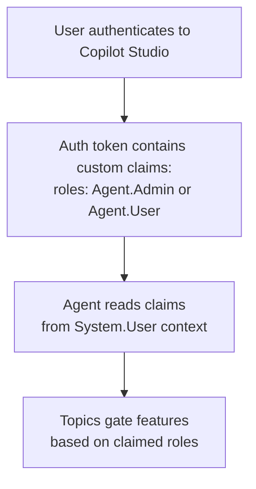
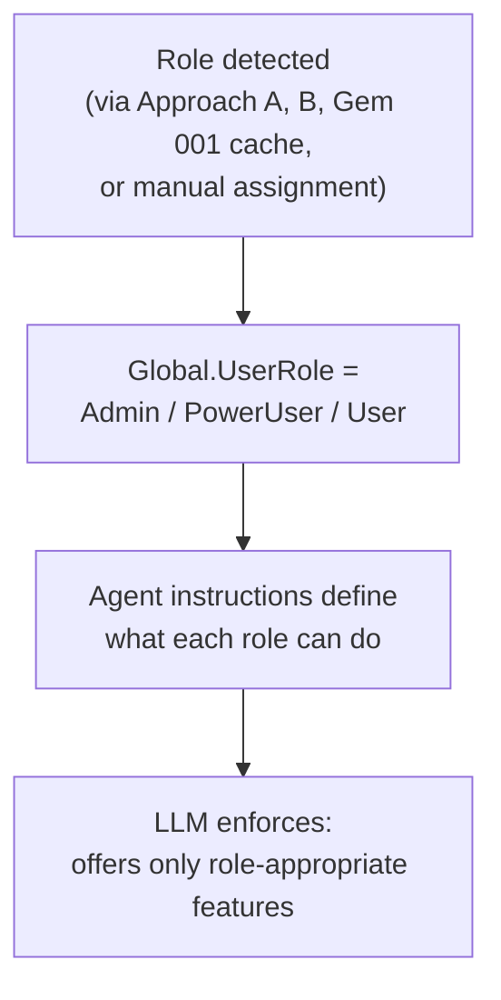

# Gem 007: Role-Based Feature Gating

*Show admin features to admins, hide them from everyone else — without deploying separate agents.*

## Classification

| Attribute | Value |
|---|---|
| **Category** | Security |
| **Complexity** | ⭐⭐⭐ (Moderate — role detection + conditional logic across topics) |
| **Channels** | All (role detection method varies) |
| **Prerequisite Gems** | [Gem 001](GEM-001-persisting-user-context-across-sessions.md) (for caching role across sessions), [Gem 004](GEM-004-debug-mode-for-m365-copilot.md) (debug mode is an example of gated feature) |

## The Problem

A single Copilot Studio agent often needs to serve multiple audiences with different capability levels. Some features should be visible only to specific roles:

- **Debug mode** ([Gem 004](GEM-004-debug-mode-for-m365-copilot.md)): Only admins or developers should be able to enable diagnostic output.
- **Data modification**: Regular users can view data; managers can approve requests; admins can delete records.
- **Sensitive information**: HR staff can see salary data; regular employees cannot.
- **Advanced actions**: Power users can trigger deployments or reindex operations; regular users can only query.
- **Configuration**: Agent settings (changing knowledge sources, updating prompts) should be admin-only.

Without role gating, you have two bad options:

1. **Show everything to everyone**: Security risk. Users see features they shouldn't access.
2. **Deploy separate agents per role**: Maintenance nightmare. Every change must be replicated.

The ideal is a **single agent** where features are conditionally available based on the user's role — detected automatically, cached for performance, and enforced consistently.

## The Ideal Outcome

A role-based access control system within a single agent:

- [ ] **Automatic role detection**: User's role is identified at conversation start without asking
- [ ] **Feature gating**: Specific topics, actions, or information are only available to authorized roles
- [ ] **Invisible to unauthorized users**: Gated features aren't just disabled — they're invisible. Users don't know they exist.
- [ ] **Fail-closed**: If role detection fails, default to the most restrictive role (not the most permissive)
- [ ] **Cacheable**: Role detection doesn't need to happen on every message — once per session is sufficient

## Approaches

### Approach A: Entra ID Group Membership via Power Automate

**Summary**: Check the user's Entra ID security group membership via Graph API. Map groups to roles. Cache the role in a global variable.  
**Technique**: Power Automate flow calling Microsoft Graph `/memberOf` endpoint, global variable for role, conditional logic in topics.

#### How It Works



```mermaid
flowchart TB
    A["Conversation start"] --> B["Power Automate:<br/>GET /users/&#123;id&#125;/memberOf"]
    B --> C{"Check groups"}
    C -->|Agent-Admins member| D["Role = Admin"]
    C -->|Agent-PowerUsers member| E["Role = PowerUser"]
    C -->|Neither| F["Role = User"]
    D --> G["Set Global.UserRole = detected role"]
    E --> G
    F --> G
    G --> H["Topics check Global.UserRole<br/>before exposing features"]
```

Entra ID security groups are the most reliable role signal because they're admin-managed, auditable, and centrally controlled.

#### Implementation

**Step 1: Create Entra ID security groups**

In Entra ID admin center, create security groups:

| Group Name | Purpose | Members |
|---|---|---|
| `CopilotAgent-Admins` | Full access: debug, config, data modification | IT admins, developers |
| `CopilotAgent-PowerUsers` | Extended access: advanced queries, reports | Team leads, power users |
| (no group needed) | Basic access: standard features only | Everyone else |

**Step 2: Create the role detection Power Automate flow**

```Text
Trigger: Run a flow from Copilot
  Input: userId (Text)

Action: HTTP to Microsoft Graph
  Method: GET
  URI: https://graph.microsoft.com/v1.0/users/{userId}/memberOf?$select=displayName,id
  
Action: Filter Groups (Select)
  From: outputs('HTTP')?['body/value']
  Condition: item()?['@odata.type'] eq '#microsoft.graph.group'

Action: Check Admin Group (Compose)
  Expression: contains(
    join(body('Filter_Groups')?['displayName'], ','),
    'CopilotAgent-Admins'
  )

Action: Check PowerUser Group (Compose)
  Expression: contains(
    join(body('Filter_Groups')?['displayName'], ','),
    'CopilotAgent-PowerUsers'
  )

Action: Determine Role (Compose)
  Expression: if(outputs('Check_Admin_Group'), 'Admin',
              if(outputs('Check_PowerUser_Group'), 'PowerUser', 'User'))

Output: role (string)
```

**Step 3: Load role at conversation start**

Via agent instructions (M365 Copilot compatible):

```yaml
kind: GptComponentMetadata
displayName: Role-Gated Agent
instructions: |+
  # Role-Gated Agent
  
  ## CRITICAL: Detect User Role
  At the START of every conversation, call "GetUserContext" to retrieve the user's role.
  Store it for use throughout the conversation.
  
  ## Role-Based Feature Access
  
  ### All Users (role = "User")
  - Knowledge search and Q&A
  - View data and reports
  - Submit requests
  
  ### Power Users (role = "PowerUser")
  - Everything in "User" plus:
  - Advanced search filters
  - Export data
  - View audit logs
  
  ### Admins (role = "Admin")
  - Everything in "PowerUser" plus:
  - Debug mode (say "xdebug on" — see Gem 004)
  - Data modification (create, update, delete records)
  - Agent configuration queries
  - User impersonation for testing
  
  ## IMPORTANT: Invisible Gating
  - NEVER mention features the user cannot access
  - NEVER say "You don't have permission to..." for features they shouldn't know about
  - If a user somehow tries a restricted action, respond naturally:
    "I can help you with [available features]. What would you like to do?"
  - If role detection fails, default to "User" role (most restrictive)
```

**Step 4: Gate features in topics with ConditionGroup**

```yaml
    # Example: Admin-only data deletion
    - kind: ConditionGroup
      id: checkAdminAccess
      conditions:
        - id: isAdmin
          condition: =Global.UserRole = "Admin"
          actions:
            - kind: SendActivity
              id: confirmDelete
              activity:
                text:
                  - "⚠️ You're about to delete record #{Topic.RecordId}. This cannot be undone.\n\nConfirm deletion?"
            # ... deletion flow ...
      elseActions:
        # Non-admins don't see this feature at all
        - kind: SendActivity
          id: featureNotAvailable
          activity:
            text:
              - "I can help you view records and submit requests. What would you like to do?"
```

**Step 5: Gate trigger phrases (advanced)**

For topics that should only exist for certain roles, check the role at the very start of the topic:

```yaml
kind: AdaptiveDialog
beginDialog:
  kind: OnRecognizedIntent
  id: main
  intent:
    displayName: Admin Configuration
    triggerQueries:
      - "agent config"
      - "change settings"
      - "admin panel"
  actions:
    # Gate: Admin only
    - kind: ConditionGroup
      id: gateAdmin
      conditions:
        - id: isAdmin
          condition: =Global.UserRole = "Admin"
          actions:
            # ... admin configuration UI ...
      elseActions:
        # Silently redirect — user doesn't know this topic exists
        - kind: SearchAndSummarizeContent
          id: fallbackSearch
          variable: Topic.FallbackAnswer
          userInput: =System.Activity.Text
```

**Step 6: Cache role across sessions (link to [Gem 001](GEM-001-persisting-user-context-across-sessions.md))**

Persist the role using [Gem 001](GEM-001-persisting-user-context-across-sessions.md) so the Graph API group check doesn't run every conversation:

```yaml
    # After role detection, save to persistent storage
    - kind: InvokeFlow
      id: cacheRole
      flowId: "@environmentVariables('WriteContextFlowId')"
      inputs:
        userId: =System.User.Id
        customData: ="{""role"": """ & Global.UserRole & """}"
```

Add a cache expiry check (e.g., re-detect role if last check was >24 hours ago) to handle group membership changes.

#### Evaluation

| Criterion | Rating | Notes |
|---|---|---|
| Ease of Implementation | 🟡 | Requires Entra ID groups + Power Automate flow + Graph API permissions. |
| Maintainability | 🟢 | Add/remove users from groups in Entra admin. No agent changes for membership updates. |
| Channel Compatibility | 🟢 | Works in all channels via agent instructions. |
| Security Strength | 🟢 | Admin-managed groups. Not bypassable by users. Auditable. |
| Automatic Detection | 🟢 | Zero user friction. Role is invisible to the user. |
| Fail-Closed | 🟢 | Default to "User" if detection fails. |

#### Limitations

- **Entra ID admin dependency**: Someone must create and maintain the security groups. If your org doesn't have dedicated Entra admin access, this is a blocker.
- **Graph API permissions**: Requires `GroupMember.Read.All` or `Directory.Read.All` — these are admin consent permissions. Plan for approval delay.
- **Group membership propagation**: When a user is added to a group, it may take minutes to propagate. If using cached roles ([Gem 001](GEM-001-persisting-user-context-across-sessions.md)), set cache expiry appropriately.
- **Power Automate latency**: Adds 2-3 seconds at conversation start. Caching mitigates repeat calls.

---

### Approach B: Claim-Based Roles from Authentication Context

**Summary**: Extract role information directly from the user's authentication token claims. No external API calls needed.  
**Technique**: Copilot Studio's authentication system variables, Entra ID app roles, conditional logic in topics.

#### How It Works



Entra ID **App Roles** are custom roles defined in the agent's app registration. When a user authenticates, their assigned roles appear as claims in the token. The agent reads these claims directly — no Graph API call needed.

#### Implementation

**Step 1: Define App Roles in Azure AD App Registration**

In Azure Portal → App Registrations → your Copilot Studio app → App Roles:

| Role Name | Display Name | Allowed Members | Value |
|---|---|---|---|
| Agent.Admin | Agent Administrator | Users/Groups | `Agent.Admin` |
| Agent.PowerUser | Agent Power User | Users/Groups | `Agent.PowerUser` |
| Agent.User | Agent User | Users/Groups | `Agent.User` |

**Step 2: Assign roles to users/groups**

In Enterprise Applications → your app → Users and Groups → Add assignment:

- Assign "Agent.Admin" role to your admin group
- Assign "Agent.PowerUser" to power user group
- Assign "Agent.User" to everyone (or make it default)

**Step 3: Read role from authentication context**

> **Note**: Copilot Studio's ability to read custom token claims varies by authentication configuration. This approach works when authentication is configured with the agent's own app registration and custom scopes.

```yaml
    # Check user's role from auth context
    - kind: SetVariable
      id: setRole
      variable: Global.UserRole
      value: =If(Contains(System.User.Roles, "Agent.Admin"), "Admin", If(Contains(System.User.Roles, "Agent.PowerUser"), "PowerUser", "User"))
```

**Step 4: Apply gating logic**

Same `ConditionGroup` patterns as Approach A, Step 4-5. The gating logic is identical — only the detection mechanism differs.

#### Evaluation

| Criterion | Rating | Notes |
|---|---|---|
| Ease of Implementation | 🟡 | Requires App Registration configuration + role assignments. |
| Maintainability | 🟢 | Role assignments managed in Entra admin. Centralized. |
| Channel Compatibility | 🟡 | Only works for authenticated channels. Anonymous Web Chat has no claims. |
| Security Strength | 🟢 | Token-based. Cryptographically signed. Cannot be spoofed. |
| Automatic Detection | 🟢 | Zero latency — roles are in the token, no API call needed. |
| Fail-Closed | 🟢 | No role claim = default to most restrictive. |

#### Limitations

- **Authentication required**: Only works in channels with authentication enabled. Anonymous or pre-authenticated channels have no claims.
- **App Registration setup**: Defining App Roles and assigning them requires Azure AD admin access and understanding of Entra ID app model.
- **Copilot Studio claim access**: The ability to read custom claims from `System.User` context depends on the authentication configuration. Not all setups expose custom roles. Test your specific configuration.
- **Not available in all channels**: M365 Copilot uses its own authentication context. Custom app roles may not be present. Test claim availability in each target channel.

---

### Approach C: Role Variable via Agent Instructions

**Summary**: Define role-based behavior entirely in agent instructions using a global variable set by any detection method. The LLM enforces feature gating.  
**Technique**: Global variable for role, detailed agent instructions defining per-role capabilities, LLM-based enforcement.

#### How It Works



This approach focuses on the **enforcement side** — regardless of how the role is detected, the agent instructions define the behavioral boundaries per role. The LLM becomes the gatekeeper.

#### Implementation

**Step 1: Comprehensive role-based instructions**

```yaml
kind: GptComponentMetadata
displayName: Role-Aware Agent
instructions: |+
  # Role-Aware Agent
  
  ## User Role Context
  The current user's role is stored in the conversation context.
  Use it to determine which features and information to offer.
  
  ## Role Definitions
  
  ### Role: "User" (Default)
  **Capabilities:**
  - Search knowledge base and ask questions
  - View their own records and history
  - Submit new requests (tickets, approvals)
  - Get general information and guidance
  
  **Restrictions:**
  - Cannot view other users' data
  - Cannot modify or delete any records
  - Cannot access configuration or settings
  - Cannot enable debug mode
  
  **Behavior:**
  - Proactively suggest available actions: "I can help you search, view your records, or submit a request."
  - If asked about admin/restricted features, respond with: "I can help you with [list available features]."
  - NEVER mention restricted features exist
  
  ### Role: "PowerUser"
  **Capabilities (in addition to User):**
  - Advanced search with filters (date range, category, status)
  - View team-level reports and summaries
  - Export data to CSV format
  - View audit logs for their team
  
  **Restrictions:**
  - Cannot modify or delete records
  - Cannot access agent configuration
  - Cannot enable debug mode
  
  ### Role: "Admin"
  **Capabilities (in addition to PowerUser):**
  - Create, update, and delete records
  - Enable debug mode ("xdebug on")
  - View all users' data
  - Access agent configuration and settings
  - Impersonate other users for testing
  - View system health and performance metrics
  
  **Behavior:**
  - Proactively offer admin-specific actions when relevant
  - Always confirm destructive actions (delete, bulk update)
  - Log all admin operations for audit
  
  ## Enforcement Rules
  1. ALWAYS check the user's role before offering or executing features
  2. If role is unknown or empty, treat as "User" (fail-closed)
  3. NEVER reveal the existence of features the user cannot access
  4. NEVER explain WHY a feature is restricted — just offer alternatives
  5. If a user explicitly asks "am I an admin?", you may confirm their role
```

**Step 2: Combine with topic-level gating**

For critical operations (data deletion, configuration changes), don't rely solely on LLM instruction following. Add explicit `ConditionGroup` checks as a defense-in-depth layer:

```yaml
    # LLM may route here based on instructions, but hard-gate as backup
    - kind: ConditionGroup
      id: hardGateAdmin
      conditions:
        - id: isAdmin
          condition: =Global.UserRole = "Admin"
          actions:
            # Proceed with admin action
      elseActions:
        # Hard block even if LLM made a routing mistake
        - kind: SendActivity
          id: blockUnauthorized
          activity:
            text:
              - "I can help you with searching, viewing your records, or submitting requests. What would you like to do?"
```

**Step 3: Feature discovery — role-appropriate suggestions**

```yaml
    # In a "What can you do?" topic
    - kind: ConditionGroup
      id: suggestByRole
      conditions:
        - id: adminSuggestions
          condition: =Global.UserRole = "Admin"
          actions:
            - kind: SendActivity
              id: adminFeatures
              activity:
                text:
                  - "Here's what I can help with:\n\n📋 **Search & Query**: Knowledge base, records, reports\n📊 **Reports**: Team and org-level analytics\n✏️ **Manage Records**: Create, update, delete\n🔧 **Debug Mode**: Enable diagnostics (say 'xdebug on')\n⚙️ **Configuration**: Agent settings and tuning"
        - id: powerUserSuggestions
          condition: =Global.UserRole = "PowerUser"
          actions:
            - kind: SendActivity
              id: powerFeatures
              activity:
                text:
                  - "Here's what I can help with:\n\n📋 **Search & Query**: Knowledge base, records, advanced filters\n📊 **Reports**: Team-level analytics and exports\n📥 **Export**: Download data as CSV"
      elseActions:
        - kind: SendActivity
          id: userFeatures
          activity:
            text:
              - "Here's what I can help with:\n\n📋 **Search**: Ask me anything about our knowledge base\n👁️ **View**: Check your records and history\n📝 **Submit**: Create new requests and tickets"
```

#### Evaluation

| Criterion | Rating | Notes |
|---|---|---|
| Ease of Implementation | 🟢 | Instructions + ConditionGroup. No external infrastructure for the gating itself. |
| Maintainability | 🟢 | Role definitions are in one instruction block. Adding a role = adding a section. |
| Channel Compatibility | 🟢 | Works everywhere. Role variable set by any detection method. |
| Security Strength | 🟡 | LLM enforcement is probabilistic. Critical actions need hard-coded ConditionGroup backup. |
| Automatic Detection | N/A | This approach doesn't detect roles — it enforces them. Pair with Approach A or B for detection. |
| Fail-Closed | 🟢 | Instructions explicitly state: unknown role = "User". |

#### Limitations

- **LLM enforcement is not deterministic**: The LLM *usually* follows role boundaries, but prompt injection or clever phrasing could bypass instruction-based gating. For security-critical features, always add hard-coded `ConditionGroup` checks.
- **Not a standalone approach**: This defines enforcement, not detection. You still need Approach A or B (or [Gem 001](GEM-001-persisting-user-context-across-sessions.md) cached data) to set `Global.UserRole`.
- **Instruction token cost**: Detailed per-role instructions consume system prompt tokens. With 4+ roles, the instructions grow significantly.
- **Testing complexity**: Each role effectively creates a different "version" of the agent. You need to test with users in each role to verify gating works correctly.

---

## Comparison Matrix

| Dimension | Approach A: Entra Groups | Approach B: Token Claims | Approach C: LLM Instructions |
|---|---|---|---|
| **Detection Method** | Graph API group check | Auth token claims | None (enforcement only) |
| **Implementation Effort** | 🟡 Medium (2-3 hours) | 🟡 Medium (2-3 hours) | 🟢 Low (1 hour) |
| **Security Strength** | 🟢 Admin-managed groups | 🟢 Cryptographic token | 🟡 Probabilistic LLM |
| **Latency** | 🟡 2-3s (API call) | 🟢 Zero (in token) | 🟢 Zero (variable check) |
| **Anonymous Users** | 🔴 Not supported | 🔴 Not supported | 🟡 Default to "User" |
| **Maintenance** | 🟢 Group membership in Entra | 🟢 Role assignment in Entra | 🟢 Instructions only |
| **Defense-in-Depth** | 🟢 Hard gate possible | 🟢 Hard gate possible | 🟡 Needs ConditionGroup backup |
| **Best When...** | Standard enterprise deployment | Custom app with Entra auth | Quick setup, non-critical gating |

## Recommended Approach

**For most enterprise scenarios**: **Approach A (Entra Groups) + Approach C (LLM Instructions)** — detection + enforcement.

Use Entra ID groups for **reliable, admin-managed role detection**. Use comprehensive agent instructions for **behavioral enforcement** (what features to offer, how to respond). Add hard-coded `ConditionGroup` checks as **defense-in-depth** for security-critical operations (data deletion, configuration changes).

```Text
Detection:   Approach A (Entra groups) or B (token claims)
Enforcement: Approach C (agent instructions) + ConditionGroup hard gates
Caching:     Gem 001 (persist role, re-detect every 24h)
```

**Choose Approach B when**: You have a custom Entra app registration with App Roles configured. Token-based detection is faster (zero latency) and doesn't require Power Automate.

**Skip the hard infrastructure when**: Features being gated are low-risk (e.g., showing extra information, offering additional search filters). LLM instruction-based gating (Approach C alone) is sufficient for non-security-critical feature differentiation.

## Platform Gotchas

> [!WARNING]
> **LLM instruction-based gating is not a security boundary.**  
> LLMs are probabilistic. A determined user crafting specific prompts could potentially bypass instruction-based restrictions. For any feature involving data modification, deletion, or sensitive information access, ALWAYS use a hard-coded `ConditionGroup` check on `Global.UserRole` in addition to instructions.

> [!WARNING]
> **ConversationStart doesn't fire in M365 Copilot** (see [Gotchas Compendium](../appendices/gotchas-compendium.md#channel-limitations)).  
> If you detect roles in `OnConversationStart`, it won't work in M365 Copilot. Use agent instructions: "At the start of every conversation, call GetUserContext to retrieve the user's role."

> [!WARNING]
> **Graph API `memberOf` requires admin consent.**  
> The `GroupMember.Read.All` or `Directory.Read.All` permissions require tenant admin consent. Plan for approval time. If blocked, consider Approach B (token claims) as an alternative.

> [!NOTE]
> **Cache roles with expiry for responsiveness.**  
> Don't call Graph API every conversation. Cache the role via [Gem 001](GEM-001-persisting-user-context-across-sessions.md) with a 24-hour expiry. Re-detect when cache expires. This balances security (group changes propagate within 24h) with performance (no API call for most conversations).

> [!NOTE]
> **Test with actual role assignments, not just code.**  
> The most common bug in role gating is the detection logic working in dev but failing in production because group names differ, permissions aren't granted, or the Graph API returns unexpected data. Test with real users in real groups.

## Related Gems

- **[Gem 001](GEM-001-persisting-user-context-across-sessions.md)**: Persisting User Context Across Sessions — Cache the detected role so it persists across sessions (24h expiry recommended)
- **[Gem 002](GEM-002-persona-adaptive-agent-instructions.md)**: Persona-Adaptive Agent Instructions — Role and persona are complementary. Role gates features; persona adjusts tone. A user can be Admin role with Manager persona.
- **[Gem 004](GEM-004-debug-mode-for-m365-copilot.md)**: Debug Mode for M365 Copilot Channel — Debug mode (Approach A's keyword toggle) is the most common example of a role-gated feature

## References

- [Microsoft Learn: Entra ID security groups](https://learn.microsoft.com/en-us/entra/fundamentals/concept-learn-about-groups)
- [Microsoft Learn: App Roles in Azure AD](https://learn.microsoft.com/en-us/entra/identity-platform/howto-add-app-roles-in-apps)
- [Microsoft Graph API: List memberOf](https://learn.microsoft.com/en-us/graph/api/user-list-memberof)
- [Microsoft Learn: Authentication in Copilot Studio](https://learn.microsoft.com/en-us/microsoft-copilot-studio/configuration-end-user-authentication)

---

*Gem 007 | Author: Sébastien Brochet | Created: 2026-02-17 | Last Validated: 2026-02-17 | Platform Version: current*
