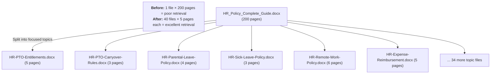

# Gem 008: Knowledge Source Optimization

*Your agent can't find the answer — even though it's in your documents. Here's why and how to fix it.*

## Classification

| Attribute | Value |
|---|---|
| **Category** | Performance |
| **Complexity** | ⭐⭐ (Low-Moderate — mostly content preparation, not code) |
| **Channels** | All (knowledge retrieval is channel-agnostic) |
| **Prerequisite Gems** | None |

## The Problem

You uploaded 50 policy documents to your Copilot Studio knowledge source. You ask the agent: "What's the paternity leave policy?" The agent responds: "I couldn't find information about that." But the answer is clearly on page 12 of the HR Policy Guide.

This is the most common frustration builders face. The knowledge is there, but the agent can't find it. The causes are rarely obvious:

- **Document format issues**: PDF files with tables break text extraction (see [Gotchas Compendium — Knowledge & Search](../appendices/gotchas-compendium.md#knowledge-search)). Scanned PDFs with no OCR return empty text. Complex Word documents with nested tables lose structure.
- **Content density**: A single 200-page document buries relevant passages in noise. The retrieval engine finds the document but can't pinpoint the right section.
- **Inconsistent terminology**: The user asks about "paternity leave" but the document says "parental leave for fathers." Semantic search helps, but it's not magic.
- **Missing metadata**: Without clear titles, headings, and structure, the retrieval engine has less signal to work with.
- **Knowledge source limits**: SharePoint indexing has delays. File upload has size limits. Website crawling has depth limits.

The fundamental challenge: **Retrieval quality is primarily a content preparation problem, not a platform problem.** The same content, prepared differently, can yield dramatically different retrieval accuracy.

## The Ideal Outcome

Knowledge sources that consistently return relevant, accurate results:

- [ ] **High retrieval rate**: Agent finds relevant content >95% of the time when it exists
- [ ] **Accurate extraction**: Tables, lists, and structured data are preserved in retrieval
- [ ] **Fast indexing**: New or updated content is searchable within minutes, not hours
- [ ] **Maintainable**: Content owners can update documents without breaking retrieval
- [ ] **Scalable**: Approach works for 10 documents and for 1,000 documents

## Approaches

### Approach A: Document Format Strategy

**Summary**: Optimize the file format and internal structure of documents before uploading to knowledge sources. The format matters more than the content quantity.  
**Technique**: Content conversion pipeline (Markdown → HTML → Word), structured headings, table formatting, metadata enrichment.

#### How It Works

The knowledge retrieval pipeline works roughly like this:

```Text
Document → Text Extraction → Chunking → Embedding → Semantic Index → Query → Retrieval
```

Problems can occur at **every stage**. The format you choose determines how much information survives extraction and chunking.

#### Implementation

**Step 1: Choose the right format**

| Format | Text Extraction | Tables | Structure | Recommendation |
|---|---|---|---|---|
| **Word (.docx)** | 🟢 Excellent | 🟢 Preserved | 🟢 Headings mapped | ✅ **Best choice** |
| **HTML** | 🟢 Excellent | 🟢 Preserved | 🟢 Tags mapped | ✅ Alternative |
| **Markdown (.md)** | 🟡 Good | 🟡 Variable | 🟡 Depends on parser | ⚠️ Test first |
| **PDF (text-based)** | 🟡 Fair | 🔴 Often broken | 🟡 Limited | ⚠️ Avoid if possible |
| **PDF (scanned/image)** | 🔴 Poor (needs OCR) | 🔴 Lost | 🔴 None | ❌ Avoid |
| **Excel (.xlsx)** | 🟡 Fair | 🟢 By nature | 🟡 Sheet names only | ⚠️ Limited use |
| **PowerPoint (.pptx)** | 🟡 Fair | 🟡 Variable | 🟡 Slide-based | ⚠️ Low density |

**Step 2: Structure documents for retrieval**

```markdown
# Document best practices for knowledge source optimization:

## Use clear heading hierarchy
- H1: Document title / major section
- H2: Topic area
- H3: Specific subtopic
- The retrieval engine uses headings as chunk boundaries

## Write self-contained sections
- Each H2/H3 section should make sense independently
- Don't rely on "as mentioned above" — chunks are retrieved independently
- Include the topic name in each section, not just the heading

## Structure tables properly
- Add a caption above each table: "Table 1: PTO Entitlements by Tenure"
- Include column headers in every table
- Avoid merged cells (they break extraction)
- Keep tables under 20 rows — split larger tables into logical groups

## Front-load answers
- Put the key information in the first paragraph of each section
- Don't bury the answer in paragraph 5 after contextual preamble
- Pattern: [Answer] → [Context] → [Exceptions] → [References]
```

**Step 3: Convert existing content**

If your content is in PDF (the most common problematic format), convert it:

```Text
Source PDF
    │
    ▼
Open in Word (File → Open → select PDF)
    │
    ▼
Review conversion quality (check tables, formatting)
    │
    ▼
Fix any conversion artifacts
    │
    ▼
Save as .docx
    │
    ▼
Upload to SharePoint / Knowledge Source
```

For Markdown sources:

```Text
Source Markdown
    │
    ▼
Convert to HTML (use any Markdown renderer)
    │
    ▼
Open HTML in Word (File → Open → select HTML)
    │
    ▼
Save as .docx
    │
    ▼
Upload to Knowledge Source
```

**Step 4: Validate extraction quality**

After uploading, test retrieval with specific queries targeting:

- Content in tables ("What's the PTO for 3-year employees?")
- Content deep in the document ("What's the exception for contract workers?")
- Content using different terminology ("paternity leave" when doc says "parental leave")
- Content with numbers and dates ("What's the deadline for Q3 budget submissions?")

#### Evaluation

| Criterion | Rating | Notes |
|---|---|---|
| Ease of Implementation | 🟢 | No code. Content preparation and reformatting. |
| Maintainability | 🟢 | Once templates are established, content owners follow the pattern. |
| Channel Compatibility | 🟢 | Knowledge source quality improves all channels equally. |
| Retrieval Improvement | 🟢 | Format conversion alone can improve retrieval from 60% to 90%+. |
| Scalability | 🟡 | Manual conversion for existing content. New content follows template from the start. |
| Indexing Speed | 🟢 | No impact on indexing speed — only on retrieval quality. |

#### Limitations

- **Manual conversion effort**: Converting 100 existing PDFs to Word is time-consuming. Prioritize high-query-volume documents first.
- **Content owner adoption**: Getting content owners to write in structured formats requires training and templates.
- **Format doesn't fix bad content**: If the information is genuinely not in the document, no format will fix it.

---

### Approach B: Content Chunking Strategy

**Summary**: Instead of uploading large documents as-is, split them into smaller, focused topic files. Each file addresses one question or topic area.  
**Technique**: Content decomposition — one large document becomes many small documents, each optimized for retrieval.

#### How It Works



Smaller, focused files give the retrieval engine much better signal. Each file is about one topic, so when it matches, the entire file is relevant — not just a paragraph buried in page 147.

#### Implementation

**Step 1: Decompose large documents**

Rules for splitting:

| Guideline | Rationale |
|---|---|
| **One topic per file** | Each file should answer a clear question or cover a specific area |
| **2-10 pages per file** | Long enough for depth, short enough for focused retrieval |
| **Self-contained** | Each file makes sense without reading the others |
| **Descriptive filename** | `HR-Parental-Leave-Policy.docx` not `Policy-Section-3.2.docx` |
| **Include context** | Each file should state its scope: "This document covers paternity and maternity leave policies for full-time employees." |

**Step 2: Add metadata headers**

Start each file with a metadata block that aids retrieval:

```markdown
# Parental Leave Policy
**Category**: Human Resources
**Applies to**: Full-time employees, all regions
**Last Updated**: January 2026
**Related Policies**: PTO Policy, Remote Work Policy

## Overview
This document covers parental leave entitlements including maternity leave,
paternity leave, and adoption leave for full-time Contoso employees.

## Policy Details
...
```

**Step 3: Create a naming convention**

```Text
[Department]-[Topic]-[Subtopic].docx

Examples:
HR-Leave-Parental.docx
HR-Leave-PTO-Entitlements.docx
HR-Leave-PTO-Carryover.docx
IT-Security-Password-Policy.docx
IT-Security-MFA-Setup-Guide.docx
Finance-Expense-Travel-Policy.docx
Finance-Expense-Reimbursement-Process.docx
```

**Step 4: Organize in SharePoint folders**

```Text
Knowledge Base (Document Library)
├── HR/
│   ├── Leave/
│   │   ├── HR-Leave-Parental.docx
│   │   ├── HR-Leave-PTO-Entitlements.docx
│   │   └── HR-Leave-Sick.docx
│   ├── Benefits/
│   │   ├── HR-Benefits-Health-Insurance.docx
│   │   └── HR-Benefits-401k.docx
│   └── Onboarding/
│       └── HR-Onboarding-Checklist.docx
├── IT/
│   └── Security/
│       ├── IT-Security-Password-Policy.docx
│       └── IT-Security-MFA-Setup.docx
└── Finance/
    └── ...
```

#### Evaluation

| Criterion | Rating | Notes |
|---|---|---|
| Ease of Implementation | 🟡 | Significant upfront effort to split existing documents. |
| Maintainability | 🟡 | More files to manage. Content owners must update the right file. Risk of drift between files. |
| Channel Compatibility | 🟢 | Purely content-side. No channel impact. |
| Retrieval Improvement | 🟢 | Dramatic improvement for large document collections. Focused files match much better. |
| Scalability | 🟢 | Scales well — many small files perform better than few large files. |
| Indexing Speed | 🟡 | More files to index, but each indexes faster. Net neutral. |

#### Limitations

- **Upfront decomposition effort**: Splitting 50 large documents into 500 focused files is a major content project. Prioritize by user query frequency.
- **Maintenance overhead**: 500 files are harder to manage than 50. Content changes may need updating in multiple files if topics overlap.
- **Cross-reference loss**: A large document has internal references ("see Section 4.2"). Split files lose these references. Add explicit cross-references: "See also: HR-Leave-PTO-Carryover.docx."
- **Duplication risk**: Information that applies to multiple topics may be duplicated across files. Accept some duplication for retrieval quality.

---

### Approach C: Custom Instructions for Retrieval Enhancement

**Summary**: Use the `customInstructions` field of `SearchAndSummarizeContent` to guide how the LLM interprets and presents retrieved content.  
**Technique**: Tailored search instructions that improve answer quality without changing the underlying documents.

#### How It Works

Even with perfect documents, the LLM's response quality depends on how it's instructed to use retrieved content. Custom instructions act as a "retrieval filter" — telling the LLM how to interpret, prioritize, and present what it finds.

```Text
User query → Semantic search → Retrieved chunks → Custom Instructions → LLM → Response
                                                        ↑
                                              "How to use these results"
```

#### Implementation

**Step 1: Domain-specific search instructions**

```yaml
    - kind: SearchAndSummarizeContent
      id: searchWithInstructions
      variable: Topic.Answer
      userInput: =System.Activity.Text
      customInstructions: |
        ## Search Instructions
        
        ### Source Priority
        When multiple sources contain relevant information:
        1. Policies and official documents take precedence over meeting notes
        2. Most recently updated document wins when information conflicts
        3. Region-specific policies override global policies
        
        ### Response Requirements
        - ALWAYS cite the specific document name and section
        - If the answer involves dates or amounts, quote the exact text
        - If information is from a document older than 12 months, note: "⚠️ This information is from [date]. Please verify it's still current."
        - If no relevant information is found, say: "I couldn't find this in our knowledge base. Try asking [specific alternative]."
        
        ### Table and Data Handling
        - If the answer is in a table, reproduce the relevant rows
        - Include column headers for context
        - Don't summarize numbers — quote them exactly
        
        ### Terminology Mapping
        Users may ask using different terms than in the documents:
        - "PTO" = "Paid Time Off" = "Annual Leave" = "Vacation"
        - "WFH" = "Remote Work" = "Work From Home" = "Telecommuting"
        - "Paternity leave" = "Parental leave for fathers" = "Family leave"
```

**Step 2: Query-type-specific instructions**

For agents with different question patterns, you can use a Prompt Tool ([Gem 002](GEM-002-persona-adaptive-agent-instructions.md)'s Approach C pattern) to generate query-specific search instructions:

```yaml
kind: PromptTool
id: prompt_searchOptimizer
displayName: "Search Query Optimizer"
description: "Generates optimized search instructions based on query type"
instructions: |
  Analyze this user query and generate search instructions:
  
  Query: {userQuery}
  
  Determine the query type:
  - FACTUAL: Specific fact, date, number, or policy → Instruct: "Quote exact text, cite source"
  - COMPARISON: Compare two things → Instruct: "Create comparison table, cite both sources"
  - PROCEDURAL: How to do something → Instruct: "Provide step-by-step from documents"
  - EXPLORATORY: Open-ended question → Instruct: "Summarize from multiple sources, cite each"
  
  Return ONLY the search instruction tailored to this query type (3-5 lines max).
  
model:
  provider: ManagedModel
  modelNameHint: GPT4Mini
inputs:
  - name: userQuery
    type: string
outputs:
  - name: instructions
    type: string
```

**Step 3: Combine with Approach A and B**

Custom instructions work best on top of well-formatted, well-chunked content:

```Text
Approach A (Format) + Approach B (Chunking) + Approach C (Instructions) = Maximum retrieval quality
```

#### Evaluation

| Criterion | Rating | Notes |
|---|---|---|
| Ease of Implementation | 🟢 | Just text in the `customInstructions` field. Minutes to implement. |
| Maintainability | 🟢 | Instructions are easy to update and iterate. |
| Channel Compatibility | 🟢 | Applies to all channels (instructions affect LLM, not rendering). |
| Retrieval Improvement | 🟡 | Improves response quality from retrieved content. Doesn't fix retrieval misses (document not found). |
| Scalability | 🟢 | Same instructions apply regardless of document count. |
| Indexing Speed | 🟢 | No impact on indexing. Instructions apply at query time. |

#### Limitations

- **Doesn't fix retrieval misses**: If the semantic search doesn't find the relevant document, custom instructions can't help. This approach improves what happens AFTER retrieval, not the retrieval itself.
- **Prompt Tool adds latency**: The optional query-type-specific optimization adds an LLM call before the search. +1-3 seconds.
- **Token cost**: Longer custom instructions = more tokens per search call.
- **LLM compliance variability**: The model follows custom instructions well but not perfectly. "Always cite the document" works 90% of the time.

---

## Comparison Matrix

| Dimension | Approach A: Format Strategy | Approach B: Content Chunking | Approach C: Custom Instructions |
|---|---|---|---|
| **Implementation Effort** | 🟡 Content conversion | 🔴 Document decomposition | 🟢 Configuration only |
| **Retrieval Improvement** | 🟢 High (format fixes extraction) | 🟢 High (focused files match better) | 🟡 Moderate (improves response, not retrieval) |
| **Fixes "Can't Find" Problem** | 🟢 Yes (broken extraction) | 🟢 Yes (buried content) | 🔴 No (post-retrieval only) |
| **Fixes "Wrong Answer" Problem** | 🟡 Partially | 🟡 Partially | 🟢 Yes (guides interpretation) |
| **Ongoing Effort** | 🟢 Low (template established) | 🟡 Medium (maintain many files) | 🟢 Low (adjust instructions) |
| **Best When...** | Documents are in PDF/wrong format | Large documents with many topics | Retrieval works but answers are poor quality |

## Recommended Approach

**Apply all three in sequence** — they're additive, not competing:

```Text
Step 1: Approach A (Format) — Fix document formats first
        Convert PDFs to Word. Fix table formatting. Add headings.
        This alone can improve retrieval from 60% to 85%.

Step 2: Approach B (Chunking) — Split large documents
        Decompose 200-page docs into focused topic files.
        This pushes retrieval from 85% to 95%.

Step 3: Approach C (Instructions) — Optimize response quality
        Add custom search instructions for citation, terminology, and formatting.
        This improves response quality for the 95% of queries that now retrieve correctly.
```

**If you can only do one**: **Approach A (Format Strategy)** — converting PDFs to Word is the single highest-impact action. In production, switching from PDF to Word fixed a complete retrieval failure (see Platform Gotchas below).

## Platform Gotchas

> [!WARNING]
> **PDF tables break SharePoint knowledge retrieval** (see [Gotchas Compendium](../appendices/gotchas-compendium.md#knowledge-search)).  
> This is the most common cause of "agent can't find the answer." PDF text extraction corrupts table data. Convert to Word (.docx) for reliable table retrieval.

> [!WARNING]  
> **SharePoint file upload knowledge source has a 512 MB file size limit.**  
> Very large documents (multi-hundred-page PDFs with images) may hit this limit. Split into smaller files per Approach B.

> [!NOTE]
> **SharePoint indexing has a delay after upload.**  
> New or updated documents may take 5-30 minutes to appear in search results. Don't test retrieval immediately after uploading. Wait at least 30 minutes.

> [!NOTE]
> **The `customInstructions` field in `SearchAndSummarizeContent` is powerful but underdocumented.**  
> It accepts free-form Markdown/text and directly influences how the LLM uses retrieved content. Experiment with specific instructions for your domain.

## Related Gems

- **[Gem 005](GEM-005-multi-language-agent-response.md)**: Multi-Language Agent Response — Knowledge source language affects retrieval. English docs + French queries works via semantic search, but response quality varies.
- **[Gem 003](GEM-003-tracing-agent-progress-before-response.md)**: Tracing Agent Progress Before Response — Add "Searching knowledge base..." progress messages before knowledge retrieval.

## References

- [Microsoft Learn: Knowledge sources in Copilot Studio](https://learn.microsoft.com/en-us/microsoft-copilot-studio/knowledge-copilot-studio)
- [Microsoft Learn: Generative answers](https://learn.microsoft.com/en-us/microsoft-copilot-studio/nlu-boost-conversations)
- [Microsoft Learn: SharePoint as knowledge source](https://learn.microsoft.com/en-us/microsoft-copilot-studio/knowledge-add-sharepoint)
- [Supported file types for knowledge](https://learn.microsoft.com/en-us/microsoft-copilot-studio/knowledge-add-file)

---

*Gem 008 | Author: Sébastien Brochet | Created: 2026-02-17 | Last Validated: 2026-02-17 | Platform Version: current*
