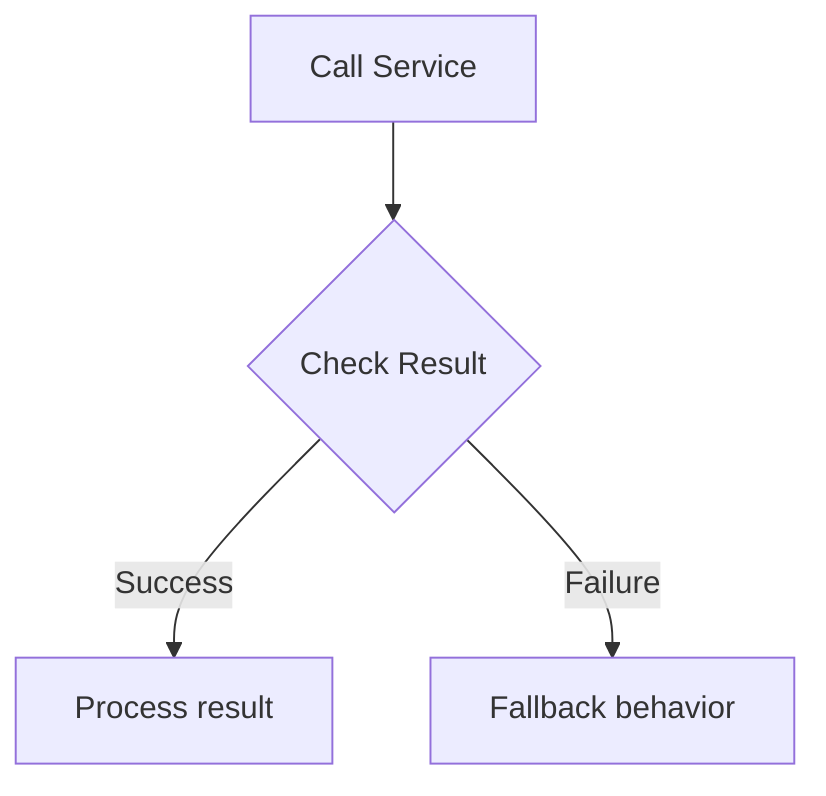

# Gem 009: Graceful Degradation and Fallback Chains

*When your external service is down, your agent shouldn't be down with it.*

## Classification

| Attribute | Value |
|---|---|
| **Category** | Integration |
| **Complexity** | ⭐⭐⭐ (Moderate — error handling across multiple integration points) |
| **Channels** | All |
| **Prerequisite Gems** | None ([Gem 004](GEM-004-debug-mode-for-m365-copilot.md) complementary for diagnostics) |

## The Problem

Production agents depend on external services: Power Automate flows, REST APIs, knowledge sources, Graph API, Dataverse. When any of these fail — and they will — the default behavior is catastrophic:

- **Unhandled flow error**: The agent shows a generic error message or goes silent. The user has no idea what happened.
- **API timeout**: The agent waits 30 seconds, then returns an error. The user has already left.
- **Knowledge source empty**: SharePoint indexing is delayed after a bulk upload. The agent says "I couldn't find information" for all queries — even though the content exists.
- **Cascading failure**: The agent calls Flow A, which calls API B, which calls Service C. Service C is down, so everything fails — and the user gets a cryptic error message about "Workflow run failed."

The fundamental challenge: **agents that depend on external services must plan for those services being unavailable.** A single unhandled failure point turns a sophisticated agent into a frustrating dead end.

## The Ideal Outcome

An agent that degrades gracefully when services are unavailable:

- [ ] **No silent failures**: Every error produces a user-friendly message with a clear next action
- [ ] **Fallback alternatives**: When the primary approach fails, a secondary approach activates
- [ ] **Timeout management**: Long-running operations have reasonable timeouts with user feedback
- [ ] **Diagnostic logging**: All failures are logged for investigation (link to [Gem 004](GEM-004-debug-mode-for-m365-copilot.md))
- [ ] **Self-healing indicators**: The agent tells the user when to try again or how to work around the issue

## Approaches

### Approach A: Error-Branch Fallback in Topics

**Summary**: Wrap every external call with condition checks. Branch to fallback behavior when the call fails.  
**Technique**: `ConditionGroup` after every `InvokeFlow` / `HttpRequest`, error response variables, fallback `SendActivity` messages.

#### How It Works



Every external call has an explicit success/failure branch. The failure branch provides a user-friendly alternative — not just an error message.

#### Implementation

**Step 1: Wrap Power Automate flow calls**

```yaml
    # Primary: Call flow to get user's ticket status
    - kind: InvokeFlow
      id: getTicketStatus
      flowId: "@environmentVariables('GetTicketStatusFlowId')"
      inputs:
        ticketId: =Topic.TicketId
      outputVariable: Topic.TicketResult

    # Check: Did the flow succeed?
    - kind: ConditionGroup
      id: checkFlowResult
      conditions:
        - id: hasResult
          condition: =!IsBlank(Topic.TicketResult) && !IsBlank(Topic.TicketResult.status)
          actions:
            - kind: SendActivity
              id: sendStatus
              activity:
                text:
                  - "Your ticket **#{Topic.TicketId}** is **{Topic.TicketResult.status}**.\n\nLast updated: {Topic.TicketResult.lastUpdate}"
      elseActions:
        # Fallback: Provide alternative when flow fails
        - kind: SendActivity
          id: flowFailed
          activity:
            text:
              - "I'm having trouble retrieving your ticket status right now. Here's what you can do:\n\n1. **Try again in a few minutes** — our systems may be updating\n2. **Check directly**: [Support Portal](https://support.contoso.com/tickets/{Topic.TicketId})\n3. **Contact support**: Email support@contoso.com with ticket #{Topic.TicketId}\n\nI apologize for the inconvenience."

    # Always: Log the attempt (Gem 004 telemetry)
    - kind: LogCustomTelemetryEvent
      id: logFlowAttempt
      eventName: AgentTrace
      properties: "={TracePoint: \"FlowCall\", FlowName: \"GetTicketStatus\", Success: !IsBlank(Topic.TicketResult), TicketId: Topic.TicketId, ConversationId: System.Conversation.Id}"
```

**Step 2: Wrap HTTP Request calls with timeout**

```yaml
    # HTTP call with explicit timeout and error handling
    - kind: HttpRequest
      id: http_getWeather
      method: GET
      url: =Concatenate("https://api.weather.example.com/current?city=", EncodeUrl(Topic.City))
      headers:
        - key: "x-api-key"
          value: =Env.agent_WeatherApiKey
      responseType: json
      responseVariable: Topic.WeatherData
      errorHandling:
        continueOnError: true
        statusCodeVariable: Topic.HttpStatus
        errorResponseVariable: Topic.HttpError
      timeout: 5000

    # Three-way check: success, client error, server/timeout error
    - kind: ConditionGroup
      id: checkHttpResult
      conditions:
        - id: success
          condition: =Topic.HttpStatus >= 200 && Topic.HttpStatus < 300
          actions:
            - kind: SendActivity
              id: sendWeather
              activity:
                text:
                  - "Weather in {Topic.City}: {Topic.WeatherData.description}, {Topic.WeatherData.temp}°C"
        - id: clientError
          condition: =Topic.HttpStatus >= 400 && Topic.HttpStatus < 500
          actions:
            - kind: SendActivity
              id: sendClientError
              activity:
                text:
                  - "I couldn't find weather data for \"{Topic.City}\". Please check the city name and try again."
      elseActions:
        # Server error, timeout, or no response at all
        - kind: SendActivity
          id: sendServerError
          activity:
            text:
              - "The weather service is temporarily unavailable. Please try again in a few minutes."
```

**Step 3: Knowledge source fallback**

```yaml
    # Primary: Knowledge search
    - kind: SearchAndSummarizeContent
      id: searchKnowledge
      variable: Topic.Answer
      userInput: =System.Activity.Text
      customInstructions: "Cite specific documents. If no relevant information is found, return empty."

    # Fallback: Handle empty results
    - kind: ConditionGroup
      id: checkKnowledgeResult
      conditions:
        - id: hasAnswer
          condition: =!IsBlank(Topic.Answer)
          actions:
            - kind: SendActivity
              id: sendAnswer
              activity:
                text:
                  - "{Topic.Answer}"
      elseActions:
        # Tiered fallback
        - kind: SendActivity
          id: suggestAlternatives
          activity:
            text:
              - "I couldn't find specific information about that in our knowledge base. Here are some alternatives:\n\n🔄 **Rephrase**: Try asking the question differently\n📧 **Email**: Contact the relevant team directly\n🔗 **Browse**: Check our [documentation portal](https://docs.contoso.com)\n\nWould you like me to try a broader search?"
```

**Step 4: Standardized error response template**

Create a consistent fallback message pattern across all topics:

```Text
[Empathize] — "I'm having trouble with..."
[Explain]   — "Our [service] is temporarily unavailable"
[Offer]     — "Here's what you can do instead: [1, 2, 3]"
[Timeframe] — "Try again in a few minutes"
[Log]       — LogCustomTelemetryEvent for diagnosis
```

#### Evaluation

| Criterion | Rating | Notes |
|---|---|---|
| Ease of Implementation | 🟢 | ConditionGroup after each call. Pattern is repetitive but straightforward. |
| Maintainability | 🟡 | Every external call gets a fallback branch. Lots of repeated pattern. |
| Channel Compatibility | 🟢 | Plain text fallbacks work everywhere. |
| User Experience | 🟢 | Users always get a helpful response, even when services fail. |
| Diagnostic Logging | 🟢 | LogCustomTelemetryEvent captures every failure for investigation. |
| Self-Healing | 🟡 | "Try again in a few minutes" — but no automatic retry mechanism. |

#### Limitations

- **Manual per-call instrumentation**: Every `InvokeFlow` and `HttpRequest` needs its own fallback branch. In a 20-topic agent with 30 external calls, that's 30 error branches to write.
- **No automatic retry**: If a service fails, the user must manually retry. There's no built-in retry loop in Copilot Studio topics.
- **Fallback quality varies**: "I couldn't find that" is better than silence, but it's still a degraded experience. The fallback is a band-aid, not a solution.

---

### Approach B: Cached Last-Known-Good Response

**Summary**: Cache successful responses in persistent storage. When a service fails, serve the cached version with a staleness indicator.  
**Technique**: Write-through cache in Dataverse/SharePoint ([Gem 001](GEM-001-persisting-user-context-across-sessions.md) patterns), conditional cache read on failure, staleness timestamps.

#### How It Works

```Text
Service call succeeds:
  → Return fresh data to user
  → Cache the response with timestamp

Service call fails:
  → Read cached response
  → Show data with "⚠️ Data as of [timestamp]" warning
  → Better than no data at all
```

This approach is valuable for data that changes infrequently — dashboards, reports, reference data, status summaries.

#### Implementation

**Step 1: Cache on success**

After every successful service call, write the response to persistent storage:

```yaml
    # Call the service
    - kind: InvokeFlow
      id: getDashboard
      flowId: "@environmentVariables('GetDashboardFlowId')"
      inputs:
        teamId: =Global.UserTeamId
      outputVariable: Topic.DashboardData

    # Check success
    - kind: ConditionGroup
      id: checkDashboard
      conditions:
        - id: hasData
          condition: =!IsBlank(Topic.DashboardData)
          actions:
            # Show fresh data
            - kind: SendActivity
              id: sendFreshDashboard
              activity:
                text:
                  - "📊 **Team Dashboard** (live data)\n\n{Topic.DashboardData.summary}"

            # Cache for fallback
            - kind: InvokeFlow
              id: cacheDashboard
              flowId: "@environmentVariables('WriteCacheFlowId')"
              inputs:
                cacheKey: =Concatenate("dashboard_", Global.UserTeamId)
                cacheValue: =Topic.DashboardData.summary
                timestamp: =Text(Now(), DateTimeFormat.UTC)

      elseActions:
        # Service failed — try cache
        - kind: InvokeFlow
          id: readCache
          flowId: "@environmentVariables('ReadCacheFlowId')"
          inputs:
            cacheKey: =Concatenate("dashboard_", Global.UserTeamId)
          outputVariable: Topic.CachedDashboard

        - kind: ConditionGroup
          id: checkCache
          conditions:
            - id: cacheHit
              condition: =!IsBlank(Topic.CachedDashboard)
              actions:
                - kind: SendActivity
                  id: sendCachedDashboard
                  activity:
                    text:
                      - "📊 **Team Dashboard** (⚠️ cached data from {Topic.CachedDashboard.timestamp})\n\n{Topic.CachedDashboard.value}\n\n_Live data is temporarily unavailable. This shows the last known data._"
          elseActions:
            # No cache either — full fallback
            - kind: SendActivity
              id: noDataAvailable
              activity:
                text:
                  - "The dashboard service is temporarily unavailable and I don't have cached data yet. Please try again in a few minutes or check the [dashboard portal](https://dashboard.contoso.com)."
```

#### Evaluation

| Criterion | Rating | Notes |
|---|---|---|
| Ease of Implementation | 🟡 | Requires cache storage (Dataverse/SharePoint) + read/write flows. More infrastructure. |
| Maintainability | 🟡 | Cache invalidation is a classic hard problem. Expiry logic needs thought. |
| Channel Compatibility | 🟢 | Cache is backend-only. All channels benefit equally. |
| User Experience | 🟢 | Users get data (even if stale) instead of an error message. |
| Diagnostic Logging | 🟡 | Must log cache hits/misses separately for monitoring. |
| Self-Healing | 🟡 | Cache is self-healing — next successful call refreshes it automatically. |

#### Limitations

- **Stale data risk**: Cached data may be hours or days old. For time-sensitive information (real-time status, financial data), stale data could be misleading.
- **Cache storage overhead**: Another Dataverse table or SharePoint list to manage. Cache entries accumulate and need expiry/cleanup.
- **Not suitable for all data**: User-specific or transaction-specific data (ticket status, order details) is too volatile to cache meaningfully.
- **Write-through latency**: Caching on every success adds a small write operation to every successful call.

---

### Approach C: Escalation with Context Preservation

**Summary**: When a service failure cannot be resolved by fallback or cache, escalate to a human agent with full conversation context preserved.  
**Technique**: `OnEscalate` topic with context summary, conversation handoff with metadata, Dynamics 365 or Teams queue integration.

#### How It Works

```Text
Service fails → Fallback attempted → Fallback insufficient
    │
    ▼
Agent: "I'm unable to resolve this automatically right now.
        Let me connect you with a human agent who can help."
    │
    ▼
Escalation with context:
  - User's original question
  - What the agent tried
  - What failed and why
  - Conversation history summary
```

#### Implementation

**Step 1: Build a context-preserving escalation topic**

```yaml
kind: AdaptiveDialog
beginDialog:
  kind: OnEscalate
  id: main
  actions:
    # Summarize conversation context for the human agent
    - kind: SetVariable
      id: buildContext
      variable: init:Topic.EscalationContext
      value: ="**Escalation Context**\n\n**User**: " & Global.UserDisplayName & "\n**Original Query**: " & System.Activity.Text & "\n**Error**: Service unavailable — " & Topic.LastErrorMessage & "\n**Attempted Fallback**: " & Topic.FallbackAttempted & "\n**Conversation ID**: " & System.Conversation.Id & "\n**Time**: " & Text(Now(), DateTimeFormat.UTC)

    # Inform the user
    - kind: SendActivity
      id: escalationNotice
      activity:
        text:
          - "I apologize — I'm unable to complete this request automatically right now.\n\n🧑‍💼 I'm transferring you to a human agent with full context of our conversation.\n\n**What happens next:**\n1. A support agent will review your question\n2. They'll have the context of what we discussed\n3. Typical response time: 5-15 minutes\n\nIs there anything else you'd like me to include in the handoff?"

    # Log the escalation
    - kind: LogCustomTelemetryEvent
      id: logEscalation
      eventName: AgentEscalation
      properties: "={Reason: \"ServiceFailure\", ErrorMessage: Topic.LastErrorMessage, ConversationId: System.Conversation.Id, UserId: System.User.Id, Timestamp: Text(Now(), DateTimeFormat.UTC)}"

    # Transfer to live agent (if Omnichannel configured)
    - kind: EndDialog
      id: endWithHandoff
      clearTopicQueue: true
```

**Step 2: Enrich with conversation summary for simpler setups**

If you don't have Dynamics 365 Omnichannel, send the context via alternative channels:

```yaml
    # Alternative: Send context via email
    - kind: InvokeFlow
      id: sendEscalationEmail
      flowId: "@environmentVariables('SendEscalationEmailFlowId')"
      inputs:
        recipientEmail: "support-queue@contoso.com"
        subject: =Concatenate("Agent Escalation: ", System.Activity.Text)
        body: =Topic.EscalationContext
        userEmail: =Global.UserEmail
```

#### Evaluation

| Criterion | Rating | Notes |
|---|---|---|
| Ease of Implementation | 🟡 | Context assembly is straightforward. Human handoff infrastructure varies greatly. |
| Maintainability | 🟢 | Escalation topic is reusable across all failure scenarios. |
| Channel Compatibility | 🟡 | Omnichannel handoff is Teams/Web Chat specific. Email fallback works everywhere. |
| User Experience | 🟢 | Clear explanation, preserved context, expected timeline. Professional. |
| Diagnostic Logging | 🟢 | Escalation events enable tracking failure patterns and improving the agent. |
| Self-Healing | 🔴 | Not self-healing — requires human intervention. |

#### Limitations

- **Requires human infrastructure**: You need a human support team, queue, or at minimum an email inbox. Not applicable for fully automated agents.
- **Context loss in handoff**: Conversation history may not fully transfer to the human agent depending on the handoff mechanism. Email-based handoff is lossy.
- **User wait time**: Human response takes minutes to hours. The benefit of an AI agent (instant response) is lost.

---

## Comparison Matrix

| Dimension | Approach A: Error-Branch | Approach B: Cache | Approach C: Escalation |
|---|---|---|---|
| **Implementation Effort** | 🟢 Low per call | 🟡 Medium (cache infra) | 🟡 Medium (handoff infra) |
| **User Gets Data** | 🔴 No (alternative offered) | 🟢 Yes (stale but present) | 🔴 No (human will help) |
| **Immediate Resolution** | 🟡 Partial (alternatives) | 🟢 Yes (cached data) | 🔴 No (wait for human) |
| **Suitable Data Types** | 🟢 All | 🟡 Semi-static data only | 🟢 All |
| **Infrastructure** | 🟢 None extra | 🟡 Cache storage | 🟡 Support queue |
| **Best When...** | Quick alternative action exists | Data changes infrequently | User needs something the agent truly can't provide |

## Recommended Approach

**Layer all three** — they're a cascade, not alternatives:

```Text
Service call attempted
    │
    ├── Success → Return data, cache it (Approach B)
    │
    ├── Failure, Level 1 → Try cached version (Approach B)
    │                        Show with staleness warning
    │
    ├── Failure, Level 2 → Offer alternatives (Approach A)
    │                        Links, rephrasing, manual workarounds
    │
    └── Failure, Level 3 → Escalate to human (Approach C)
                             Full context preserved
```

**Start with Approach A** — it's the minimum viable resilience. Every external call should have a failure branch. Then add **Approach B** for frequently-accessed, semi-static data. Add **Approach C** as the last resort for critical requests that truly can't wait.

## Platform Gotchas

> [!WARNING]
> **Power Automate flow failures may not return to the agent gracefully.**  
> If a flow crashes mid-execution (not a handled error, but an unhandled exception), the agent may receive no response at all — not even an error. Use `continueOnError` and check for blank output variables as your safety net.

> [!WARNING]
> **`HttpRequest` timeout defaults may be too long.**  
> If you don't set a `timeout`, the default may be 30+ seconds. Users will leave before the timeout fires. Set explicit timeouts: 5 seconds for fast APIs, 10 seconds maximum for anything user-facing.

> [!NOTE]
> **Application Insights reveals failure patterns.**  
> Log every failure via `LogCustomTelemetryEvent` ([Gem 004](GEM-004-debug-mode-for-m365-copilot.md)'s Approach B). Aggregate in KQL to find which services fail most, at what times, and for which users. This data drives your fallback strategy priorities.

## Related Gems

- **[Gem 003](GEM-003-tracing-agent-progress-before-response.md)**: Tracing Agent Progress Before Response — Show "Attempting to retrieve..." progress messages before fallback kicks in
- **[Gem 004](GEM-004-debug-mode-for-m365-copilot.md)**: Debug Mode for M365 Copilot Channel — Telemetry logging for failure diagnosis
- **[Gem 001](GEM-001-persisting-user-context-across-sessions.md)**: Persisting User Context Across Sessions — Cache infrastructure from [Gem 001](GEM-001-persisting-user-context-across-sessions.md) can be reused for response caching

## References

- [Microsoft Learn: Error handling in Power Automate](https://learn.microsoft.com/en-us/power-automate/error-handling)
- [Microsoft Learn: HTTP Request node in Copilot Studio](https://learn.microsoft.com/en-us/microsoft-copilot-studio/authoring-http-node)
- [Microsoft Learn: Escalation and handoff](https://learn.microsoft.com/en-us/microsoft-copilot-studio/advanced-hand-off)

---

*Gem 009 | Author: Sébastien Brochet | Created: 2026-02-17 | Last Validated: 2026-02-17 | Platform Version: current*
