```mermaid
flowchart TB
    A["Escalation triggered"] --> B["<b>Prompt Tool:</b> Summarize conversation<br/>Input: history, query, actions<br/>Output: structured summary"]
    B --> C["<b>Package handoff:</b><br/>• Summary<br/>• User details name, email, role<br/>• Category and priority<br/>• Conversation ID"]
    C --> D["<b>Deliver to human:</b><br/>Email / Teams channel / Omnichannel queue"]
```

# Gem 010: Agent-to-Human Handoff with Context

*When the agent can't help, hand off to a human — without making the user repeat everything.*

## Classification

| Attribute | Value |
|---|---|
| **Category** | UX |
| **Complexity** | ⭐⭐⭐ to ⭐⭐⭐⭐ (depends on handoff infrastructure) |
| **Channels** | Teams, Web Chat (Omnichannel), M365 Copilot (limited) |
| **Prerequisite Gems** | None ([Gem 009](GEM-009-graceful-degradation-and-fallback-chains.md) complementary for fallback chains) |

## The Problem

Every agent has limits. When the user's question exceeds the agent's capabilities — complex edge cases, sensitive issues, emotional situations, or missing knowledge — the right action is to connect them with a human.

But the typical handoff experience is terrible:

- **Context loss**: The user explains their problem to the agent, gets transferred, and the human agent asks "How can I help you?" — forcing the user to repeat everything.
- **No triage**: The human agent receives a notification with no context. They don't know what was already discussed, what was tried, or why the escalation happened.
- **Abrupt transfer**: The agent says "Let me transfer you" and the conversation ends. No explanation of what happens next, no expected wait time, no confirmation.
- **No follow-up loop**: The human resolves the issue, but the resolution isn't captured. The next time the user asks the same question, the agent still can't help.

The fundamental challenge: **preserving and transferring conversation context** across the AI-to-human boundary in a way that's useful to both the user and the human agent.

## The Ideal Outcome

A seamless handoff where the human agent is fully briefed:

- [ ] **Context transferred**: The human agent receives a summary of the conversation, the user's question, and what the agent already tried
- [ ] **User informed**: The user knows what's happening, what to expect, and estimated wait time
- [ ] **Triage data**: Priority, category, and user details are included for queue routing
- [ ] **Multi-channel**: Works in the primary deployment channel (Teams, Web Chat)
- [ ] **Graceful experience**: The transition feels smooth, not like hitting a wall

## Approaches

### Approach A: LLM-Generated Conversation Summary

**Summary**: Use the LLM to generate a concise summary of the conversation, then package it as a handoff message to the human support queue.  
**Technique**: Prompt Tool for conversation summarization, topic variables for context assembly, email/Teams/Omnichannel handoff.

#### How It Works



#### Implementation

**Step 1: Create a conversation summarizer Prompt Tool**

```yaml
kind: PromptTool
id: prompt_conversationSummary
displayName: "Conversation Summarizer"
description: "Generates a concise handoff summary for human agents"
instructions: |
  Summarize this conversation for a human support agent who will take over.
  
  User's latest message: {userMessage}
  Topic the agent was handling: {topicName}
  Error or reason for escalation: {escalationReason}
  User's name: {userName}
  
  Generate a summary with these sections:
  
  **User Request**: What the user originally asked (1-2 sentences)
  **What Was Tried**: What the agent attempted to do (bullet points)
  **Why Escalating**: Why the agent couldn't resolve this (1 sentence)
  **Suggested Action**: What the human agent should do next (1-2 sentences)
  
  Keep the summary under 150 words. Be factual, not apologetic.
  
model:
  provider: ManagedModel
  modelNameHint: GPT4Mini
inputs:
  - name: userMessage
    type: string
    required: true
  - name: topicName
    type: string
    required: true
  - name: escalationReason
    type: string
    required: true
  - name: userName
    type: string
outputs:
  - name: summary
    type: string
```

**Step 2: Build the escalation topic**

```yaml
kind: AdaptiveDialog
beginDialog:
  kind: OnEscalate
  id: main
  actions:
    # Generate conversation summary
    - kind: InvokePrompt
      id: generateSummary
      promptId: prompt_conversationSummary
      inputs:
        userMessage: =System.Activity.Text
        topicName: =If(IsBlank(Topic.CurrentTopicName), "General", Topic.CurrentTopicName)
        escalationReason: =If(IsBlank(Topic.EscalationReason), "User requested human assistance", Topic.EscalationReason)
        userName: =If(IsBlank(Global.UserDisplayName), "Unknown", Global.UserDisplayName)
      outputVariable: Topic.HandoffSummary

    # Ask user for priority before handoff
    - kind: Question
      id: askPriority
      variable: init:Topic.Priority
      prompt: "Before I connect you with a support agent, how urgent is this?"
      entity: ChoicePrebuiltEntity
      choiceOptions:
        - value: "Low"
          synonyms: ["not urgent", "when possible"]
        - value: "Medium"
          synonyms: ["normal", "standard"]
        - value: "High"
          synonyms: ["urgent", "ASAP", "blocking"]

    # Build the handoff package
    - kind: SetVariable
      id: buildHandoffPackage
      variable: init:Topic.HandoffPackage
      value: ="## Agent Handoff\n\n**Conversation ID**: " & System.Conversation.Id & "\n**User**: " & Global.UserDisplayName & "\n**Email**: " & Global.UserEmail & "\n**Priority**: " & Topic.Priority & "\n**Time**: " & Text(Now(), DateTimeFormat.UTC) & "\n\n---\n\n" & Topic.HandoffSummary

    # Inform the user
    - kind: SendActivity
      id: informUser
      activity:
        text:
          - "I'm connecting you with a support agent now.\n\n📋 **What I've shared with them:**\n- A summary of our conversation\n- Your contact details\n- Priority: {Topic.Priority}\n\n⏱ **Expected wait time**: Usually 5-15 minutes during business hours.\n\n💡 **Reference**: Conversation {System.Conversation.Id}\n\nA human agent will reach out shortly. Is there anything else you'd like me to include?"

    # Send to support queue (via Power Automate)
    - kind: InvokeFlow
      id: sendToQueue
      flowId: "@environmentVariables('EscalationFlowId')"
      inputs:
        handoffPackage: =Topic.HandoffPackage
        userEmail: =Global.UserEmail
        priority: =Topic.Priority
        conversationId: =System.Conversation.Id

    # Log for analytics
    - kind: LogCustomTelemetryEvent
      id: logEscalation
      eventName: AgentEscalation
      properties: "={Reason: Topic.EscalationReason, Priority: Topic.Priority, ConversationId: System.Conversation.Id, Timestamp: Text(Now(), DateTimeFormat.UTC)}"
```

**Step 3: Power Automate flow for email-based handoff**

```Text
Trigger: Run a flow from Copilot
  Inputs: handoffPackage, userEmail, priority, conversationId

Action: Send Email (Outlook)
  To: support-queue@contoso.com
  Subject: "[{priority}] Agent Handoff - Conv #{conversationId}"
  Body: {handoffPackage}
  Importance: if(priority = "High", "High", "Normal")

Optional: Post to Teams Channel
  Team: Support Team
  Channel: Agent Escalations
  Message: {handoffPackage}
```

#### Evaluation

| Criterion | Rating | Notes |
|---|---|---|
| Ease of Implementation | 🟢 | Prompt Tool + email flow. Works without Omnichannel. |
| Maintainability | 🟢 | Summary prompt is easy to adjust. Escalation topic is reusable. |
| Channel Compatibility | 🟢 | All channels (email handoff is channel-agnostic). |
| Context Quality | 🟢 | LLM generates readable, structured summaries. Human agents can scan quickly. |
| User Experience | 🟢 | Clear communication: what's shared, what to expect, reference number. |
| Real-time Handoff | 🔴 | Async — user waits for email/Teams response. Not a live chat transfer. |

#### Limitations

- **Asynchronous handoff**: The user doesn't get a live chat with a human. They get a notification that a human will follow up. Acceptable for email-based support; insufficient for real-time chat expectations.
- **Summary quality depends on LLM**: The Prompt Tool's summary is only as good as the context it receives. If topic variables weren't tracked, the summary may be thin.
- **No live queue visibility**: The user doesn't know their position in queue or real-time status. They trust the "5-15 minutes" estimate.

---

### Approach B: Structured Context Card Handoff

**Summary**: Instead of LLM-generated prose, assemble a structured Adaptive Card with all relevant context fields. Send to the human agent via Teams or email.  
**Technique**: Adaptive Card with context fields, Power Automate distribution, optional Teams Incoming Webhook posting.

#### How It Works



```mermaid
flowchart TB
    A["Escalation triggered"] --> B["Assemble structured context:<br/>• User details (name, email, role)<br/>• Conversation summary<br/>• What was tried (topic trail)<br/>• Category, priority, timestamp"]
    B --> C["Format as Adaptive Card JSON"]
    C --> D["Post to Teams support channel<br/>via Incoming Webhook"]
```

The structured card is visually scannable — human agents can triage in seconds without reading paragraphs.

#### Implementation

**Step 1: Build the context card**

```yaml
    - kind: SetVariable
      id: buildContextCard
      variable: init:Topic.ContextCardJson
      value: |
        {
          "type": "AdaptiveCard",
          "$schema": "http://adaptivecards.io/schemas/adaptive-card.json",
          "version": "1.5",
          "body": [
            {
              "type": "TextBlock",
              "text": "🚨 Agent Handoff Request",
              "weight": "bolder",
              "size": "large",
              "color": "attention"
            },
            {
              "type": "FactSet",
              "facts": [
                {"title": "User", "value": "{Global.UserDisplayName}"},
                {"title": "Email", "value": "{Global.UserEmail}"},
                {"title": "Priority", "value": "{Topic.Priority}"},
                {"title": "Conversation", "value": "{System.Conversation.Id}"},
                {"title": "Time (UTC)", "value": "{Text(Now(), DateTimeFormat.UTC)}"}
              ]
            },
            {
              "type": "TextBlock",
              "text": "**User's Request**",
              "weight": "bolder",
              "separator": true
            },
            {
              "type": "TextBlock",
              "text": "{System.Activity.Text}",
              "wrap": true
            },
            {
              "type": "TextBlock",
              "text": "**Escalation Reason**",
              "weight": "bolder",
              "separator": true
            },
            {
              "type": "TextBlock",
              "text": "{Topic.EscalationReason}",
              "wrap": true
            }
          ]
        }
```

**Step 2: Post to Teams support channel**

```Text
Power Automate Flow:
  Action: Post to Teams channel (Incoming Webhook)
    Webhook URL: @environmentVariables('SupportWebhookUrl')
    Body: Topic.ContextCardJson
```

**Step 3: Inform the user (same pattern as Approach A)**

#### Evaluation

| Criterion | Rating | Notes |
|---|---|---|
| Ease of Implementation | 🟡 | Card JSON requires careful assembly. Teams Webhook setup needed. |
| Maintainability | 🟡 | Card JSON is verbose. Adding fields means editing JSON. |
| Channel Compatibility | 🟡 | Teams Webhook for card delivery. Email for non-Teams support teams. |
| Context Quality | 🟡 | Structured but static. Only includes fields you explicitly map — no LLM summary. |
| User Experience | 🟢 | Same as Approach A — clear communication to user. |
| Real-time Handoff | 🟡 | Teams notification is near-real-time. Better than email. |

#### Limitations

- **Static fields only**: The card shows what you explicitly map. Unlike Approach A's LLM summary, it can't infer "what was discussed" from conversation context.
- **Teams Webhook setup**: Requires configuring an Incoming Webhook in a Teams channel. Admin permissions may be needed.
- **Card JSON maintenance**: Verbose JSON is error-prone and hard to read.

---

### Approach C: Dynamics 365 Omnichannel Live Handoff

**Summary**: Use the built-in Copilot Studio → Dynamics 365 Omnichannel for Customer Service integration for a seamless live chat transfer.  
**Technique**: Copilot Studio's native escalation to Omnichannel, conversation transcript transfer, queue routing.

#### How It Works



```mermaid
flowchart TB
    A["Escalation triggered"] --> B["Copilot Studio transfers conversation<br/>to Omnichannel"]
    B --> C["<b>Omnichannel:</b><br/>• Routes to appropriate queue<br/>• Human agent sees full transcript<br/>• Agent picks up live chat"]
    C --> D["User continues chatting<br/>— now with human agent<br/>(no channel switch, no context loss)"]
```

This is the only approach that provides a **true live chat transfer** — the user stays in the same conversation, and a human agent joins the chat seamlessly.

#### Implementation

**Step 1: Configure Omnichannel integration**

In Copilot Studio:

1. Go to **Settings** → **Customer engagement hub**
2. Select **Dynamics 365 Customer Service**
3. Connect your Omnichannel environment
4. Configure queue routing rules

**Step 2: Set context variables for routing**

```yaml
    # Before escalation, set context variables that Omnichannel uses for routing
    - kind: SetVariable
      id: setCategory
      variable: Global.EscalationCategory
      value: =Topic.Category

    - kind: SetVariable
      id: setPriority
      variable: Global.EscalationPriority
      value: =Topic.Priority

    # Escalation message
    - kind: SendActivity
      id: sendEscalationMessage
      activity:
        text:
          - "I'm connecting you with a support agent now. They'll be able to see our full conversation.\n\n⏱ A human agent will join this chat shortly."

    # Trigger the transfer
    - kind: EndDialog
      id: escalateToOmnichannel
      clearTopicQueue: true
```

**Step 3: Omnichannel queue receives the conversation**

Omnichannel automatically:

- Transfers the full conversation transcript
- Passes context variables (category, priority) for routing
- Queues the conversation to the appropriate team
- Notifies the next available agent

The human agent sees the entire conversation in their Omnichannel workspace — every message the user sent and every response the agent gave.

#### Evaluation

| Criterion | Rating | Notes |
|---|---|---|
| Ease of Implementation | 🔴 | Requires Dynamics 365 Omnichannel license + configuration. Major infrastructure. |
| Maintainability | 🟢 | Once configured, Omnichannel handles routing and queue management. |
| Channel Compatibility | 🟡 | Works for Teams and Web Chat channels with Omnichannel. Not M365 Copilot. |
| Context Quality | 🟢 | Full conversation transcript transferred automatically. Best context preservation. |
| User Experience | 🟢 | Seamless — user stays in the same chat. No channel switch. |
| Real-time Handoff | 🟢 | Live transfer to human agent. True real-time chat handoff. |

#### Limitations

- **Dynamics 365 license required**: Omnichannel for Customer Service is a premium Dynamics 365 license. Significantly more expensive than email or Teams-based handoff.
- **Complex setup**: Omnichannel configuration (queues, routing rules, agent workspace, capacity management) is a project in itself.
- **Channel restrictions**: Only works for channels connected to Omnichannel (Web Chat, Teams). M365 Copilot doesn't support Omnichannel handoff.
- **Overkill for internal agents**: If your agent serves 50 internal employees, deploying Omnichannel is disproportionate. Email or Teams handoff is sufficient.

---

## Comparison Matrix

| Dimension | Approach A: LLM Summary | Approach B: Context Card | Approach C: Omnichannel |
|---|---|---|---|
| **Implementation Effort** | 🟢 Low (2-3 hours) | 🟡 Medium (2-3 hours) | 🔴 High (days-weeks) |
| **Licensing Cost** | 🟢 None extra | 🟢 None extra | 🔴 Dynamics 365 license |
| **Context Quality** | 🟢 LLM-summarized | 🟡 Structured fields only | 🟢 Full transcript |
| **Real-time Transfer** | 🔴 Async (email/Teams) | 🟡 Near-real-time (Teams) | 🟢 Live chat transfer |
| **User Channel Switch** | 🔴 May switch to email | 🟡 Stays in Teams | 🟢 Same conversation |
| **Best When...** | Internal agents, email-based support | Teams-centric support teams | Customer-facing, high-volume support |

## Recommended Approach

**For internal/enterprise agents**: **Approach A (LLM Summary)** — the fastest to implement, works with any support workflow (email, Teams, ticketing system). The LLM-generated summary gives human agents enough context to take over efficiently.

**For Teams-centric organizations**: **Combine A + B** — post the structured context card to a Teams support channel for visual triage, with the LLM summary included as a text section. Human agents see a scannable card in their Teams feed.

**For customer-facing agents**: **Approach C (Omnichannel)** — the only approach that provides a true live chat transfer. Worth the investment for customer support scenarios where wait time and seamless experience are critical.

## Platform Gotchas

> [!WARNING]
> **M365 Copilot does not support Omnichannel handoff.**  
> If your agent is deployed to M365 Copilot, Approach C (Omnichannel) is not available. Use Approach A or B for M365 Copilot escalations.

> [!WARNING]
> **Conversation transcript is not available as a single variable.**  
> There's no `System.Conversation.Transcript` variable in Copilot Studio. You can't pass the full conversation history to a flow. The LLM summary (Approach A) or Omnichannel's automatic transcript transfer (Approach C) are the workarounds.

> [!NOTE]
> **Track escalation reasons in Application Insights.**  
> Every escalation should log the reason ([Gem 004](GEM-004-debug-mode-for-m365-copilot.md)'s telemetry). Aggregate these reasons to identify gaps in the agent's capabilities — the most common escalation reason is your highest-priority improvement target.

## Related Gems

- **[Gem 009](GEM-009-graceful-degradation-and-fallback-chains.md)**: Graceful Degradation and Fallback Chains — Escalation is the last level of the fallback cascade
- **[Gem 003](GEM-003-tracing-agent-progress-before-response.md)**: Tracing Agent Progress Before Response — "Connecting you with a support agent..." progress message
- **[Gem 007](GEM-007-role-based-feature-gating.md)**: Role-Based Feature Gating — Escalation routing may differ by role (admins get priority queue)

## References

- [Microsoft Learn: Hand off to a live agent](https://learn.microsoft.com/en-us/microsoft-copilot-studio/advanced-hand-off)
- [Microsoft Learn: Omnichannel for Customer Service](https://learn.microsoft.com/en-us/dynamics365/customer-service/implement/introduction-omnichannel)
- [Microsoft Learn: Configure handoff to Omnichannel](https://learn.microsoft.com/en-us/microsoft-copilot-studio/configuration-hand-off-omnichannel)
- [Microsoft Teams Incoming Webhooks](https://learn.microsoft.com/en-us/microsoftteams/platform/webhooks-and-connectors/how-to/add-incoming-webhook)

---

*Gem 010 | Author: Sébastien Brochet | Created: 2026-02-17 | Last Validated: 2026-02-17 | Platform Version: current*
