# Gem 011: Conversation Memory Within a Session

*Make the agent remember what was said five turns ago — not just the last message.*

## Classification

| Attribute | Value |
|---|---|
| **Category** | Context & State |
| **Complexity** | ⭐⭐ to ⭐⭐⭐ (depends on approach) |
| **Channels** | All |
| **Prerequisite Gems** | None ([Gem 001](GEM-001-persisting-user-context-across-sessions.md) is complementary — cross-session vs within-session) |

## The Problem

Users expect multi-turn conversations. They build context over several messages:

```Text
Turn 1: "What's our PTO policy?"       → Agent responds with policy details
Turn 2: "How does carryover work?"      → Agent should know this is about PTO
Turn 3: "What about for contractors?"   → Agent should know this is about PTO carryover for contractors
Turn 4: "Compare that with France"      → Agent should know: PTO carryover, contractors, US vs France
```

By turn 4, the user has established significant context: topic (PTO), subtopic (carryover), audience (contractors), and comparison (US vs France). If the agent forgets earlier turns, turn 4 becomes meaningless — "Compare WHAT with France?"

Copilot Studio's generative orchestration handles basic conversation history, but it has limits:

- **Context window truncation**: In long conversations, early turns may drop out of the LLM's context window.
- **Topic switching clears context**: When the orchestrator routes to a different specialist agent, the new agent may not have the previous agent's conversation context.
- **Variable scope**: Topic variables reset when a new topic starts. Global variables persist but must be explicitly set.
- **Generative orchestration opacity**: You can't directly control how much conversation history the LLM sees or how it uses it.

## The Ideal Outcome

An agent that maintains rich conversational context throughout a session:

- [ ] **Multi-turn coherence**: References from 5+ turns ago are correctly interpreted
- [ ] **Topic switch resilience**: Context survives when the orchestrator switches between specialist agents
- [ ] **Explicit availability**: Key context is stored in variables, not just implicit in conversation history
- [ ] **Graceful degradation**: If context is lost, the agent asks for clarification rather than giving a wrong answer

## Approaches

### Approach A: Global Variable Context Accumulator

**Summary**: Maintain a global variable that accumulates key conversation facts as the conversation progresses. Each topic appends to it.  
**Technique**: `Global.ConversationContext` string variable, `SetVariable` nodes that append, agent instructions that reference it.

#### How It Works

```Text
Turn 1: User asks about PTO
  → Global.ConversationContext += "Topic: PTO Policy. "

Turn 2: User asks about carryover
  → Global.ConversationContext += "Subtopic: Carryover rules. "

Turn 3: User specifies contractors
  → Global.ConversationContext += "Audience: Contractors. "

Turn 4: User says "Compare that with France"
  → LLM reads Global.ConversationContext:
    "Topic: PTO Policy. Subtopic: Carryover rules. Audience: Contractors."
  → Correctly interprets: Compare contractor PTO carryover rules between US and France
```

The accumulator is a simple string that grows throughout the conversation. The LLM uses it as supplementary context alongside the conversation history.

#### Implementation

**Step 1: Initialize the context accumulator**

Via agent instructions:

```yaml
kind: GptComponentMetadata
displayName: Context-Aware Agent
instructions: |+
  # Conversation Context Management
  
  ## CRITICAL: Maintain Running Context
  You have access to a running context variable that tracks key conversation facts.
  
  After EVERY response, update the context by calling the "UpdateContext" action with:
  - The current topic being discussed
  - Any specific entities mentioned (people, dates, products, regions)
  - Any constraints or filters applied (e.g., "for contractors", "in France")
  
  ## Using Context
  When interpreting user messages, ALWAYS check the running context:
  - "that" / "it" / "this" → refers to the most recent topic in context
  - "Compare with X" → compare the current context topic with X
  - "What about Y?" → apply Y as a new filter to the current topic
  
  ## Context Reset
  If the user clearly starts a NEW topic (completely unrelated), reset the context.
  If unsure, keep the existing context and ask: "Are you still asking about [current topic]?"
```

**Step 2: Create an UpdateContext topic**

```yaml
kind: AdaptiveDialog
beginDialog:
  kind: OnRecognizedIntent
  id: main
  intent:
    displayName: Update Conversation Context
    includeInOnSelectIntent: false
    triggerQueries: []
  actions:
    - kind: SetVariable
      id: appendContext
      variable: Global.ConversationContext
      value: =Concatenate(If(IsBlank(Global.ConversationContext), "", Global.ConversationContext & " | "), Topic.NewContextEntry)
```

**Step 3: Reference context in knowledge searches**

```yaml
    - kind: SearchAndSummarizeContent
      id: contextAwareSearch
      variable: Topic.Answer
      userInput: =Concatenate(System.Activity.Text, " [Context: ", Global.ConversationContext, "]")
      customInstructions: |
        The user's message may reference previous conversation context provided in brackets.
        Use this context to interpret ambiguous references like "that", "it", "compare with".
```

#### Evaluation

| Criterion | Rating | Notes |
|---|---|---|
| Ease of Implementation | 🟢 | Simple string concatenation. No infrastructure. |
| Maintainability | 🟢 | One global variable. Clear pattern. |
| Channel Compatibility | 🟢 | Global variables work in all channels. |
| Multi-turn Coherence | 🟡 | Works well for explicit facts. Doesn't capture nuances or sentiment. |
| Topic Switch Resilience | 🟢 | Global variable survives topic switches and agent routing. |
| Graceful Degradation | 🟡 | Context string can grow long and noisy over many turns. |

#### Limitations

- **String grows unbounded**: After 20 turns, `Global.ConversationContext` becomes a long, noisy string. The LLM may struggle to prioritize recent context over old.
- **No structure**: A flat string doesn't distinguish "active topic" from "mentioned 10 turns ago." Everything has equal weight.
- **Manual maintenance**: Each topic must explicitly append to the context. If you forget to update in one topic, context is lost.
- **Token cost**: Injecting the context string into every knowledge search adds tokens.

---

### Approach B: LLM-Managed Conversation Summary

**Summary**: Periodically ask the LLM to generate a concise summary of the conversation so far. Use this summary as context for subsequent turns.  
**Technique**: Prompt Tool for summarization, triggered every N turns or on topic switch, stored in global variable.

#### How It Works



```mermaid
flowchart TB
    A["<b>Every 3-5 turns</b><br/>(or on topic switch)"]
    B["<b>Prompt Tool</b><br/>Summarize the key facts<br/>from this conversation<br/>in 3-5 bullet points"]
    C["<b>Global.ConversationSummary =</b><br/>• Discussing PTO policy<br/>• Focus on carryover rules<br/>• Specific to contractors<br/>• Comparing US and France"]
    A --> B --> C
```

The LLM distills the conversation into key points, discarding noise and prioritizing active threads.

#### Implementation

**Step 1: Create a conversation summarizer Prompt Tool**

```yaml
kind: PromptTool
id: prompt_sessionSummarizer
displayName: "Session Context Summarizer"
description: "Generates a concise summary of the current conversation for context preservation"
instructions: |
  Summarize the key facts established in this conversation.
  
  Current conversation summary (may be empty): {currentSummary}
  Latest user message: {latestMessage}
  Agent's latest response topic: {responseTopic}
  
  Generate an updated summary with:
  - Main topic being discussed
  - Key entities (people, dates, products, regions)
  - Active filters or constraints
  - Any pending questions or follow-ups
  
  Format as bullet points. Maximum 5 bullets. 
  Remove outdated items from the previous summary if the topic has shifted.
  Keep it under 100 words.
  
model:
  provider: ManagedModel
  modelNameHint: GPT4Mini
inputs:
  - name: currentSummary
    type: string
  - name: latestMessage
    type: string
    required: true
  - name: responseTopic
    type: string
outputs:
  - name: summary
    type: string
```

**Step 2: Trigger summarization in agent instructions**

```yaml
instructions: |+
  ## Context Management
  
  Every 3 turns, or whenever the conversation topic shifts, call the 
  "SessionContextSummarizer" tool to update the running summary.
  
  When interpreting ambiguous messages, reference the current summary 
  to resolve "it", "that", "compare with", etc.
  
  If the summary is empty or stale, ask the user for clarification rather 
  than guessing.
```

**Step 3: Inject summary into knowledge searches**

Same pattern as Approach A:

```yaml
    - kind: SearchAndSummarizeContent
      id: searchWithSummary
      variable: Topic.Answer
      userInput: =Concatenate(System.Activity.Text, " [Conversation context: ", Global.ConversationSummary, "]")
```

#### Evaluation

| Criterion | Rating | Notes |
|---|---|---|
| Ease of Implementation | 🟡 | Prompt Tool setup + trigger logic. More moving parts than Approach A. |
| Maintainability | 🟢 | Summary prompt is easily adjustable. |
| Channel Compatibility | 🟢 | Works in all channels. |
| Multi-turn Coherence | 🟢 | LLM-generated summary captures nuance better than raw concatenation. |
| Topic Switch Resilience | 🟢 | Summary survives in global variable. Outdated items are pruned by the LLM. |
| Graceful Degradation | 🟢 | Summary has a fixed size (5 bullets max). Doesn't grow unbounded. |

#### Limitations

- **Double LLM cost**: Every 3-5 turns, an extra LLM call generates the summary. Adds ~0.5-1 second latency and token cost.
- **Summary staleness**: Between summarization triggers, the summary may be 2-3 turns stale. The most recent turn isn't captured until the next summarization cycle.
- **Summarization quality**: The LLM may drop important context or over-compress. "PTO carryover for contractors" might become just "PTO policy."
- **Trigger timing**: Deciding when to summarize (every N turns? on topic switch?) requires tuning per agent.

---

### Approach C: Explicit Entity Tracking with Variables

**Summary**: Track specific conversation entities (current topic, active filters, mentioned entities) in dedicated global variables. Fully deterministic, no LLM dependency.  
**Technique**: Dedicated global variables per entity type, `SetVariable` nodes in each topic, structured context object.

#### How It Works

```Text
Global.CurrentTopic = "PTO Policy"
Global.ActiveSubtopic = "Carryover Rules"
Global.ActiveFilters = "Contractors, US"
Global.ComparisonTarget = "France"
Global.MentionedEntities = "PTO, Carryover, Contractors"
```

Each variable has a clear purpose. Topics explicitly set the relevant variables. The agent reads them when interpreting ambiguous queries.

#### Implementation

**Step 1: Define the entity tracking variables**

| Variable | Type | Purpose | Example |
|---|---|---|---|
| `Global.CurrentTopic` | String | Primary conversation topic | "PTO Policy" |
| `Global.ActiveSubtopic` | String | Current subtopic within that topic | "Carryover Rules" |
| `Global.ActiveFilters` | String | Active filters or constraints | "Contractors, US" |
| `Global.ComparisonTarget` | String | If comparing, what's being compared | "France" |
| `Global.LastQuestionType` | String | Type of last question | "Comparison", "Factual", "Procedural" |

**Step 2: Set variables in each topic**

```yaml
    # In the PTO Policy topic
    - kind: SetVariable
      id: setTopic
      variable: Global.CurrentTopic
      value: "PTO Policy"

    - kind: SetVariable
      id: setSubtopic
      variable: Global.ActiveSubtopic
      value: "General"

    # When user asks about carryover
    - kind: SetVariable
      id: updateSubtopic
      variable: Global.ActiveSubtopic
      value: "Carryover Rules"
```

**Step 3: Use variables in agent instructions**

```yaml
instructions: |+
  ## Context Variables
  You have access to these conversation context variables:
  - CurrentTopic: The main topic being discussed
  - ActiveSubtopic: The specific aspect within that topic
  - ActiveFilters: Audience, region, or constraint filters
  - ComparisonTarget: If the user is comparing, what they're comparing against
  
  When interpreting ambiguous messages:
  - "What about France?" → Set ComparisonTarget = "France", keep CurrentTopic and ActiveSubtopic
  - "For contractors" → Add "Contractors" to ActiveFilters
  - "Never mind, new question" → Clear all context variables
```

#### Evaluation

| Criterion | Rating | Notes |
|---|---|---|
| Ease of Implementation | 🟡 | More variables to manage. Every topic must set them correctly. |
| Maintainability | 🟡 | Many variables to track. Risk of staleness if a topic forgets to update. |
| Channel Compatibility | 🟢 | Global variables work everywhere. |
| Multi-turn Coherence | 🟢 | Deterministic — exactly what you track is what's available. No LLM interpretation needed. |
| Topic Switch Resilience | 🟢 | Global variables survive topic switches. |
| Graceful Degradation | 🟢 | Fixed number of variables. No unbounded growth. Explicit "unknown" state. |

#### Limitations

- **High maintenance**: Every topic must correctly set/update 3-5 global variables. Miss one, and context is stale.
- **Rigid schema**: Predefined variables can't capture unexpected context. If the user discusses something your variables don't cover, it's lost.
- **No conversation nuance**: Variables capture facts but not tone, sentiment, or complex relationships between entities.
- **Doesn't scale**: Useful for focused agents (5-10 topics). For 50+ topics each with different context needs, the variable matrix becomes unmanageable.

---

## Comparison Matrix

| Dimension | Approach A: Accumulator | Approach B: LLM Summary | Approach C: Entity Tracking |
|---|---|---|---|
| **Implementation Effort** | 🟢 Low (30 min) | 🟡 Medium (1-2 hours) | 🟡 Medium (1-2 hours) |
| **Context Quality** | 🟡 Raw, noisy | 🟢 Distilled, prioritized | 🟢 Precise, deterministic |
| **Unbounded Growth** | 🔴 Grows every turn | 🟢 Fixed size (5 bullets) | 🟢 Fixed variable count |
| **LLM Cost** | 🟢 Zero extra | 🟡 Periodic LLM calls | 🟢 Zero extra |
| **Flexibility** | 🟢 Captures anything | 🟢 LLM adapts to any topic | 🔴 Only predefined entities |
| **Best When...** | Quick, pragmatic solution | Long conversations, diverse topics | Focused agent, few topic areas |

## Recommended Approach

**For most agents**: **Approach B (LLM Summary)** — the best balance of quality and maintainability. The LLM handles the hard part (deciding what's important), the summary stays compact, and it works across any topic structure.

**For focused agents (5-10 topics)**: **Approach C (Entity Tracking)** — when you know exactly what context matters, explicit variables are deterministic and free from LLM cost. Best for narrow-domain agents.

**For quick implementation**: **Approach A (Accumulator)** — drop it in as a global string. Works immediately, good enough for prototypes. Graduate to B or C when the accumulator gets noisy.

## Platform Gotchas

> [!WARNING]
> **Generative orchestration manages its own conversation history — but you can't see or control it.**  
> The LLM sees some conversation history automatically, but you don't control how many turns or how it's truncated. For critical multi-turn scenarios, don't rely on implicit history — use explicit context variables.

> [!WARNING]
> **Global variable size is limited.**  
> While there's no documented hard limit, very long strings (thousands of characters) in global variables may cause issues. Keep `Global.ConversationContext` or `Global.ConversationSummary` under 500 characters.

> [!NOTE]
> **Topic variables reset when a new topic starts.**  
> Only `Global.*` variables survive topic switches. If you track context in `Topic.*` variables, it vanishes when the orchestrator routes to a different topic.

## Related Gems

- **[Gem 001](GEM-001-persisting-user-context-across-sessions.md)**: Persisting User Context Across Sessions — [Gem 001](GEM-001-persisting-user-context-across-sessions.md) is cross-session (between conversations); this Gem is within-session (within one conversation). Complementary patterns.
- **[Gem 002](GEM-002-persona-adaptive-agent-instructions.md)**: Persona-Adaptive Agent Instructions — Persona context can be combined with conversation context for richer interpretation.

## References

- [Microsoft Learn: Variables in Copilot Studio](https://learn.microsoft.com/en-us/microsoft-copilot-studio/authoring-variables)
- [Microsoft Learn: Generative orchestration](https://learn.microsoft.com/en-us/microsoft-copilot-studio/advanced-generative-actions)
- [Prompt engineering: Chain of thought](https://learn.microsoft.com/en-us/azure/ai-services/openai/concepts/prompt-engineering)

---

*Gem 011 | Author: Sébastien Brochet | Created: 2026-02-17 | Last Validated: 2026-02-17 | Platform Version: current*
