# Gem 012: Cost Estimation and Token Budget Management

*Know what your agent costs per conversation — and control it before the invoice surprises you.*

## Classification

| Attribute | Value |
|---|---|
| **Category** | Performance |
| **Complexity** | ⭐⭐⭐ (Moderate — telemetry setup + budget enforcement) |
| **Channels** | All (cost monitoring is backend-only) |
| **Prerequisite Gems** | [Gem 004](GEM-004-debug-mode-for-m365-copilot.md) (Application Insights telemetry pipeline) |

## The Problem

Copilot Studio agents consume AI capacity with every interaction. Each generative response, each knowledge search, each Prompt Tool invocation uses tokens. For agents with hundreds or thousands of daily conversations, costs accumulate:

- **No visibility**: Copilot Studio doesn't show per-conversation or per-topic token costs in the UI. You see an aggregate bill but can't break it down.
- **Persona-driven cost variance**: An Engineer persona getting detailed technical responses costs 2-3x more tokens than a Manager persona getting executive summaries ([Gem 002](GEM-002-persona-adaptive-agent-instructions.md)).
- **Generative answers are expensive**: A single `SearchAndSummarizeContent` call can consume 2,000-4,000 tokens (search context + response generation). Multiply by 10 turns per conversation × 500 conversations/day.
- **Prompt Tool double-dip**: Using a Prompt Tool ([Gem 002](GEM-002-persona-adaptive-agent-instructions.md)'s Approach C, [Gem 011](GEM-011-conversation-memory-within-a-session.md)'s Approach B) adds a separate LLM call per invocation. Two Prompt Tools + one generative answer = 3 LLM calls per turn.
- **Budget surprises**: An agent that costs $50/month in UAT may cost $500/month in production due to higher volume and longer conversations.

The fundamental challenge: **you can't optimize what you can't measure.** And you can't set guardrails without knowing your cost drivers.

## The Ideal Outcome

Cost visibility and control for your agent:

- [ ] **Per-conversation cost tracking**: Know how much each conversation costs in tokens/dollars
- [ ] **Cost attribution**: Identify which topics, agents, or features drive the most cost
- [ ] **Budget guardrails**: Set limits that prevent runaway costs without degrading user experience
- [ ] **Trend monitoring**: Track cost changes over time as the agent evolves
- [ ] **Optimization actionability**: Data that helps you decide WHERE to optimize

## Approaches

### Approach A: Application Insights Token Tracking

**Summary**: Use `LogCustomTelemetryEvent` to log estimated token counts at every LLM interaction point. Query and visualize with KQL.  
**Technique**: Telemetry events with token estimates, Application Insights dashboard, KQL queries for cost attribution.

#### How It Works



```mermaid
flowchart TB
    A["<b>Every LLM call</b><br/>generative answer, prompt tool,<br/>agent routing"]
    B["<b>LogCustomTelemetryEvent</b><br/>• Estimated input tokens (prompt + context)<br/>• Estimated output tokens (response length)<br/>• Topic name, agent name<br/>• Conversation ID"]
    C["Application Insights → KQL queries → Cost dashboard"]
    A --> B --> C
```

Token counts are estimated using response length heuristics (1 token ≈ 4 characters for English text). Not exact, but within 10-15% of actual billing.

#### Implementation

**Step 1: Add token tracking to generative answer nodes**

```yaml
    - kind: SearchAndSummarizeContent
      id: searchKnowledge
      variable: Topic.Answer
      userInput: =System.Activity.Text

    # Estimate tokens from response length
    - kind: SetVariable
      id: estimateTokens
      variable: init:Topic.EstimatedOutputTokens
      value: =RoundUp(Len(Topic.Answer) / 4, 0)

    # Log token usage
    - kind: LogCustomTelemetryEvent
      id: logTokenUsage
      eventName: TokenUsage
      properties: "={CallType: \"GenerativeAnswer\", TopicName: \"SupportQuery\", InputEstimate: 2000, OutputEstimate: Topic.EstimatedOutputTokens, ConversationId: System.Conversation.Id, Timestamp: Text(Now(), DateTimeFormat.UTC)}"
```

**Step 2: Add tracking to Prompt Tool invocations**

```yaml
    - kind: InvokePrompt
      id: classifyIntent
      promptId: prompt_intentClassifier
      inputs:
        userMessage: =System.Activity.Text
      outputVariable: Topic.Classification

    - kind: LogCustomTelemetryEvent
      id: logPromptToolTokens
      eventName: TokenUsage
      properties: "={CallType: \"PromptTool\", ToolName: \"IntentClassifier\", InputEstimate: 500, OutputEstimate: 50, ConversationId: System.Conversation.Id, Timestamp: Text(Now(), DateTimeFormat.UTC)}"
```

**Step 3: KQL queries for cost analysis**

```kusto
// Daily token consumption
customEvents
| where name == "TokenUsage"
| where timestamp > ago(7d)
| extend InputTokens = toint(customDimensions.InputEstimate)
| extend OutputTokens = toint(customDimensions.OutputEstimate)
| extend TotalTokens = InputTokens + OutputTokens
| summarize DailyTokens = sum(TotalTokens), CallCount = count() by bin(timestamp, 1d)
| render timechart

// Cost by topic (find expensive topics)
customEvents
| where name == "TokenUsage"
| where timestamp > ago(30d)
| extend TopicName = tostring(customDimensions.TopicName)
| extend TotalTokens = toint(customDimensions.InputEstimate) + toint(customDimensions.OutputEstimate)
| summarize TotalTokens = sum(TotalTokens), Calls = count() by TopicName
| extend AvgTokensPerCall = TotalTokens / Calls
| order by TotalTokens desc

// Cost per conversation
customEvents
| where name == "TokenUsage"
| where timestamp > ago(7d)
| extend ConvId = tostring(customDimensions.ConversationId)
| extend TotalTokens = toint(customDimensions.InputEstimate) + toint(customDimensions.OutputEstimate)
| summarize ConvTokens = sum(TotalTokens), Turns = count() by ConvId
| summarize AvgTokensPerConv = avg(ConvTokens), MaxTokensPerConv = max(ConvTokens), AvgTurns = avg(Turns)
```

**Step 4: Estimate dollar cost**

```kusto
// Approximate cost (adjust pricing per your model)
let inputPricePer1K = 0.0015;  // GPT-4o-mini input
let outputPricePer1K = 0.006;  // GPT-4o-mini output
customEvents
| where name == "TokenUsage"
| where timestamp > ago(30d)
| extend InputTokens = toint(customDimensions.InputEstimate)
| extend OutputTokens = toint(customDimensions.OutputEstimate)
| extend EstCost = (InputTokens / 1000.0 * inputPricePer1K) + (OutputTokens / 1000.0 * outputPricePer1K)
| summarize TotalCost = sum(EstCost), TotalConversations = dcount(tostring(customDimensions.ConversationId))
| extend CostPerConversation = TotalCost / TotalConversations
```

#### Evaluation

| Criterion | Rating | Notes |
|---|---|---|
| Ease of Implementation | 🟡 | Requires App Insights + telemetry events at every LLM call point. |
| Maintainability | 🟢 | KQL queries are reusable. Dashboard updates automatically. |
| Channel Compatibility | 🟢 | Telemetry is backend — works in all channels. |
| Cost Attribution | 🟢 | Per-topic, per-tool, per-conversation breakdown. |
| Accuracy | 🟡 | Estimates within 10-15% of actual billing. Not exact. |
| Budget Guardrails | 🔴 | Monitoring only — doesn't prevent overspend. |

#### Limitations

- **Estimation, not measurement**: Token counts are derived from character length heuristics. Actual billing depends on the tokenizer, which varies by model.
- **No input token visibility**: You can estimate output tokens from response length, but input tokens (system prompt + conversation history + search context) are harder to estimate from YAML alone.
- **Retrospective**: You see costs after they happen, not in real-time. Can't prevent a costly conversation while it's happening.
- **App Insights cost**: The telemetry itself costs money at scale. High-volume agents generate significant telemetry data.

---

### Approach B: Response Length Capping via Instructions

**Summary**: Control token cost by instructing the LLM to limit response length. Shorter responses = fewer output tokens = lower cost.  
**Technique**: Agent instructions with length constraints, persona-based depth ([Gem 002](GEM-002-persona-adaptive-agent-instructions.md)), progressive disclosure (offer more detail on request).

#### How It Works

```Text
Instructions: "Keep responses under 200 words unless the user asks for more detail."

User: "What's the PTO policy?"
Agent: "Full-time employees get 25 days PTO per year, with 5 days carryover.
        Would you like more details about carryover rules or part-time entitlements?"
        (47 words — ~63 tokens)

vs. uncontrolled:
Agent: "The Paid Time Off (PTO) policy at Contoso applies to all full-time employees...
        [detailed explanation covering carryover, accrual rates, blackout periods,
        part-time rules, contractor exclusions, regional variations...]"
        (300+ words — ~400+ tokens)
```

By defaulting to concise responses and offering detail on demand, you can cut token usage by 40-60% without degrading user experience.

#### Implementation

**Step 1: Add length constraints to agent instructions**

```yaml
kind: GptComponentMetadata
displayName: Cost-Optimized Agent
instructions: |+
  # Response Guidelines
  
  ## Default Response Length
  - Keep responses to **100-200 words** unless the user explicitly asks for more
  - Lead with the direct answer in the first sentence
  - Follow with 2-3 key supporting points
  - End with: "Would you like more details about [specific aspect]?"
  
  ## When to Provide Longer Responses
  - User explicitly asks: "explain in detail", "tell me everything", "full policy"
  - Comparison questions (need side-by-side data)
  - Step-by-step procedures (can't be shortened without losing steps)
  
  ## Response Format Efficiency
  - Use bullet points instead of paragraphs (more info, fewer words)
  - Use tables for comparisons (structured, compact)
  - Avoid repetitive phrasing ("As I mentioned earlier...")
  - Don't restate the question in the answer
```

**Step 2: Persona-based length control (link to [Gem 002](GEM-002-persona-adaptive-agent-instructions.md))**

```yaml
  ## Persona-Adjusted Length
  
  ### Manager Persona
  - Maximum 100 words. Bottom-line first.
  - Pattern: [Answer] + [1-2 bullets] + "Want more detail?"
  
  ### Engineer Persona  
  - Maximum 300 words. Include code/config when relevant.
  - Only expand beyond 300 if the query explicitly requires it.
  
  ### NewHire Persona
  - Maximum 250 words. Step-by-step, but keep each step concise.
  - Use "💡 Tip:" sparingly (one per response max).
```

**Step 3: Knowledge search instruction optimization**

```yaml
    - kind: SearchAndSummarizeContent
      id: efficientSearch
      variable: Topic.Answer
      userInput: =System.Activity.Text
      customInstructions: |
        Provide a concise answer in under 150 words.
        If the knowledge source contains extensive information, summarize the key points
        and offer to provide specific sections on request.
        Do NOT reproduce entire document sections — extract only the relevant facts.
```

#### Evaluation

| Criterion | Rating | Notes |
|---|---|---|
| Ease of Implementation | 🟢 | Instructions only. 15 minutes to implement. |
| Maintainability | 🟢 | Adjust word limits in instructions. Easy to tune. |
| Channel Compatibility | 🟢 | Works in all channels. |
| Cost Reduction | 🟢 | 40-60% output token reduction. Significant for high-volume agents. |
| Accuracy | N/A | Doesn't measure cost — reduces it. |
| User Experience | 🟡 | Concise answers are often better. But some users want detail upfront and find "Would you like more?" annoying. |

#### Limitations

- **LLM compliance is approximate**: Instructing "under 200 words" doesn't guarantee exactly 200 words. Responses may be 150-250. The LLM follows the spirit, not the letter.
- **Not all responses can be shortened**: Comparison tables, step-by-step guides, and explanations of complex policies have a minimum viable length.
- **User friction**: Power users who always want detail may find the "Want more detail?" pattern tedious. Persona-based length (Step 2) mitigates this.
- **Doesn't address input tokens**: This only reduces output tokens. Input tokens (system prompt, conversation history, search context) are unaffected.

---

### Approach C: Conversation Turn Limits

**Summary**: Set a maximum number of turns per conversation. After the limit, gracefully end the conversation or suggest starting fresh.  
**Technique**: Global turn counter variable, conditional check per turn, graceful shutdown message.

#### How It Works

```Text
Turn 1: Counter = 1  ✅
Turn 2: Counter = 2  ✅
...
Turn 15: Counter = 15  ✅
Turn 16: Counter = 16  → Approaching limit
  Agent: "We've been chatting for a while! I can answer 4 more questions
          in this session. For longer research, consider starting a new conversation."
Turn 20: Counter = 20  → Limit reached
  Agent: "We've reached the end of this session. Start a new conversation
          to continue — I'll remember your preferences! (Gem 001)"
```

This is a blunt instrument but effective for cost control. Each turn has an approximate token cost, so capping turns caps total cost.

#### Implementation

**Step 1: Increment counter on every turn**

Via agent instructions:

```yaml
instructions: |+
  ## Turn Management
  Track the conversation turn count. Increment it with every user message.
  
  - At turn 15: Add a note: "I can help with a few more questions in this session."
  - At turn 20: Gracefully close: "Let's start fresh for your next questions. 
    Your preferences are saved so we'll pick right up!"
  
  This ensures each conversation stays focused and efficient.
```

Or via explicit topic logic:

```yaml
    # Increment turn counter (add to every topic entry)
    - kind: SetVariable
      id: incrementTurn
      variable: Global.TurnCount
      value: =If(IsBlank(Global.TurnCount), 1, Global.TurnCount + 1)

    # Check if approaching limit
    - kind: ConditionGroup
      id: checkTurnLimit
      conditions:
        - id: atLimit
          condition: =Global.TurnCount >= 20
          actions:
            - kind: SendActivity
              id: sessionEnd
              activity:
                text:
                  - "We've had a great conversation! To keep things efficient, let's start a new session for your next questions.\n\n✅ Your preferences and context are saved.\n🔄 Start a new conversation to continue."
            - kind: EndDialog
              id: endSession
              clearTopicQueue: true
        - id: nearLimit
          condition: =Global.TurnCount >= 16
          actions:
            - kind: SendActivity
              id: nearLimitNotice
              activity:
                text:
                  - "💡 _I can help with {20 - Global.TurnCount} more questions in this session._"
```

#### Evaluation

| Criterion | Rating | Notes |
|---|---|---|
| Ease of Implementation | 🟢 | Simple counter + condition. |
| Maintainability | 🟢 | One number to adjust (turn limit). |
| Channel Compatibility | 🟢 | Works in all channels. |
| Cost Control | 🟢 | Hard cap on per-conversation cost. Predictable. |
| User Experience | 🔴 | Cutting off conversations is frustrating. Users may feel punished. |
| Cost Attribution | 🔴 | Doesn't tell you WHY conversations are expensive — just limits them. |

#### Limitations

- **User frustration**: Being told "session over" feels like hitting a wall. Users who need 25 turns for a legitimate complex query will be annoyed.
- **Arbitrary limit**: 20 turns is reasonable for some agents, too low for others. Finding the right limit requires cost data (Approach A).
- **No cost granularity**: All turns are treated equally. A turn with a Prompt Tool + generative answer costs 3x more than a simple SendActivity turn.
- **Blunt instrument**: Limits total activity rather than targeting the expensive parts.

---

## Comparison Matrix

| Dimension | Approach A: Token Tracking | Approach B: Response Capping | Approach C: Turn Limits |
|---|---|---|---|
| **Implementation Effort** | 🟡 Medium (2-3 hours) | 🟢 Low (15 min) | 🟢 Low (30 min) |
| **Cost Visibility** | 🟢 Full attribution | 🔴 None | 🔴 None |
| **Cost Reduction** | 🔴 Monitoring only | 🟢 40-60% output reduction | 🟢 Hard cap per conversation |
| **User Impact** | 🟢 None (invisible) | 🟡 Slightly less detailed | 🔴 Session cutoff |
| **Actionability** | 🟢 Data-driven optimization | 🟡 Global reduction only | 🔴 Blunt limit |
| **Best When...** | You need to understand costs | You need to reduce costs now | You need hard budget control |

## Recommended Approach

**Layer A + B for most scenarios**:

1. **Start with Approach B** (response capping) — immediate cost reduction with zero infrastructure. Add length constraints to your instructions today.
2. **Add Approach A** (token tracking) — understand where your costs actually come from. Use the data to optimize specific topics, remove underused Prompt Tools, or adjust persona depth levels.
3. **Add Approach C** (turn limits) only as a safety net — set the limit high (30-40 turns) so it only triggers for truly runaway conversations.

```Text
Immediate: Approach B — cap default response length (40-60% savings)
Week 1:    Approach A — instrument telemetry, build cost dashboard
Ongoing:   Use Approach A data to fine-tune Approach B limits per topic
Safety:    Approach C — soft limit at 30 turns (catches outliers)
```

## Platform Gotchas

> [!WARNING]
> **Copilot Studio doesn't expose actual token counts.**  
> There's no `System.TokensUsed` variable. All token tracking is estimation based on response character length.

> [!WARNING]
> **Copilot Studio AI capacity is billed as "messages" not tokens in some licensing models.**  
> Check your specific licensing. Some plans use message-based billing (per conversation or per monthly active user). Token-level optimization may not directly reduce your bill under message-based plans.

> [!NOTE]
> **System prompt tokens are invisible but significant.**  
> Your agent instructions, persona definitions, and conversation history consume input tokens on every turn. A 2,000-word instruction set ([Gem 002](GEM-002-persona-adaptive-agent-instructions.md)'s branched instructions) uses ~2,500 tokens of input on every LLM call. This is your "fixed cost per turn."

> [!NOTE]
> **Shorter responses often improve user satisfaction.**  
> Research shows users prefer concise, actionable answers over long explanations. Response capping (Approach B) frequently improves both cost AND user experience.

## Related Gems

- **[Gem 002](GEM-002-persona-adaptive-agent-instructions.md)**: Persona-Adaptive Agent Instructions — Manager persona (concise) costs less than Engineer persona (detailed). Token budgets can be set per persona.
- **[Gem 004](GEM-004-debug-mode-for-m365-copilot.md)**: Debug Mode for M365 Copilot Channel — Application Insights pipeline (Approach B in [Gem 004](GEM-004-debug-mode-for-m365-copilot.md)) is the same infrastructure used for token tracking here.
- **[Gem 011](GEM-011-conversation-memory-within-a-session.md)**: Conversation Memory Within a Session — Approach B (LLM summary) adds token cost. Track it to understand the trade-off.

## References

- [OpenAI Tokenizer](https://platform.openai.com/tokenizer) — Estimate tokens from text
- [Azure OpenAI pricing](https://azure.microsoft.com/en-us/pricing/details/cognitive-services/openai-service/)
- [Microsoft Learn: Copilot Studio licensing](https://learn.microsoft.com/en-us/microsoft-copilot-studio/requirements-licensing-subscriptions)
- [Microsoft Learn: Application Insights for Copilot Studio](https://learn.microsoft.com/en-us/microsoft-copilot-studio/advanced-custom-analytics)

---

*Gem 012 | Author: Sébastien Brochet | Created: 2026-02-17 | Last Validated: 2026-02-17 | Platform Version: current*
