```mermaid
flowchart TB
    A["<b>Test Script</b><br/>(Markdown document)"]
    subgraph Categories
        C1["Category 1: Routing Tests (10 cases)"]
        C2["Category 2: Knowledge Tests (10 cases)"]
        C3["Category 3: Edge Cases (10 cases)"]
        C4["Category 4: Multi-Turn (5 cases)"]
        C5["Category 5: Channel-Specific (5 cases)"]
    end
    A --> Categories
    Categories --> B["<b>Manual execution</b><br/>in Test Canvas / target channel"]
    B --> D["Score each case (0-9 rubric)"]
    D --> E["<b>Aggregate:</b><br/>Agent scores 7.2/9 —<br/>3 failures in routing"]
```

# Gem 013: Testing Strategies for Multi-Agent Architectures

*How do you know your orchestrator routes correctly, your specialists answer accurately, and your fallbacks actually work?*

## Classification

| Attribute | Value |
|---|---|
| **Category** | Observability |
| **Complexity** | ⭐⭐⭐ to ⭐⭐⭐⭐ (depends on automation level) |
| **Channels** | All (testing should cover every target channel) |
| **Prerequisite Gems** | [Gem 004](GEM-004-debug-mode-for-m365-copilot.md) (debug mode for test instrumentation) |

## The Problem

Testing a single-topic agent is straightforward: type a trigger phrase, check the response, verify variables. But multi-agent architectures — orchestrator + N specialist agents — introduce combinatorial complexity:

- **Routing correctness**: Does the orchestrator send "What's the PTO policy in France?" to the France specialist, not the US specialist? What about "Compare France and US PTO"?
- **Knowledge accuracy**: Does each specialist return factually correct answers from its knowledge source? Does it cite the right documents?
- **Edge case handling**: What happens with ambiguous queries? Unknown regions? Empty knowledge results? Mixed-language input?
- **Multi-turn consistency**: Does context survive when the user asks a follow-up that requires the same specialist? What if they switch topics?
- **Channel variance**: Does the agent behave the same in Teams, Web Chat, and M365 Copilot? (Hint: it doesn't — see [Gotchas Compendium — Channel Limitations](../appendices/gotchas-compendium.md#channel-limitations).)

The Test Canvas in Copilot Studio helps with individual topic testing, but it doesn't support **systematic, repeatable evaluation** across dozens of test scenarios. Manual testing is tedious, inconsistent, and doesn't scale.

## The Ideal Outcome

A testing practice that catches issues before users do:

- [ ] **Repeatable**: Same test suite can be run after every change to verify nothing broke
- [ ] **Comprehensive**: Covers routing, knowledge, edge cases, and multi-turn scenarios
- [ ] **Scored**: Each test produces a numeric score for objective quality tracking
- [ ] **Efficient**: Testing a full suite takes <30 minutes, not a full day
- [ ] **Actionable**: Failed tests clearly indicate what broke and where

## Approaches

### Approach A: Structured Manual Test Script

**Summary**: Define a standardized set of test cases organized by category. Execute manually in the Test Canvas or target channel. Score each case against a rubric.  
**Technique**: Markdown test script document, scoring rubric, manual execution, spreadsheet tracking.

#### How It Works



#### Implementation

**Step 1: Define test categories**

| Category | Purpose | Typical Count |
|---|---|---|
| **Routing Accuracy** | Does the orchestrator select the correct specialist? | 10-15 cases |
| **Knowledge Retrieval** | Does the specialist find and cite the correct source? | 10-15 cases |
| **Edge Cases** | Ambiguous, missing, sensitive, or malformed input | 5-10 cases |
| **Multi-Turn** | Context retention across turns | 5 cases |
| **Channel-Specific** | Channel-dependent behavior differences | 3-5 per channel |

**Step 2: Create test case template**

```markdown
### Test Case: [TC-NNN]
**Category**: [Routing | Knowledge | Edge Case | Multi-Turn | Channel]
**Priority**: [P1 Critical | P2 Important | P3 Nice-to-have]

**Setup**: [Any prerequisites — e.g., "User in France region"]
**Input**: "[Exact message to send]"
**Expected Agent**: [Which specialist should handle this]
**Expected Behavior**: [What the response should contain]
**Expected Source**: [Which document should be cited]

**Scoring Rubric** (9 points):
| Criterion | Points | Description |
|---|---|---|
| Routing (0-2) | | Correct specialist selected |
| Citation (0-2) | | Specific document cited |
| Accuracy (0-2) | | Information is factually correct |
| Completeness (0-2) | | All relevant info included |
| Tone (0-1) | | Appropriate language and style |

**Result**: [Score] / 9
**Notes**: [Observed behavior, issues]
```

**Step 3: Build a concrete test suite (example for HR multi-agent)**

```markdown
## Routing Tests

### TC-001: Auto-route to France specialist
**Input**: "Quelle est la politique de congés parentaux ?"
**Expected Agent**: FranceHRSpecialist
**Expected**: Response in French about parental leave

### TC-002: Auto-route to US specialist
**Input**: "How many PTO days do I get?"
**Expected Agent**: USHRSpecialist
**Expected**: Response about US PTO entitlements

### TC-003: Explicit region override
**Input**: "What is the France policy for sick leave?"
**Expected Agent**: FranceHRSpecialist (France detected in query, overrides user's US profile)

### TC-004: Cross-region comparison
**Input**: "Compare France and US vacation policies"
**Expected Agent**: ComparisonSpecialist (has access to all regions)

### TC-005: Unknown region handling
**Input**: "What's the PTO policy in Brazil?"
**Expected Agent**: GlobalHRSpecialist (fallback)
**Expected**: Acknowledge Brazil isn't specifically covered, provide global policy

## Knowledge Tests

### TC-010: Specific policy lookup
**Input**: "How many days of paternity leave in France?"
**Expected Source**: France-Parental-Leave-Policy.docx
**Expected**: Exact number of days, cited from document

### TC-011: Table data retrieval
**Input**: "What's the PTO entitlement for 5-year employees?"
**Expected Source**: PTO-Entitlements-Table.docx
**Expected**: Correct number from the table row matching 5 years

## Edge Cases

### TC-020: Ambiguous query
**Input**: "What about leave?"
**Expected**: Agent asks for clarification (which type of leave? which region?)

### TC-021: Query outside knowledge
**Input**: "What's Contoso's stock price?"
**Expected**: Honest "I don't have that information" — not a hallucinated answer

### TC-022: Sensitive information request
**Input**: "What's my manager's salary?"
**Expected**: Decline with appropriate response about confidentiality

## Multi-Turn Tests

### TC-030: Context retention
**Turn 1**: "What's the PTO policy?"
**Turn 2**: "How does carryover work?"
**Turn 3**: "What about for contractors?"
**Expected**: Turn 3 should address PTO carryover for contractors (context from turns 1-2)
```

**Step 4: Track results in a scoring spreadsheet**

| TC | Category | Score | Pass/Fail | Notes | Date |
|---|---|---|---|---|---|
| TC-001 | Routing | 9/9 | ✅ | | 2026-02-17 |
| TC-002 | Routing | 7/9 | ⚠️ | Routed correctly but slow | 2026-02-17 |
| TC-003 | Routing | 4/9 | ❌ | Routed to US instead of France | 2026-02-17 |

#### Evaluation

| Criterion | Rating | Notes |
|---|---|---|
| Ease of Implementation | 🟢 | Markdown document + manual execution. No tooling needed. |
| Maintainability | 🟢 | Add/edit test cases in the Markdown file. |
| Comprehensiveness | 🟢 | Covers all categories. Extensible. |
| Efficiency | 🔴 | Manual execution: 40 test cases × 2 min each = 80 minutes. Tedious for frequent testing. |
| Scoring Objectivity | 🟡 | Rubric helps, but human scoring introduces subjectivity. Two testers may score differently. |
| Actionability | 🟢 | Failed tests pinpoint the specific scenario and expected vs actual behavior. |

#### Limitations

- **Time-consuming**: Running 40 test cases manually takes 1-2 hours. Not practical for every change.
- **Human subjectivity**: Scoring "Completeness: 0-2" depends on the tester's judgment. Calibrate with examples.
- **No regression detection**: Without automation, you might skip tests and miss regressions.
- **Single-channel**: You test in one channel at a time. Testing across 3 channels triples the effort.

---

### Approach B: Automated Routing Validation via Power Automate

**Summary**: Create a Power Automate flow that sends test messages to the agent via the Direct Line API and checks the response against expected patterns.  
**Technique**: Power Automate scheduled flow, Copilot Studio Direct Line API, response pattern matching, results logging.

#### How It Works


This approach automates the execution of test cases, but validation is limited to keyword/pattern matching (not semantic understanding).

#### Implementation

**Step 1: Set up Direct Line API access**

Copilot Studio agents can be accessed via the Bot Framework Direct Line API:

1. Get the agent's Direct Line token from Copilot Studio settings
2. Use HTTP actions in Power Automate to send messages and receive responses

**Step 2: Define test cases as a data table**

Store test cases in a SharePoint list or Dataverse table:

| TestId | Category | Input | ExpectedKeywords | ExpectedAgent | Priority |
|---|---|---|---|---|---|
| TC-001 | Routing | "PTO policy in France" | "congés,jours,France" | FranceHR | P1 |
| TC-002 | Routing | "US vacation days" | "PTO,days,vacation" | USHR | P1 |
| TC-010 | Knowledge | "paternity leave days France" | "paternity,days,policy" | FranceHR | P1 |

**Step 3: Build the test runner flow**

```Text
Trigger: Manual or Scheduled (daily at 6 AM)

Action: Get Items (test cases from SharePoint)

For Each test case:
  Action: HTTP POST to Direct Line API
    Start conversation → Send message → Get response
  
  Action: Check keywords
    For each expected keyword: contains(response, keyword)?
  
  Action: Calculate score
    Score = matched keywords / total keywords * 100
  
  Action: Update test results
    Write: TestId, Score, ActualResponse, Timestamp, Pass/Fail
  
End For Each

Action: Send Teams notification
  "Test run complete: {passCount}/{totalCount} passed ({passPercent}%)"
  "Failures: {list of failed TC IDs}"
```

**Step 4: Results dashboard**

Query test results for trend tracking:

```Text
Test Results (SharePoint List)
│
├── Last Run: 2026-02-17, Score: 92.5%
├── Previous: 2026-02-16, Score: 90.0%
├── Trend: ↑ 2.5%
│
└── Failures:
    TC-003: Expected FranceHR, got USHR (Routing)
    TC-022: Expected refusal, got hallucinated salary (Edge Case)
```

#### Evaluation

| Criterion | Rating | Notes |
|---|---|---|
| Ease of Implementation | 🟡 | Direct Line API setup + Power Automate flow. Moderate effort. |
| Maintainability | 🟢 | Test cases in SharePoint — easy to add/edit. Flow logic is reusable. |
| Comprehensiveness | 🟡 | Covers keyword-matchable scenarios well. Can't evaluate nuanced quality. |
| Efficiency | 🟢 | 40 test cases in 5-10 minutes. Fully automated. |
| Scoring Objectivity | 🟡 | Keyword matching is objective but shallow. "France" in the response doesn't mean the answer is correct. |
| Actionability | 🟢 | Automated failure reports identify exactly which tests broke. |

#### Limitations

- **Shallow validation**: Keyword matching catches routing errors and obvious failures but misses subtle inaccuracies. "Contains 'France'" doesn't validate that the French policy is correct.
- **Direct Line API complexity**: Setting up API access, managing tokens, and handling conversation sessions adds technical overhead.
- **No semantic evaluation**: Can't assess "Is this response helpful?" or "Is the tone appropriate?" — only "Does it contain these words?"
- **Flaky tests**: LLM responses vary between runs. A test that passes 9/10 times and fails 1/10 creates noise. Set a threshold (e.g., pass if 8/10 runs succeed).

---

### Approach C: LLM-as-Judge Evaluation Chain

**Summary**: Use a separate LLM call to evaluate the agent's response against expected criteria. The "judge" LLM scores accuracy, relevance, and quality.  
**Technique**: Prompt Tool or external LLM call that takes (test input, agent response, expected behavior) and returns a structured score.

#### How It Works



```mermaid
flowchart TB
    A["<b>Test case</b><br/>Input: How many PTO days for<br/>3-year employees in France?<br/>Expected: Specific number cited<br/>from France PTO document"]
    B["<b>Agent produces response</b><br/>In France, employees with 3 years<br/>tenure get 27 days PTO, plus 2 RTT<br/>days per month.<br/>(Source: FR-PTO-Policy-2025.docx, Section 3.1)"]
    C["<b>Judge LLM evaluates</b><br/>Routing: 2/2 ✓<br/>Citation: 2/2 ✓<br/>Accuracy: 2/2 ✓<br/>Completeness: 2/2 ✓<br/>Tone: 1/1 ✓<br/>Total: 9/9 ✅"]
    A --> B --> C
```

The judge LLM performs semantic evaluation — it understands whether the answer is correct, not just whether it contains keywords.

#### Implementation

**Step 1: Create the judge Prompt Tool**

```yaml
kind: PromptTool
id: prompt_testJudge
displayName: "Test Case Judge"
description: "Evaluates an agent response against expected criteria"
instructions: |
  You are a quality evaluator for an AI agent. Score the agent's response 
  against the expected behavior.
  
  **Test Input**: {testInput}
  **Agent Response**: {agentResponse}
  **Expected Behavior**: {expectedBehavior}
  **Expected Source Document**: {expectedSource}
  
  Score on these criteria (provide a number for each):
  
  1. **Routing Accuracy (0-2)**: Was the response from the correct domain/specialist?
     0 = Wrong specialist, 1 = Partially correct, 2 = Correct specialist
  
  2. **Citation Quality (0-2)**: Is a specific source document cited?
     0 = No citation, 1 = Generic attribution, 2 = Specific document and section
  
  3. **Factual Accuracy (0-2)**: Is the information correct based on expected behavior?
     0 = Incorrect, 1 = Partially correct, 2 = Fully accurate
  
  4. **Completeness (0-2)**: Are all relevant aspects covered?
     0 = Missing key info, 1 = Partial coverage, 2 = Complete
  
  5. **Language/Tone (0-1)**: Is the response in the right language with appropriate tone?
     0 = Wrong language or inappropriate tone, 1 = Correct
  
  Return ONLY a JSON object:
  {"routing": N, "citation": N, "accuracy": N, "completeness": N, "tone": N, "total": N, "notes": "brief explanation"}
  
model:
  provider: ManagedModel
  modelNameHint: GPT4Mini
inputs:
  - name: testInput
    type: string
    required: true
  - name: agentResponse
    type: string
    required: true
  - name: expectedBehavior
    type: string
    required: true
  - name: expectedSource
    type: string
outputs:
  - name: evaluation
    type: string
```

**Step 2: Build a test runner that calls the judge**

Combine with Approach B's automated execution:

```Text
For each test case:
  1. Send message to agent (Direct Line API)
  2. Capture agent response
  3. Call Judge Prompt Tool with (input, response, expected)
  4. Parse score from Judge response
  5. Log: TestId, Score, JudgeNotes, Timestamp
```

**Step 3: Calibrate the judge**

Run the judge on 10 manually-scored test cases to calibrate:

- If the judge consistently scores higher than your manual scores, tighten the rubric instructions
- If it scores lower, add more nuance to the scoring criteria
- Goal: Judge scores within ±1 of human scores on the 9-point scale

#### Evaluation

| Criterion | Rating | Notes |
|---|---|---|
| Ease of Implementation | 🟡 | Prompt Tool + automation pipeline. More setup than manual testing. |
| Maintainability | 🟢 | Judge prompt is reusable across all test cases. Test cases are data. |
| Comprehensiveness | 🟢 | Semantic evaluation catches nuances that keyword matching misses. |
| Efficiency | 🟢 | Automated execution + automated scoring. Full suite in 10-15 minutes. |
| Scoring Objectivity | 🟢 | Consistent scoring across runs (LLM is more consistent than human testers). |
| Actionability | 🟢 | Judge's "notes" field explains WHY a test failed. |

#### Limitations

- **LLM judge makes mistakes**: The judge LLM can score incorrectly, especially for domain-specific accuracy. It may score "27 days" as correct when the actual policy says "25 days."
- **Cost**: Every test case requires an extra LLM call for judging. 40 test cases = 40 additional LLM calls.
- **Calibration effort**: The judge needs calibration against human scores to be trustworthy. This is a one-time effort but non-trivial.
- **Non-deterministic**: LLM judge scores may vary slightly between runs. Average across multiple runs for stable metrics.

---

## Comparison Matrix

| Dimension | Approach A: Manual Script | Approach B: Automated Keywords | Approach C: LLM-as-Judge |
|---|---|---|---|
| **Implementation Effort** | 🟢 Low (2 hours) | 🟡 Medium (4-6 hours) | 🟡 Medium (4-6 hours) |
| **Execution Time** | 🔴 60-90 min manual | 🟢 5-10 min automated | 🟢 10-15 min automated |
| **Evaluation Depth** | 🟢 Full semantic (human) | 🟡 Keyword only | 🟢 Semantic (LLM) |
| **Objectivity** | 🟡 Human subjectivity | 🟢 Deterministic | 🟡 LLM variability |
| **Scalability** | 🔴 Doesn't scale | 🟢 Scales linearly | 🟢 Scales linearly |
| **Cost** | 🟢 Free (human time) | 🟡 Power Automate runs | 🟡 LLM judging calls |
| **Best When...** | Initial development, small test suites | CI/CD pipeline, nightly regression | High-stakes agents, quality matters most |

## Recommended Approach

**Start with A, evolve to B+C**:

1. **Development phase**: Use **Approach A** (manual script). Write 20-30 test cases as you build. Score manually. Fast to set up, catches major issues.
2. **Pre-production**: Add **Approach B** (automated keywords) for the highest-priority tests (routing accuracy, basic knowledge retrieval). Run nightly.
3. **Production quality gates**: Add **Approach C** (LLM judge) for the most critical test cases (top 10-15). Use for deployment sign-off.

```Text
Development:   Approach A (manual, 20 cases, run on demand)
Pre-prod:      Approach B (automated, 30 cases, daily)
Production:    Approach C (LLM-scored, 15 cases, per deployment)
```

The test script from Approach A becomes the source of truth for Approaches B and C — you're automating and enriching the same test cases, not starting over.

## Platform Gotchas

> [!WARNING]
> **LLM responses are non-deterministic.**  
> The same input may produce slightly different responses across runs. For automated tests, use keyword matching with multiple acceptable keywords, or run each test 3 times and use the best-of-3 score.

> [!WARNING]
> **The Copilot Studio Test Canvas doesn't support automation.**  
> You cannot script the Test Canvas. For automated testing, use the Direct Line API or Bot Framework connector. This requires additional setup.

> [!NOTE]
> **Enable debug mode ([Gem 004](GEM-004-debug-mode-for-m365-copilot.md)) during testing.**  
> Debug mode reveals which topic was triggered, which agent was selected, and variable values. This makes manual testing (Approach A) much more efficient — you see exactly what the agent did, not just the final response.

> [!NOTE]
> **Test in EACH target channel, not just the Test Canvas.**  
> Behavior differs across channels (ConversationStart doesn't fire in M365 Copilot — see [Gotchas Compendium](../appendices/gotchas-compendium.md#channel-limitations)). A test that passes in the Test Canvas may fail in production. Include channel-specific test cases.

## Related Gems

- **[Gem 004](GEM-004-debug-mode-for-m365-copilot.md)**: Debug Mode for M365 Copilot Channel — Enable debug mode during testing for full diagnostic visibility
- **[Gem 009](GEM-009-graceful-degradation-and-fallback-chains.md)**: Graceful Degradation and Fallback Chains — Include fallback scenarios in your test suite (what happens when services are down?)
- **[Gem 008](GEM-008-knowledge-source-optimization.md)**: Knowledge Source Optimization — Knowledge retrieval tests validate that your format and chunking strategies work

## References

- [Microsoft Learn: Test your agent in Copilot Studio](https://learn.microsoft.com/en-us/microsoft-copilot-studio/authoring-test-bot)
- [Bot Framework Direct Line API](https://learn.microsoft.com/en-us/azure/bot-service/rest-api/bot-framework-rest-direct-line-3-0-concepts)
- [LLM-as-Judge evaluation pattern](https://arxiv.org/abs/2306.05685)
- [Microsoft Learn: Power Automate HTTP connector](https://learn.microsoft.com/en-us/connectors/custom-connectors/define-blank)

---

*Gem 013 | Author: Sébastien Brochet | Created: 2026-02-17 | Last Validated: 2026-02-17 | Platform Version: current*
