# Gem 014: Proactive Agent Messages and Event-Driven Conversations

*Don't wait for the user to ask — reach out first when something they care about happens.*

## Classification

| Attribute | Value |
|---|---|
| **Category** | Integration |
| **Complexity** | ⭐⭐⭐⭐ (Complex — event infrastructure + message delivery) |
| **Channels** | Teams (best support), Web Chat (limited), M365 Copilot (not supported) |
| **Prerequisite Gems** | [Gem 001](GEM-001-persisting-user-context-across-sessions.md) (user context for personalized proactive messages) |

## The Problem

Every Gem in this collection assumes the user starts the conversation. But real-world scenarios demand agents that reach out first:

- **Ticket resolution notification**: "Your ticket #4521 has been resolved. Was the solution helpful?" — sent when the ticket status changes in the backend system.
- **Approval reminders**: "You have 3 pending approvals waiting for more than 48 hours." — sent on a schedule.
- **Policy announcements**: "Important: The PTO carryover policy has changed for 2027. Here's what's different." — sent when HR publishes a new document.
- **Onboarding check-ins**: "Hi! You're in your second week. Do you have questions about setting up your dev environment?" — sent on day 8 of onboarding.
- **SLA alerts**: "Alert: 5 support tickets are approaching SLA breach in the next 2 hours." — sent when backend monitoring detects risk.

The fundamental constraint: **Copilot Studio agents are primarily reactive**. They wait for user input. Proactive messaging — where the agent initiates contact — requires bridging external events into the conversation channel. The platform has limited native support for this, and the approaches differ significantly by channel.

## The Ideal Outcome

An agent that can reach out to users when relevant events occur:

- [ ] **Event-driven**: Messages triggered by real events (data changes, schedules, thresholds), not just timers
- [ ] **Personalized**: Proactive messages use user context (name, role, preferences) from [Gem 001](GEM-001-persisting-user-context-across-sessions.md)
- [ ] **Actionable**: Messages include actions the user can take (approve, acknowledge, ask follow-up)
- [ ] **Channel-appropriate**: Delivered via the user's primary channel (Teams, email, etc.)
- [ ] **Non-intrusive**: Users can control frequency and opt out of non-critical proactive messages

## Approaches

### Approach A: Power Automate Proactive Cards via Teams

**Summary**: Use Power Automate to detect events and send Adaptive Cards directly to users in Teams — bypassing Copilot Studio entirely for the notification, but linking back to the agent for follow-up.  
**Technique**: Power Automate cloud flow (scheduled or event-triggered), Teams "Post card in a chat" action, Adaptive Card with action buttons that deep-link to the agent.

#### How It Works



```mermaid
flowchart TB
    A["<b>Event occurs</b><br/>Dataverse change, schedule, webhook"]
    B["Power Automate Flow triggers"]
    C["Flow retrieves user context<br/>(who to notify, preferences)"]
    D["Flow sends Adaptive Card<br/>to user in Teams"]
    E["Card includes: notification +<br/>Ask the agent button"]
    F["User clicks button → opens<br/>Copilot Studio agent with context"]
    A --> B --> C --> D --> E --> F
```

The proactive message is a Teams Adaptive Card sent by a Power Automate flow. The card contains the notification content and an action button that opens the Copilot Studio agent in Teams, optionally pre-loading context (like a ticket ID or topic).

This approach is pragmatic: it doesn't require Copilot Studio to support proactive messaging natively. Power Automate handles the event detection and delivery; the agent handles follow-up conversation.

#### Implementation

**Step 1: Create the event-triggered flow**

Example: Ticket status change in Dataverse triggers a notification.

```Text
Trigger: When a row is modified (Dataverse)
  Table: Support Tickets
  Filter: Status changed to "Resolved"
  Scope: Organization

Action: Get Row (Dataverse - Users table)
  Row ID: trigger/assignedTo
  → Retrieve user email, Teams ID

Action: Get User Context (optional - Gem 001 pattern)
  → Retrieve preferred language, notification preferences

Condition: User has opted out of proactive messages?
  Yes → End flow
  No → Continue

Action: Post Adaptive Card in a chat (Teams)
  Recipient: user's Teams ID
  Card: [see Step 2]
```

**Step 2: Design the proactive Adaptive Card**

```json
{
  "type": "AdaptiveCard",
  "$schema": "http://adaptivecards.io/schemas/adaptive-card.json",
  "version": "1.5",
  "body": [
    {
      "type": "ColumnSet",
      "columns": [
        {
          "type": "Column",
          "width": "auto",
          "items": [
            { "type": "TextBlock", "text": "✅", "size": "extraLarge" }
          ]
        },
        {
          "type": "Column",
          "width": "stretch",
          "items": [
            {
              "type": "TextBlock",
              "text": "Ticket Resolved",
              "weight": "bolder",
              "size": "medium"
            },
            {
              "type": "TextBlock",
              "text": "Your ticket #4521 has been resolved.",
              "wrap": true,
              "isSubtle": true
            }
          ]
        }
      ]
    },
    {
      "type": "FactSet",
      "facts": [
        { "title": "Ticket", "value": "#4521" },
        { "title": "Subject", "value": "Can't login to portal" },
        { "title": "Resolution", "value": "Password reset + MFA reconfigured" },
        { "title": "Resolved by", "value": "Support Team" }
      ]
    }
  ],
  "actions": [
    {
      "type": "Action.OpenUrl",
      "title": "✅ Confirm Resolved",
      "url": "https://support.contoso.com/tickets/4521/confirm"
    },
    {
      "type": "Action.OpenUrl",
      "title": "🤖 Ask the Agent",
      "url": "https://teams.microsoft.com/l/chat/0/0?users=28:agent-bot-id&message=Ticket%204521%20follow-up"
    },
    {
      "type": "Action.OpenUrl",
      "title": "🔄 Reopen Ticket",
      "url": "https://support.contoso.com/tickets/4521/reopen"
    }
  ]
}
```

**Step 3: Scheduled proactive messages**

For time-based notifications (reminders, digests, check-ins):

```Text
Trigger: Recurrence (daily at 9:00 AM)

Action: List Rows (Dataverse)
  Table: Pending Approvals
  Filter: assignedTo eq '{user}' AND createdDate lt addDays(utcNow(), -2)
  
Condition: Count > 0?
  Yes →
    Action: Post Adaptive Card in Teams
      "You have {count} pending approvals (oldest: {days} days).
       [Review in Approval Center] [Ask the Agent]"
  No → End flow
```

**Step 4: Notification preferences (link to [Gem 001](GEM-001-persisting-user-context-across-sessions.md))**

Store user notification preferences using [Gem 001](GEM-001-persisting-user-context-across-sessions.md)'s persistence pattern:

| Preference | Type | Default |
|---|---|---|
| `proactiveEnabled` | Boolean | true |
| `digestFrequency` | Choice (Daily/Weekly/Never) | Daily |
| `urgentOnly` | Boolean | false |
| `quietHoursStart` | Time | 18:00 |
| `quietHoursEnd` | Time | 09:00 |

Load preferences in the Power Automate flow before sending any proactive message.

#### Evaluation

| Criterion | Rating | Notes |
|---|---|---|
| Ease of Implementation | 🟢 | Power Automate + Teams card. Standard connectors, no custom code. |
| Maintainability | 🟢 | Flows are visual and easy to modify. Card templates are JSON. |
| Channel Compatibility | 🟡 | Teams only. No Web Chat or M365 Copilot proactive delivery. |
| Event-Driven | 🟢 | Dataverse triggers, webhook triggers, scheduled triggers — all supported. |
| Personalization | 🟢 | Flow can load user context ([Gem 001](GEM-001-persisting-user-context-across-sessions.md)) before sending. |
| Agent Integration | 🟡 | Card links back to the agent via URL. Not a seamless conversation continuation. |

#### Limitations

- **Teams only**: This approach delivers cards in Teams. Users on Web Chat or M365 Copilot don't receive proactive messages.
- **Not a conversation**: The proactive card is a one-way notification. The user must click a button and start a new conversation with the agent — it's not a continuation of an existing conversation.
- **Bot registration required**: To send cards from a bot (not a user), you need the bot registered in Teams. Power Automate's "Post card in a chat" action works with the Flow bot, but has limitations on card interactivity.
- **Rate limits**: Teams has message rate limits. Sending hundreds of proactive cards simultaneously may be throttled.
- **No delivery confirmation**: You can't verify the user saw the card. No read receipts.

---

### Approach B: Event Grid Webhook → Power Automate → Bot Framework Proactive API

**Summary**: Use Azure Event Grid to capture real-time events, trigger a Power Automate flow, which calls the Bot Framework's proactive messaging API to send a message as the Copilot Studio agent.  
**Technique**: Azure Event Grid subscription, Power Automate HTTP webhook trigger, Bot Framework REST API for proactive messaging, conversation reference storage.

#### How It Works



```mermaid
flowchart TB
    A["<b>Azure Event</b><br/>blob change, resource update, custom event"]
    B["Event Grid → Webhook → Power Automate"]
    C["Flow looks up user's conversation<br/>reference (stored in Dataverse)"]
    D["Flow calls Bot Framework<br/>Proactive Message API"]
    E["Message appears IN the existing<br/>Copilot Studio conversation"]
    A --> B --> C --> D --> E
```

The key difference from Approach A: the message appears **inside the agent's conversation**, not as a separate Teams card. The user sees the proactive message as if the agent spoke to them — the conversation continues seamlessly.

#### Implementation

**Step 1: Store conversation references**

When a user first interacts with the agent, capture their conversation reference (channel-specific address). Store it using [Gem 001](GEM-001-persisting-user-context-across-sessions.md)'s persistence pattern:

```yaml
    # In ConversationStart topic (or first interaction)
    - kind: InvokeFlow
      id: storeConversationRef
      flowId: "@environmentVariables('StoreConvRefFlowId')"
      inputs:
        userId: =System.User.Id
        conversationId: =System.Conversation.Id
        channelId: =System.Activity.ChannelId
        serviceUrl: =System.Activity.ServiceUrl
```

The conversation reference contains: `conversationId`, `channelId`, `serviceUrl`, and `bot.id` — everything needed to address the user proactively.

**Step 2: Set up Event Grid subscription**

```Text
Azure Event Grid Topic
  → Subscription: Power Automate webhook endpoint
  → Filter: eventType = "TicketResolved"
  → Payload: { ticketId, assignedUserId, resolution }
```

**Step 3: Power Automate flow calls Bot Framework API**

```Text
Trigger: When an HTTP request is received (webhook from Event Grid)

Action: Parse event payload
  ticketId, assignedUserId, resolution

Action: Get conversation reference (Dataverse)
  Filter: userId eq '{assignedUserId}'
  → Retrieve: conversationId, serviceUrl, bot.id

Action: HTTP POST to Bot Framework
  URL: {serviceUrl}/v3/conversations/{conversationId}/activities
  Headers:
    Authorization: Bearer {botToken}
    Content-Type: application/json
  Body:
    {
      "type": "message",
      "from": { "id": "{botId}", "name": "Support Agent" },
      "text": "✅ Your ticket #{ticketId} has been resolved!\n\nResolution: {resolution}\n\nWas this helpful? (Yes / No / I need more help)"
    }
```

**Step 4: Agent handles the follow-up**

The proactive message appears in the agent's conversation. If the user responds, the agent's normal topics handle it:

```yaml
kind: AdaptiveDialog
beginDialog:
  kind: OnRecognizedIntent
  id: main
  intent:
    displayName: Ticket Follow-up
    triggerQueries:
      - "yes it helped"
      - "no it didn't help"
      - "I need more help"
      - "ticket follow-up"
  actions:
    - kind: ConditionGroup
      id: checkFeedback
      conditions:
        - id: positive
          condition: =Contains(Lower(System.Activity.Text), "yes")
          actions:
            - kind: SendActivity
              id: thankUser
              activity:
                text:
                  - "Great to hear! I'll close the ticket. Let me know if anything else comes up."
        - id: needMore
          condition: =Contains(Lower(System.Activity.Text), "more help")
          actions:
            - kind: SendActivity
              id: offerMore
              activity:
                text:
                  - "I'm sorry it's not fully resolved. Let me look into this further. Can you describe what's still not working?"
```

#### Evaluation

| Criterion | Rating | Notes |
|---|---|---|
| Ease of Implementation | 🔴 | Bot Framework API, conversation reference storage, Event Grid setup. Significant infrastructure. |
| Maintainability | 🟡 | Multiple components: Event Grid + Power Automate + Dataverse + Bot Framework API. |
| Channel Compatibility | 🟡 | Works for Teams and Web Chat (where conversation references can be stored). Not M365 Copilot. |
| Event-Driven | 🟢 | Real-time event delivery via Event Grid. Sub-second latency. |
| Personalization | 🟢 | Full user context available from conversation reference + [Gem 001](GEM-001-persisting-user-context-across-sessions.md) data. |
| Agent Integration | 🟢 | Seamless — message appears in the agent's conversation. True proactive messaging. |

#### Limitations

- **High complexity**: This is the most infrastructure-heavy pattern in the entire Gems collection. Event Grid + Bot Framework + conversation reference storage is a significant engineering effort.
- **Conversation reference management**: References expire and become invalid. You need to refresh them periodically and handle stale references gracefully.
- **Bot Framework expertise**: Calling the proactive messaging API requires understanding Bot Framework REST API, token acquisition, and conversation addressing — well beyond typical Copilot Studio maker skills.
- **M365 Copilot not supported**: Proactive messaging via Bot Framework doesn't work for the M365 Copilot channel.
- **Authentication**: Acquiring a Bot Framework token programmatically from a Power Automate flow requires an App Registration with the proper credentials.

---

### Approach C: Scheduled Copilot Studio Trigger Topics

**Summary**: Use Copilot Studio's trigger configuration to define scheduled or event-based topic activation. The platform handles delivery.  
**Technique**: `trigger/` folder in VS Code Extension workspace, scheduled trigger YAML, platform-managed delivery.

#### How It Works

Copilot Studio's VS Code Extension file structure includes a `trigger/` folder for event-based configurations. This suggests platform-level support for proactive scenarios:


#### Implementation

**Step 1: Define a scheduled trigger**

```yaml
kind: ScheduledTrigger
id: trigger_weeklyDigest
displayName: "Weekly Digest Reminder"
description: "Sends weekly summary of pending items to subscribed users"
schedule:
  frequency: weekly
  dayOfWeek: monday
  time: "09:00"
  timezone: "UTC"
targetTopic: WeeklyDigestTopic
```

**Step 2: Define the target topic**

```yaml
kind: AdaptiveDialog
beginDialog:
  kind: OnScheduledTrigger
  id: main
  actions:
    - kind: SendActivity
      id: sendDigest
      activity:
        text:
          - "📋 **Your Weekly Summary**\n\nHere's what needs your attention this week..."
    # Fetch user-specific data and present
```

> **Important update (February 2026)**: Copilot Studio event triggers reached **General Availability in March 2025**. The platform now includes a full **trigger library** with visual configuration for Dataverse row changes, new emails, new documents, and more. The `trigger/` folder and YAML approach described below works, and the UI-based trigger configuration is the recommended path. An **Activity tab** tracks all trigger executions with full audit trail. Agents can now run **fully autonomously** without end-user input.

#### Evaluation

| Criterion | Rating | Notes |
|---|---|---|
| Ease of Implementation | 🟢 | Visual trigger configuration in Copilot Studio UI. YAML also supported. |
| Maintainability | 🟢 | Platform-managed. Activity tab provides full execution history. |
| Channel Compatibility | 🟡 | Teams and Web Chat. Proactive Teams messages have advanced options (notification labeling, active chat detection, status codes). |
| Event-Driven | 🟢 | Full trigger library: Dataverse changes, emails, documents, schedules, and more. |
| Personalization | 🟢 | Trigger payload includes event data + custom instructions. Agent can access user context. |
| Agent Integration | 🟢 | Native — triggers activate agent instructions/topics. True autonomous agent behavior. |

#### Limitations

- **Trigger payload design**: The payload determines what context the agent receives. Poorly designed payloads lead to agents that don't have enough context to act. Invest time in payload design.
- **Testing difficulty**: Event triggers fire on real events. Testing requires either triggering real events or using the Activity tab to review past executions.
- **Channel delivery for proactive messages**: The trigger activates the agent, but delivering proactive messages to specific users in Teams requires the proactive messaging connector with advanced options (notification labeling, active chat detection).

---

## Comparison Matrix

| Dimension | Approach A: PA + Teams Card | Approach B: Bot Framework API | Approach C: Platform Triggers |
|---|---|---|---|
| **Implementation Effort** | 🟢 Low (2-3 hours) | 🔴 High (1-2 days) | � Low-Medium (1-2 hours) |
| **Real-time Events** | 🟢 Via Dataverse/PA triggers | 🟢 Via Event Grid | 🟢 Full trigger library (Dataverse, email, docs, schedule) |
| **In-Agent Conversation** | 🔴 Separate card, link back | 🟢 True in-conversation message | 🟢 Native topic/instruction activation |
| **Infrastructure** | 🟢 Power Automate only | 🔴 Event Grid + Bot Framework + Dataverse | 🟢 Platform-native (GA) |
| **Channel Support** | 🟡 Teams only | 🟡 Teams + Web Chat | 🟡 Teams + Web Chat |
| **Platform Maturity** | 🟢 Fully supported | 🟢 Fully supported (Bot Framework) | 🟢 GA since March 2025 |
| **Best When...** | Simple Teams notifications | Seamless conversation continuity | Event-driven autonomous agents (recommended) |

## Recommended Approach

**For most scenarios today**: **Approach A (Power Automate + Teams Card)** — pragmatic, quick to implement, leverages existing Power Automate skills. The "Ask the Agent" button links back to the agent for follow-up.

**For high-value use cases**: **Approach B (Bot Framework API)** — when the proactive message must feel like a natural continuation of the conversation (e.g., support ticket follow-up, multi-step workflow notifications). The engineering investment is high but the user experience is seamless.

**Watch and evaluate**: **Approach C (Platform Triggers)** — as Copilot Studio matures, native trigger support will likely become the preferred approach. Check the VS Code Extension file structure and platform release notes periodically.

**Practical default**:

```Text
Most notifications      → Approach A (Teams card, 2-hour setup)
Critical follow-ups     → Approach B (in-conversation, 1-day setup)
Future-proof planning   → Approach C (evaluate as platform evolves)
```

## Platform Gotchas

> [!WARNING]
> **M365 Copilot does NOT support proactive messaging.**  
> There is no mechanism to proactively send a message to a user in the M365 Copilot channel. Proactive messaging is limited to Teams and Web Chat. Plan your notification strategy around Teams as the delivery channel.

> [!WARNING]
> **Bot Framework conversation references expire.**  
> If using Approach B, conversation references become stale when the user hasn't interacted with the bot in a while. Always handle `403 Forbidden` or `404 Not Found` responses gracefully — re-engage the user via Approach A (Teams card) as fallback.

> [!WARNING]
> **Power Automate Teams card actions are limited.**  
> `Action.Submit` in a card sent via Power Automate does NOT route back to the Copilot Studio agent. Use `Action.OpenUrl` with a deep link to the agent's Teams chat instead.

> [!NOTE]
> **Respect notification fatigue.**  
> Users who receive too many proactive messages will mute or ignore the agent. Implement notification preferences (frequency, urgency threshold, quiet hours) using [Gem 001](GEM-001-persisting-user-context-across-sessions.md)'s persistence pattern.

## Related Gems

- **[Gem 001](GEM-001-persisting-user-context-across-sessions.md)**: Persisting User Context Across Sessions — Store notification preferences and conversation references
- **[Gem 006](GEM-006-adaptive-cards-as-multi-field-forms.md)**: Adaptive Cards as Multi-Field Forms — Proactive cards can include form fields for quick user responses
- **[Gem 009](GEM-009-graceful-degradation-and-fallback-chains.md)**: Graceful Degradation and Fallback Chains — If proactive delivery fails (expired reference), fall back to email or Teams card

## References

- [Microsoft Learn: Proactive messages in Bot Framework](https://learn.microsoft.com/en-us/azure/bot-service/bot-builder-howto-proactive-message)
- [Microsoft Learn: Power Automate Teams connector](https://learn.microsoft.com/en-us/connectors/teams/)
- [Microsoft Learn: Azure Event Grid overview](https://learn.microsoft.com/en-us/azure/event-grid/overview)
- [Microsoft Learn: Copilot Studio VS Code Extension](https://learn.microsoft.com/en-us/microsoft-copilot-studio/visual-studio-code-extension-overview)
- [Adaptive Cards: Action.OpenUrl deep links](https://adaptivecards.io/explorer/Action.OpenUrl.html)

---

*Gem 014 | Author: Sébastien Brochet | Created: 2026-02-17 | Last Validated: 2026-02-17 | Platform Version: current*
