# Gem 015: Dataverse CRUD Operations Patterns

*Read, create, update, delete — the four operations every data-driven agent needs, implemented three different ways.*

## Classification

| Attribute | Value |
|---|---|
| **Category** | Integration |
| **Complexity** | ⭐⭐⭐ (Moderate — multiple integration patterns, role-gating considerations) |
| **Channels** | All |
| **Prerequisite Gems** | [Gem 007](GEM-007-role-based-feature-gating.md) (role-based gating for write/delete operations) |

## The Problem

[Gem 001](GEM-001-persisting-user-context-across-sessions.md) introduced Dataverse as a persistence layer for user context — a simple upsert pattern for one table with one row per user. But real agents need to interact with **business data**: support tickets, approval requests, inventory records, employee profiles, project tasks.

These interactions require the full CRUD spectrum:

- **Create**: "Create a support ticket for login issues." — Insert a new row.
- **Read**: "Show me my open tickets." — Query and display rows.
- **Update**: "Change the priority of ticket #4521 to Critical." — Modify an existing row.
- **Delete**: "Cancel my ticket #4521." — Remove or soft-delete a row.

Each operation has different complexity, security implications, and implementation trade-offs:

- **Read is safe, write is risky**: A misconfigured Create could flood your table with garbage rows. An uncontrolled Delete could destroy business data.
- **Authentication matters**: Who is performing the operation? The agent (service account)? The user (delegated)? The answer affects auditability.
- **Validation is critical**: User-provided data must be validated before writing. "Set priority to banana" shouldn't create a record.
- **Performance varies**: A simple read is fast. A filtered query across 100K rows with joins is not.

## The Ideal Outcome

A reliable, secure CRUD pattern for Dataverse interaction:

- [ ] **All four operations**: Create, Read (single + list), Update, Delete working reliably
- [ ] **Role-gated writes**: Create/Update/Delete restricted to authorized roles ([Gem 007](GEM-007-role-based-feature-gating.md))
- [ ] **Input validation**: User-provided data validated before any write operation
- [ ] **Error handling**: Graceful failure messages when operations fail ([Gem 009](GEM-009-graceful-degradation-and-fallback-chains.md))
- [ ] **Audit trail**: Changes logged for accountability

## Approaches

### Approach A: Power Automate Flows per Operation

**Summary**: Create dedicated Power Automate cloud flows for each CRUD operation. The agent invokes the appropriate flow via `InvokeFlow`.  
**Technique**: One flow per operation (or per entity × operation), Dataverse connector actions, agent topic integration.

#### How It Works


#### Implementation

**Step 1: Design the Dataverse table**

Example: Support Tickets table.

| Column | Type | Description |
|---|---|---|
| `TicketId` | Auto-number | Unique ticket identifier |
| `Title` | Single line text | Short description |
| `Description` | Multi-line text | Detailed description |
| `Status` | Choice (Open/InProgress/Resolved/Cancelled) | Current state |
| `Priority` | Choice (Low/Medium/High/Critical) | Urgency |
| `AssignedTo` | Lookup (Users) | Who it's assigned to |
| `CreatedBy` | Lookup (Users) | Who created it |
| `CreatedOn` | DateTime | Auto-populated |
| `ModifiedOn` | DateTime | Auto-populated |

**Step 2: Create the Read flow**

```Text
Trigger: Run a flow from Copilot
  Input: userId (Text), statusFilter (Text, optional)

Action: List Rows (Dataverse)
  Table: Support Tickets
  Filter: _createdby_value eq '{userId}'
           AND (statusFilter eq '' OR cr_status eq '{statusFilter}')
  Order by: cr_createdon desc
  Top Count: 10

Action: Select (transform to simplified output)
  From: body/value
  Map:
    ticketId: item()?['cr_ticketid']
    title: item()?['cr_title']
    status: item()?['cr_status@OData.Community.Display.V1.FormattedValue']
    priority: item()?['cr_priority@OData.Community.Display.V1.FormattedValue']
    createdOn: item()?['cr_createdon']

Output: tickets (Array of objects)
```

**Step 3: Create the Create flow**

```Text
Trigger: Run a flow from Copilot
  Inputs: title (Text), description (Text), priority (Text), userId (Text)

Action: Add Row (Dataverse)
  Table: Support Tickets
  Title: {title}
  Description: {description}
  Priority: {priority mapped to choice value}
  Status: "Open"
  CreatedBy: {userId}

Output: ticketId (the new auto-number)
```

**Step 4: Create the Update flow**

```Text
Trigger: Run a flow from Copilot
  Inputs: ticketId (Text), fieldToUpdate (Text), newValue (Text)

Action: List Rows (Dataverse)
  Filter: cr_ticketid eq '{ticketId}'
  Top Count: 1

Condition: Row found?
  Yes →
    Action: Update Row (Dataverse)
      Row ID: first(body/value)?['cr_supportticketid']
      Set {fieldToUpdate} to {newValue}
    Output: success = true
  No →
    Output: success = false, error = "Ticket not found"
```

**Step 5: Create the Delete flow (soft delete)**

```Text
Trigger: Run a flow from Copilot
  Inputs: ticketId (Text), userId (Text)

Action: List Rows (Dataverse)
  Filter: cr_ticketid eq '{ticketId}' AND _createdby_value eq '{userId}'

Condition: Row found AND user owns it?
  Yes →
    Action: Update Row (Dataverse)
      Status: "Cancelled"
    Output: success = true
  No →
    Output: success = false, error = "Ticket not found or not yours"
```

**Step 6: Agent topic integration with role gating**

```yaml
kind: AdaptiveDialog
beginDialog:
  kind: OnRecognizedIntent
  id: main
  intent:
    displayName: Manage Support Tickets
    triggerQueries:
      - "create a ticket"
      - "show my tickets"
      - "update ticket"
      - "cancel ticket"
  actions:
    # Detect operation from user message
    - kind: ConditionGroup
      id: detectOperation
      conditions:
        - id: isCreate
          condition: =Contains(Lower(System.Activity.Text), "create")
          actions:
            # Collect required fields
            - kind: Question
              id: askTitle
              variable: init:Topic.TicketTitle
              prompt: "What's the issue? (brief title)"
              entity: StringPrebuiltEntity

            - kind: Question
              id: askDescription
              variable: init:Topic.TicketDescription
              prompt: "Please describe the issue in detail:"
              entity: StringPrebuiltEntity

            - kind: Question
              id: askPriority
              variable: init:Topic.TicketPriority
              prompt: "Priority level?"
              entity: ChoicePrebuiltEntity
              choiceOptions:
                - value: "Low"
                - value: "Medium"
                - value: "High"
                - value: "Critical"

            # Create via flow
            - kind: InvokeFlow
              id: createTicket
              flowId: "@environmentVariables('CreateTicketFlowId')"
              inputs:
                title: =Topic.TicketTitle
                description: =Topic.TicketDescription
                priority: =Topic.TicketPriority
                userId: =System.User.Id
              outputVariable: Topic.CreateResult

            - kind: SendActivity
              id: confirmCreate
              activity:
                text:
                  - "✅ Ticket **#{Topic.CreateResult.ticketId}** created!\n\n| Field | Value |\n|---|---|\n| Title | {Topic.TicketTitle} |\n| Priority | {Topic.TicketPriority} |\n| Status | Open |"

        - id: isRead
          condition: =Contains(Lower(System.Activity.Text), "show") || Contains(Lower(System.Activity.Text), "list")
          actions:
            - kind: InvokeFlow
              id: readTickets
              flowId: "@environmentVariables('ReadTicketsFlowId')"
              inputs:
                userId: =System.User.Id
                statusFilter: ""
              outputVariable: Topic.TicketList

            - kind: SendActivity
              id: showTickets
              activity:
                text:
                  - "📋 **Your Tickets**\n\n{Topic.TicketList}"

        - id: isDelete
          condition: =Contains(Lower(System.Activity.Text), "cancel") || Contains(Lower(System.Activity.Text), "delete")
          actions:
            # Role check for delete (Gem 007)
            - kind: ConditionGroup
              id: checkDeletePermission
              conditions:
                - id: canDelete
                  condition: =Global.UserRole = "Admin" || Global.UserRole = "PowerUser"
                  actions:
                    # ... deletion flow ...
              elseActions:
                - kind: SendActivity
                  id: denyDelete
                  activity:
                    text:
                      - "You can view and create tickets. To cancel a ticket, please contact your team lead."
```

#### Evaluation

| Criterion | Rating | Notes |
|---|---|---|
| Ease of Implementation | 🟡 | 4 flows + topic logic. Straightforward but many components. |
| Maintainability | 🟢 | Each flow is independent. Schema changes require flow updates. |
| Channel Compatibility | 🟢 | All channels (flows are backend). |
| Security | 🟢 | Flows run with connector credentials. Role gating in topics. |
| Validation | 🟢 | Flows can validate before writing. Topics validate via Question entities. |
| Performance | 🟡 | Power Automate adds 1-3s per operation. Acceptable for CRUD. |

#### Limitations

- **Flow proliferation**: 4 operations × N entities = many flows. 3 entities means 12 flows to maintain.
- **Power Automate quota**: Each CRUD call consumes a flow run. High-volume agents may hit licensing limits.
- **Complex queries**: Multi-table joins, aggregations, and complex filters are cumbersome in Power Automate's Dataverse connector.
- **Flow latency**: 1-3 seconds per call. Chatty CRUD operations (read → update → read) compound latency.

---

### Approach B: HTTP Connector to Dataverse Web API

**Summary**: Call the Dataverse Web API directly via `HttpRequest` nodes in topics. No Power Automate in the loop.  
**Technique**: `HttpRequest` node with OData queries, environment variables for Dataverse URL, bearer token from authentication context.

#### How It Works



```mermaid
flowchart LR
    subgraph AT ["Agent Topic"]
        A1["HttpRequest GET /tickets"]
        A2["HttpRequest POST /tickets"]
    end
    subgraph DV ["Dataverse Web API"]
        B1["OData query<br/>→ JSON response"]
        B2["Create record<br/>→ New record ID"]
    end
    A1 <--> B1
    A2 <--> B2
```

Direct HTTP calls eliminate Power Automate latency and flow quotas. But they require constructing OData URLs and managing authentication.

#### Implementation

**Step 1: Configure environment variables**

```xml
<environmentvariabledefinition schemaname="agent_DataverseUrl">
  <defaultvalue>https://org12345.api.crm.dynamics.com</defaultvalue>
</environmentvariabledefinition>
```

**Step 2: Read operation**

```yaml
    - kind: HttpRequest
      id: http_readTickets
      method: GET
      url: =Concatenate(Env.agent_DataverseUrl, "/api/data/v9.2/cr_supporttickets?$filter=_createdby_value eq '", System.User.Id, "'&$select=cr_ticketid,cr_title,cr_status,cr_priority&$orderby=createdon desc&$top=10")
      headers:
        - key: "Accept"
          value: "application/json"
        - key: "OData-MaxVersion"
          value: "4.0"
        - key: "OData-Version"
          value: "4.0"
      responseType: json
      responseVariable: Topic.TicketResponse
      errorHandling:
        continueOnError: true
        statusCodeVariable: Topic.HttpStatus
      timeout: 10000
```

**Step 3: Create operation**

```yaml
    - kind: HttpRequest
      id: http_createTicket
      method: POST
      url: =Concatenate(Env.agent_DataverseUrl, "/api/data/v9.2/cr_supporttickets")
      headers:
        - key: "Content-Type"
          value: "application/json"
        - key: "OData-MaxVersion"
          value: "4.0"
      body: |
        {
          "cr_title": "{Topic.TicketTitle}",
          "cr_description": "{Topic.TicketDescription}",
          "cr_priority": {Topic.PriorityValue},
          "cr_status": 1
        }
      responseType: json
      responseVariable: Topic.CreateResponse
      errorHandling:
        continueOnError: true
        statusCodeVariable: Topic.CreateStatus
      timeout: 10000
```

**Step 4: Update operation**

```yaml
    - kind: HttpRequest
      id: http_updateTicket
      method: PATCH
      url: =Concatenate(Env.agent_DataverseUrl, "/api/data/v9.2/cr_supporttickets(", Topic.RecordId, ")")
      headers:
        - key: "Content-Type"
          value: "application/json"
      body: |
        {
          "cr_priority": {Topic.NewPriorityValue}
        }
      responseType: json
      responseVariable: Topic.UpdateResponse
      errorHandling:
        continueOnError: true
        statusCodeVariable: Topic.UpdateStatus
      timeout: 10000
```

#### Evaluation

| Criterion | Rating | Notes |
|---|---|---|
| Ease of Implementation | 🔴 | OData URL construction is complex. Authentication management adds difficulty. |
| Maintainability | 🟡 | OData queries in YAML are hard to read. Schema changes require URL updates. |
| Channel Compatibility | 🟢 | HTTP nodes work in all channels. |
| Security | 🟡 | Authentication depends on how the agent's identity flows to Dataverse. Managed Identity ideal but setup varies. |
| Validation | 🟡 | Must be done in topic logic before the HTTP call. No connector-level validation. |
| Performance | 🟢 | Direct calls. No Power Automate overhead. Fastest option (~200-500ms). |

#### Limitations

- **OData complexity**: Constructing filtered, sorted, paginated OData queries in concatenated strings is error-prone and hard to debug.
- **Authentication challenge**: The `HttpRequest` node needs a bearer token to call Dataverse. How the agent obtains this depends on the authentication configuration — Managed Identity, app registration, or user delegation.
- **No transaction support**: Multiple HTTP calls don't form a transaction. If a read succeeds but the subsequent update fails, you're in an inconsistent state.
- **Error messages are technical**: Dataverse returns OData error JSON, not user-friendly messages. You must parse and translate.

---

### Approach C: Generative AI with Natural Language Dataverse Access

**Summary**: Instruct the agent to use Dataverse as a tool via generative orchestration. The LLM interprets user intent and constructs the appropriate operation.  
**Technique**: Agent instructions that describe available data operations, Dataverse connector as an action/tool, generative orchestration for intent-to-operation mapping.

#### How It Works


The LLM handles the natural language → structured operation translation. No explicit topic logic for each operation — the agent "understands" CRUD naturally.

#### Implementation

**Step 1: Configure Dataverse as a tool**

In Copilot Studio, add a Dataverse connector action or configure a Power Automate flow as a tool with clear descriptions:

```yaml
# Tool descriptions that help the LLM understand when to use each
tools:
  - name: CreateTicket
    description: "Creates a new support ticket. Use when user wants to report an issue or create a case."
    inputs: [title, description, priority]
    
  - name: ListMyTickets
    description: "Lists the current user's support tickets. Use when user asks to see, show, or list their tickets."
    inputs: [statusFilter (optional)]
    
  - name: UpdateTicket
    description: "Updates a field on an existing ticket. Use when user wants to change priority, status, or details."
    inputs: [ticketId, fieldName, newValue]
    
  - name: CancelTicket
    description: "Cancels (soft-deletes) a ticket. Use when user wants to cancel, close, or remove their ticket."
    inputs: [ticketId]
```

**Step 2: Agent instructions for CRUD behavior**

```yaml
kind: GptComponentMetadata
displayName: Data-Driven Agent
instructions: |+
  # Data Operations
  
  You can manage support tickets for users. Available operations:
  
  ## Reading Data
  - When users ask to "show", "list", "check", or "view" tickets → call ListMyTickets
  - Present results in a formatted table
  - If no results, say "You don't have any [status] tickets"
  
  ## Creating Data
  - When users want to "create", "submit", "report", or "open" a ticket → collect required fields, then call CreateTicket
  - Required fields: title, description, priority
  - Always confirm before creating: "I'll create: [summary]. Proceed?"
  
  ## Updating Data
  - When users want to "change", "update", or "modify" a ticket → identify the ticket and field, then call UpdateTicket
  - Always confirm before updating: "Change [field] to [value] on ticket #[id]?"
  
  ## Deleting Data
  - When users want to "cancel", "remove", or "close" a ticket → call CancelTicket
  - ALWAYS confirm destructive actions: "Are you sure you want to cancel ticket #[id]?"
  - Only the ticket creator or an Admin can cancel tickets
  
  ## Security Rules
  - Users can only see and modify their OWN tickets
  - Admins can see and modify ALL tickets
  - NEVER expose another user's ticket data to non-admins
```

**Step 3: LLM handles the mapping**

With well-described tools and clear instructions, the LLM extracts the operation and parameters from natural language:

| User says | LLM interprets | Tool called |
|---|---|---|
| "I can't login, please help" | Create ticket, title="Login issue" | CreateTicket |
| "Show me my tickets" | List user's tickets | ListMyTickets |
| "Make ticket 4521 critical" | Update #4521, priority=Critical | UpdateTicket |
| "Never mind about ticket 4521" | Cancel #4521 | CancelTicket |

#### Evaluation

| Criterion | Rating | Notes |
|---|---|---|
| Ease of Implementation | 🟢 | Tools/actions + instructions. Minimal code once tools are configured. |
| Maintainability | 🟢 | Instructions are natural language. Adding operations = adding tool descriptions. |
| Channel Compatibility | 🟢 | Generative orchestration works in all channels. |
| Security | 🟡 | LLM instruction-based gating is probabilistic. Add hard gates for Delete ([Gem 007](GEM-007-role-based-feature-gating.md)). |
| Validation | 🟡 | LLM extracts fields but may miss validation. Combine with explicit confirmation. |
| Performance | 🟡 | LLM intent parsing adds 1-2 seconds before the actual operation. |

#### Limitations

- **LLM may misinterpret operations**: "Delete ticket 4521" vs "Show me deleted tickets" — the LLM usually gets this right, but edge cases exist. Always require explicit confirmation for write operations.
- **Parameter extraction accuracy**: "Make it high priority" — does "it" refer to the last-mentioned ticket? LLM handles this with conversation context ([Gem 011](GEM-011-conversation-memory-within-a-session.md)), but it's not 100% reliable.
- **Security is instruction-based**: For Delete operations, LLM instruction compliance is not a security boundary. Always add a hard `ConditionGroup` check on `Global.UserRole` as defense-in-depth ([Gem 007](GEM-007-role-based-feature-gating.md)).
- **No bulk operations**: "Update all my tickets to High priority" requires iterating — the LLM may try but the tool typically handles one row at a time.

---

### Approach D: Dataverse MCP Server (Prebuilt)

**Summary**: Use the prebuilt **Dataverse MCP Server** connector in Copilot Studio. Add it as a tool — the agent can then query, describe, and interact with Dataverse tables via natural language with zero custom configuration.  
**Technique**: Copilot Studio's built-in Dataverse MCP connector, generative orchestration, auto-discovered tools.

#### How It Works



```mermaid
flowchart LR
    subgraph AG ["Agent"]
        A1["Show my open tickets"]
        A2["Create a high priority<br/>ticket about login"]
    end
    subgraph MCP ["Dataverse MCP Server"]
        B1["MCP tool: query_records<br/>→ Structured JSON results"]
        B2["MCP tool: create_record<br/>→ New record confirmation"]
    end
    subgraph DV ["Dataverse"]
        C1["List Rows"]
        C2["Add Row"]
    end
    A1 <--> B1 <--> C1
    A2 <--> B2 <--> C2
```

The Dataverse MCP Server publishes tools that the agent automatically discovers. No flow definition, no OData URLs, no tool descriptions to write — the MCP server defines everything.

#### Implementation

**Step 1: Add the Dataverse MCP Server to your agent**

1. In Copilot Studio → **Tools** → **Add a tool**
2. Select **Model Context Protocol**
3. Select **Dataverse MCP Server** from the prebuilt connectors list
4. Authorize the connection (uses existing Dataverse permissions)
5. Click **Add to agent**

That's it. The MCP server auto-publishes its available tools.

**Step 2: Test with natural language**

In the Test panel, try:

- "List tables in Dataverse"
- "Describe the Support Tickets table"
- "How many open tickets do I have?"
- "Show me tickets created this week"

**Step 3: Selectively enable/disable MCP tools**

If the Dataverse MCP Server exposes tools you don't want (e.g., delete operations):

1. Go to **Tools** → select the Dataverse MCP Server → **Edit**
2. Turn off **Allow all**
3. Disable individual tools (e.g., disable `delete_record`)

**Step 4: Add agent instructions for CRUD behavior**

```yaml
instructions: |+
  ## Dataverse Operations
  You have access to the Dataverse MCP Server for data operations.
  
  ## Rules
  - ALWAYS confirm before creating, updating, or deleting records
  - For deletions, use soft-delete (set Status to "Cancelled") when available
  - Only show the current user's records unless they have Admin role (Gem 007)
  - Format query results as tables for readability
```

#### Evaluation

| Criterion | Rating | Notes |
|---|---|---|
| Ease of Implementation | 🟢 | 3 clicks to add. Zero configuration. Fastest option. |
| Maintainability | 🟢 | Microsoft maintains the MCP server. Tool updates auto-sync. |
| Channel Compatibility | 🟢 | All channels (generative orchestration required). |
| Security | 🟡 | Connection's Dataverse permissions. Selective tool toggling. Add hard gates for safety. |
| Validation | 🟡 | LLM interprets natural language. Combine with confirmations. |
| Performance | 🟡 | MCP round-trip + LLM interpretation. Comparable to Approach C. |

#### Limitations

- **Generative Orchestration required**: MCP tools only work with generative orchestration enabled. Manual topics cannot call MCP tools directly.
- **Less control than flows**: You can't customize query logic, add complex validation, or transform results. The MCP server handles queries its own way.
- **Platform-managed, not custom**: If the Dataverse MCP Server doesn't support a specific query pattern, fall back to Approach A or B.
- **Security relies on connection + instructions**: Fine-grained row-level security depends on Dataverse security roles, not agent logic.

---

## Comparison Matrix

| Dimension | Approach A: Power Automate | Approach B: HTTP Direct | Approach C: Generative AI | Approach D: Dataverse MCP |
|---|---|---|---|---|
| **Implementation Effort** | 🟡 Medium (4 flows) | 🔴 High (OData URLs) | 🟢 Low (tools + instructions) | 🟢 Lowest (3 clicks) |
| **Performance** | 🟡 1-3s per operation | 🟢 200-500ms | 🟡 1-2s (LLM parsing) | 🟡 1-2s (MCP + LLM) |
| **Security Control** | 🟢 Flow-level validation | 🟡 HTTP-level auth | 🟡 LLM + hard gates | 🟡 Connection + tool toggling |
| **Natural Language** | 🔴 Fixed topic triggers | 🔴 Fixed topic triggers | 🟢 Free-form input | 🟢 Free-form input |
| **Auto-Updates** | 🔴 Manual flow maintenance | 🔴 Manual URL maintenance | 🔴 Manual tool config | 🟢 Auto-sync from MCP server |
| **Flow Quota Impact** | 🔴 4 runs per CRUD cycle | 🟢 None | 🟡 Depends on tool | 🟢 None |
| **Best When...** | Visual flow dev, PA skills | Max performance, pro-dev | Custom tools, rapid dev | Fastest time-to-value, standard CRUD |

## Recommended Approach

**For fastest time-to-value**: **Approach D (Dataverse MCP Server)** — 3 clicks to add, zero configuration, auto-syncing tools. If your CRUD needs are standard (read, create, update with confirmation, soft-delete) and you're using generative orchestration, start here. The prebuilt Dataverse MCP Server handles the most common scenarios.

**For most production agents**: **Approach A (Power Automate)** for the backend, with **Approach C or D** for the user-facing experience. Flows give you validated, secure operations. Generative orchestration (via custom tools or MCP) gives you natural language interaction.

The hybrid pattern:

1. Build Power Automate flows for operations needing custom validation (Approach A backend)
2. Use Dataverse MCP Server for standard read/query operations (Approach D)
3. Let generative orchestration handle the natural language → tool mapping
4. Add hard `ConditionGroup` gates for write/delete operations ([Gem 007](GEM-007-role-based-feature-gating.md))

```Text
User speaks naturally (Approach C experience)
    → LLM selects the right tool
    → Tool calls Power Automate flow (Approach A backend)
    → Flow executes validated Dataverse operation
    → Result returned to user
```

**Choose Approach B when**: You're a pro-dev team optimizing for sub-second performance and you need the full power of OData queries (complex joins, aggregations). Worth the OData complexity for high-volume, latency-sensitive agents.

## Platform Gotchas

> [!WARNING]
> **Always use soft-delete for user-facing Delete operations.**  
> Never physically delete Dataverse rows from an agent. Set a status to "Cancelled" or "Deleted" instead. This prevents accidental data loss and enables audit trails.

> [!WARNING]
> **Confirm ALL write operations before executing.**  
> Whether via explicit Question node ("Proceed? Yes/No") or agent instructions ("Always confirm before creating/updating/deleting"), never let a misinterpreted natural language command silently modify data.

> [!WARNING]
> **LLM-based operation mapping is not a security boundary.**  
> Even if instructions say "only admins can delete," a determined user could circumvent LLM restrictions. Always add hard-coded role checks ([Gem 007](GEM-007-role-based-feature-gating.md)) for write and delete operations.

> [!NOTE]
> **Dataverse Choice columns return codes, not labels.**  
> When reading Choice columns via API or flow, you get numeric values (1, 2, 3), not display labels ("Open", "In Progress", "Resolved"). Map codes to labels in your flow or topic logic for user-friendly display.

## Related Gems

- **[Gem 001](GEM-001-persisting-user-context-across-sessions.md)**: Persisting User Context — The simpler cousin. [Gem 001](GEM-001-persisting-user-context-across-sessions.md) is a single-table upsert; this Gem is full CRUD for business entities.
- **[Gem 006](GEM-006-adaptive-cards-as-multi-field-forms.md)**: Adaptive Cards as Multi-Field Forms — Collect CRUD input data via form cards instead of sequential questions.
- **[Gem 007](GEM-007-role-based-feature-gating.md)**: Role-Based Feature Gating — Essential security layer for write/delete operations.
- **[Gem 009](GEM-009-graceful-degradation-and-fallback-chains.md)**: Graceful Degradation — Handle Dataverse unavailability gracefully.

## References

- [Microsoft Learn: Dataverse Web API](https://learn.microsoft.com/en-us/power-apps/developer/data-platform/webapi/overview)
- [Microsoft Learn: Dataverse connector in Power Automate](https://learn.microsoft.com/en-us/connectors/commondataserviceforapps/)
- [Microsoft Learn: OData query syntax for Dataverse](https://learn.microsoft.com/en-us/power-apps/developer/data-platform/webapi/query-data-web-api)
- [Microsoft Learn: Copilot Studio actions and tools](https://learn.microsoft.com/en-us/microsoft-copilot-studio/advanced-generative-actions)

---

*Gem 015 | Author: Sébastien Brochet | Created: 2026-02-17 | Last Validated: 2026-02-17 | Platform Version: current*
