```mermaid
flowchart TB
    A["Conversation reaches resolution"]
    B["Agent: Before you go —<br/>how was your experience?"]
    C["<b>Adaptive Card</b><br/>⭐⭐⭐⭐⭐ (1-5 rating)<br/>What could I do better? (optional text)<br/>[Submit] [Skip]"]
    D["Feedback stored +<br/>logged to telemetry"]
    A --> B --> C --> D
```

# Gem 016: Conversation Analytics and Quality Measurement

*You built the agent and deployed it. Now: is it actually helping people?*

## Classification

| Attribute | Value |
|---|---|
| **Category** | Observability |
| **Complexity** | ⭐⭐ to ⭐⭐⭐ (depends on analytics depth) |
| **Channels** | All |
| **Prerequisite Gems** | [Gem 004](GEM-004-debug-mode-for-m365-copilot.md) (Application Insights pipeline for custom analytics) |

## The Problem

[Gem 012](GEM-012-cost-estimation-and-token-budget-management.md) tracks cost (tokens per conversation). [Gem 013](GEM-013-testing-strategies-for-multi-agent-architectures.md) validates correctness (test suites). But neither answers the most important question: **is the agent actually solving users' problems?**

After deployment, you need to know:

- **Resolution rate**: What percentage of conversations end with the user's question answered — vs abandonment, escalation, or confusion?
- **Topic coverage**: Which topics are used most? Which are never triggered? Are there queries the agent receives that match no topic at all?
- **Knowledge gaps**: What do users ask that the agent can't answer? These are your highest-priority content improvements.
- **User satisfaction**: Do users find the agent helpful? Would they use it again?
- **Trends**: Is the agent getting better over time? Did the last knowledge update improve resolution rates?

Copilot Studio provides a built-in analytics dashboard, but it has limitations: aggregated metrics only, limited custom filtering, and no way to track custom business KPIs. For serious production monitoring, you need supplementary analytics.

## The Ideal Outcome

A measurement system that tells you whether the agent is succeeding:

- [ ] **Resolution visibility**: Know what percentage of conversations resolve successfully
- [ ] **Gap identification**: Identify questions the agent can't answer (knowledge gaps)
- [ ] **User feedback**: Capture direct satisfaction signals from users
- [ ] **Trend tracking**: See quality metrics over time to measure improvement
- [ ] **Actionable insights**: Data directly drives what to improve next

## Approaches

### Approach A: Built-in Copilot Studio Analytics

**Summary**: Use the default analytics dashboard included with every Copilot Studio agent. Zero setup required.  
**Technique**: Navigate to Analytics in Copilot Studio portal, review built-in charts and metrics.

#### How It Works

Copilot Studio automatically tracks conversation metrics and surfaces them in the Analytics section:

```mermaid
flowchart TB
    A["Copilot Studio Portal → Your Agent → <b>Analytics</b>"]
    A --> B["<b>Summary</b><br/>Total sessions, resolution rate,<br/>escalation rate, CSAT"]
    A --> C["<b>Customer Satisfaction</b><br/>CSAT scores over time"]
    A --> D["<b>Sessions</b><br/>Session trends, abandonment"]
    A --> E["<b>Topics</b><br/>Per-topic engagement,<br/>resolution, escalation"]
    A --> F["<b>Billing</b><br/>Message consumption"]
```



#### Implementation

**Step 1: Navigate to analytics**

No implementation needed. Open Copilot Studio → Select your agent → Analytics tab.

**Step 2: Review key metrics**

| Metric | Where to Find | What It Tells You |
|---|---|---|
| **Resolution rate** | Summary dashboard | % of conversations where the agent resolved the issue |
| **Escalation rate** | Summary dashboard | % conversations transferred to human |
| **Abandonment rate** | Sessions tab | % conversations where user left without resolution |
| **CSAT score** | Customer Satisfaction tab | Average satisfaction rating (if survey enabled) |
| **Top topics** | Topics tab | Which topics are triggered most frequently |
| **Unmatched queries** | Topics tab (Unmatched) | User messages that didn't trigger any topic |

**Step 3: Enable the end-of-conversation survey**

Copilot Studio can show a satisfaction survey at the end of conversations:

1. Go to **Settings** → **Agent settings** → **Customer satisfaction**
2. Enable the survey
3. Choose survey style (thumbs up/down or 1-5 star rating)

The default survey appears after the `EndDialog` node with `conversationOutcome: ResolvedImplied`.

**Step 4: Monitor unmatched queries**

The "Unmatched" section in Analytics → Topics shows user messages that didn't trigger any topic. This is your **knowledge gap detector**:

```Text
Unmatched queries:
  "How do I connect to VPN?"      → 47 times (no VPN topic!)
  "Where's the cafeteria?"        → 23 times (out of scope)
  "Reset my password"             → 15 times (trigger phrase missing?)
```

Action: Create topics for frequently unmatched queries, or add trigger phrases to existing topics.

#### Evaluation

| Criterion | Rating | Notes |
|---|---|---|
| Ease of Implementation | 🟢 | Zero setup. Built-in with every agent. |
| Maintainability | 🟢 | Platform-managed. No infrastructure to maintain. |
| Channel Compatibility | 🟢 | Tracks all channels automatically. |
| Customization | 🔴 | Limited to built-in metrics. Can't add custom KPIs or filters. |
| Gap Identification | 🟡 | Unmatched queries help, but no semantic clustering or priority ranking. |
| Trend Tracking | 🟡 | Basic time series. No custom date ranges or drill-down. |

#### Limitations

- **No custom metrics**: You can't track business-specific KPIs (e.g., "tickets created via agent" or "documents downloaded").
- **Limited filtering**: Can't filter by user role, region, or channel easily.
- **No export/API**: Data stays in the Copilot Studio portal. Can't feed it into external dashboards or reports.
- **CSAT survey has low completion rates**: Typically 10-20% of users complete the survey. The sample may not represent all users.
- **Aggregated only**: You can see "50% resolution rate" but can't drill into which specific conversations failed and why.

---

### Approach B: Application Insights Custom Analytics Pipeline

**Summary**: Instrument your agent with `LogCustomTelemetryEvent` at key conversation milestones. Query with KQL and visualize in Power BI.  
**Technique**: Custom telemetry events, Application Insights connected to agent, KQL queries, Power BI dashboard.

#### How It Works



```mermaid
flowchart TB
    A["Agent topics emit telemetry<br/>at key points"]
    B["Application Insights<br/>collects all events"]
    C["<b>KQL queries extract metrics:</b><br/>• Resolution rate (by topic, channel, persona)<br/>• Knowledge gap queries<br/>• User satisfaction (from custom survey)<br/>• Conversation duration and turn count"]
    D["Power BI dashboard<br/>for trends and drill-down"]
    A --> B --> C --> D
```

This extends [Gem 004](GEM-004-debug-mode-for-m365-copilot.md)'s Application Insights pipeline (originally for debug telemetry) into a full analytics system.

#### Implementation

**Step 1: Define a telemetry event schema**

Standardize events across all topics:

| Event Name | When Fired | Key Properties |
|---|---|---|
| `ConversationStart` | First user message | UserId, Channel, Persona, Language |
| `TopicTriggered` | Topic activated | TopicName, TriggerType, ConversationId |
| `KnowledgeSearch` | Generative answer attempted | Query, HasResults, SourceCount |
| `ActionExecuted` | Flow/HTTP call made | ActionName, Success, DurationMs |
| `ConversationOutcome` | Conversation ending | Outcome (Resolved/Escalated/Abandoned), TurnCount |
| `UserFeedback` | User rates the experience | Rating (1-5), FeedbackText, TopicName |

**Step 2: Instrument conversation milestones**

```yaml
    # At conversation start
    - kind: LogCustomTelemetryEvent
      id: log_convStart
      eventName: ConversationStart
      properties: "={Channel: System.Activity.ChannelId, UserId: System.User.Id, Persona: Global.UserPersona, Language: Global.ResponseLanguage, ConversationId: System.Conversation.Id, Timestamp: Text(Now(), DateTimeFormat.UTC)}"

    # When a topic is triggered
    - kind: LogCustomTelemetryEvent
      id: log_topicTriggered
      eventName: TopicTriggered
      properties: "={TopicName: \"PasswordReset\", TriggerType: \"OnRecognizedIntent\", ConversationId: System.Conversation.Id}"

    # After knowledge search
    - kind: LogCustomTelemetryEvent
      id: log_knowledgeSearch
      eventName: KnowledgeSearch
      properties: "={Query: System.Activity.Text, HasResults: !IsBlank(Topic.Answer), ConversationId: System.Conversation.Id}"

    # At conversation end (resolved)
    - kind: LogCustomTelemetryEvent
      id: log_resolved
      eventName: ConversationOutcome
      properties: "={Outcome: \"Resolved\", TurnCount: Global.TurnCount, ConversationId: System.Conversation.Id, Timestamp: Text(Now(), DateTimeFormat.UTC)}"
```

**Step 3: KQL queries for key metrics**

```kusto
// Resolution rate by topic (last 30 days)
customEvents
| where name == "ConversationOutcome"
| where timestamp > ago(30d)
| extend Outcome = tostring(customDimensions.Outcome)
| extend TopicName = tostring(customDimensions.TopicName)
| summarize
    Total = count(),
    Resolved = countif(Outcome == "Resolved"),
    Escalated = countif(Outcome == "Escalated"),
    Abandoned = countif(Outcome == "Abandoned")
    by bin(timestamp, 1d)
| extend ResolutionRate = round(100.0 * Resolved / Total, 1)
| render timechart
```

```kusto
// Knowledge gaps — queries with no results (last 7 days)
customEvents
| where name == "KnowledgeSearch"
| where timestamp > ago(7d)
| extend HasResults = tobool(customDimensions.HasResults)
| extend Query = tostring(customDimensions.Query)
| where HasResults == false
| summarize FailCount = count() by Query
| order by FailCount desc
| take 20
```

```kusto
// User satisfaction trend
customEvents
| where name == "UserFeedback"
| where timestamp > ago(30d)
| extend Rating = toint(customDimensions.Rating)
| summarize AvgRating = round(avg(Rating), 2), Responses = count() by bin(timestamp, 1d)
| render timechart
```

```kusto
// Conversation duration and turn count distribution
customEvents
| where name == "ConversationOutcome"
| where timestamp > ago(7d)
| extend TurnCount = toint(customDimensions.TurnCount)
| extend Outcome = tostring(customDimensions.Outcome)
| summarize AvgTurns = round(avg(TurnCount), 1), MaxTurns = max(TurnCount) by Outcome
```

**Step 4: Power BI dashboard**

Connect Power BI to Application Insights and build a live dashboard:

| Dashboard Section | Visualizations |
|---|---|
| **Resolution Overview** | Daily resolution rate (line chart), current rate (KPI card) |
| **Top Topics** | Bar chart of topic frequency, table of per-topic resolution rates |
| **Knowledge Gaps** | Word cloud or table of unanswered queries |
| **User Satisfaction** | CSAT trend (line chart), distribution (histogram) |
| **Channel Breakdown** | Resolution rate by channel (Teams vs Web Chat vs M365) |
| **Persona Insights** | Cost and satisfaction by persona (links to [Gem 002](GEM-002-persona-adaptive-agent-instructions.md) + 012) |

#### Evaluation

| Criterion | Rating | Notes |
|---|---|---|
| Ease of Implementation | 🟡 | Requires App Insights + telemetry instrumentation across topics. |
| Maintainability | 🟡 | KQL queries and Power BI dashboards need occasional updates as the agent evolves. |
| Channel Compatibility | 🟢 | Telemetry works in all channels. |
| Customization | 🟢 | Full flexibility. Any metric you can emit, you can query. |
| Gap Identification | 🟢 | Knowledge gap queries (no-result searches) directly identify improvement priorities. |
| Trend Tracking | 🟢 | Power BI time series with drill-down. |

#### Limitations

- **Instrumentation effort**: Every topic needs telemetry events at key milestones. Per-topic instrumentation is repetitive.
- **Application Insights cost**: High-volume agents generate significant telemetry. At 10K conversations/day, consider sampling or retention policies.
- **KQL learning curve**: Writing effective queries requires KQL familiarity.
- **No automatic gap clustering**: The knowledge gap query returns raw strings. You need to manually group "reset password", "password reset", "can't login" into one category.
- **Data delay**: ~2-5 minutes before events appear in Application Insights. Not real-time.

---

### Approach C: Post-Conversation Satisfaction Survey

**Summary**: Ask the user to rate their experience at the end of each conversation with a custom survey. Capture both numeric ratings and freeform feedback.  
**Technique**: Adaptive Card survey at conversation end, conditional on conversation outcome, stored via Power Automate or telemetry.

#### How It Works



#### Implementation

**Step 1: Create a feedback topic**

```yaml
kind: AdaptiveDialog
beginDialog:
  kind: OnRecognizedIntent
  id: main
  intent:
    displayName: Conversation Feedback
    includeInOnSelectIntent: false
    triggerQueries: []
  actions:
    - kind: SendActivity
      id: sendSurvey
      activity:
        attachments:
          - contentType: application/vnd.microsoft.card.adaptive
            content:
              type: AdaptiveCard
              "$schema": http://adaptivecards.io/schemas/adaptive-card.json
              version: "1.5"
              body:
                - type: TextBlock
                  text: "How was your experience?"
                  weight: bolder
                  size: medium
                - type: TextBlock
                  text: "Your feedback helps me improve."
                  isSubtle: true
                  wrap: true
                - type: Input.ChoiceSet
                  id: rating
                  label: "Rate your experience"
                  style: expanded
                  isRequired: true
                  choices:
                    - title: "⭐⭐⭐⭐⭐ Excellent"
                      value: "5"
                    - title: "⭐⭐⭐⭐ Good"
                      value: "4"
                    - title: "⭐⭐⭐ Average"
                      value: "3"
                    - title: "⭐⭐ Below average"
                      value: "2"
                    - title: "⭐ Poor"
                      value: "1"
                - type: Input.Text
                  id: feedbackText
                  label: "Any additional feedback? (optional)"
                  placeholder: "What could I do better?"
                  isMultiline: true
                  maxLength: 500
              actions:
                - type: Action.Submit
                  title: "Submit Feedback"
                  style: positive

    - kind: AdaptiveCardPrompt
      id: captureFeedback
      card:
        # ... same card as above ...
      outputVariable: Topic.FeedbackResponse

    # Parse and log
    - kind: SetVariable
      id: parseRating
      variable: init:Topic.Rating
      value: =Value(Topic.FeedbackResponse.rating)

    - kind: LogCustomTelemetryEvent
      id: logFeedback
      eventName: UserFeedback
      properties: "={Rating: Topic.Rating, FeedbackText: Topic.FeedbackResponse.feedbackText, ConversationId: System.Conversation.Id, Persona: Global.UserPersona, Timestamp: Text(Now(), DateTimeFormat.UTC)}"

    - kind: SendActivity
      id: thankUser
      activity:
        text:
          - "Thank you for your feedback! 🙏"
```

**Step 2: Trigger the survey at conversation end**

In agent instructions:

```yaml
instructions: |+
  ## End of Conversation
  When you've fully answered the user's question and they indicate they're done 
  (e.g., "thanks", "that's all", "goodbye"), call the "ConversationFeedback" topic 
  before ending the conversation.
  
  Do NOT show the survey if:
  - The conversation was very short (1-2 turns)
  - The user is being escalated to a human
  - The user seems frustrated (adding a survey would make it worse)
```

**Step 3: Analyze feedback**

```kusto
// Average rating by topic (what needs improvement?)
customEvents
| where name == "UserFeedback"
| where timestamp > ago(30d)
| extend Rating = toint(customDimensions.Rating)
| extend TopicName = tostring(customDimensions.TopicName)
| summarize AvgRating = round(avg(Rating), 2), Count = count() by TopicName
| order by AvgRating asc
```

```kusto
// Negative feedback text analysis
customEvents
| where name == "UserFeedback"
| where timestamp > ago(30d)
| extend Rating = toint(customDimensions.Rating)
| extend FeedbackText = tostring(customDimensions.FeedbackText)
| where Rating <= 2 and isnotempty(FeedbackText)
| project timestamp, Rating, FeedbackText
| order by timestamp desc
```

#### Evaluation

| Criterion | Rating | Notes |
|---|---|---|
| Ease of Implementation | 🟡 | Adaptive Card + telemetry logging. Moderate effort. |
| Maintainability | 🟢 | Survey card and logging are one-time setup. |
| Channel Compatibility | 🟡 | Adaptive Card required. Fallback to text-based survey for non-card channels. |
| Customization | 🟢 | Full control over questions, rating scale, and follow-up. |
| Response Rate | 🔴 | 10-20% typical. Low sample size may not be representative. |
| Actionability | 🟢 | Freeform feedback + per-topic ratings directly drive improvements. |

#### Limitations

- **Low completion rate**: Most users skip surveys. Expect 10-20% response rate. The feedback you get is biased — frustrated or very satisfied users are more likely to respond.
- **Survey fatigue**: If the agent asks for feedback every conversation, users will stop responding or feel annoyed. Consider showing the survey 1 in 3 conversations, or only after longer conversations.
- **Delayed signal**: Satisfaction is measured after the conversation. You can't intervene during a bad experience — only learn from it afterward.
- **Qualitative feedback is unstructured**: Freeform text requires manual review or LLM-based categorization to extract actionable patterns.

---

## Comparison Matrix

| Dimension | Approach A: Built-in Analytics | Approach B: App Insights Custom | Approach C: Satisfaction Survey |
|---|---|---|---|
| **Implementation Effort** | 🟢 Zero | 🟡 Medium (3-4 hours) | 🟡 Medium (1-2 hours) |
| **Customization** | 🔴 None | 🟢 Full flexibility | 🟢 Custom questions |
| **Real-time Visibility** | 🟡 Some delay | 🟢 ~5 min delay + Power BI | 🔴 After conversation only |
| **Gap Identification** | 🟡 Unmatched queries | 🟢 No-result searches + clustering | 🟡 Freeform feedback (manual) |
| **User Effort** | 🟢 None (passive) | 🟢 None (passive) | 🔴 Active (survey) |
| **Trend Analysis** | 🟡 Basic | 🟢 Full KQL + Power BI | 🟡 From logged ratings |
| **Best When...** | Starting out, quick overview | Production monitoring, data-driven optimization | Direct user voice, qualitative insights |

## Recommended Approach

**Layer all three** — they measure different things:

```Text
Day 1:      Approach A — Review built-in dashboard. Costs nothing. Immediate baseline.
Week 1:     Approach C — Add satisfaction survey. Start hearing the user's voice.
Month 1:    Approach B — Instrument custom telemetry. Build the full analytics pipeline.
```

**Ongoing optimization cycle**:

1. **Built-in analytics** (A) → Identify low-resolution topics
2. **Custom telemetry** (B) → Drill into WHY those topics fail (knowledge gaps, slow flows)
3. **User feedback** (C) → Validate that fixes actually improve satisfaction
4. Repeat

## Platform Gotchas

> [!WARNING]
> **Built-in analytics have a data retention limit.**  
> Copilot Studio analytics data is retained for a limited period (typically 30 days for detailed data, longer for aggregates). If you need historical trend analysis beyond 30 days, export data or use Approach B with Application Insights (configurable retention up to 730 days).

> [!WARNING]
> **CSAT survey response rates drop sharply after the first week.**  
> Users who interact with the agent regularly will stop responding to surveys. Show the survey selectively: every 3rd conversation, only after 3+ turn conversations, or on a rotating schedule.

> [!NOTE]
> **"Unmatched queries" in built-in analytics is your most actionable metric.**  
> Check it weekly. The top 10 unmatched queries tell you exactly which topics to create or which trigger phrases to add. This is the highest-ROI analytics action.

> [!NOTE]
> **Application Insights telemetry from [Gem 004](GEM-004-debug-mode-for-m365-copilot.md) and [Gem 012](GEM-012-cost-estimation-and-token-budget-management.md) feeds directly into this Gem.**  
> If you've already set up the telemetry pipeline for debug mode ([Gem 004](GEM-004-debug-mode-for-m365-copilot.md)) or token tracking ([Gem 012](GEM-012-cost-estimation-and-token-budget-management.md)), you have the infrastructure. This Gem adds conversation outcome and satisfaction events to the same pipeline.

## Related Gems

- **[Gem 004](GEM-004-debug-mode-for-m365-copilot.md)**: Debug Mode for M365 Copilot — The Application Insights pipeline established in [Gem 004](GEM-004-debug-mode-for-m365-copilot.md) is extended here for conversation analytics
- **[Gem 012](GEM-012-cost-estimation-and-token-budget-management.md)**: Cost Estimation and Token Budget — Cost and quality are the two sides of agent performance. This Gem measures quality; [Gem 012](GEM-012-cost-estimation-and-token-budget-management.md) measures cost.
- **[Gem 013](GEM-013-testing-strategies-for-multi-agent-architectures.md)**: Testing Strategies — Pre-deployment testing ([Gem 013](GEM-013-testing-strategies-for-multi-agent-architectures.md)) validates correctness; this Gem validates real-world effectiveness.
- **[Gem 008](GEM-008-knowledge-source-optimization.md)**: Knowledge Source Optimization — Knowledge gap analysis (Approach B) directly identifies documents to create or improve.

## References

- [Microsoft Learn: Analytics in Copilot Studio](https://learn.microsoft.com/en-us/microsoft-copilot-studio/analytics-overview)
- [Microsoft Learn: Customer satisfaction in Copilot Studio](https://learn.microsoft.com/en-us/microsoft-copilot-studio/analytics-csat)
- [Microsoft Learn: Application Insights for Copilot Studio](https://learn.microsoft.com/en-us/microsoft-copilot-studio/advanced-custom-analytics)
- [KQL Quick Reference](https://learn.microsoft.com/en-us/kusto/query/kql-quick-reference)
- [Power BI + Application Insights](https://learn.microsoft.com/en-us/azure/azure-monitor/logs/log-powerbi)

---

*Gem 016 | Author: Sébastien Brochet | Created: 2026-02-17 | Last Validated: 2026-02-17 | Platform Version: current*
