# Gem 017: Multi-Tenant Agent Configuration

*One agent, many clients — different knowledge, branding, and behavior without deploying separate agents.*

## Classification

| Attribute | Value |
|---|---|
| **Category** | Context & State |
| **Complexity** | ⭐⭐⭐⭐ (Complex — configuration architecture + runtime tenant resolution) |
| **Channels** | All |
| **Prerequisite Gems** | [Gem 001](GEM-001-persisting-user-context-across-sessions.md) (persistence patterns), [Gem 002](GEM-002-persona-adaptive-agent-instructions.md) (persona adaptation) |

## The Problem

You've built a great Copilot Studio agent for Client A. Now Client B wants the same agent with different knowledge sources, branding, and slightly different instructions. Client C is next. Then D.

The naive approach — clone the agent per client — creates a maintenance nightmare:

- **Feature updates**: Fix a bug or add a feature? Apply it to N agents manually. Miss one, and that client has a broken experience.
- **Instruction drift**: Over time, cloned agents diverge. Client A's agent gets improvements that never reach Client C.
- **Knowledge management**: Each client has separate SharePoint sites, but the agent logic for searching is identical. You're duplicating infrastructure for no reason.
- **Cost**: N agents = N Power Platform environments (potentially), N sets of flows, N maintenance windows.

The ideal: **one agent deployment that adapts its behavior, knowledge, and branding at runtime based on which tenant (client, department, or business unit) the user belongs to**.

This pattern is common in SaaS platforms ("multi-tenancy") but rarely discussed in the Copilot Studio context.

## The Ideal Outcome

A single agent that serves multiple tenants with isolated configuration:

- [ ] **Tenant isolation**: Each tenant gets its own knowledge sources, instructions, and branding — no data leakage between tenants
- [ ] **Single codebase**: Agent topics, flows, and logic are shared. Only configuration varies.
- [ ] **Runtime resolution**: The correct tenant configuration is loaded automatically based on user identity
- [ ] **Easy onboarding**: Adding a new tenant requires configuration, not code changes
- [ ] **Centralized updates**: Bug fixes and features propagate to all tenants simultaneously

## Approaches

### Approach A: Environment Variables per Power Platform Environment

**Summary**: Deploy the same solution to separate Power Platform environments — one per tenant. Each environment has its own environment variable values (SharePoint URL, instructions, branding).  
**Technique**: Power Platform managed solutions, environment-specific variable values, solution import per environment.

#### How It Works


Same agent, same topics, same flows. Only the environment variable values differ.

#### Implementation

**Step 1: Define configurable elements as environment variables**

```xml
<!-- In the solution, define all tenant-specific config as env vars -->
<environmentvariabledefinition schemaname="agent_TenantName">
  <defaultvalue>Default Tenant</defaultvalue>
</environmentvariabledefinition>

<environmentvariabledefinition schemaname="agent_SharePointSiteUrl">
  <defaultvalue>https://default.sharepoint.com/kb</defaultvalue>
</environmentvariabledefinition>

<environmentvariabledefinition schemaname="agent_AgentDisplayName">
  <defaultvalue>Support Assistant</defaultvalue>
</environmentvariabledefinition>

<environmentvariabledefinition schemaname="agent_CustomInstructions">
  <defaultvalue>You are a helpful support assistant.</defaultvalue>
</environmentvariabledefinition>

<environmentvariabledefinition schemaname="agent_BrandColor">
  <defaultvalue>accent</defaultvalue>
</environmentvariabledefinition>

<environmentvariabledefinition schemaname="agent_SupportEmail">
  <defaultvalue>support@contoso.com</defaultvalue>
</environmentvariabledefinition>
```

**Step 2: Reference env vars throughout the agent**

In agent instructions:

```yaml
kind: GptComponentMetadata
displayName: =@environmentVariables("agent_AgentDisplayName")
instructions: |+
  # Agent Identity
  You are **{Env.agent_AgentDisplayName}**, the AI assistant for {Env.agent_TenantName}.
  
  {Env.agent_CustomInstructions}
  
  ## Knowledge Source
  You search the knowledge base at the configured SharePoint site.
  
  ## Escalation
  For human support, direct users to: {Env.agent_SupportEmail}
```

In knowledge source configuration:

```yaml
kind: KnowledgeSourceConfiguration
source:
  kind: SharePointSearchSource
  site: "@environmentVariables('agent_SharePointSiteUrl')"
```

In topics (branded messages):

```yaml
    - kind: SendActivity
      id: greetUser
      activity:
        text:
          - "Welcome to **{Env.agent_AgentDisplayName}**! How can I help you today?"
```

**Step 3: Deploy to multiple environments**

```powershell
# Export from dev
pac solution export --name MultiTenantAgent --path ./MultiTenantAgent.zip --managed

# Import to Client A environment
pac auth create --environment "https://clienta.crm.dynamics.com"
pac solution import --path ./MultiTenantAgent.zip

# Import to Client B environment
pac auth create --environment "https://clientb.crm.dynamics.com"
pac solution import --path ./MultiTenantAgent.zip

# Set env vars per environment (via Power Apps admin or API)
```

**Step 4: Per-environment variable configuration**

After import, set environment variable values in each environment:

1. Go to **Power Apps** → **Solutions** → **Default Solution** → **Environment Variables**
2. Set `agent_SharePointSiteUrl`, `agent_TenantName`, etc. for the specific tenant
3. Publish the agent

#### Evaluation

| Criterion | Rating | Notes |
|---|---|---|
| Ease of Implementation | 🟢 | Standard Power Platform ALM. Well-documented solution import process. |
| Maintainability | 🟢 | One solution, one codebase. Updates deploy via re-import to each environment. |
| Tenant Isolation | 🟢 | Complete isolation — separate environments, separate databases. |
| Scalability | 🟡 | Each tenant = separate environment. Environment creation may require admin and licensing. |
| Onboarding Speed | 🟡 | New tenant: create environment + import solution + set variables. ~1-2 hours per tenant. |
| Runtime Resolution | 🟢 | No resolution needed — each environment IS the tenant. |

#### Limitations

- **Environment proliferation**: 20 tenants = 20 environments. Environment management overhead scales linearly.
- **Power Platform licensing**: Each environment may require licensing. Check your tenant's environment capacity.
- **Update deployment**: Updating 20 environments requires 20 solution imports (automatable via ALM pipelines but still operational overhead).
- **No cross-tenant features**: An admin can't view metrics across all tenants from a single dashboard without external aggregation.
- **User routing**: Users must be directed to the correct environment's agent URL. Doesn't auto-detect which tenant a user belongs to.

---

### Approach B: Runtime Configuration Table in Dataverse

**Summary**: Store all tenant configuration in a single Dataverse table. At conversation start, detect the user's tenant and load the matching configuration row.  
**Technique**: Dataverse configuration table, Power Automate or Graph API for tenant detection, global variables populated at runtime.

#### How It Works



```mermaid
flowchart TB
    A["User starts conversation"]
    B["<b>Detect tenant</b><br/>Email domain → clienta.com → TenantId=ClientA<br/>OR: Entra group → ClientA-Users<br/>OR: Explicit selection → User picks tenant"]
    C["<b>Load config from Dataverse</b><br/>TenantConfig table →<br/>Row where TenantId = ClientA"]
    D["<b>Populate global variables</b><br/>Global.TenantName = Client A<br/>Global.SharePointUrl = clienta.sharepoint.com/kb<br/>Global.CustomInstructions = ...<br/>Global.SupportEmail = support@clienta.com"]
    E["Agent uses Global.* variables<br/>for all tenant-specific behavior"]
    A --> B --> C --> D --> E
```

One environment, one agent, one Dataverse table with N rows (one per tenant).

#### Implementation

**Step 1: Create the TenantConfig Dataverse table**

| Column | Type | Description |
|---|---|---|
| `TenantId` | Single line text (Primary) | Unique tenant identifier |
| `TenantName` | Single line text | Display name |
| `EmailDomain` | Single line text | Email domain for auto-detection (e.g., "clienta.com") |
| `SharePointUrl` | URL | Tenant-specific knowledge source URL |
| `CustomInstructions` | Multi-line text | Tenant-specific agent instructions |
| `SupportEmail` | Email | Escalation email |
| `BrandGreeting` | Single line text | Welcome message |
| `MaxTurns` | Integer | Per-tenant conversation limit |
| `Language` | Choice | Default language |
| `IsActive` | Boolean | Enable/disable tenant |

**Step 2: Auto-detect tenant from user's email domain**

```Text
Power Automate Flow: GetTenantConfig
  Trigger: Run a flow from Copilot
  Input: userEmail (Text)

  Action: Extract domain
    Expression: split(userEmail, '@')[1]  → "clienta.com"

  Action: List Rows (Dataverse)
    Table: TenantConfig
    Filter: cr_emaildomain eq '{domain}' AND cr_isactive eq true
    Top Count: 1

  Condition: Row found?
    Yes → Output all config fields
    No → Output default configuration
```

**Step 3: Load tenant config at conversation start**

Via agent instructions (M365 Copilot compatible):

```yaml
kind: GptComponentMetadata
displayName: Multi-Tenant Agent
instructions: |+
  # Multi-Tenant Agent
  
  ## CRITICAL: Load Tenant Configuration
  At the START of every conversation, call "GetTenantConfig" with the user's email.
  Use the returned configuration for ALL subsequent behavior:
  
  - Use `tenantName` in greetings: "Welcome to [tenantName]!"
  - Follow `customInstructions` for tone and behavior
  - Search knowledge at `sharePointUrl`
  - Escalate to `supportEmail`
  
  If no tenant configuration is found, use general-purpose defaults.
```

Or via ConversationStart topic:

```yaml
kind: AdaptiveDialog
beginDialog:
  kind: OnConversationStart
  id: main
  actions:
    - kind: InvokeFlow
      id: loadTenantConfig
      flowId: "@environmentVariables('GetTenantConfigFlowId')"
      inputs:
        userEmail: =System.User.Email
      outputVariable: Topic.TenantConfig

    - kind: SetVariable
      id: setTenantName
      variable: Global.TenantName
      value: =If(IsBlank(Topic.TenantConfig.tenantName), "Support", Topic.TenantConfig.tenantName)

    - kind: SetVariable
      id: setSharePointUrl
      variable: Global.SharePointUrl
      value: =Topic.TenantConfig.sharePointUrl

    - kind: SetVariable
      id: setInstructions
      variable: Global.CustomInstructions
      value: =Topic.TenantConfig.customInstructions

    - kind: SetVariable
      id: setSupportEmail
      variable: Global.SupportEmail
      value: =If(IsBlank(Topic.TenantConfig.supportEmail), "support@contoso.com", Topic.TenantConfig.supportEmail)

    - kind: SendActivity
      id: tenantGreeting
      activity:
        text:
          - =If(IsBlank(Topic.TenantConfig.brandGreeting), "Hello! How can I help?", Topic.TenantConfig.brandGreeting)
```

**Step 4: Use tenant config in knowledge searches**

```yaml
    - kind: SearchAndSummarizeContent
      id: tenantAwareSearch
      variable: Topic.Answer
      userInput: =System.Activity.Text
      sharePointSearchDataSource:
        site: =Global.SharePointUrl
      customInstructions: =Global.CustomInstructions
```

> **Note**: Dynamic SharePoint URL in `SearchAndSummarizeContent` depends on platform support for variable-based site configuration. If not supported, use a topic-level HTTP call to SharePoint search API as a workaround.

**Step 5: Admin UI for tenant management**

Create a simple Power App (Model-driven or Canvas) on top of the TenantConfig table:

```Text
Tenant Management App (Power Apps)
    │
    ├── List all tenants (grid view)
    ├── Edit tenant config (form view)
    ├── Add new tenant (new row)
    ├── Activate/deactivate tenant (toggle IsActive)
    └── Test tenant config (preview greeting, instructions)
```

Non-technical administrators can onboard new tenants by filling in a form — no code changes needed.

#### Evaluation

| Criterion | Rating | Notes |
|---|---|---|
| Ease of Implementation | 🟡 | Dataverse table + detection flow + variable mapping. Moderate setup. |
| Maintainability | 🟢 | Single agent, single environment. Config changes via Dataverse rows. |
| Tenant Isolation | 🟡 | Logical isolation (config rows), not physical isolation (shared environment). |
| Scalability | 🟢 | Adding a tenant = adding a Dataverse row. Minutes, not hours. |
| Onboarding Speed | 🟢 | Non-technical: fill a form. ~15 minutes per tenant. |
| Runtime Resolution | 🟢 | Auto-detected from email domain. Zero user friction. |

#### Limitations

- **Shared environment risk**: All tenants share one Power Platform environment. A configuration error could affect all tenants.
- **Knowledge source limitation**: Dynamic SharePoint URL in generative answers may not be fully supported. Validate with your platform version.
- **Instruction token cost**: Loading long custom instructions from Dataverse into the system prompt increases token usage per conversation.
- **Config caching**: Loading config from Dataverse every conversation adds latency (~1-2s). Cache with [Gem 001](GEM-001-persisting-user-context-across-sessions.md)'s persistence pattern for repeat users.
- **No physical data isolation**: Unlike Approach A, tenant data isn't in separate databases. For compliance-sensitive scenarios, this may be insufficient.

---

### Approach C: Agent Cloning with VS Code Extension

**Summary**: Use the Copilot Studio VS Code Extension to clone and customize the agent per tenant. Each tenant gets a customized copy managed via git.  
**Technique**: VS Code Extension clone, git branching per tenant, YAML customization, selective sync.

#### How It Works


Each tenant is a git branch of the same base agent. Shared topics stay on `main`; tenant-specific customizations (instructions, knowledge, branding) are branch-specific.

#### Implementation

**Step 1: Clone the base agent**

```Text
1. Open VS Code with Copilot Studio Extension
2. Clone the base agent to a local workspace
3. Initialize git: git init
4. Commit the base: git add . && git commit -m "Base agent"
```

**Step 2: Create tenant branches**

```powershell
# Create Client A branch
git checkout -b tenant/client-a

# Edit agent.yaml — customize name, instructions
# Edit knowledge sources — point to Client A's SharePoint
# Commit customizations
git add . ; git commit -m "Client A customization"

# Apply to Copilot Studio
# VS Code Extension → Apply Changes (to Client A's environment)
```

**Step 3: Propagate shared updates**

```powershell
# Fix a bug in a shared topic (on main branch)
git checkout main
# Edit topics/error-handler.topic.yaml
git commit -am "Fix error handler edge case"

# Propagate to all tenants
git checkout tenant/client-a
git merge main
# Resolve any conflicts (rare if customizations are limited to config)
# VS Code Extension → Apply Changes

git checkout tenant/client-b
git merge main
# Apply changes...
```

**Step 4: Automation with scripts**

```powershell
# Script: deploy-all-tenants.ps1
$tenants = @("tenant/client-a", "tenant/client-b", "tenant/client-c")

foreach ($tenant in $tenants) {
    git checkout $tenant
    git merge main --no-edit
    # pac solution pack + import (or VS Code Extension sync)
    Write-Host "Deployed to $tenant"
}
```

#### Evaluation

| Criterion | Rating | Notes |
|---|---|---|
| Ease of Implementation | 🟡 | Requires git fluency and VS Code Extension workflow. |
| Maintainability | 🟡 | Merge conflicts possible. Disciplined branching required. |
| Tenant Isolation | 🟢 | Complete — separate agent instances per tenant. |
| Scalability | 🔴 | Git branching becomes unwieldy past 10-15 tenants. |
| Onboarding Speed | 🟡 | Create branch + customize + deploy. ~30-60 minutes per tenant. |
| Runtime Resolution | 🟢 | No resolution needed — each tenant has its own agent URL. |

#### Limitations

- **Branch management overhead**: At 20+ tenants, managing and merging branches becomes a full-time job. Git conflicts multiply.
- **No dynamic configuration**: Changing a tenant's greeting requires a code change (YAML edit), commit, merge, and redeploy. Not admin-friendly.
- **Requires developer skills**: Git branching, VS Code Extension, and solution deployment are developer-level tasks. No self-service for non-technical administrators.
- **No centralized analytics**: Each tenant's agent is a separate instance. Cross-tenant metrics require aggregation in a shared Application Insights instance.

---

## Comparison Matrix

| Dimension | Approach A: Env per Environment | Approach B: Runtime Config Table | Approach C: Git Branching |
|---|---|---|---|
| **Implementation Effort** | 🟡 Medium (per environment) | 🟡 Medium (one-time) | 🟡 Medium (git setup) |
| **Tenant Isolation** | 🟢 Physical (separate envs) | 🟡 Logical (shared env) | 🟢 Physical (separate agents) |
| **Scalability** | 🟡 Linear env overhead | 🟢 Config row per tenant | 🔴 Branch complexity grows |
| **Onboarding Speed** | 🟡 1-2 hours (env setup) | 🟢 15 min (fill a form) | 🟡 30-60 min (branch + deploy) |
| **Non-Technical Admin** | 🔴 Requires PA admin | 🟢 Power App form | 🔴 Requires developer |
| **Update Propagation** | 🟡 Re-import to each env | 🟢 Instant (shared agent) | 🟡 Merge to each branch |
| **Dynamic Config Changes** | 🔴 Redeploy required | 🟢 Edit Dataverse row | 🔴 Code change + redeploy |
| **Best When...** | Compliance requires physical isolation | Rapid onboarding, admin self-service | Developer-centric, <10 tenants |

## Recommended Approach

**For most multi-tenant scenarios**: **Approach B (Runtime Config Table)** — fastest onboarding, admin-friendly, and the single-codebase benefit is enormous. One bug fix benefits all tenants instantly.

**Choose Approach A when**: Regulatory compliance demands physical data isolation between tenants (healthcare, finance, government). The environment-level separation is the strongest isolation guarantee.

**Choose Approach C when**: You have <10 tenants, a developer-centric team, and need maximum per-tenant customization (not just config — different topic logic per tenant). The git branching model gives full flexibility at the cost of operational overhead.

**Hybrid pattern**: Use **Approach B** as the baseline, with **Approach A** for compliance-sensitive tenants that require physical isolation. Most tenants share the single-environment agent; high-compliance tenants get dedicated environments.

## Platform Gotchas

> [!WARNING]
> **Dynamic SharePoint URL in `SearchAndSummarizeContent` may not be supported.**  
> The `site` property in knowledge source configuration may require a static environment variable, not a runtime variable. Test whether `=Global.SharePointUrl` works in Approach B. If not, use a Power Automate flow to query SharePoint search API directly.

> [!WARNING]
> **ConversationStart doesn't fire in M365 Copilot** (see [Gotchas Compendium](../appendices/gotchas-compendium.md#channel-limitations)).  
> Tenant detection in ConversationStart only works in Teams and Web Chat. For M365 Copilot, use agent instructions to mandate calling the GetTenantConfig action before any response.

> [!WARNING]
> **Shared environment means shared capacity.**  
> In Approach B, all tenants share one environment's Dataverse capacity, Power Automate quotas, and AI capacity. A high-volume tenant could impact others. Monitor per-tenant usage ([Gem 012](GEM-012-cost-estimation-and-token-budget-management.md)) and set quotas if needed.

> [!NOTE]
> **Environment variable values can be set via API.**  
> For Approach A at scale, don't manually configure each environment. Use the Power Platform Admin API to programmatically set environment variable values during deployment.

## Related Gems

- **[Gem 001](GEM-001-persisting-user-context-across-sessions.md)**: Persisting User Context — Cache tenant config per user to avoid loading every conversation
- **[Gem 002](GEM-002-persona-adaptive-agent-instructions.md)**: Persona-Adaptive Agent Instructions — Tenant-specific instructions are a form of "persona" at the organizational level
- **[Gem 007](GEM-007-role-based-feature-gating.md)**: Role-Based Feature Gating — Tenant admin vs tenant user role gating within a shared agent
- **[Gem 005](GEM-005-multi-language-agent-response.md)**: Multi-Language Agent Response — Tenant may dictate default language

## References

- [Microsoft Learn: Environment variables in Power Platform](https://learn.microsoft.com/en-us/power-apps/maker/data-platform/environmentvariables)
- [Microsoft Learn: Power Platform ALM with solutions](https://learn.microsoft.com/en-us/power-platform/alm/overview-alm)
- [Microsoft Learn: Copilot Studio VS Code Extension](https://learn.microsoft.com/en-us/microsoft-copilot-studio/visual-studio-code-extension-overview)
- [Microsoft Learn: Power Platform environments](https://learn.microsoft.com/en-us/power-platform/admin/environments-overview)

---

*Gem 017 | Author: Sébastien Brochet | Created: 2026-02-17 | Last Validated: 2026-02-17 | Platform Version: current*
