```mermaid
flowchart TB
    A["<b>User:</b><br/>Find onboarding documents"]
    B["Agent topic → InvokeFlow: SearchDocuments<br/>Input: query, fileType, folder"]
    C["<b>Power Automate</b><br/>SharePoint HTTP: /_api/search/query"]
    D["Parse results →<br/>format as document list"]
    E["Agent receives:<br/>title, url, modified, author, fileType"]
    F["Agent displays results as<br/>Adaptive Card or formatted text"]
    A --> B --> C --> D --> E --> F
```

```mermaid
flowchart TB
    A["<b>User:</b><br/>Find expense templates"]
    B["<b>HttpRequest:</b><br/>POST /v1.0/search/query<br/>entityTypes: driveItem"]
    C["Parse results → format as list"]
    D["Display with direct links"]
    A --> B --> C --> D
```

```mermaid
flowchart TB
    A["<b>User:</b><br/>Find the latest expense report template"]
    B["<b>Agent instructions:</b><br/>When asked to find/locate/show documents,<br/>search knowledge base and list matches"]
    C["SearchAndSummarizeContent executes"]
    D["<b>LLM response:</b><br/>1. Expense Report Template v3 — Jan 2026<br/>2. Expense Policy Guide — Dec 2025<br/>Access them in document library"]
    A --> B --> C --> D
```

# Gem 018: SharePoint Document Retrieval and Display

*Beyond knowledge search — find, list, and link to specific SharePoint documents on demand.*

## Classification

| Attribute | Value |
|---|---|
| **Category** | Integration |
| **Complexity** | ⭐⭐⭐ (Moderate — search API integration + result formatting) |
| **Channels** | All (Adaptive Card rendering varies) |
| **Prerequisite Gems** | None ([Gem 008](GEM-008-knowledge-source-optimization.md) complementary for knowledge optimization) |

## The Problem

[Gem 008](GEM-008-knowledge-source-optimization.md) (Knowledge Source Optimization) addresses how to get better **answers** from documents. But sometimes users don't want an answer — they want the **document itself**:

- "Send me the latest expense report template."
- "Find all compliance documents updated in January 2026."
- "Where's the architecture diagram for Project Atlas?"
- "Show me documents tagged 'onboarding'."

Copilot Studio's generative answers (`SearchAndSummarizeContent`) searches content and generates a synthesized response. But it doesn't return a list of matching documents with download links. The user gets an answer but can't access the source document directly.

The gap: **document discovery and retrieval** — finding specific files, presenting them as a browsable list, and giving users direct links to open or download them. This is a search-and-display problem, not a question-answering problem.

## The Ideal Outcome

An agent that can find and present SharePoint documents:

- [ ] **Search by query**: Natural language search ("find expense templates") returns matching documents
- [ ] **Filter by metadata**: Filter by date, author, file type, or custom metadata
- [ ] **Direct links**: Results include clickable links to view or download the document
- [ ] **Structured results**: Documents presented in a scannable list, not a prose paragraph
- [ ] **Pagination**: Large result sets are pageable ("show me the next 5")

## Approaches

### Approach A: Power Automate + SharePoint Search

**Summary**: Use a Power Automate flow to query SharePoint's search API, format results, and return a structured document list to the agent.  
**Technique**: Power Automate cloud flow, SharePoint "Send an HTTP request" action (search API), result formatting, Adaptive Card display.

#### How It Works



#### Implementation

**Step 1: Create the SharePoint Search flow**

```Text
Trigger: Run a flow from Copilot
  Inputs: searchQuery (Text), fileType (Text, optional), maxResults (Number, default 5)

Action: Send an HTTP request to SharePoint
  Site: @environmentVariables('SharePointSiteUrl')
  Method: GET
  URI: /_api/search/query?querytext='{searchQuery}'&rowlimit={maxResults}&selectproperties='Title,Path,LastModifiedTime,Author,FileExtension,Size'
  Headers:
    Accept: application/json;odata=verbose

Action: Parse JSON
  Content: body('Send_an_HTTP_request_to_SharePoint')
  Schema: (auto-generate from sample response)

Action: Select (transform results)
  From: body('Parse_JSON')?['d']?['query']?['PrimaryQueryResult']?['RelevantResults']?['Table']?['Rows']?['results']
  Map:
    title: item()?['Cells']?['results'][index_of_Title]?['Value']
    url: item()?['Cells']?['results'][index_of_Path]?['Value']
    modified: item()?['Cells']?['results'][index_of_LastModifiedTime]?['Value']
    author: item()?['Cells']?['results'][index_of_Author]?['Value']
    fileType: item()?['Cells']?['results'][index_of_FileExtension]?['Value']

Condition: Result count > 0?
  Yes → Output: documents (Array), resultCount (Number)
  No → Output: documents (empty), resultCount = 0
```

**Step 2: Display results in the agent**

**Option 1: Formatted text (all channels)**

```yaml
    - kind: InvokeFlow
      id: searchDocs
      flowId: "@environmentVariables('SearchDocumentsFlowId')"
      inputs:
        searchQuery: =Topic.SearchTerm
        maxResults: 5
      outputVariable: Topic.SearchResults

    - kind: ConditionGroup
      id: checkResults
      conditions:
        - id: hasResults
          condition: =Topic.SearchResults.resultCount > 0
          actions:
            - kind: SendActivity
              id: showResults
              activity:
                text:
                  - "📄 **Found {Topic.SearchResults.resultCount} documents:**\n\n{Topic.SearchResults.formattedList}\n\nWould you like me to search for something else?"
      elseActions:
        - kind: SendActivity
          id: noResults
          activity:
            text:
              - "I couldn't find documents matching \"{Topic.SearchTerm}\". Try:\n- Different keywords\n- Broader search terms\n- Checking the document library directly: [SharePoint]({Env.agent_SharePointSiteUrl})"
```

**Option 2: Adaptive Card with clickable links (card-capable channels)**

```yaml
    - kind: SendActivity
      id: sendResultsCard
      activity:
        attachments:
          - contentType: application/vnd.microsoft.card.adaptive
            content:
              type: AdaptiveCard
              "$schema": http://adaptivecards.io/schemas/adaptive-card.json
              version: "1.5"
              body:
                - type: TextBlock
                  text: "📄 Document Search Results"
                  weight: bolder
                  size: medium
                - type: TextBlock
                  text: "Found {Topic.SearchResults.resultCount} documents for \"{Topic.SearchTerm}\""
                  isSubtle: true
                  wrap: true
                # Dynamic result items rendered by the flow as pre-formatted JSON
                - type: Container
                  items:
                    - type: FactSet
                      facts:
                        - title: "1."
                          value: "[Document Title](url) — Modified: date"
                        # ... additional results ...
              actions:
                - type: Action.OpenUrl
                  title: "🔍 Search in SharePoint"
                  url: "{Env.agent_SharePointSiteUrl}/_layouts/15/search.aspx?q={Topic.SearchTerm}"
```

**Step 3: Add filters for refined search**

```yaml
    - kind: Question
      id: askSearchTerm
      variable: init:Topic.SearchTerm
      prompt: "What document are you looking for?"
      entity: StringPrebuiltEntity

    - kind: Question
      id: askFileType
      variable: init:Topic.FileTypeFilter
      prompt: "Any specific file type? (or say 'any')"
      entity: ChoicePrebuiltEntity
      choiceOptions:
        - value: "any"
          synonyms: ["all", "no filter", "doesn't matter"]
        - value: "docx"
          synonyms: ["word", "document"]
        - value: "xlsx"
          synonyms: ["excel", "spreadsheet"]
        - value: "pptx"
          synonyms: ["powerpoint", "presentation"]
        - value: "pdf"
          synonyms: ["pdf"]
```

#### Evaluation

| Criterion | Rating | Notes |
|---|---|---|
| Ease of Implementation | 🟡 | SharePoint search API parsing is moderately complex. Flow design requires API knowledge. |
| Maintainability | 🟢 | Flow is reusable across topics. Changes to result formatting in one place. |
| Channel Compatibility | 🟢 | Text format works everywhere. Adaptive Card for richer display. |
| Search Quality | 🟢 | SharePoint search is mature — full-text, metadata, managed properties. |
| Direct Links | 🟢 | Results include full URLs to documents. |
| Pagination | 🟡 | Possible but requires flow modification (pass startRow parameter). |

#### Limitations

- **SharePoint search API complexity**: The search REST API returns deeply nested JSON. Parsing it in Power Automate requires careful configuration.
- **Permissions**: The flow must have access to the SharePoint site. Users see results based on the flow's permissions, not their own — unless you use delegated authentication.
- **No preview**: Results link to documents but don't show a preview. The user must click to see the content.
- **Flow latency**: SharePoint search + result parsing adds 2-4 seconds.

---

### Approach B: Microsoft Graph Search API via HTTP Request

**Summary**: Call the Graph Search API directly from the agent using `HttpRequest` nodes. No Power Automate in the loop.  
**Technique**: `HttpRequest` to Graph API `/search/query` endpoint, result parsing, direct document links.

#### How It Works



#### Implementation

**Step 1: Call Graph Search API**

```yaml
    - kind: HttpRequest
      id: http_graphSearch
      method: POST
      url: "https://graph.microsoft.com/v1.0/search/query"
      headers:
        - key: "Content-Type"
          value: "application/json"
      body: |
        {
          "requests": [{
            "entityTypes": ["driveItem"],
            "query": {
              "queryString": "{Topic.SearchTerm} filetype:{Topic.FileTypeFilter}"
            },
            "from": 0,
            "size": 5,
            "fields": ["name", "webUrl", "lastModifiedDateTime", "lastModifiedBy", "size"]
          }]
        }
      responseType: json
      responseVariable: Topic.GraphResults
      errorHandling:
        continueOnError: true
        statusCodeVariable: Topic.GraphStatus
      timeout: 10000
```

**Step 2: Parse and display results**

```yaml
    - kind: ConditionGroup
      id: checkGraphResults
      conditions:
        - id: hasHits
          condition: =Topic.GraphStatus >= 200 && Topic.GraphStatus < 300
          actions:
            - kind: SendActivity
              id: showGraphResults
              activity:
                text:
                  - "📄 **Documents found:**\n\n{Topic.FormattedResults}\n\nClick any link to open the document."
      elseActions:
        - kind: SendActivity
          id: graphError
          activity:
            text:
              - "I'm having trouble searching documents right now. You can search directly: [SharePoint]({Env.agent_SharePointSiteUrl})"
```

#### Evaluation

| Criterion | Rating | Notes |
|---|---|---|
| Ease of Implementation | 🟡 | Graph API call is simpler than SharePoint REST, but authentication setup required. |
| Maintainability | 🟢 | Single HTTP call. No Power Automate dependency. |
| Channel Compatibility | 🟢 | HTTP nodes work everywhere. |
| Search Quality | 🟢 | Graph Search is the most powerful Microsoft search API — cross-site, cross-service. |
| Direct Links | 🟢 | `webUrl` field provides direct document links. |
| Pagination | 🟢 | `from` and `size` parameters support native pagination. |

#### Limitations

- **Authentication**: Graph API requires a bearer token. The agent must authenticate to Graph — either via the user's delegated token or a service principal.
- **Permission scope**: `Files.Read.All` or `Sites.Read.All` required. Admin consent may be needed.
- **JSON parsing complexity**: Graph Search response structure is deeply nested. Extracting document fields requires careful parsing in Power Fx.
- **Cross-site results**: Graph Search can return results from any SharePoint site the user (or service) has access to — this may be too broad. Use `site` or `path` filters to scope.

---

### Approach C: Generative Orchestration with "Find Document" Instructions

**Summary**: Instruct the agent to use its knowledge source for document discovery — not just Q&A. The LLM identifies relevant documents from search results and presents them as a list.  
**Technique**: Agent instructions that mandate document listing behavior, `SearchAndSummarizeContent` with specific instructions, LLM formats results as document references.

#### How It Works



#### Implementation

**Step 1: Add document discovery instructions**

```yaml
kind: GptComponentMetadata
displayName: Document-Aware Agent
instructions: |+
  ## Document Discovery Mode
  
  When the user asks to "find", "locate", "show me", "where is", or "get" a document:
  
  1. Search the knowledge base using their query
  2. Present results as a NUMBERED LIST of documents, not a prose answer
  3. For each document, include:
     - Document title (bold)
     - Brief description (one sentence)
     - Last modified date (if available)
  4. End with: "You can browse all documents at [document library link]."
  
  DO NOT synthesize an answer from the documents.
  DO list the documents themselves so the user can choose which to open.
```

**Step 2: Custom search instructions for document mode**

```yaml
    - kind: SearchAndSummarizeContent
      id: findDocuments
      variable: Topic.DocumentList
      userInput: =System.Activity.Text
      customInstructions: |
        The user is looking for specific DOCUMENTS, not answers.
        
        List each matching document as a numbered item:
        1. **[Document Title]** — [brief description] (Modified: [date])
        
        Do NOT answer questions from the document content.
        DO present the documents as a browsable list.
        
        If you find relevant documents, present them.
        If no documents match, say: "I couldn't find documents matching that query."
```

#### Evaluation

| Criterion | Rating | Notes |
|---|---|---|
| Ease of Implementation | 🟢 | Instructions only. Zero infrastructure. |
| Maintainability | 🟢 | One instruction block. Easy to tune. |
| Channel Compatibility | 🟢 | Text-based results work everywhere. |
| Search Quality | 🟡 | Depends on knowledge source indexing ([Gem 008](GEM-008-knowledge-source-optimization.md)). |
| Direct Links | 🔴 | Knowledge source doesn't expose document URLs in generative answers. LLM may reference titles but can't provide clickable links. |
| Pagination | 🔴 | SearchAndSummarizeContent doesn't support pagination. |

#### Limitations

- **No direct download links**: This is the critical limitation. Generative answers don't include file URLs. The user gets document titles but must navigate to SharePoint manually to find and download them.
- **No metadata filtering**: Can't filter by date, file type, or author. The search is purely semantic.
- **LLM interpretation**: The LLM may still try to answer from the document rather than listing it, despite instructions. Compliance is ~80-90%.
- **No pagination**: All results come in one response. No "show me more."

---

## Comparison Matrix

| Dimension | Approach A: PA + SharePoint Search | Approach B: Graph Search API | Approach C: Generative Discovery |
|---|---|---|---|
| **Implementation Effort** | 🟡 Medium (3-4 hours) | 🟡 Medium (2-3 hours) | 🟢 Low (15 min) |
| **Direct Document Links** | 🟢 Full URL per result | 🟢 webUrl per result | 🔴 No links (titles only) |
| **Search Quality** | 🟢 SharePoint search maturity | 🟢 Graph Search (best cross-service) | 🟡 Knowledge source quality |
| **Metadata Filtering** | 🟢 File type, date, author | 🟢 Full KQL filter support | 🔴 None |
| **Pagination** | 🟡 Possible (manual) | 🟢 Native (from/size) | 🔴 Not supported |
| **Infrastructure** | 🟡 Power Automate flow | 🟡 Auth setup + HTTP nodes | 🟢 None |
| **Best When...** | Teams-centric, PA skills | Pro-dev, cross-site search | Quick, titles sufficient (no download needed) |

## Recommended Approach

**For document retrieval with links**: **Approach A (Power Automate)** — the most practical path to actual clickable document links. SharePoint search API is well-understood, the flow pattern is reusable, and results can be formatted as Adaptive Cards with download buttons.

**Choose Approach B when**: You need cross-site search (documents across multiple SharePoint sites) or you're a pro-dev team that wants to eliminate Power Automate latency. Graph Search is the most powerful option.

**Use Approach C when**: Users just need to know which documents exist ("Do we have an expense template?") and can navigate to SharePoint themselves. Zero infrastructure, works immediately, but no download links.

**Practical pattern**: Combine **C + A** — use Approach C (generative discovery) for casual "do we have..." queries, and Approach A (Power Automate search) for explicit "find and link me to..." requests. The agent detects intent from keywords like "download", "link to", "send me".

## Platform Gotchas

> [!WARNING]
> **`SearchAndSummarizeContent` does not return document URLs.**  
> Generative answers synthesize content from documents but don't expose the source file's URL to the topic. For direct links, you must use Approach A or B.

> [!WARNING]
> **SharePoint search API requires `Sites.Read.All` or equivalent permissions.**  
> The Power Automate "Send an HTTP request to SharePoint" action uses the connection's permissions. Ensure the connection account has read access to the target site.

> [!NOTE]
> **Format search results as Adaptive Cards for the best UX.**  
> A card with document titles, file type icons, and "Open" buttons is much more scannable than a text list. Use [Gem 006](GEM-006-adaptive-cards-as-multi-field-forms.md)'s card patterns for result display.

> [!NOTE]
> **Graph Search supports KQL syntax.**  
> You can pass complex queries: `expense template filetype:docx modified>2026-01-01`. This enables powerful filtering without building separate filter UI.

## Related Gems

- **[Gem 008](GEM-008-knowledge-source-optimization.md)**: Knowledge Source Optimization — Better knowledge indexing improves document discovery quality
- **[Gem 006](GEM-006-adaptive-cards-as-multi-field-forms.md)**: Adaptive Cards as Multi-Field Forms — Display search results in structured Adaptive Cards
- **[Gem 009](GEM-009-graceful-degradation-and-fallback-chains.md)**: Graceful Degradation — Handle SharePoint unavailability with fallback messages
- **[Gem 017](GEM-017-multi-tenant-agent-configuration.md)**: Multi-Tenant Agent — Different tenants may have different SharePoint document libraries

## References

- [Microsoft Learn: SharePoint search REST API](https://learn.microsoft.com/en-us/sharepoint/dev/general-development/sharepoint-search-rest-api-overview)
- [Microsoft Graph: Search API](https://learn.microsoft.com/en-us/graph/api/resources/search-api-overview)
- [Microsoft Graph: driveItem resource](https://learn.microsoft.com/en-us/graph/api/resources/driveitem)
- [KQL syntax reference](https://learn.microsoft.com/en-us/sharepoint/dev/general-development/keyword-query-language-kql-syntax-reference)

---

*Gem 018 | Author: Sébastien Brochet | Created: 2026-02-17 | Last Validated: 2026-02-17 | Platform Version: current*
