# Gem 020: Agent Instructions as Living Documents

*Your agent's instructions are its DNA — version them, modularize them, and evolve them without redeploying.*

## Classification

| Attribute | Value |
|---|---|
| **Category** | Personalization |
| **Complexity** | ⭐⭐⭐⭐ (Complex — instruction architecture + configuration management) |
| **Channels** | All |
| **Prerequisite Gems** | [Gem 002](GEM-002-persona-adaptive-agent-instructions.md) (persona instructions), [Gem 017](GEM-017-multi-tenant-agent-configuration.md) (tenant-specific instructions) |

## The Problem

Every Gem in this collection uses `GptComponentMetadata.instructions` — it's the most important configuration in your agent. But it's treated as a monolithic block of text embedded in YAML. This causes problems at scale:

- **Monolithic blob**: A mature agent has 2,000+ words of instructions covering identity, personas, roles, knowledge handling, language, disambiguation, safety rules, and escalation. One giant `instructions: |+` block that nobody wants to edit.
- **No version history**: You changed the instructions yesterday and resolution rates dropped 15%. What did you change? If the instructions are embedded in YAML, you need git diff expertise to find out.
- **No A/B testing**: You think a friendlier tone will improve CSAT scores. How do you test this with 50% of users while keeping the other 50% on the current instructions?
- **Token waste**: [Gem 002](GEM-002-persona-adaptive-agent-instructions.md)'s Approach A puts ALL persona instructions in every conversation — even though only one persona is active. A 2,000-word instruction set with 5 personas burns tokens on 4 unused sections per turn.
- **Cross-concern coupling**: Safety rules ([Gem 022](GEM-022-secure-data-handling-in-conversations.md)), persona definitions ([Gem 002](GEM-002-persona-adaptive-agent-instructions.md)), role gating ([Gem 007](GEM-007-role-based-feature-gating.md)), and language handling ([Gem 005](GEM-005-multi-language-agent-response.md)) are all crammed into one instructions block. Changing the safety policy risks accidentally breaking persona routing.

The fundamental challenge: **instructions need the same lifecycle management as code** — versioning, modularity, testing, and rollback — but they're treated as static configuration.

## The Ideal Outcome

An instruction management system that supports professional-grade agent operations:

- [ ] **Modular composition**: Instructions split into independent fragments (identity, personas, safety, routing) that can be edited independently
- [ ] **Version control**: Every change is logged, diffable, and reversible
- [ ] **A/B testing**: Multiple instruction variants can run simultaneously for different user segments
- [ ] **Token efficiency**: Only the relevant instruction fragments load per conversation (not all personas for every user)
- [ ] **Non-technical editing**: Content owners can update instructions without touching YAML

## Approaches

### Approach A: Static YAML with Git Version Control

**Summary**: Keep instructions in YAML but apply software engineering practices — git branching, meaningful commits, pull request reviews.  
**Technique**: VS Code Extension workflow, git for versioning, branch-based A/B testing, commit history for audit trail.

#### How It Works


#### Implementation

**Step 1: Structure instructions with clear sections**

Even within a single YAML block, organize instructions into labeled sections:

```yaml
kind: GptComponentMetadata
displayName: Production Agent
instructions: |+
  # ====================================
  # SECTION 1: AGENT IDENTITY
  # Version: 1.3 | Updated: 2026-02-15
  # ====================================
  You are [Agent Name], the AI assistant for Contoso.
  
  # ====================================
  # SECTION 2: PERSONA DEFINITIONS
  # Version: 2.1 | Updated: 2026-02-17
  # ====================================
  ## When persona is "Engineer"
  - Be technical, use code examples...
  
  ## When persona is "Manager"
  - Be concise, focus on outcomes...
  
  # ====================================
  # SECTION 3: SAFETY AND DATA HANDLING
  # Version: 1.0 | Updated: 2026-02-17
  # ====================================
  ## Prohibited Data Types
  - Never accept SSN, credit cards...
  
  # ====================================
  # SECTION 4: ROUTING AND DISAMBIGUATION
  # Version: 1.2 | Updated: 2026-02-16
  # ====================================
  ## When a query is ambiguous...
```

**Step 2: Meaningful commit messages**

```Text
git log --oneline

a3f7b2c feat(instructions): Add NewHire persona with step-by-step guidance
b1d9e4f fix(safety): Strengthen SSN refusal language after bypass report
c5a2f8d perf(persona): Reduce Manager persona from 150 to 80 words
d9b3c1e experiment: A/B test - friendlier greeting tone
e2f4a7b rollback: Revert d9b3c1e - friendlier tone decreased CSAT by 8%
```

**Step 3: A/B testing via branches**

```powershell
# Production agent uses main branch
git checkout main
# Apply to Production environment

# Test agent uses experiment branch
git checkout experiment/friendlier-tone
# Apply to Test environment

# Compare CSAT scores between environments after 1 week
# If experiment wins: merge to main
# If experiment loses: delete branch
```

**Step 4: Pre-commit instruction validation**

Create a simple validation script:

```powershell
# validate-instructions.ps1
$content = Get-Content -Path "gpt.default/data" -Raw
$wordCount = ($content -split '\s+').Count

if ($wordCount -gt 3000) {
    Write-Warning "Instructions exceed 3000 words ($wordCount). Consider modularizing."
}

# Check for required sections
$requiredSections = @("AGENT IDENTITY", "SAFETY AND DATA HANDLING")
foreach ($section in $requiredSections) {
    if ($content -notmatch $section) {
        Write-Error "Missing required section: $section"
    }
}

Write-Host "Instructions validated: $wordCount words, all required sections present."
```

#### Evaluation

| Criterion | Rating | Notes |
|---|---|---|
| Ease of Implementation | 🟢 | Git + VS Code Extension. Standard developer workflow. |
| Maintainability | 🟢 | Full version history, diff, blame, rollback. |
| Channel Compatibility | 🟢 | YAML-based. Deploy to any channel. |
| Token Efficiency | 🔴 | All instructions loaded every conversation. No selective loading. |
| A/B Testing | 🟡 | Via separate environments/branches. Not per-user within one environment. |
| Non-Technical Editing | 🔴 | Requires git + YAML knowledge. Developers only. |

#### Limitations

- **Developer-only workflow**: Content owners and subject matter experts can't edit instructions without developer help.
- **No per-user variants**: A/B testing requires separate environments, not user-level segmentation within one agent.
- **Full instructions loaded always**: Even with clear sections, the LLM processes the entire instruction block for every user.
- **Environment overhead**: A/B testing requires a separate test environment per variant.

---

### Approach B: Dataverse Instruction Store with Runtime Loading

**Summary**: Store instruction fragments in a Dataverse table. At conversation start, load the relevant fragments based on user context (persona, tenant, experiment group) and assemble the final instructions dynamically.  
**Technique**: Dataverse instruction table, Power Automate assembly flow, runtime instruction injection via agent instructions or topics.

#### How It Works



```mermaid
flowchart TB
    T["<b>Dataverse: InstructionFragments Table</b><br/><br/>F001 · Identity · v1.3 · All · You are Contoso Assistant...<br/>F002 · Persona · v2.1 · Engineer · Be technical, use code...<br/>F003 · Persona · v2.1 · Manager · Be concise, focus on...<br/>F004 · Safety · v1.0 · All · Never accept SSN...<br/>F005 · Routing · v1.2 · All · When query is ambiguous...<br/>F006 · Identity · v1.3-B · AB_Test · Hey! I'm your Contoso pal..."]
    T --> A["<b>At conversation start</b><br/>User persona = Engineer, AB group = Control"]
    A --> L["<b>Load:</b> F001 (Identity) + F002 (Engineer Persona)<br/>+ F004 (Safety) + F005 (Routing)"]
    A --> S["<b>Skip:</b> F003 (Manager), F006 (AB_Test variant)"]
    L --> R["Assembled instructions: ~800 words (not 2000!)"]
```

Only the **relevant fragments** are loaded — the user's specific persona, the universal safety rules, and the current routing logic. Other personas and A/B variants are skipped.

#### Implementation

**Step 1: Create the InstructionFragments Dataverse table**

| Column | Type | Description |
|---|---|---|
| `FragmentId` | Auto-number | Unique identifier |
| `Section` | Choice (Identity/Persona/Safety/Routing/Knowledge/Language/Custom) | Instruction category |
| `Version` | Single line text | Version tag (e.g., "1.3", "1.3-B") |
| `Audience` | Single line text | Who sees this: "All", "Engineer", "Manager", "AB_GroupB", "TenantA" |
| `Priority` | Integer | Assembly order (lower = first) |
| `Content` | Multi-line text | The actual instruction text |
| `IsActive` | Boolean | Enable/disable without deleting |
| `EffectiveDate` | DateTime | When this version becomes active |
| `ExpiryDate` | DateTime | When this version expires (for time-limited rules) |

**Step 2: Create the Instruction Assembly flow**

```Text
Trigger: Run a flow from Copilot
  Inputs: persona (Text), tenantId (Text), abGroup (Text)

Action: List Rows (Dataverse)
  Table: InstructionFragments
  Filter: cr_isactive eq true 
          AND (cr_audience eq 'All' OR cr_audience eq '{persona}' OR cr_audience eq '{tenantId}' OR cr_audience eq '{abGroup}')
          AND cr_effectivedate le '{utcNow()}'
          AND (cr_expirydate eq null OR cr_expirydate ge '{utcNow()}')
  Order by: cr_priority asc

Action: Select Content
  From: body/value
  Map: item()?['cr_content']

Action: Join
  From: output of Select
  Separator: "\n\n"

Output: assembledInstructions (string)
```

**Step 3: Load assembled instructions at conversation start**

```yaml
kind: GptComponentMetadata
displayName: Modular Agent
instructions: |+
  # Core Agent Configuration
  
  ## CRITICAL: Load Dynamic Instructions
  At the START of every conversation:
  1. Call "GetUserContext" to retrieve persona, tenant, and AB group
  2. Call "AssembleInstructions" with those parameters
  3. Follow the returned instructions for the rest of the conversation
  
  ## Fallback Instructions (if assembly fails)
  You are a helpful assistant for Contoso.
  Be professional, concise, and helpful.
  Never accept sensitive personal information.
  If unsure, ask for clarification.
```

**Step 4: Admin UI for instruction management**

Build a Power App on the InstructionFragments table:

```Text
Instruction Manager (Canvas App)
    │
    ├── Fragment List: Filter by Section, Audience, Active status
    ├── Fragment Editor: Rich text editor for instruction content
    ├── Version History: Show all versions of a fragment
    ├── A/B Test Manager: Create variant fragments with audience groups
    ├── Preview: Assemble and display instructions for a sample user
    └── Rollback: Deactivate current version, reactivate previous
```

Subject matter experts edit fragments via the app. Changes take effect immediately — no deployment needed.

#### Evaluation

| Criterion | Rating | Notes |
|---|---|---|
| Ease of Implementation | 🟡 | Dataverse table + assembly flow + admin app. Significant upfront investment. |
| Maintainability | 🟢 | Fragments edited via UI. Version history in Dataverse. Non-technical editing possible. |
| Channel Compatibility | 🟢 | Instructions are loaded dynamically — works in all channels. |
| Token Efficiency | 🟢 | Only relevant fragments loaded. A 5-persona agent loads 1 persona per conversation. |
| A/B Testing | 🟢 | Native — create variant fragments with different `Audience` values (AB_GroupA, AB_GroupB). |
| Non-Technical Editing | 🟢 | Power App with rich text editor. No YAML, no git, no deployment. |

#### Limitations

- **Upfront investment**: Dataverse table, assembly flow, and admin app take 4-6 hours to build initially.
- **Assembly latency**: Loading and assembling fragments adds 1-3 seconds at conversation start.
- **Instruction coherence risk**: Independently-edited fragments may contradict each other. The "Identity" fragment says "Be concise" but the "NewHire Persona" fragment says "Explain everything in detail." Need editorial guidelines.
- **Dynamic instructions and LLM compliance**: Very long assembled instructions (if all fragments are verbose) may exceed the LLM's effective instruction-following threshold.
- **Testing complexity**: A change to one fragment combined with another user's persona may create unexpected behavior. Integration testing across fragment combinations is important.

---

### Approach C: Modular Markdown Fragment Composition

**Summary**: Store instruction fragments as separate Markdown files. Assemble at build time (VS Code Extension sync) or runtime (Prompt Tool composition).  
**Technique**: Markdown files per section, build script for assembly, VS Code Extension for deployment, optional runtime composition.

#### How It Works


Each concern is a separate file. A build script assembles the relevant fragments into the final instructions block.

#### Implementation

**Step 1: Create instruction fragments as Markdown files**

```markdown
<!-- instructions/01-identity.md -->
# Agent Identity
You are **Contoso Assistant**, an AI-powered support agent for Contoso employees.
You are helpful, professional, and accurate.
```

```markdown
<!-- instructions/02-persona-engineer.md -->
## When the user's persona is "Engineer"
- Be direct and technical
- Use code examples and CLI commands
- Prefer precision over friendliness
```

```markdown
<!-- instructions/03-safety.md -->
## Sensitive Data Handling
- NEVER accept SSN, credit cards, or passwords
- Redirect to secure portals for sensitive operations
- Log security events (type only, not data)
```

**Step 2: Build script for full assembly**

```powershell
# build-instructions.ps1
# Assembles all fragments into a single instructions block

param(
    [string[]]$Personas = @("All"),  # Which persona fragments to include
    [string]$OutputFile = "assembled-instructions.md"
)

$fragments = @()

# Always include universal fragments (no persona filter)
$universalFiles = @("01-identity.md", "03-safety.md", "04-routing.md", "05-language.md", "06-knowledge.md")
foreach ($file in $universalFiles) {
    $fragments += Get-Content "instructions/$file" -Raw
}

# Include persona-specific fragments
foreach ($persona in $Personas) {
    $personaFile = "instructions/02-persona-$($persona.ToLower()).md"
    if (Test-Path $personaFile) {
        $fragments += Get-Content $personaFile -Raw
    }
}

$assembled = $fragments -join "`n`n---`n`n"
$wordCount = ($assembled -split '\s+').Count

Set-Content -Path $OutputFile -Value $assembled
Write-Host "Assembled $wordCount words from $($fragments.Count) fragments → $OutputFile"
```

**Step 3: Build-time assembly (full instructions, all personas)**

```powershell
# For static deployment: include all personas
./build-instructions.ps1 -Personas @("Engineer", "Manager", "NewHire") -OutputFile "full-instructions.md"

# Copy assembled content into agent.yaml
# Deploy via VS Code Extension
```

**Step 4: Runtime selective assembly (optimal token efficiency)**

For runtime composition, use a simpler Prompt Tool or Power Automate flow that concatenates only the needed fragments from a storage location (SharePoint, Blob Storage, or Dataverse):

```yaml
kind: PromptTool
id: prompt_instructionAssembler
displayName: "Instruction Assembler"
description: "Assembles relevant instruction fragments for the current user"
instructions: |
  You are an instruction assembler. Given the universal instructions and a persona-specific 
  section, combine them into a coherent instruction set.
  
  Universal: {universalInstructions}
  Persona-specific: {personaInstructions}
  
  Output the combined instructions as a single coherent document.
  Do not add anything — just combine and output.
```

> **Simpler alternative**: Use a Power Automate flow that reads the appropriate Markdown files from a SharePoint library and concatenates them, similar to Approach B but file-based instead of Dataverse.

#### Evaluation

| Criterion | Rating | Notes |
|---|---|---|
| Ease of Implementation | 🟢 | Markdown files + PowerShell script. Developer-friendly. |
| Maintainability | 🟢 | Each concern is a separate file. Git-diffable per section. |
| Channel Compatibility | 🟢 | Assembled output works in all channels. |
| Token Efficiency | 🟡 | Build-time: all personas included. Runtime: selective but needs infrastructure. |
| A/B Testing | 🟡 | Via file variants (02-persona-engineer-v2.md) + build script parameters. |
| Non-Technical Editing | 🟡 | Markdown is friendlier than YAML, but still requires file editing and deployment. |

#### Limitations

- **Build-time vs runtime trade-off**: Build-time assembly is simple but loads all fragments. Runtime assembly requires infrastructure (flow or Prompt Tool).
- **Still requires deployment**: Editing a Markdown file requires running the build script and redeploying via VS Code Extension. Not instant like Approach B.
- **Fragment coherence**: Same risk as Approach B — independent editing may create contradictions. Needs editorial review.
- **File management**: 8-10 instruction files per agent, per variant. For 5 tenants × 3 A/B experiments = potentially many files.

---

## Comparison Matrix

| Dimension | Approach A: YAML + Git | Approach B: Dataverse Store | Approach C: Markdown Fragments |
|---|---|---|---|
| **Implementation Effort** | 🟢 Low (existing workflow) | 🟡 Medium (4-6 hours) | 🟢 Low (1-2 hours) |
| **Non-Technical Editing** | 🔴 Developers only | 🟢 Power App for content owners | 🟡 Markdown-friendly |
| **Version Control** | 🟢 Git (full history) | 🟢 Dataverse (version column) | 🟢 Git (per-file history) |
| **Token Efficiency** | 🔴 All loaded always | 🟢 Selective per-user | 🟡 Build-time all, runtime selective |
| **A/B Testing** | 🟡 Via environments | 🟢 Native (audience groups) | 🟡 Via file variants |
| **Instant Updates** | 🔴 Requires deployment | 🟢 Dataverse edit → live | 🔴 Requires build + deploy |
| **Best When...** | Developer team, small instruction set | Enterprise, content owner self-service | Developer team, modular architecture |

## Recommended Approach

**For small-medium agents (< 1,000 words of instructions)**: **Approach A (YAML + Git)** — keep it simple. The overhead of Approaches B and C isn't justified for a small instruction set. Just write good commit messages.

**For enterprise agents with content owners**: **Approach B (Dataverse Store)** — the investment pays off when non-technical SMEs need to update instructions (HR updates policy language, legal updates compliance rules, marketing updates brand voice). The Power App interface unlocks self-service instruction management.

**For developer-centric teams valuing modularity**: **Approach C (Markdown Fragments)** — the best separation of concerns. Each team owns their section (security team owns safety.md, HR team owns persona-newhire.md). Git provides per-team change tracking.

**The evolution path**:

```Text
Prototype:   Approach A — monolithic YAML, git commits
Growth:      Approach C — split into fragments, build script
Enterprise:  Approach B — Dataverse + Power App, content owner self-service
```

## Platform Gotchas

> [!WARNING]
> **Agent instructions have a practical effective length limit.**  
> While there's no hard character limit, LLM instruction-following degrades past ~3,000-4,000 words. If your assembled instructions exceed this, the model may ignore later sections. Measure quality with [Gem 013](GEM-013-testing-strategies-for-multi-agent-architectures.md) as instructions grow.

> [!WARNING]
> **Dynamic instructions loaded via agent instructions create a bootstrapping problem.**  
> If you tell the agent "call AssembleInstructions first," the agent needs *some* instructions to know to do that. Always have a static fallback instruction block in YAML with the assembly directive.

> [!NOTE]
> **Modular instructions save tokens when loaded selectively.**  
> A 2,000-word instruction set with 5 personas loads 2,000 tokens on every turn. With selective loading (Approach B), an Engineer conversation loads only ~600 words (identity + engineer persona + safety + routing). At 100 turns/day, that's 140,000 fewer tokens per day.

> [!NOTE]
> **A/B testing instructions requires a metric to measure.**  
> Without [Gem 016](GEM-016-conversation-analytics-and-quality-measurement.md) (analytics) tracking resolution rate and CSAT per instruction variant, A/B testing is blind. Always pair instruction experiments with measurable outcomes.

## Related Gems

- **[Gem 002](GEM-002-persona-adaptive-agent-instructions.md)**: Persona-Adaptive Agent Instructions — Defines the persona content that lives in instruction fragments
- **[Gem 007](GEM-007-role-based-feature-gating.md)**: Role-Based Feature Gating — Role-specific instructions can be separate fragments
- **[Gem 012](GEM-012-cost-estimation-and-token-budget-management.md)**: Cost Estimation — Instruction length directly affects per-turn token cost
- **[Gem 017](GEM-017-multi-tenant-agent-configuration.md)**: Multi-Tenant Agent — Tenant-specific instructions are a modular fragment use case
- **[Gem 022](GEM-022-secure-data-handling-in-conversations.md)**: Secure Data Handling — Safety instructions should be an independent, immutable fragment

## References

- [Microsoft Learn: Agent instructions in Copilot Studio](https://learn.microsoft.com/en-us/microsoft-copilot-studio/nlu-generative-ai)
- [Microsoft Learn: Copilot Studio VS Code Extension](https://learn.microsoft.com/en-us/microsoft-copilot-studio/visual-studio-code-extension-overview)
- [Prompt Engineering best practices](https://learn.microsoft.com/en-us/azure/ai-services/openai/concepts/prompt-engineering)
- [Microsoft Learn: Dataverse tables](https://learn.microsoft.com/en-us/power-apps/maker/data-platform/entity-overview)

---

*Gem 020 | Author: Sébastien Brochet | Created: 2026-02-17 | Last Validated: 2026-02-17 | Platform Version: current*
