# Gem 021: Conversation Branching and Disambiguation

*When the user says "Tell me about leave," which of your 4 leave topics should fire?*

## Classification

| Attribute | Value |
|---|---|
| **Category** | UX |
| **Complexity** | ⭐⭐⭐ (Moderate — topic design + conditional routing) |
| **Channels** | All |
| **Prerequisite Gems** | None ([Gem 011](GEM-011-conversation-memory-within-a-session.md) complementary for contextual disambiguation) |

## The Problem

The user says "leave." Your agent has four leave-related topics: PTO, sick leave, parental leave, and bereavement leave. What happens?

- **Generative orchestration guesses**: The LLM picks whichever topic seems most likely — usually PTO (the most common). If the user meant parental leave, they get the wrong answer and must rephrase.
- **Multiple topic match**: If trigger phrases overlap ("leave" appears in all four topics), the orchestrator may pick inconsistently — PTO today, sick leave tomorrow for the same query.
- **Information dump**: Some agents respond with everything about all types of leave — a 500-word wall of text that nobody reads.
- **Silent misroute**: The agent confidently answers about the wrong topic. The user doesn't even realize they got the wrong information — the most dangerous outcome.

This isn't a rare edge case. **Ambiguous queries account for 15-30% of all agent interactions** in production, based on typical unmatched/mismatched analytics. It's the #1 category in "edge case" testing ([GEM-013](GEM-013-testing-strategies-for-multi-agent-architectures.md), TC-020).

The problem worsens as agents grow: an agent with 5 topics has few overlaps; an agent with 30 topics has dozens. Without a systematic disambiguation strategy, every new topic increases the chance of misrouting.

## The Ideal Outcome

An agent that handles ambiguity gracefully and accurately:

- [ ] **Detects ambiguity**: Recognizes when a query matches multiple topics with similar confidence
- [ ] **Clarifies efficiently**: Asks one focused clarification question — not an interrogation
- [ ] **Routes correctly**: After clarification, routes to the exact right topic 100% of the time
- [ ] **Skips disambiguation when unnecessary**: Specific queries ("How many PTO days do I get?") go directly to the topic without an extra turn
- [ ] **Learns from patterns**: Analytics reveal which queries are commonly ambiguous, driving trigger phrase improvements

## Approaches

### Approach A: Dedicated Disambiguation Topic with Choice Card

**Summary**: Create a disambiguation topic that fires when the query is broad. It presents options as a choice question or Adaptive Card. The user selects, and the agent routes precisely.  
**Technique**: `OnRecognizedIntent` topic with broad trigger phrases, `Question` or `AdaptiveCardPrompt` for option selection, `GotoTopic` for routing.

#### How It Works



```mermaid
flowchart TB
    A["User: Tell me about leave"] --> B["Disambiguation Topic fires<br/>(broad trigger phrases)"]
    B --> C["Agent: I can help with several types of leave:<br/>🏖️ PTO / Vacation<br/>🤒 Sick Leave<br/>👶 Parental Leave<br/>🕊️ Bereavement Leave<br/><br/>Which one are you interested in?"]
    C --> D["User selects: Parental Leave"]
    D --> E["Redirect to Parental Leave topic"]
```

One extra turn in exchange for 100% routing accuracy.

#### Implementation

**Step 1: Design the trigger phrase strategy**

The key insight: **broad queries go to the disambiguation topic, specific queries go directly to leaf topics**.

| Trigger Phrase | Routes To | Why |
|---|---|---|
| "leave" | Disambiguation | Too broad — could be any leave type |
| "leave policy" | Disambiguation | Still ambiguous |
| "time off" | Disambiguation | Could be PTO or sick |
| "PTO" | PTO Topic (direct) | Specific enough |
| "how many vacation days" | PTO Topic (direct) | Clearly about PTO |
| "sick day policy" | Sick Leave (direct) | Clearly about sick leave |
| "maternity leave" | Parental Leave (direct) | Clearly about parental |
| "paternity leave" | Parental Leave (direct) | Clearly about parental |
| "bereavement" | Bereavement (direct) | Clearly about bereavement |

**Step 2: Create the disambiguation topic**

```yaml
kind: AdaptiveDialog
beginDialog:
  kind: OnRecognizedIntent
  id: main
  intent:
    displayName: Leave Policy Disambiguation
    includeInOnSelectIntent: true
    triggerQueries:
      - "leave"
      - "leave policy"
      - "time off"
      - "absence"
      - "days off"
      - "what leave do I get"
      - "tell me about leave"
  actions:
    - kind: Question
      id: askLeaveType
      variable: init:Topic.LeaveType
      prompt: "I can help with several types of leave. Which one are you interested in?"
      entity: ChoicePrebuiltEntity
      choiceOptions:
        - value: "PTO"
          synonyms: ["vacation", "paid time off", "annual leave", "holiday"]
        - value: "Sick Leave"
          synonyms: ["sick", "sick day", "illness", "medical"]
        - value: "Parental Leave"
          synonyms: ["maternity", "paternity", "baby", "parent", "adoption"]
        - value: "Bereavement Leave"
          synonyms: ["bereavement", "funeral", "death", "mourning"]

    # Route to the specific topic
    - kind: ConditionGroup
      id: routeToLeave
      conditions:
        - id: isPTO
          condition: =Topic.LeaveType = "PTO"
          actions:
            - kind: GotoTopic
              id: gotoPTO
              topicId: PTOPolicy
        - id: isSick
          condition: =Topic.LeaveType = "Sick Leave"
          actions:
            - kind: GotoTopic
              id: gotoSick
              topicId: SickLeavePolicy
        - id: isParental
          condition: =Topic.LeaveType = "Parental Leave"
          actions:
            - kind: GotoTopic
              id: gotoParental
              topicId: ParentalLeavePolicy
        - id: isBereavement
          condition: =Topic.LeaveType = "Bereavement Leave"
          actions:
            - kind: GotoTopic
              id: gotoBereavement
              topicId: BereavementLeavePolicy
```

**Step 3: Create an Adaptive Card version for richer UX**

```yaml
    - kind: SendActivity
      id: sendDisambiguationCard
      activity:
        attachments:
          - contentType: application/vnd.microsoft.card.adaptive
            content:
              type: AdaptiveCard
              "$schema": http://adaptivecards.io/schemas/adaptive-card.json
              version: "1.5"
              body:
                - type: TextBlock
                  text: "Which type of leave are you asking about?"
                  weight: bolder
                  size: medium
                - type: ActionSet
                  actions:
                    - type: Action.Submit
                      title: "🏖️ PTO / Vacation"
                      data: { "leaveType": "PTO" }
                    - type: Action.Submit
                      title: "🤒 Sick Leave"
                      data: { "leaveType": "Sick" }
                    - type: Action.Submit
                      title: "👶 Parental Leave"
                      data: { "leaveType": "Parental" }
                    - type: Action.Submit
                      title: "🕊️ Bereavement Leave"
                      data: { "leaveType": "Bereavement" }
```

**Step 4: Build a reusable disambiguation pattern**

For agents with many disambiguation points, standardize:

```yaml
# Template: Disambiguation Topic
# Copy and customize per domain

# 1. Trigger: broad phrases for the domain
# 2. Question/Card: present domain-specific options
# 3. Route: ConditionGroup → GotoTopic per option

# Domains that commonly need disambiguation:
# - Leave types (PTO, sick, parental, bereavement)
# - Support categories (billing, technical, account)
# - Report types (financial, performance, compliance)
# - IT requests (access, hardware, software, network)
```

#### Evaluation

| Criterion | Rating | Notes |
|---|---|---|
| Ease of Implementation | 🟢 | Question node + ConditionGroup. Standard topic authoring. |
| Maintainability | 🟢 | Adding a new option = adding a choice + a condition branch. |
| Channel Compatibility | 🟢 | Choice questions work everywhere. Adaptive Card for richer display. |
| Routing Accuracy | 🟢 | 100% accurate — user explicitly selected the target. |
| User Experience | 🟡 | Adds one turn. Users who knew what they wanted may find it redundant. |
| Specific Query Bypass | 🟢 | Specific queries bypass disambiguation and go directly to leaf topics. |

#### Limitations

- **Extra turn for every broad query**: The disambiguation question adds a conversation turn. For users who ask the same thing daily ("leave" always means PTO for them), this feels repetitive. Combine with [Gem 001](GEM-001-persisting-user-context-across-sessions.md) to remember their last choice.
- **Static options**: The choice list is hardcoded. Adding a new leave type requires editing the topic, the choices, and adding a new route.
- **Doesn't scale to 10+ options**: A choice list with 10 items is overwhelming. For large option sets, consider hierarchical disambiguation (category first, then subcategory).
- **No learning**: The disambiguation topic doesn't get smarter. The same broad query always shows the same options, regardless of user history.

---

### Approach B: LLM Inference with Clarification Fallback

**Summary**: Let the generative orchestrator attempt to route based on context and LLM inference. Only ask for clarification when the query is truly ambiguous — not every time.  
**Technique**: Agent instructions that define when to clarify vs when to infer, generative orchestration with well-described topics, contextual re-routing.

#### How It Works


The LLM tries to resolve ambiguity using available context *before* asking the user. Disambiguation is a fallback, not the default.

#### Implementation

**Step 1: Craft orchestrator instructions for disambiguation**

```yaml
kind: GptComponentMetadata
displayName: Smart Routing Agent
instructions: |+
  # Intent Disambiguation Protocol
  
  ## When a user's query could match multiple topics:
  
  ### Step 1: Check conversation context
  If the conversation already established a topic (e.g., we were discussing PTO),
  assume the new query relates to the same topic unless the user explicitly shifts.
  
  ### Step 2: Check user context
  Use user profile data (role, department, recent interactions) to infer likely intent:
  - HR department user asking "leave" → likely asking about leave policies they manage
  - New hire asking "leave" → likely asking about their own PTO entitlements
  - User who just returned from parental leave → likely asking about return-to-work
  
  ### Step 3: Check query specificity
  If the query contains ANY specific keyword, route directly:
  - "PTO", "vacation", "annual" → PTO Policy
  - "sick", "illness", "medical" → Sick Leave
  - "maternity", "paternity", "baby", "adoption" → Parental Leave
  - "bereavement", "funeral", "death" → Bereavement Leave
  
  ### Step 4: If still ambiguous — ASK
  If steps 1-3 don't resolve the intent, ask ONE focused question:
  "I can help with PTO, sick leave, parental leave, or bereavement leave.
   Which one are you interested in?"
  
  ## IMPORTANT
  - NEVER guess when multiple options are equally likely
  - NEVER dump information about all topics — it overwhelms the user
  - ONE clarification question is acceptable; TWO in a row is not
  - After the user clarifies, remember their choice for context (Step 1 next time)
```

**Step 2: Write well-differentiated topic descriptions**

Generative orchestration routes based on agent/topic descriptions (see [Gotchas Compendium](../appendices/gotchas-compendium.md#agent-instructions)). Make them disambiguating:

```yaml
# PTO topic description
description: "Handles questions about Paid Time Off (PTO), vacation days, 
  annual leave entitlements, carryover rules, and PTO booking procedures.
  Do NOT route here for sick leave, parental leave, or bereavement."

# Sick Leave topic description  
description: "Handles questions about sick leave policy, sick day entitlements,
  medical leave procedures, and doctor's note requirements.
  Do NOT route here for PTO, parental leave, or bereavement."
```

The "Do NOT route here for..." negative instructions help the LLM differentiate between similar topics.

**Step 3: Context-aware disambiguation (link to [Gem 011](GEM-011-conversation-memory-within-a-session.md))**

```yaml
instructions: |+
  ## Contextual Routing
  
  If Global.ConversationSummary mentions a specific leave type,
  assume follow-up questions about "leave" refer to that type.
  
  Example:
  - Summary contains "PTO" → "What about carryover?" → Route to PTO topic
  - Summary contains "parental leave" → "How long is it?" → Route to Parental Leave
```

#### Evaluation

| Criterion | Rating | Notes |
|---|---|---|
| Ease of Implementation | 🟢 | Instructions + topic descriptions. No new topics or flows. |
| Maintainability | 🟢 | Update instructions and descriptions. No structural changes. |
| Channel Compatibility | 🟢 | Works in all channels (LLM-based). |
| Routing Accuracy | 🟡 | Good for clear contexts. Still guesses incorrectly ~10-15% of the time for truly ambiguous queries. |
| User Experience | 🟢 | Zero extra turns when context resolves ambiguity. One turn when it can't. Best possible UX. |
| Specific Query Bypass | 🟢 | Naturally handled — specific queries trigger specific topics. |

#### Limitations

- **LLM inference is probabilistic**: "leave" with no context — the LLM still has to pick something or ask. It may pick PTO (most common) when the user meant something else.
- **Description quality dependency**: If topic descriptions don't clearly differentiate, the LLM will struggle. Requires careful description authoring.
- **Context dependency**: Without [Gem 011](GEM-011-conversation-memory-within-a-session.md) (session memory), the LLM has no prior context to use for inference. The approach degrades to "guess or ask."
- **Testing difficulty**: Unlike Approach A (deterministic routing), LLM-based routing requires probabilistic testing ([Gem 013](GEM-013-testing-strategies-for-multi-agent-architectures.md)). The same query may route differently across runs.
- **No explicit user confirmation**: When the LLM infers correctly, it's seamless. When it infers incorrectly, the user gets wrong information without ever being asked — the worst outcome.

---

### Approach C: Trigger Phrase Engineering with Overlap Elimination

**Summary**: Redesign trigger phrases across all topics to eliminate overlap. Broad phrases go to disambiguation; specific phrases go directly to leaf topics. Systematic trigger management prevents ambiguity at the source.  
**Technique**: Trigger phrase audit, overlap matrix, disambiguation topic for broad terms, leaf topics with unique-only triggers.

#### How It Works

```Text
Before (overlap problem):
  PTO Topic:       "leave", "PTO", "vacation", "time off", "days off"
  Sick Leave:      "leave", "sick", "illness", "sick day"
  Parental Leave:  "leave", "parental", "maternity", "paternity"
  → "leave" matches 3 topics! Ambiguous.

After (overlap eliminated):
  Disambiguation:  "leave", "time off", "days off", "absence" (broad terms)
  PTO Topic:       "PTO", "vacation", "annual leave", "how many vacation days"
  Sick Leave:      "sick leave", "sick day", "illness", "medical leave"
  Parental Leave:  "parental leave", "maternity", "paternity", "adoption leave"
  → "leave" → Disambiguation. "PTO" → PTO directly. Zero overlap.
```

#### Implementation

**Step 1: Audit existing trigger phrases**

Create an overlap matrix:

```markdown
| Trigger Phrase    | PTO | Sick | Parental | Bereavement | Action |
|-------------------|-----|------|----------|-------------|--------|
| "leave"           | ✓   | ✓    | ✓        | ✓           | → Move to Disambiguation |
| "time off"        | ✓   | ✓    |          |             | → Move to Disambiguation |
| "PTO"             | ✓   |      |          |             | ✅ Keep in PTO |
| "vacation"        | ✓   |      |          |             | ✅ Keep in PTO |
| "sick"            |     | ✓    |          |             | ✅ Keep in Sick |
| "maternity"       |     |      | ✓        |             | ✅ Keep in Parental |
| "bereavement"     |     |      |          | ✓           | ✅ Keep in Bereavement |
```

**Rule**: If a trigger phrase matches 2+ topics, move it to the disambiguation topic.

**Step 2: Formalize the trigger hierarchy**

```Text
Level 1 (Disambiguation): Broad terms shared across subtopics
  "leave", "time off", "days off", "absence"
  
Level 2 (Leaf Topics): Unique terms for each specific topic
  PTO:         "PTO", "vacation", "annual leave", "paid time off"
  Sick:        "sick leave", "sick day", "illness", "medical leave"
  Parental:    "parental leave", "maternity", "paternity", "adoption leave"
  Bereavement: "bereavement leave", "funeral leave", "compassionate leave"
```

**Step 3: Document trigger assignments for governance**

Create a trigger phrase registry (spreadsheet or Dataverse table):

| Phrase | Assigned Topic | Level | Last Reviewed |
|---|---|---|---|
| "leave" | Disambiguation | 1 | 2026-02-17 |
| "PTO" | PTO Policy | 2 | 2026-02-17 |
| "vacation" | PTO Policy | 2 | 2026-02-17 |
| "sick leave" | Sick Leave Policy | 2 | 2026-02-17 |

**Step 4: Add new phrases systematically**

When adding trigger phrases:

1. Check the registry for overlap
2. If the phrase is unique → add to leaf topic
3. If the phrase overlaps → add to disambiguation topic
4. Update the registry

**Step 5: Monitor and iterate using analytics ([Gem 016](GEM-016-conversation-analytics-and-quality-measurement.md))**

```kusto
// Find misrouted queries (from unmatched or low-satisfaction conversations)
customEvents
| where name == "UserFeedback"
| where toint(customDimensions.Rating) <= 2
| extend TopicName = tostring(customDimensions.TopicName)
| extend UserQuery = tostring(customDimensions.OriginalQuery)
| summarize LowRatingCount = count() by TopicName, UserQuery
| order by LowRatingCount desc
```

If "leave" routed to PTO gets low ratings, the user probably wanted a different leave type → confirm it should go to disambiguation.

#### Evaluation

| Criterion | Rating | Notes |
|---|---|---|
| Ease of Implementation | 🟡 | Requires trigger audit across all topics. Design work, not coding. |
| Maintainability | 🟡 | Registry must be maintained. Every new phrase needs overlap checking. |
| Channel Compatibility | 🟢 | Trigger phrases work the same in all channels. |
| Routing Accuracy | 🟢 | Deterministic. No overlap = no ambiguity for covered phrases. |
| User Experience | 🟢 | Specific queries: zero extra turns. Broad queries: one disambiguation turn. Best of both worlds. |
| Specific Query Bypass | 🟢 | By design — specific phrases go directly to leaf topics. |

#### Limitations

- **Upfront audit effort**: For an agent with 30 topics and 200+ trigger phrases, the initial audit is significant.
- **Doesn't cover unanticipated queries**: Users will always find new ways to ask things. A phrase not in any trigger list goes to generative orchestration (unpredictable).
- **Registry overhead**: Maintaining the trigger registry adds governance overhead. If not maintained, overlap creeps back.
- **Phrases aren't enough**: Users don't always use your exact trigger phrases. "I need to take time off because my dad passed away" — this needs LLM understanding, not trigger matching.

---

## Comparison Matrix

| Dimension | Approach A: Disambiguation Topic | Approach B: LLM Inference | Approach C: Trigger Engineering |
|---|---|---|---|
| **Implementation Effort** | 🟢 Low (1-2 hours) | 🟢 Low (1 hour) | 🟡 Medium (2-4 hours audit) |
| **Extra Turns** | 🟡 Always 1 for broad queries | 🟢 Zero when context resolves | 🟡 Only for broad queries |
| **Routing Accuracy** | 🟢 100% (user selected) | 🟡 85-90% (LLM inference) | 🟢 100% (no overlap) |
| **Scalability (topics)** | 🟡 Choice list grows with topics | 🟢 LLM handles any count | 🟡 Registry grows with topics |
| **Handles Novel Queries** | 🔴 Only listed options | 🟢 LLM adapts to any phrasing | 🔴 Only registered phrases |
| **Determinism** | 🟢 Fully deterministic | 🔴 Probabilistic | 🟢 Fully deterministic |
| **Best When...** | Well-defined option sets, accuracy critical | Rich user context, natural UX | Governance-oriented, large topic sets |

## Recommended Approach

**Combine all three** — they're complementary layers:

```Text
Layer 1: Approach C (Prevention)
  Audit and eliminate trigger phrase overlap.
  Specific phrases route directly. Broad phrases go to disambiguation.

Layer 2: Approach A (Explicit Disambiguation)
  For broad queries that reach the disambiguation topic,
  present clear options for the user to choose.

Layer 3: Approach B (Smart Inference)
  Within the disambiguation topic or the orchestrator,
  use conversation context (Gem 011) and user context (Gem 001)
  to pre-select the most likely option — but still confirm.
```

**The combined pattern in practice**:

```Text
User: "leave"
  → Trigger engineering (C): Matches "Disambiguation" topic (broad term)
  → LLM inference (B): Checks context — user discussed PTO yesterday
  → Disambiguation topic (A): "Based on our previous conversation, 
    I think you're asking about PTO. Is that right?
    If not: [Sick Leave] [Parental] [Bereavement]"
```

This gives you: trigger-based prevention, context-aware inference, and explicit user confirmation. Three layers, maximum accuracy.

## Platform Gotchas

> [!WARNING]
> **Generative orchestration can override your trigger phrases.**  
> Even if you carefully separate trigger phrases, the LLM may route queries based on topic descriptions rather than exact phrase matching. Ensure descriptions are also disambiguating (add "Do NOT route here for X" instructions per Approach B, Step 2).

> [!WARNING]
> **Choice question synonyms are exact-match, not semantic.**  
> In a `ChoicePrebuiltEntity`, synonyms like `["vacation"]` only match the exact word "vacation." They won't match "I want to go on vacation next month." For natural language flexibility, combine Approach A (choices) with Approach B (LLM instructions).

> [!NOTE]
> **The "Unmatched queries" analytics ([Gem 016](GEM-016-conversation-analytics-and-quality-measurement.md)) is your disambiguation radar.**  
> Queries that consistently go unmatched often indicate missing disambiguation topics or insufficient trigger phrases. Check weekly and add new broad terms to disambiguation topics.

> [!NOTE]
> **Remember disambiguation choices across sessions ([Gem 001](GEM-001-persisting-user-context-across-sessions.md)).**  
> If a user always selects "PTO" when disambiguation fires, persist this preference. Next session, pre-select PTO: "I think you're asking about PTO again. Is that right?" This reduces friction for repeat users.

## Related Gems

- **[Gem 001](GEM-001-persisting-user-context-across-sessions.md)**: Persisting User Context — Remember disambiguation preferences across sessions
- **[Gem 006](GEM-006-adaptive-cards-as-multi-field-forms.md)**: Adaptive Cards as Multi-Field Forms — Present disambiguation options as a structured card
- **[Gem 011](GEM-011-conversation-memory-within-a-session.md)**: Conversation Memory Within a Session — Conversation context resolves many ambiguities automatically
- **[Gem 013](GEM-013-testing-strategies-for-multi-agent-architectures.md)**: Testing Strategies — Ambiguous queries are a key test category (TC-020)
- **[Gem 016](GEM-016-conversation-analytics-and-quality-measurement.md)**: Conversation Analytics — Unmatched queries reveal where disambiguation is needed

## References

- [Microsoft Learn: Trigger phrases in Copilot Studio](https://learn.microsoft.com/en-us/microsoft-copilot-studio/authoring-triggers)
- [Microsoft Learn: Generative orchestration](https://learn.microsoft.com/en-us/microsoft-copilot-studio/advanced-generative-actions)
- [Microsoft Learn: Topic management best practices](https://learn.microsoft.com/en-us/microsoft-copilot-studio/authoring-topic-management)

---

*Gem 021 | Author: Sébastien Brochet | Created: 2026-02-17 | Last Validated: 2026-02-17 | Platform Version: current*
