# Gem 022: Secure Data Handling in Conversations

*Users will type passwords, SSNs, and credit card numbers into your agent. Here's how to protect that data.*

## Classification

| Attribute | Value |
|---|---|
| **Category** | Security |
| **Complexity** | ⭐⭐⭐⭐ (Complex — multi-layer defense across platform, telemetry, and storage) |
| **Channels** | All (risks and mitigations vary by channel) |
| **Prerequisite Gems** | [Gem 004](GEM-004-debug-mode-for-m365-copilot.md) (telemetry pipeline awareness), [Gem 007](GEM-007-role-based-feature-gating.md) (role-based access) |

## The Problem

Users treat AI agents like trusted confidants. They volunteer sensitive information freely — sometimes before the agent even asks:

- "My SSN is 123-45-6789, can you update my profile?"
- "The password is P@ssw0rd123, it's not working."
- "My credit card number is 4111-1111-1111-1111, process the refund."
- "I'm dealing with a harassment complaint about [specific person]."

Once typed, this data propagates to multiple locations:

| Data Location | Visibility | Retention | Risk |
|---|---|---|---|
| **Conversation window** | User + anyone viewing screen | Session | Screen shoulder-surfing |
| **LLM context window** | Processed by LLM | Session | Included in model input/output |
| **Copilot Studio logs** | Platform telemetry | 30+ days | Platform-accessible |
| **Application Insights** | Custom telemetry ([Gem 004](GEM-004-debug-mode-for-m365-copilot.md)) | Up to 730 days | Queryable by admins |
| **Power Automate run history** | Flow execution logs | 28 days | Visible to flow owners |
| **Dataverse** | Persistent storage ([Gem 001](GEM-001-persisting-user-context-across-sessions.md)) | Indefinite | Queryable by admins |

A single credit card number typed into a conversation can end up in 6 different places — each with different access controls, retention periods, and compliance implications.

For regulated industries, this isn't theoretical:

- **GDPR** (EU): Data minimization — don't collect what you don't need.
- **PCI-DSS**: Credit card data must never be stored in plain text.
- **HIPAA** (US): Protected health information requires encryption and access controls.
- **SOX**: Financial data handling requires audit trails.

## The Ideal Outcome

An agent that minimizes sensitive data exposure across all layers:

- [ ] **Prevention**: The agent actively discourages users from sharing sensitive data
- [ ] **Detection**: Sensitive patterns (SSN, credit cards, passwords) are identified when entered
- [ ] **Containment**: Detected sensitive data is not logged, not persisted, and not propagated
- [ ] **Response safety**: The agent doesn't display sensitive data in responses unnecessarily
- [ ] **Compliance**: Handling meets regulatory requirements for the target industry

## Approaches

### Approach A: Instruction-Based Prevention

**Summary**: Use agent instructions to explicitly refuse sensitive data and redirect users to secure alternatives.  
**Technique**: Agent instructions with data handling rules, refusal patterns, secure alternative suggestions.

#### How It Works



```mermaid
flowchart TB
    A["User: My SSN is 123-45-6789"] --> B["LLM reads instructions:<br/>NEVER accept SSN, credit card, or passwords"]
    B --> C["Agent: ⚠️ For your security, please don't share<br/>sensitive information like SSNs in this chat.<br/><br/>To update your profile securely, please use:<br/>🔒 HR Self-Service Portal<br/>📧 hr-secure@contoso.com (encrypted email)<br/><br/>I've noted that you need a profile update."]
```

The agent acknowledges the user's intent (profile update) while refusing the sensitive data and offering a secure alternative.

#### Implementation

**Step 1: Comprehensive data handling instructions**

```yaml
kind: GptComponentMetadata
displayName: Security-Aware Agent
instructions: |+
  # Sensitive Data Handling Protocol
  
  ## CRITICAL: Data You Must NEVER Accept
  
  If a user shares ANY of the following, immediately:
  1. Warn them NOT to share sensitive data in chat
  2. Do NOT repeat, reference, or acknowledge the specific data they shared
  3. Redirect to a secure alternative
  
  ### Prohibited Data Types
  - **Social Security Numbers** (SSN): Any 9-digit number in XXX-XX-XXXX format
  - **Credit/Debit Card Numbers**: Any 13-19 digit number
  - **Passwords**: Any text the user identifies as a password or credential
  - **Bank Account Numbers**: Routing and account numbers
  - **Personal Health Information**: Medical conditions, diagnoses, prescriptions
  - **Government IDs**: Passport numbers, driver's license numbers
  
  ### Response Template for Prohibited Data
  "⚠️ **For your security**, please don't share [data type] in this chat. 
  This conversation is not a secure channel for sensitive information.
  
  Instead, please use: [appropriate secure alternative]
  
  I can still help with your request — just without the sensitive data."
  
  ## Data You CAN Handle (with care)
  - **Name**: OK to use for personalization
  - **Email**: OK for identification and communication
  - **Employee ID**: OK for record lookup (non-sensitive identifier)
  - **Phone Number**: OK if user volunteers for callback
  
  ## Response Safety
  - When displaying user records, MASK sensitive fields:
    - SSN: "***-**-6789" (show last 4 only)
    - Credit Card: "**** **** **** 1111" (show last 4 only)
    - Salary: Display only if user has Admin role (Gem 007)
  
  ## Secure Alternatives by Request Type
  | User Needs | Redirect To |
  |---|---|
  | Update personal info | HR Self-Service Portal |
  | Reset password | IT Self-Service Portal |
  | Financial transaction | Finance Portal |
  | Medical/benefits claim | Benefits Portal (encrypted) |
  | Report harassment | Ethics Hotline (anonymous) |
```

**Step 2: Create a dedicated "sensitive data detected" topic**

```yaml
kind: AdaptiveDialog
beginDialog:
  kind: OnRecognizedIntent
  id: main
  intent:
    displayName: Sensitive Data Warning
    triggerQueries:
      - "my social security number is"
      - "my SSN is"
      - "my credit card number"
      - "my password is"
      - "my bank account"
  actions:
    - kind: SendActivity
      id: securityWarning
      activity:
        text:
          - "⚠️ **Security Notice**\n\nPlease don't share sensitive personal information (SSN, credit cards, passwords) in this chat.\n\nThis conversation is **not encrypted** and may be logged for quality purposes.\n\n🔒 For secure actions, please use:\n- [HR Portal](https://hr.contoso.com) for personal info updates\n- [IT Portal](https://it.contoso.com) for password resets\n- [Finance Portal](https://finance.contoso.com) for financial requests\n\nI can help with your request in other ways. What would you like to do?"

    # Log the incident (WITHOUT the sensitive data)
    - kind: LogCustomTelemetryEvent
      id: logSensitiveAttempt
      eventName: SecurityEvent
      properties: "={EventType: \"SensitiveDataAttempt\", DataCategory: \"Unknown\", ConversationId: System.Conversation.Id, Timestamp: Text(Now(), DateTimeFormat.UTC)}"
```

#### Evaluation

| Criterion | Rating | Notes |
|---|---|---|
| Ease of Implementation | 🟢 | Instructions only + one topic. 30 minutes to implement. |
| Maintainability | 🟢 | Update instructions and secure alternative links as needed. |
| Channel Compatibility | 🟢 | Works in all channels. |
| Prevention Effectiveness | 🟡 | LLM compliance is ~85-90%. It will usually refuse, but edge cases exist (disguised data, partial numbers). |
| Detection Accuracy | 🟡 | Relies on LLM pattern recognition. No deterministic validation. |
| Containment | 🔴 | The sensitive data is already in the conversation history and LLM context. This approach prevents *use*, not *capture*. |

#### Limitations

- **Data is already in the message**: By the time the LLM reads the instruction, the user's message (with the SSN) is already in the conversation context. The instruction prevents the agent from *repeating* it, but doesn't prevent it from being *logged*.
- **LLM compliance is probabilistic**: In rare cases, the agent may acknowledge or repeat the sensitive data before catching itself. Particularly with complex prompts that disguise the sensitive data.
- **No regex-based detection**: The LLM recognizes patterns but doesn't run regex. "One two three-four five-six seven eight nine" may slip through as SSN.
- **Conversation logs still contain the data**: Copilot Studio's platform logs capture the user's raw message regardless of the agent's instructions.

---

### Approach B: Input Sanitization via Prompt Tool

**Summary**: Pre-process every user message through a Prompt Tool that detects and redacts sensitive patterns before the main agent processes it.  
**Technique**: Prompt Tool as a pre-filter, sensitive pattern detection, redacted message passed to the agent, original message blocked from further processing.

#### How It Works



```mermaid
flowchart TB
    A["User: My SSN is 123-45-6789,<br/>please update my profile"] --> B["<b>Prompt Tool (Sanitizer)</b><br/>Input: My SSN is 123-45-6789...<br/>Output: My SSN is REDACTED-SSN...<br/>Flag: sensitiveDetected = true<br/>Type: SSN"]
    B --> C["Agent processes sanitized message ONLY<br/>Never sees the actual SSN"]
    C --> D["Agent: ⚠️ I detected sensitive data.<br/>For security, I've removed it.<br/>Please use HR Portal for profile updates."]
```

The Prompt Tool acts as a **security gateway** — the main agent never processes the raw sensitive data.

#### Implementation

**Step 1: Create the Input Sanitizer Prompt Tool**

```yaml
kind: PromptTool
id: prompt_inputSanitizer
displayName: "Input Sanitizer"
description: "Detects and redacts sensitive data patterns from user input"
instructions: |
  Analyze the following user message for sensitive data patterns.
  
  Message: {userMessage}
  
  Detect these patterns:
  - **SSN**: 9 digits in XXX-XX-XXXX or XXXXXXXXX format → Replace with [REDACTED-SSN]
  - **Credit Card**: 13-19 digit number (may have spaces/dashes) → Replace with [REDACTED-CC]
  - **Password**: Any text after "password is", "pwd:", "pass:" → Replace with [REDACTED-PWD]
  - **Bank Account**: Routing (9 digits) + account numbers → Replace with [REDACTED-BANK]
  - **Phone Number with context**: "call me at" + number → Keep (not sensitive in most contexts)
  
  Return a JSON object:
  {
    "sanitizedMessage": "the message with sensitive data replaced by [REDACTED-*] tokens",
    "sensitiveDetected": true/false,
    "detectedTypes": ["SSN", "CreditCard", etc.],
    "originalContainedSensitive": true/false
  }
  
  IMPORTANT: 
  - If NO sensitive data is found, return the original message unchanged
  - NEVER include the actual sensitive data in your output
  - Be conservative — when in doubt, redact
  
model:
  provider: ManagedModel
  modelNameHint: GPT4Mini
inputs:
  - name: userMessage
    type: string
    required: true
outputs:
  - name: result
    type: string
```

**Step 2: Integrate as a pre-processing step**

In agent instructions:

```yaml
kind: GptComponentMetadata
displayName: Secure Agent
instructions: |+
  ## CRITICAL: Input Sanitization
  
  Before processing ANY user message, call the "InputSanitizer" tool.
  
  If sensitiveDetected is true:
  1. DO NOT process the original message further
  2. Warn the user about sharing sensitive data
  3. Redirect to secure alternatives
  4. Log the event (type of data detected, NOT the data itself)
  
  If sensitiveDetected is false:
  Process the message normally.
```

Or as an explicit topic pre-processor:

```yaml
kind: AdaptiveDialog
beginDialog:
  kind: OnUnknownIntent
  id: main
  priority: 100
  actions:
    # Sanitize first
    - kind: InvokePrompt
      id: sanitizeInput
      promptId: prompt_inputSanitizer
      inputs:
        userMessage: =System.Activity.Text
      outputVariable: Topic.SanitizationResult

    # Check if sensitive data was detected
    - kind: ConditionGroup
      id: checkSensitive
      conditions:
        - id: foundSensitive
          condition: =Topic.SanitizationResult.sensitiveDetected = true
          actions:
            - kind: SendActivity
              id: warnUser
              activity:
                text:
                  - "⚠️ **Security Notice**: I detected what appears to be sensitive information ({Topic.SanitizationResult.detectedTypes}) in your message.\n\nFor your protection, I've blocked that data from being processed.\n\n🔒 **Secure alternatives:**\n- [HR Portal](https://hr.contoso.com) for personal info\n- [IT Portal](https://it.contoso.com) for password issues\n\nHow else can I help you?"

            - kind: LogCustomTelemetryEvent
              id: logSensitiveDetection
              eventName: SecurityEvent
              properties: "={EventType: \"SensitiveDataDetected\", DataTypes: Topic.SanitizationResult.detectedTypes, ConversationId: System.Conversation.Id, Timestamp: Text(Now(), DateTimeFormat.UTC)}"
      elseActions:
        # No sensitive data — pass sanitized message to normal processing
        - kind: SearchAndSummarizeContent
          id: normalProcessing
          variable: Topic.Answer
          userInput: =Topic.SanitizationResult.sanitizedMessage
```

#### Evaluation

| Criterion | Rating | Notes |
|---|---|---|
| Ease of Implementation | 🟡 | Prompt Tool + integration logic. Moderate setup. |
| Maintainability | 🟢 | Sanitizer prompt is easy to update with new patterns. |
| Channel Compatibility | 🟢 | Works in all channels (pre-processing is backend). |
| Prevention Effectiveness | 🟢 | Agent never sees raw sensitive data — only sanitized version. |
| Detection Accuracy | 🟡 | LLM-based detection catches most patterns but may miss encoded or disguised data. |
| Containment | 🟡 | The main agent is protected, but the raw message still exists in platform logs and the Prompt Tool's own processing. |

#### Limitations

- **Double LLM cost**: Every message goes through the sanitizer LLM call before the main agent processes it. +1-2 seconds latency and ~50% more tokens per turn.
- **Raw message still in platform logs**: The user's original message (with the SSN) is captured by Copilot Studio's platform-level logging before the Prompt Tool can sanitize it. This approach protects the agent but not the platform logs.
- **False positives**: A 9-digit number in a business context ("Order #123456789") may be flagged as SSN. The sanitizer needs tuning for domain-specific patterns.
- **Prompt Tool isn't regex**: LLM-based detection is approximate. A deliberately encoded SSN ("one-two-three dash four-five dash six-seven-eight-nine") may not be caught.
- **Still in conversation history**: The user's original message is in the conversation view. The sanitizer prevents the agent from using it, but the text remains visible in the chat window.

---

### Approach C: Telemetry and Storage Redaction

**Summary**: Accept that sensitive data may enter the conversation, but ensure it doesn't persist in logs, telemetry, or storage. Defense-in-depth at the data layer.  
**Technique**: Application Insights data masking, Power Automate log configuration, Dataverse field-level security, retention policies.

#### How It Works



```mermaid
flowchart TB
    A["User types sensitive data<br/>(enters conversation — unavoidable)"] --> B["<b>Layer 1: Agent instructions</b> (Approach A)<br/>Agent refuses to repeat/use the data"]
    B --> C["<b>Layer 2: Sanitizer pre-processing</b> (Approach B)<br/>Main agent doesn't process raw data"]
    C --> D["<b>Layer 3: Telemetry redaction</b> (THIS approach)"]
    D --> E["Application Insights:<br/>Telemetry initializer strips PII"]
    D --> F["Power Automate:<br/>Secure inputs/outputs enabled on flows"]
    D --> G["Dataverse:<br/>Field-level security on sensitive columns"]
    D --> H["Retention:<br/>Short retention for conversation logs"]
```

This is the **post-capture** defense. It doesn't prevent sensitive data from entering the system, but ensures it doesn't persist where it can be accessed later.

#### Implementation

**Step 1: Application Insights — Never log raw user messages**

In your telemetry events, never include `System.Activity.Text` directly:

```yaml
    # BAD — logs the raw user message (may contain PII)
    - kind: LogCustomTelemetryEvent
      id: log_bad
      eventName: AgentTrace
      properties: "={UserMessage: System.Activity.Text, ConversationId: System.Conversation.Id}"

    # GOOD — logs ONLY non-sensitive metadata
    - kind: LogCustomTelemetryEvent
      id: log_good
      eventName: AgentTrace
      properties: "={TopicName: \"PasswordReset\", MessageLength: Len(System.Activity.Text), ConversationId: System.Conversation.Id, Timestamp: Text(Now(), DateTimeFormat.UTC)}"
```

**Rule**: Log the **topic name**, **message length**, and **metadata** — never the **message text** itself.

**Step 2: Application Insights — Reduce retention**

Configure Application Insights retention:

1. Azure Portal → Application Insights → Usage and estimated costs → Data Retention
2. Set retention to **30 days** (minimum) instead of the default 90
3. For highly sensitive agents, consider 7-day retention

**Step 3: Power Automate — Enable secure inputs/outputs**

For flows that handle user messages:

1. Open the flow in Power Automate
2. For each action, click `...` → Settings
3. Enable **Secure Inputs** and **Secure Outputs**
4. This hides the input/output values from flow run history

```json
// In the flow definition JSON
"actions": {
  "Process_User_Message": {
    "type": "Compose",
    "inputs": "@triggerBody()?['userMessage']",
    "runtimeConfiguration": {
      "secureData": {
        "properties": ["inputs", "outputs"]
      }
    }
  }
}
```

**Step 4: Dataverse — Exclude sensitive data from persisted context**

When using [Gem 001](GEM-001-persisting-user-context-across-sessions.md)'s persistence pattern, explicitly exclude sensitive fields:

```yaml
    # NEVER persist raw user messages
    - kind: InvokeFlow
      id: saveContext
      flowId: "@environmentVariables('WriteContextFlowId')"
      inputs:
        userId: =System.User.Id
        preferredLanguage: =Global.PreferredLanguage    # ✅ OK to persist
        region: =Global.UserRegion                       # ✅ OK to persist
        lastTopicName: =Global.LastTopicName             # ✅ OK to persist
        # DO NOT persist: System.Activity.Text, Topic.UserMessage, or any raw input
```

**Step 5: Create a data handling policy document**

```markdown
## Agent Data Handling Policy

### Data Classification
| Data Type | Classification | Can Log? | Can Persist? | Can Display? |
|---|---|---|---|---|
| User name | Low | ✅ Yes | ✅ Yes | ✅ Yes |
| Email | Low | ✅ Yes | ✅ Yes | ✅ Yes |
| Employee ID | Low | ✅ Yes | ✅ Yes | ✅ Yes |
| User message text | Medium | ❌ Never raw | ❌ Never | N/A (input) |
| SSN | Critical | ❌ Never | ❌ Never | Masked (last 4) |
| Credit card | Critical | ❌ Never | ❌ Never | Masked (last 4) |
| Password | Critical | ❌ Never | ❌ Never | ❌ Never |
| Salary | High | ✅ Admins only | ✅ With access control | ✅ Role-gated (Gem 007) |
| Medical info | Critical | ❌ Never | ❌ Never | ❌ Never |
```

#### Evaluation

| Criterion | Rating | Notes |
|---|---|---|
| Ease of Implementation | 🟡 | Multiple configuration points across platforms. No code, but many settings. |
| Maintainability | 🟢 | Once configured, settings persist. Policy document guides future development. |
| Channel Compatibility | 🟢 | Backend configurations — all channels benefit equally. |
| Prevention Effectiveness | N/A | This approach doesn't prevent — it contains. |
| Detection Accuracy | N/A | No detection component. |
| Containment | 🟢 | Strongest layer. Even if data enters, it doesn't persist in queryable form. |

#### Limitations

- **Doesn't prevent initial capture**: Copilot Studio's platform-level telemetry captures the raw message before any of your configurations apply. You control your custom telemetry and storage — not the platform's internal logs.
- **Platform log access**: Microsoft may retain conversation data for service operation purposes. Check the [Microsoft Privacy Statement](https://privacy.microsoft.com/) and your specific licensing agreement.
- **Operational impact**: Secure inputs/outputs in Power Automate make debugging harder — you can't see flow inputs in run history when investigating issues. Security vs debuggability trade-off.
- **Requires cross-team coordination**: App Insights configuration, Power Automate settings, and Dataverse security involve different admin roles. Needs coordination.

---

## Comparison Matrix

| Dimension | Approach A: Instructions | Approach B: Sanitizer | Approach C: Redaction |
|---|---|---|---|
| **Layer** | Prevention (refuse) | Detection (before agent) | Containment (after capture) |
| **Implementation Effort** | 🟢 Low (30 min) | 🟡 Medium (2-3 hours) | 🟡 Medium (2-3 hours) |
| **Runtime Cost** | 🟢 Zero extra | 🟡 +1 LLM call per turn | 🟢 Zero extra |
| **Protects Agent Context** | 🟡 Agent still sees raw message | 🟢 Agent sees sanitized only | 🔴 Agent sees raw message |
| **Protects Logs** | 🔴 No (platform logs raw) | 🔴 No (platform logs raw) | 🟢 Custom logs redacted |
| **Protects Storage** | 🟡 Depends on dev discipline | 🟡 Depends on dev discipline | 🟢 Policy-enforced |
| **Determinism** | 🟡 LLM ~85-90% | 🟡 LLM ~90-95% | 🟢 Configuration-based |
| **Best When...** | Minimum viable security | Agent context must be clean | Compliance / audit requirements |

## Recommended Approach

**Layer all three** — they address different layers of the problem:

```Text
Layer 1 (Prevention):   Approach A — Agent instructions refuse sensitive data
Layer 2 (Detection):    Approach B — Sanitizer catches what slips through
Layer 3 (Containment):  Approach C — Logs and storage redacted as safety net

Defense-in-depth: each layer catches what the previous missed.
```

**For basic agents**: Start with **Approach A alone** — instructions that refuse sensitive data and redirect to secure channels. This covers 85-90% of cases at zero cost.

**For regulated agents**: Add **Approach C** — telemetry redaction, secure I/O on flows, and a data handling policy. This satisfies compliance auditors.

**For maximum protection**: Add **Approach B** — the sanitizer ensures the main agent never processes raw sensitive data. Worth the LLM cost for healthcare, finance, or government agents.

## Platform Gotchas

> [!WARNING]
> **Copilot Studio platform logs capture raw user messages.**  
> Your custom telemetry and storage can be redacted, but the platform's internal conversation logs capture everything the user types. Check your org's data retention settings and Microsoft's data processing agreements for compliance implications.

> [!WARNING]
> **LLM-based detection is not PCI-DSS compliant on its own.**  
> PCI-DSS requires deterministic protection of credit card data. LLM pattern detection (~90-95% accuracy) is not sufficient for PCI compliance. For payment processing agents, use server-side regex validation as an additional layer, or redirect all payment operations to a certified payment page.

> [!WARNING]  
> **The user's original message is visible in the conversation window.**  
> Even if you sanitize the message for the agent, the user's original text (containing the SSN) remains visible in the chat window. There's no way to "delete" or "mask" a sent message in Copilot Studio channels. The only defense is instructing the user not to share it in the first place.

> [!NOTE]
> **"Secure Inputs/Outputs" in Power Automate hides data from run history.**  
> This is powerful for compliance but makes debugging harder. Consider enabling it only in production environments, not in dev/test.

> [!NOTE]
> **Application Insights data masking can be configured in the SDK.**  
> If you have access to the Application Insights configuration, you can add a telemetry initializer that strips PII patterns from all events before they're sent. This is the most thorough protection for custom telemetry.

## Related Gems

- **[Gem 004](GEM-004-debug-mode-for-m365-copilot.md)**: Debug Mode — Custom telemetry events must exclude sensitive data. GEM-022 defines what to log and what to redact.
- **[Gem 007](GEM-007-role-based-feature-gating.md)**: Role-Based Feature Gating — Control who can see sensitive data in agent responses (e.g., salary data only for HR admins).
- **[Gem 001](GEM-001-persisting-user-context-across-sessions.md)**: Persisting User Context — Define what user data is safe to persist vs what must be excluded.
- **[Gem 010](GEM-010-agent-to-human-handoff-with-context.md)**: Human Handoff — Escalation summaries must not include sensitive data the user shared.
- **[Gem 016](GEM-016-conversation-analytics-and-quality-measurement.md)**: Conversation Analytics — Analytics queries should never return raw user messages.

## References

- [Microsoft Privacy Statement](https://privacy.microsoft.com/)
- [Microsoft Learn: Data loss prevention in Power Platform](https://learn.microsoft.com/en-us/power-platform/admin/wp-data-loss-prevention)
- [PCI-DSS compliance for AI systems](https://www.pcisecuritystandards.org/)
- [GDPR Article 25: Data protection by design](https://gdpr-info.eu/art-25-gdpr/)
- [Microsoft Learn: Secure inputs/outputs in Power Automate](https://learn.microsoft.com/en-us/power-automate/guidance/planning/manage-sensitive-input-output)
- [Application Insights: Data masking and privacy](https://learn.microsoft.com/en-us/azure/azure-monitor/app/data-retention-privacy)

---

*Gem 022 | Author: Sébastien Brochet | Created: 2026-02-17 | Last Validated: 2026-02-17 | Platform Version: current*
