# Gem 023: MCP Connector Integration Patterns

*MCP, custom connector, or HTTP node? Choose the right integration tool for the job.*

## Classification

| Attribute | Value |
|---|---|
| **Category** | Integration |
| **Complexity** | ⭐⭐⭐ (Moderate — connector selection + configuration) |
| **Channels** | All (MCP requires Generative Orchestration) |
| **Prerequisite Gems** | None ([Gem 015](GEM-015-dataverse-crud-operations-patterns.md) complementary for Dataverse-specific patterns) |

## The Problem

Your agent needs to call an external service — a CRM, a ticketing system, a weather API, an internal database. Copilot Studio offers **four different ways** to connect to external services, and the documentation doesn't tell you which one to use:

1. **Model Context Protocol (MCP)**: The newest option. Connect to an MCP server that publishes tools and resources. The agent auto-discovers available operations.
2. **Power Platform Custom Connector**: The traditional Power Platform approach. Define an OpenAPI spec, configure authentication, register operations.
3. **Power Automate Flow**: Build a visual flow that calls the API and returns results. Register the flow as a tool.
4. **HTTP Request Node**: Call any REST API directly from a topic with the `HttpRequest` node.

Each serves different use cases, and choosing the wrong one wastes time or limits capabilities:

- **MCP** is magical when an MCP server exists — auto-discovery, auto-sync, zero per-agent configuration. But if no MCP server exists, you must build one first.
- **Custom Connectors** are reusable across agents and environments, but require OpenAPI spec authoring and connector certification for sharing.
- **Power Automate Flows** are visual and familiar, but each call consumes a flow run against your quota, and the flow adds 1-3 seconds latency.
- **HTTP Nodes** are the most flexible but require manual URL construction, authentication management, and no connector governance.

Most builders choose based on familiarity (what they already know), not fitness (what best serves the scenario).

## The Ideal Outcome

A clear decision framework for selecting the right integration approach:

- [ ] **Right tool for the job**: Each integration scenario uses the most appropriate connector type
- [ ] **Minimal overhead**: No unnecessary infrastructure (don't build a flow when an HTTP node suffices)
- [ ] **Future-proof**: Integration approach supports upstream API changes gracefully
- [ ] **Governable**: IT can manage, monitor, and control what external services agents access
- [ ] **Reusable**: Integrations built once can be used across multiple agents

## Approaches

### Approach A: Model Context Protocol (MCP) Connector

**Summary**: Connect to an MCP server that publishes tools and resources. The agent auto-discovers operations and their parameters. When the upstream API changes, the MCP server updates once and all agents automatically use the new version.  
**Technique**: Copilot Studio MCP onboarding wizard, MCP server (prebuilt or custom), Streamable HTTP transport, OAuth 2.0 / API key / no auth.

#### How It Works



```mermaid
flowchart LR
    A["<b>Copilot Studio Agent</b><br/><br/>Tools auto-discovered:<br/>• search_tickets<br/>• create_ticket<br/>• get_customer<br/>• update_status"] -- "MCP" --> B["<b>MCP Server</b><br/>(tools + resources)<br/><br/>Publishes:<br/>• Tool name + description<br/>• Input schema (JSON Schema)<br/>• Output schema<br/>• Auth requirements"]
    B -- "JSON" --> A
    B -- "API" --> C["<b>Backend Service</b>"]
    C --> B
```

The MCP server is the **single source of truth** for tool definitions. When a new operation is added or an existing one changes, the server updates once — all connected agents reflect the change automatically, without republishing.

#### Implementation

**Step 1: Connect to a prebuilt Microsoft MCP server**

Microsoft provides prebuilt MCP connectors for common services:

| Prebuilt MCP Server | Tools Available |
|---|---|
| **Dataverse** | Query tables, describe schema, CRUD operations |
| **Outlook** | Send email, search emails, manage calendar |
| **GitHub** | Repository operations, issues, pull requests |
| **Salesforce** | Account, contact, opportunity management |
| **JIRA** | Issue management, project queries |

To add a prebuilt connector:

1. Go to **Tools** → **Add a tool**
2. Select **Model Context Protocol**
3. Browse the catalog of available MCP connectors
4. Select the desired connector → Authorize → **Add to agent**

**Step 2: Connect to a custom MCP server**

If no prebuilt connector exists, use the MCP onboarding wizard:

1. Go to **Tools** → **Add a tool** → **New tool** → **Model Context Protocol**
2. Fill in:
   - **Server Name**: "Inventory Service"
   - **Server Description**: "Manages product inventory — check stock, reserve items, update quantities"
   - **Server URL**: `https://inventory-mcp.contoso.com/mcp`
3. Configure authentication:
   - **None**: For internal services on private networks
   - **API Key**: Header or query parameter authentication
   - **OAuth 2.0**: Dynamic discovery, dynamic, or manual configuration
4. Click **Create** → **Add to agent**

**Step 3: Configure which tools the agent can use**

After adding the MCP server:

1. Go to **Tools** → Select the MCP server
2. View the auto-discovered **Tools** and **Resources**
3. Toggle off tools the agent shouldn't use (e.g., disable `delete_item` for safety)
4. The **Allow all** toggle controls auto-enabling of newly published tools

```Text
Tools from Inventory MCP Server:
  ✅ check_stock        — Check available quantity for a product
  ✅ reserve_item       — Reserve items for an order
  ✅ get_product_info   — Get product details and pricing
  ❌ delete_product     — DISABLED (admin only, not agent-accessible)
  ❌ bulk_update        — DISABLED (too risky for conversational use)
```

**Step 4: Agent instructions for MCP tool usage**

```yaml
kind: GptComponentMetadata
displayName: Inventory Agent
instructions: |+
  # Inventory Agent
  
  You have access to the Inventory MCP Server. Use these tools to help users:
  
  ## Available Tools
  - **check_stock**: Use when users ask about product availability
  - **reserve_item**: Use when users want to place a hold on items
  - **get_product_info**: Use for pricing, descriptions, specifications
  
  ## Rules
  - ALWAYS confirm before reserving items
  - If stock is zero, suggest alternatives or notify the user
  - Format results as tables when showing multiple products
  - Never reveal wholesale pricing (only retail)
```

**Step 5: Build a custom MCP server (when none exists)**

If you need to expose a custom API as MCP, build an MCP server:

```Text
Your REST API                    MCP Server Wrapper              Copilot Studio
─────────────                    ──────────────────              ──────────────
/api/tickets (GET, POST)   ←──  Expose as MCP tools:            Agent auto-discovers:
/api/tickets/:id (PATCH)         • search_tickets                • search_tickets
/api/customers (GET)             • create_ticket                 • create_ticket
                                 • update_ticket                 • update_ticket
                                 • get_customer                  • get_customer
```

Microsoft provides an [MCP server implementation example](https://github.com/microsoft/CopilotStudioSamples/tree/main/MCPSamples) on GitHub. Use the Streamable HTTP transport (SSE is deprecated after August 2025).

#### Evaluation

| Criterion | Rating | Notes |
|---|---|---|
| Ease of Implementation | 🟢 | Prebuilt: 3 clicks. Custom server: moderate effort to build, then 3 clicks to connect. |
| Maintainability | 🟢 | Tool updates on server auto-sync to all agents. Zero per-agent maintenance. |
| Channel Compatibility | 🟢 | All channels (requires Generative Orchestration). |
| Reusability | 🟢 | One MCP server serves unlimited agents. Publish connector for cross-tenant sharing. |
| Governance | 🟢 | Selective tool toggling per agent. Auth managed centrally on the server. |
| Auto-Discovery | 🟢 | Tools and resources auto-discovered. Name, description, inputs inherited from server. |

#### Limitations

- **Generative Orchestration required**: MCP tools are only available when generative orchestration is enabled. Manual topics cannot call MCP tools directly.
- **MCP server must exist**: If no prebuilt connector exists and no MCP server is available, you must build one. This is the server-side investment that custom connectors and HTTP nodes don't require.
- **Can't enrich tool descriptions per agent**: The tool description comes from the MCP server. You can't add agent-specific context to a tool's description to improve routing accuracy.
- **No custom input/output transformation**: The MCP server defines the exact input/output schema. If you need to transform data before or after the call, you need a wrapper flow or a modified MCP server.
- **Transport limitation**: Only Streamable HTTP is supported. SSE deprecated after August 2025.

---

### Approach B: Power Platform Custom Connector

**Summary**: Define a custom connector from an OpenAPI specification. Register operations as agent tools. Reusable across agents and environments within the Power Platform.  
**Technique**: OpenAPI/Swagger spec, Power Platform custom connector wizard, operation registration in Copilot Studio.

#### How It Works



```mermaid
flowchart LR
    A["<b>Copilot Studio Agent</b>"] -- "Custom Connector" --> B["<b>Custom Connector</b><br/>(OpenAPI spec)<br/><br/>Operations:<br/>• GET /tickets → Search Tickets<br/>• POST /tickets → Create Ticket<br/>• PATCH /tickets/id → Update Ticket<br/>• GET /customers/id → Get Customer"]
    B --> A
    B -- "API" --> C["<b>Backend Service</b>"]
    C --> B
```

Each operation has manually-defined descriptions, parameters, and response schemas. The connector is a registered Power Platform resource with managed authentication.

#### Implementation

**Step 1: Create an OpenAPI specification**

```yaml
openapi: 3.0.0
info:
  title: Contoso Ticket API
  version: 1.0.0
  description: Support ticket management API
servers:
  - url: https://api.contoso.com/v1
paths:
  /tickets:
    get:
      operationId: searchTickets
      summary: Search support tickets
      description: Search and filter support tickets. Use when users ask about their tickets, open cases, or ticket status.
      parameters:
        - name: userId
          in: query
          required: true
          schema:
            type: string
          description: The ID of the user whose tickets to search
        - name: status
          in: query
          required: false
          schema:
            type: string
            enum: [open, in_progress, resolved, cancelled]
          description: Filter by ticket status
      responses:
        '200':
          description: List of matching tickets
          content:
            application/json:
              schema:
                type: array
                items:
                  type: object
                  properties:
                    ticketId: { type: string }
                    title: { type: string }
                    status: { type: string }
                    priority: { type: string }
                    createdAt: { type: string, format: date-time }
    post:
      operationId: createTicket
      summary: Create a new support ticket
      description: Create a new support ticket for a user. Use when users want to report an issue or submit a request.
      requestBody:
        required: true
        content:
          application/json:
            schema:
              type: object
              required: [title, description, priority]
              properties:
                title: { type: string, description: Brief issue description }
                description: { type: string, description: Detailed issue description }
                priority: { type: string, enum: [low, medium, high, critical] }
      responses:
        '201':
          description: Ticket created successfully
```

**Step 2: Create the custom connector in Power Platform**

1. Go to **Power Apps** → **Custom Connectors** → **New custom connector** → **Import from OpenAPI**
2. Upload or paste your OpenAPI spec
3. Configure authentication (API key, OAuth 2.0, etc.)
4. Test each operation
5. Create the connector

**Step 3: Add connector operations to your agent**

1. In Copilot Studio → **Tools** → **Add a tool**
2. Search for your custom connector name
3. Select the operations you want → **Add to agent**

Each operation appears as a separate tool with the description from your OpenAPI spec.

#### Evaluation

| Criterion | Rating | Notes |
|---|---|---|
| Ease of Implementation | 🟡 | Requires OpenAPI spec + connector creation. Moderate effort. |
| Maintainability | 🟡 | API changes require updating the OpenAPI spec and connector. Manual per-change. |
| Channel Compatibility | 🟢 | Works in all channels. |
| Reusability | 🟢 | Connector reusable across agents, flows, and Power Apps in the environment. |
| Governance | 🟢 | Power Platform DLP policies apply. Admin-managed connector approval. |
| Auto-Discovery | 🔴 | No auto-discovery. Operations must be manually defined and described. |

#### Limitations

- **OpenAPI spec authoring**: Writing a good OpenAPI spec with clear descriptions, proper schemas, and examples is non-trivial. Poor descriptions lead to poor LLM routing.
- **Manual updates**: When the API changes (new endpoint, modified parameters), you must update the OpenAPI spec, update the connector, and potentially update the agent.
- **Per-environment**: Custom connectors are environment-specific unless certified and published to the connector catalog.
- **Description quality is critical**: The LLM uses operation descriptions to decide when to call each operation. Vague descriptions ("Process data") lead to misrouting. Invest in clear, specific descriptions.

---

### Approach C: HTTP Request Node (Direct API Call)

**Summary**: Call any REST API directly from a topic using the `HttpRequest` node. Maximum flexibility, zero infrastructure overhead.  
**Technique**: `HttpRequest` node in topic YAML, environment variables for URLs and keys, manual response parsing.

#### How It Works

```Text
Topic YAML → HttpRequest node → REST API → JSON response → Parse → Use in topic
```

No connector, no MCP server, no Power Automate. The agent calls the API directly with a configured HTTP request.

#### Implementation

See **[Gem 009](GEM-009-graceful-degradation-and-fallback-chains.md)** (Graceful Degradation) and **[Gem 015](GEM-015-dataverse-crud-operations-patterns.md)** (Dataverse CRUD, Approach B) for detailed `HttpRequest` node examples. The pattern is:

```yaml
    - kind: HttpRequest
      id: http_searchTickets
      method: GET
      url: =Concatenate(Env.agent_ApiBaseUrl, "/tickets?userId=", EncodeUrl(System.User.Id), "&status=open")
      headers:
        - key: "Authorization"
          value: =Concatenate("Bearer ", Env.agent_ApiKey)
        - key: "Accept"
          value: "application/json"
      responseType: json
      responseVariable: Topic.TicketResults
      errorHandling:
        continueOnError: true
        statusCodeVariable: Topic.HttpStatus
      timeout: 10000

    - kind: ConditionGroup
      id: checkResults
      conditions:
        - id: success
          condition: =Topic.HttpStatus >= 200 && Topic.HttpStatus < 300
          actions:
            - kind: SendActivity
              id: showResults
              activity:
                text:
                  - "Found {Len(Topic.TicketResults)} tickets..."
      elseActions:
        - kind: SendActivity
          id: showError
          activity:
            text:
              - "I couldn't retrieve your tickets right now. Please try again in a few minutes."
```

#### Evaluation

| Criterion | Rating | Notes |
|---|---|---|
| Ease of Implementation | 🟡 | No infrastructure, but URL construction and response parsing are manual. |
| Maintainability | 🔴 | API changes require editing YAML in every topic that calls the API. |
| Channel Compatibility | 🟢 | Works in all channels. |
| Reusability | 🔴 | Not reusable. Each agent must configure its own HTTP calls. |
| Governance | 🔴 | No DLP policy coverage. No admin visibility into what APIs agents call. |
| Auto-Discovery | 🔴 | No auto-discovery. Everything is manually configured. |

#### Limitations

- **No governance**: IT admins have no visibility into what HTTP endpoints agents call. No DLP policy coverage.
- **URL string construction**: Building OData or REST URLs with query parameters in Power Fx is error-prone and hard to debug.
- **Response parsing**: You must parse JSON responses manually. Nested objects require careful Power Fx expressions.
- **Not reusable**: The HTTP call configuration is embedded in topic YAML. Can't be shared across agents.
- **Authentication management**: API keys in environment variables. No connector-level credential management.

---

## Comparison Matrix

| Dimension | Approach A: MCP | Approach B: Custom Connector | Approach C: HTTP Node |
|---|---|---|---|
| **Setup Effort** | 🟢 Prebuilt: 3 clicks. Custom: build server | 🟡 OpenAPI spec + connector creation | 🟡 URL + header configuration per call |
| **Upstream API Changes** | 🟢 Auto-sync (MCP server updates once) | 🔴 Manual spec + connector update | 🔴 Manual YAML edit per topic |
| **Reusability** | 🟢 One server, unlimited agents | 🟢 One connector, multiple agents | 🔴 Per-topic, per-agent |
| **Governance** | 🟢 Tool toggling + auth on server | 🟢 DLP policies + admin approval | 🔴 No governance |
| **Auto-Discovery** | 🟢 Tools auto-discovered from server | 🔴 Manual operation definitions | 🔴 Fully manual |
| **Manual Topics** | 🔴 Cannot call from manual topics | 🟢 Available in flows + topics | 🟢 Available in any topic |
| **Generative Orchestration** | 🟢 Required (and native) | 🟢 Supported | 🟡 Requires manual topic routing |
| **Flow Quota** | 🟢 None | 🟡 If called via flow | 🟢 None |
| **Best When...** | MCP server exists or can be built; multiple agents consume same API | Reusable across Power Platform; governance required | Quick prototype; one-off API call; manual topic control |

## Decision Framework

Use this flowchart to select the right approach:

```Text
Does a prebuilt MCP connector exist? (Dataverse, Outlook, GitHub, Salesforce, JIRA)
  │
  ├── YES → Use Approach A (MCP prebuilt). Done.
  │
  └── NO → Do you control the API?
            │
            ├── YES → Will multiple agents use this API?
            │          │
            │          ├── YES → Build an MCP server (Approach A custom)
            │          │          Best long-term investment: auto-sync, auto-discovery
            │          │
            │          └── NO  → Is governance/DLP required?
            │                     │
            │                     ├── YES → Custom Connector (Approach B)
            │                     │
            │                     └── NO  → HTTP Node (Approach C)
            │                               Fastest for single-agent, single-call
            │
            └── NO (third-party API) → Does a community MCP server exist?
                                        │
                                        ├── YES → Use it (Approach A)
                                        │
                                        └── NO  → Is an OpenAPI spec available?
                                                   │
                                                   ├── YES → Custom Connector (Approach B)
                                                   │
                                                   └── NO  → HTTP Node (Approach C)
```

## Recommended Approach

**Default to MCP when possible**: If a prebuilt MCP connector exists for your service, it's always the fastest and most maintainable option. The auto-sync capability alone justifies MCP — when upstream APIs change, you update the MCP server once instead of updating every agent.

**Build an MCP server when**: Multiple agents will consume the same API, or the API changes frequently. The upfront server investment pays for itself through zero per-agent maintenance.

**Use Custom Connectors when**: You need Power Platform governance (DLP policies, admin approval), or you're integrating an API that's also used in Power Automate flows and Power Apps (connector is shared across the platform).

**Use HTTP Nodes when**: Quick prototyping, one-off API calls in a single manual topic, or when you need full control over the HTTP request (custom headers, complex URL construction, response transformation).

```Text
Prebuilt MCP exists     →  Approach A (MCP prebuilt, 3 clicks)
Multi-agent, API changes →  Approach A (MCP custom server, build once)
Governance required      →  Approach B (Custom Connector, reusable)
Quick prototype          →  Approach C (HTTP Node, fastest start)
```

## Platform Gotchas

> [!WARNING]
> **MCP requires Generative Orchestration.**  
> MCP tools are only available when generative orchestration is enabled. If your agent uses only manually-authored topics ([Gem 027](GEM-027-deterministic-conversation-flows-for-regulated-workflows.md)'s deterministic flows), you cannot call MCP tools. Use Power Automate flows or HTTP nodes instead.

> [!WARNING]
> **SSE transport is deprecated after August 2025.**  
> If connecting to an MCP server, ensure it supports the **Streamable HTTP** transport. Servers using the older SSE (Server-Sent Events) transport are no longer supported by Copilot Studio.

> [!WARNING]
> **MCP tool descriptions can't be enriched per agent.**  
> The tool name and description come from the MCP server. If the description is vague ("Process data"), the LLM will struggle to know when to call it. Fix the description on the server side, not the agent side. For agent-specific routing guidance, use agent instructions.

> [!NOTE]
> **Prebuilt MCP connectors are expanding rapidly.**  
> Microsoft adds new prebuilt MCP connectors regularly. Check the catalog before building a custom connector or MCP server — the service you need may already be available.

> [!NOTE]
> **MCP resources must be exposed as tool outputs.**  
> For an MCP resource (file-like data) to be used by a Copilot Studio agent, the MCP server owner must configure the resource as an output of one of the MCP tools. Resources alone aren't directly accessible — they must flow through a tool.

> [!NOTE]
> **New tools added to an MCP server are off by default when "Allow all" is disabled.**  
> If you've toggled off "Allow all" and selectively enabled tools, any new tools published by the server won't auto-enable. You must manually enable them. This is a safety feature for governance.

## Related Gems

- **[Gem 015](GEM-015-dataverse-crud-operations-patterns.md)**: Dataverse CRUD Operations — Approach D uses the prebuilt Dataverse MCP Server
- **[Gem 009](GEM-009-graceful-degradation-and-fallback-chains.md)**: Graceful Degradation — Error handling patterns apply to all integration approaches
- **[Gem 018](GEM-018-sharepoint-document-retrieval-and-display.md)**: SharePoint Document Retrieval — Graph API calls can be via HTTP node or custom connector
- **[Gem 007](GEM-007-role-based-feature-gating.md)**: Role-Based Feature Gating — Control which users can trigger which tools
- **[Gem 014](GEM-014-proactive-agent-messages-and-event-driven-conversations.md)**: Proactive Messages — Event triggers can invoke MCP tools autonomously

## References

- [Microsoft Learn: Extend your agent with Model Context Protocol](https://learn.microsoft.com/microsoft-copilot-studio/agent-extend-action-mcp)
- [Microsoft Learn: Connect to an existing MCP server](https://learn.microsoft.com/microsoft-copilot-studio/mcp-add-existing-server-to-agent)
- [Microsoft Learn: Add MCP tools and resources to your agent](https://learn.microsoft.com/microsoft-copilot-studio/mcp-add-components-to-agent)
- [Microsoft Learn: Create a new MCP server](https://learn.microsoft.com/microsoft-copilot-studio/mcp-create-new-server)
- [Microsoft Learn: Agent tools guidance — when to use MCP](https://learn.microsoft.com/microsoft-copilot-studio/guidance/agent-tools#integrate-agent-tools-by-using-mcp)
- [Microsoft Learn: Dataverse MCP Server](https://learn.microsoft.com/power-apps/maker/data-platform/data-platform-mcp-copilot-studio)
- [MCP Server implementation example (GitHub)](https://github.com/microsoft/CopilotStudioSamples/tree/main/MCPSamples)
- [Model Context Protocol specification](https://modelcontextprotocol.io/introduction)

---

*Gem 023 | Author: Sébastien Brochet | Created: 2026-02-17 | Last Validated: 2026-02-17 | Platform Version: current (MCP GA)*
