# Gem 024: Multi-Agent Composition and Connected Agent Patterns

*One agent can't do everything. But how do you split responsibilities across multiple agents without creating an unmanageable mess?*

## Classification

| Attribute | Value |
|---|---|
| **Category** | Integration |
| **Complexity** | ⭐⭐⭐⭐ (multi-agent architecture design + connection configuration) |
| **Channels** | All (with M365 Copilot limitations for Fabric Data Agents) |
| **Prerequisite Gems** | [Gem 002](GEM-002-persona-adaptive-agent-instructions.md) (persona routing as the simplest multi-agent case), [Gem 013](GEM-013-testing-strategies-for-multi-agent-architectures.md) (testing multi-agent architectures) |

## The Problem

Your agent started simple: one agent, five topics, one knowledge source. Then it grew.

Now it has 35 topics, 12 tools, 3 knowledge sources, and serves 4 departments. The orchestrator struggles to differentiate between similarly-described topics. Response quality degrades because the instruction set is 5,000 words long. Three different teams want to update their portion of the agent independently. And the data science team built a Fabric Data Agent for analytics questions that needs to plug in somehow.

Copilot Studio now supports **five distinct ways** to compose multi-agent solutions:

| Connection Type | What It Is |
|---|---|
| **Child Agents** | Lightweight agents defined *within* your main agent's solution |
| **Connected Copilot Studio Agents** | Separate, independently published agents in the same environment |
| **Microsoft Foundry Agents** (preview) | AI agents built in Azure AI Foundry, connected by agent ID |
| **Fabric Data Agents** (preview) | Data-grounding agents from Microsoft Fabric ([Gem 028](GEM-028-grounding-agents-in-enterprise-analytics-data.md)) |
| **A2A Protocol Agents** (preview) | Any agent implementing the open Agent2Agent standard |

The challenge isn't *can* you connect agents — it's **which connection type to use, when to split vs keep together, and how to manage the resulting architecture**. Get it wrong and you have:

- **Over-splitting**: 10 connected agents with 2 topics each. Every query adds an orchestration hop. Latency doubles.
- **Under-splitting**: One monolith agent with 50 tools. The orchestrator can't distinguish between them. Routing accuracy drops.
- **Wrong boundary**: You split by technology (one agent for Power Automate flows, one for HTTP calls) instead of by domain (one for HR, one for IT). Users can't tell the difference, but the orchestrator can — badly.

Microsoft's own guidance: performance degrades when a single agent has **more than 30-40 choices** (tools + topics + agents combined). That's your split signal.

## The Ideal Outcome

A well-composed multi-agent solution where:

- [ ] **Clear domain boundaries**: Each agent owns a distinct domain (HR, IT, Finance) or capability (analytics, document search)
- [ ] **Right connection type**: Child agents for simple cases, connected agents for team independence, external agents for cross-platform
- [ ] **Manageable orchestration**: The main agent has < 30 choices and routes accurately
- [ ] **Independent lifecycle**: Teams can update their agents without redeploying the entire solution
- [ ] **Acceptable latency**: Each orchestration hop adds < 2 seconds; total response time < 5 seconds

## Approaches

### Approach A: Child Agents (Monolith Pattern)

**Summary**: Create lightweight specialist agents as `AgentDialog` components within your main agent's solution. Single deployment, single ALM pipeline, lowest latency.  
**Technique**: `AgentDialog` YAML components, generative orchestration for routing, shared knowledge and tools.

#### How It Works


All agents live in the same Copilot Studio solution. The main agent automatically routes to children based on their descriptions. No network hops — routing is in-process.

#### Implementation

**Step 1: Design domain boundaries**

Split by **user intent domain**, not by technical capability:

| Good Boundary (by domain) | Bad Boundary (by technology) |
|---|---|
| HR Agent → all HR topics | Power Automate Agent → all flow-based topics |
| IT Agent → all IT topics | Knowledge Agent → all search topics |
| Finance Agent → all finance topics | Adaptive Card Agent → all card-based topics |

**Rule of thumb**: If a user would describe their question as belonging to a department or function, that's a good agent boundary.

**Step 2: Create child agents with clear descriptions**

```yaml
kind: AgentDialog
beginDialog:
  kind: OnToolSelected
  id: main
  description: >
    HR specialist handling questions about Paid Time Off (PTO), sick leave, 
    parental leave, benefits enrollment, payroll schedules, and HR policies.
    Routes here when the user asks about any human resources topic.
    Do NOT route here for IT support, finance, or general company questions.

settings:
  instructions: |
    # HR Specialist Agent
    
    You are an HR policy expert. Answer questions about leave policies,
    benefits, payroll, and HR procedures.
    
    ## Knowledge Priority
    1. Always check HR knowledge sources first
    2. Cite specific policy documents and sections
    3. If unsure, say "I'd recommend contacting HR directly at hr@contoso.com"
    
    ## Tone
    - Professional but approachable
    - Empathetic for sensitive topics (leave, termination)
    - Always include policy references

inputType: {}
outputType: {}
```

**Step 3: Write differentiated descriptions**

The orchestrator routes based on description quality. Ambiguous descriptions cause misrouting:

```yaml
# BAD — overlapping descriptions
HR Agent:      "Handles employee questions"
IT Agent:      "Handles employee questions about technology"
Finance Agent: "Handles employee questions about money"

# GOOD — specific, with negative boundaries
HR Agent:      "Handles leave, benefits, payroll, onboarding. 
               Do NOT route here for IT tickets or expense reports."
IT Agent:      "Handles password resets, hardware requests, software access, 
               VPN issues. Do NOT route here for HR policies or finance."
Finance Agent: "Handles expense reports, budget queries, invoice status, 
               procurement. Do NOT route here for payroll (that's HR)."
```

**Step 4: Reference child agents in orchestrator instructions**

```yaml
kind: GptComponentMetadata
displayName: Enterprise Assistant
instructions: |+
  # Enterprise Assistant
  
  You help employees with HR, IT, and Finance questions.
  
  ## Routing
  Route each query to the most appropriate specialist:
  - /HRAgent for leave, benefits, payroll, HR policies
  - /ITAgent for passwords, hardware, software, network issues
  - /FinanceAgent for expenses, budgets, invoices, procurement
  
  If the query spans multiple domains ("I need to expense my new laptop"),
  route to the primary domain (Finance for expense, IT for laptop setup)
  and mention the other: "I've submitted the expense. For laptop setup, 
  you can ask me about that next."
  
  ## When in doubt
  Ask one clarification question rather than guessing the wrong agent.
```

**Step 5: Configure behavior after child agent completion**

When a child agent finishes, the main agent can:

- **Respond** (default): The orchestrator synthesizes the child's output into a final response
- **Don't respond**: The child's response is sent directly to the user (less overhead, more direct)

Set via the child agent's configuration on the Agents page.

#### Evaluation

| Criterion | Rating | Notes |
|---|---|---|
| Ease of Implementation | 🟢 | YAML components within one solution. Standard Copilot Studio authoring. |
| Latency | 🟢 | No network hops. Fastest multi-agent pattern. |
| Team Independence | 🔴 | Single solution = single deployment. All teams share one ALM pipeline. |
| Reusability | 🔴 | Child agents can't be used by other main agents. Locked to this solution. |
| Scalability | 🟡 | Works up to ~30 total tools/topics/agents. Beyond that, routing degrades. |
| Per-Agent Configuration | 🔴 | Children share the main agent's settings (model, general knowledge toggle). |

#### Limitations

- **Single deployment bottleneck**: Any change to any child agent requires redeploying the entire solution. Team A's urgent fix is blocked by Team B's untested change.
- **No independent publishing**: Child agents can't be deployed to channels independently. They only exist within the main agent.
- **Shared settings**: The main agent's model choice and general knowledge setting apply to all children. You can't use GPT-4o for the Finance agent and GPT-4o-mini for the FAQ agent.
- **30-40 item ceiling**: Microsoft's documented threshold. Past this, the orchestrator's selection quality degrades — it may call the wrong agent or miss the right one.

---

### Approach B: Connected Copilot Studio Agents (Federated Pattern)

**Summary**: Build each domain agent as an independent Copilot Studio agent in the same environment. Connect them to a main orchestrator agent. Each agent has its own ALM lifecycle, settings, and can be published independently.  
**Technique**: Separate Copilot Studio agents, connected agent configuration, independent solutions, generative orchestration.

#### How It Works


Each connected agent is a full, independently deployable agent. The orchestrator discovers and routes to them, but they can also be published directly to channels for standalone use.

#### Implementation

**Step 1: Create each domain agent as a separate Copilot Studio agent**

Each agent is its own solution with its own:

- Agent instructions (tailored to the domain)
- Knowledge sources (domain-specific documents)
- Tools and flows (domain-specific integrations)
- Settings (model choice, general knowledge toggle)
- Authentication configuration

**Step 2: Connect agents to the orchestrator**

1. In the orchestrator agent → **Agents** tab → **+ Add an agent**
2. Select **Connect to a Copilot Studio agent**
3. Choose the agent from your environment
4. Select the connection → **Add and configure**

The connected agent appears on the orchestrator's Agents page with an Enabled toggle.

**Step 3: Write the orchestrator's routing instructions**

```yaml
kind: GptComponentMetadata
displayName: Enterprise Hub
instructions: |+
  # Enterprise Hub — Orchestrator
  
  You are the front door for all employee questions. Route to the right
  specialist agent based on the query domain.
  
  ## Connected Agents
  - **HR Agent**: Leave policies, benefits, payroll, onboarding, offboarding
  - **IT Support Agent**: Passwords, hardware, software, VPN, network
  - **Finance Agent**: Expenses, budgets, invoices, procurement, travel
  - **Analytics Agent**: Data questions, metrics, reports, dashboards
  
  ## Routing Rules
  1. Analyze the user's query to determine the domain
  2. Route to the matching specialist agent
  3. If the query spans domains, route to the PRIMARY domain
  4. For general questions ("What time does the cafeteria open?"), 
     answer directly from general knowledge
  
  ## After Specialist Responds
  If the specialist's response mentions a related domain 
  ("Your expense was approved. You may also need IT to set up the laptop"),
  proactively ask: "Would you like me to help with the IT setup too?"
```

**Step 4: Enable independent publishing (optional)**

Connected agents can be published to channels independently. This enables:

- **Direct access**: Users in the IT team access the IT Agent directly in their Teams channel
- **Hub access**: All users access the orchestrator, which routes to the IT Agent when needed

Same agent, two access paths. No duplication.

**Step 5: Manage lifecycle independently**

Each team deploys their agent on their own schedule:

```Text
HR Team:      Updates HR Agent → Tests → Publishes → Orchestrator picks up changes
IT Team:      Updates IT Agent → Tests → Publishes → Orchestrator picks up changes  
Orchestrator: Only updates when routing logic or general instructions change
```

No cross-team deployment dependencies.

#### Evaluation

| Criterion | Rating | Notes |
|---|---|---|
| Ease of Implementation | 🟡 | Multiple agents to create, connect, and configure. More setup. |
| Latency | 🟡 | Each connected agent adds an orchestration hop (+1-3s). User may notice. |
| Team Independence | 🟢 | Each agent is independently deployable. Teams manage their own lifecycle. |
| Reusability | 🟢 | A connected agent can serve multiple main agents (with restrictions). |
| Scalability | 🟢 | Each agent has its own 30-item budget. The orchestrator routes between N agents. |
| Per-Agent Configuration | 🟢 | Each agent has its own model, knowledge, settings. Full isolation. |

#### Limitations

- **Orchestration hop latency**: Each connected agent runs its own orchestration layer. A query routed from orchestrator → HR Agent incurs two orchestration cycles. For complex chains (orchestrator → HR Agent → benefits sub-agent), latency compounds.
- **No circular connections**: If Agent A connects to Agent B, Agent B cannot also connect to Agent A. Hub-and-spoke only — no mesh.
- **Same environment required**: Connected Copilot Studio agents must be in the same Power Platform environment as the orchestrator.
- **Connection limit**: While undocumented, practical testing shows routing quality degrades with more than 8-10 connected agents on a single orchestrator (same 30-40 item principle applies to agents).
- **`explanation_of_tool_call` message**: In multi-agent setups where the parent has no topics/knowledge of its own, the platform may send an extra system-generated message after the child responds. This is a known platform behavior — design around it by giving the orchestrator at least basic general knowledge.

---

### Approach C: External Agent Connections (A2A, Foundry, Fabric)

**Summary**: Connect agents built outside Copilot Studio — Foundry agents for AI-powered workflows, Fabric Data Agents for analytics, and any agent implementing the A2A protocol. Maximum reach, cross-platform composition.  
**Technique**: A2A protocol connections, Foundry agent connections, Fabric Data Agent connections (all preview).

#### How It Works


This approach reaches beyond the Copilot Studio ecosystem. Each connection type serves a different scenario.

#### Implementation

**Option 1: A2A Protocol Connection**

The [Agent2Agent (A2A) protocol](https://a2a-protocol.org/) is an open standard. Any agent with a compliant endpoint can be connected:

1. In Copilot Studio → **Agents** tab → **+ Add an agent**
2. Select **Agent2Agent** under "Connect to an external agent"
3. Enter the agent's **endpoint URL** (not the agent card URL)
4. Copilot Studio auto-populates name and description from the agent card at `/.well-known/agent.json`
5. If auto-population fails, manually enter a **descriptive name and description** (critical for routing)
6. Select the **authentication method** (None, API Key, OAuth, etc.)
7. Click **Create** → select connection → **Add and configure**

```Text
A2A Agent Card (/.well-known/agent.json):
{
  "name": "Inventory Lookup Agent",
  "description": "Checks real-time product inventory across warehouses. 
                   Ask about stock levels, availability, and reorder status.",
  "endpoint": "https://inventory-agent.contoso.com/a2a",
  "auth": { "type": "bearer", "tokenUrl": "..." }
}
```

**When to use A2A**:

- Your organization has agents built with LangChain, Semantic Kernel, AutoGen, or other AI frameworks
- You need to connect to a partner's agent (cross-organization composition)
- You're integrating with non-Microsoft AI platforms that support the A2A standard

**Option 2: Microsoft Foundry Agent Connection**

For agents built in Azure AI Foundry:

1. In Copilot Studio → **Agents** tab → **+ Add an agent**
2. Select **Microsoft Foundry** under "Connect to an external agent"
3. Authenticate with your Azure credentials
4. Select the published Foundry agent from the list
5. **Add and configure**

**When to use Foundry**:

- Your data science team builds custom AI workflows in Azure AI Foundry
- You need agents with custom models (fine-tuned, domain-specific)
- The agent requires Azure-specific integrations (Cognitive Services, Document Intelligence)

**Option 3: Fabric Data Agent Connection**

Covered in detail in [Gem 028](GEM-028-grounding-agents-in-enterprise-analytics-data.md). In brief:

1. Create and publish a Data Agent in Microsoft Fabric
2. In Copilot Studio → **Agents** tab → **+ Add an agent** → **Microsoft Fabric**
3. Select the published Fabric Data Agent
4. Configure with a clear, routing-friendly description

**When to use Fabric**:

- Users need to query structured data (warehouses, lakehouses, semantic models)
- Questions are ad-hoc (can't pre-build flows for every possible query)
- Data already lives in Microsoft Fabric

**Step: Write routing instructions for mixed agent types**

```yaml
kind: GptComponentMetadata
displayName: Enterprise Hub
instructions: |+
  # Enterprise Hub with External Agents
  
  ## Connected Agents
  
  ### Internal (Copilot Studio)
  - **HR Agent**: Leave, benefits, payroll — routes for any HR policy question
  - **IT Agent**: Passwords, hardware, software — routes for technical support
  
  ### External
  - **Analytics Agent** (Fabric): Data questions about revenue, KPIs, metrics.
    Route here when users ask for numbers, trends, comparisons, or reports.
  - **Inventory Agent** (A2A): Real-time stock levels and warehouse availability.
    Route here when users ask about product availability or inventory.
  
  ## Routing Priority
  1. If the question involves DATA or METRICS → Analytics Agent
  2. If the question involves INVENTORY or STOCK → Inventory Agent
  3. If the question involves HR policies → HR Agent
  4. If the question involves IT support → IT Agent
  5. General questions → Answer from knowledge sources
  
  ## External Agent Caveats
  - External agents may have higher latency (2-5 seconds). 
    Send a brief "Looking into that..." message before routing.
  - If an external agent is unavailable, inform the user and suggest alternatives.
```

#### Evaluation

| Criterion | Rating | Notes |
|---|---|---|
| Ease of Implementation | 🟡 | Connection setup is simple. Building the external agent is the hard part. |
| Latency | 🔴 | Network hop + external orchestration. 2-5 seconds per external call. |
| Team Independence | 🟢 | Fully independent. Different platforms, teams, organizations. |
| Reusability | 🟢 | External agents serve any consumer — not locked to Copilot Studio. |
| Scalability | 🟢 | No shared item budget. Each external agent is self-contained. |
| Cross-Platform | 🟢 | A2A connects to any compliant agent — LangChain, AutoGen, custom frameworks. |

#### Limitations

- **Preview status**: Foundry, Fabric, M365 Agents SDK, and A2A connections are all in preview (February 2026). Expect breaking changes.
- **Authentication complexity**: Each external agent has its own auth model. Managing credentials across N external agents is a governance challenge.
- **Latency stacking**: Orchestrator (1-2s) + network hop (0.5-1s) + external orchestration (1-3s) = 3-6 seconds per external call. Users notice.
- **No topic redirect for Fabric**: Fabric Data Agents can't be called via `Redirect` nodes in topics. Only generative orchestration can route to them.
- **No Fabric in M365 Copilot**: Fabric Data Agent connections don't function when the main agent is deployed to M365 Copilot.
- **No instruction references for Fabric**: Fabric Data Agents can't be referenced with `/AgentName` in orchestrator instructions.
- **Agent card dependency (A2A)**: If the A2A agent's `.well-known/agent.json` card is missing or malformed, auto-population fails and you must manually write the description. Bad descriptions = bad routing.
- **Responsibility model**: You are responsible for the security, data handling, and quality of connected external agents. Copilot Studio doesn't validate what external agents do.

---

## Comparison Matrix

| Dimension | Approach A: Child Agents | Approach B: Connected CS Agents | Approach C: External (A2A/Foundry/Fabric) |
|---|---|---|---|
| **Implementation Effort** | 🟢 Low (YAML in one solution) | 🟡 Medium (separate agents + connections) | 🟡 Medium (external agent + connection) |
| **Latency** | 🟢 Fastest (in-process) | 🟡 +1-3s per hop | 🔴 +2-5s per external call |
| **Team Independence** | 🔴 Single ALM pipeline | 🟢 Independent deployment | 🟢 Fully independent |
| **Reusability** | 🔴 Locked to one main agent | 🟢 Reusable across main agents | 🟢 Reusable across platforms |
| **Per-Agent Settings** | 🔴 Shared with parent | 🟢 Independent model, knowledge, settings | 🟢 Fully independent |
| **Cross-Platform** | 🔴 Copilot Studio only | 🔴 Copilot Studio only | 🟢 Any A2A-compliant agent |
| **Maturity** | 🟢 GA, stable | 🟢 GA, stable | 🟡 Preview (A2A, Foundry, Fabric) |
| **Best When...** | Small team, < 30 items, simplicity | Multiple teams, independent lifecycle | Cross-platform, external AI, analytics |

## Recommended Approach

**Start with Child Agents (A), evolve to Connected Agents (B) when you hit the ceiling, add External Agents (C) for cross-platform needs.**

```Text
Phase 1: One agent with child agents
  (< 30 tools/topics/agents, single team)
  
Phase 2: Split into connected agents  
  (> 30 items, OR multiple teams need independent deployment)
  
Phase 3: Add external agents for specialized capabilities
  (Fabric for analytics, Foundry for custom AI, A2A for partner agents)
```

**The decision flowchart**:

```mermaid
flowchart TB
    A{"Total tools + topics + agents < 30?"} -->|YES| B{"Single team manages everything?"}
    A -->|NO| D["Split into Connected Agents (B)"]
    B -->|YES| C["Child Agents (A) ✅"]
    B -->|NO| D
    D --> E{"Need cross-platform agents?"}
    E -->|NO| F["Connected CS Agents only (B) ✅"]
    E -->|YES| G{"What type?"}
    G -->|"Analytics/data"| H["Add Fabric Data Agent (C)"]
    G -->|"Custom AI models"| I["Add Foundry Agent (C)"]
    G -->|"External/partner"| J["Add A2A Agent (C)"]
```



**The hybrid pattern (recommended for production)**:

Most enterprise solutions end up with a mix:

- **Child agents** for closely related domains within one team's ownership
- **Connected Copilot Studio agents** for domains owned by different teams
- **One Fabric Data Agent** for analytics questions ([Gem 028](GEM-028-grounding-agents-in-enterprise-analytics-data.md))
- **A2A connections** if partner or cross-platform agents exist

The orchestrator's job is to route — it should have minimal logic of its own. Keep the orchestrator thin: good descriptions on all connected agents, clear routing instructions, and general knowledge for FAQ-style queries that don't belong to any specialist.

## Platform Gotchas

> [!WARNING]
> **Orchestration quality degrades past 30-40 choices.**  
> This is Microsoft's documented threshold. If your main agent's total count of tools + topics + child agents + connected agents exceeds ~30, the orchestrator may call the wrong agent or fail to differentiate between similar descriptions. Monitor routing accuracy ([Gem 013](GEM-013-testing-strategies-for-multi-agent-architectures.md)) and split when quality drops.

> [!WARNING]
> **Connected agents can't form circular connections.**  
> If Agent A connects to Agent B, Agent B cannot also connect to Agent A. Multi-agent topologies are hub-and-spoke only — no mesh or peer-to-peer. Design your architecture with a clear orchestrator at the top.

> [!WARNING]
> **Fabric Data Agents don't work in M365 Copilot.**  
> If your main agent is deployed to M365 Copilot, connected Fabric Data Agents won't function. Plan alternative data access for M365 Copilot users (e.g., Power Automate flow with pre-built queries as fallback).

> [!WARNING]
> **A2A, Foundry, and Fabric connections are in preview.**  
> Preview features may have breaking changes, limited support, and aren't recommended for production-critical workloads. Child agents and connected Copilot Studio agents are GA and stable.

> [!NOTE]
> **Write "Do NOT route here for..." in every agent description.**  
> Negative boundaries are as important as positive ones. Without them, the orchestrator may route "payroll" to both the HR Agent and the Finance Agent. Explicit exclusions eliminate ambiguity.

> [!NOTE]
> **The orchestrator should have its own knowledge source.**  
> If the orchestrator has zero topics and zero knowledge, it sends every query to a child/connected agent. This can produce an extra `explanation_of_tool_call` message. Give the orchestrator basic general knowledge (FAQ, company info) so it can handle simple queries directly.

> [!NOTE]
> **Test routing with ambiguous queries ([Gem 013](GEM-013-testing-strategies-for-multi-agent-architectures.md)).**  
> The highest-value test cases for multi-agent are cross-domain queries: "I need to expense my new laptop" (Finance or IT?), "My paycheck seems wrong" (HR or Finance?). Include these in your test suite.

## Related Gems

- **[Gem 002](GEM-002-persona-adaptive-agent-instructions.md)**: Persona-Adaptive Agent Instructions — Child agents per persona is the simplest multi-agent use case. This Gem generalizes beyond personas to full domain composition.
- **[Gem 013](GEM-013-testing-strategies-for-multi-agent-architectures.md)**: Testing Strategies for Multi-Agent Architectures — Testing routing accuracy across connected agents is covered there. This Gem focuses on when and how to split.
- **[Gem 021](GEM-021-conversation-branching-and-disambiguation.md)**: Conversation Branching and Disambiguation — Disambiguation within a single agent. This Gem addresses disambiguation *between* agents via description quality.
- **[Gem 028](GEM-028-grounding-agents-in-enterprise-analytics-data.md)**: Grounding Agents in Enterprise Analytics Data — Fabric Data Agent connection is one specific case of Approach C. That Gem covers the data grounding depth; this Gem covers the composition pattern.
- **[Gem 023](GEM-023-mcp-connector-integration-patterns.md)**: MCP Connector Integration Patterns — MCP connects to external *tools*; connected agents connect to external *agents*. Different integration layers.

## References

- [Microsoft Learn: Add other agents overview](https://learn.microsoft.com/en-us/microsoft-copilot-studio/authoring-add-other-agents)
- [Microsoft Learn: Create child agents](https://learn.microsoft.com/en-us/microsoft-copilot-studio/add-agent-child-agent)
- [Microsoft Learn: Connect to other Copilot Studio agents](https://learn.microsoft.com/en-us/microsoft-copilot-studio/add-agent-copilot-studio-agent)
- [Microsoft Learn: Connect A2A protocol agents](https://learn.microsoft.com/en-us/microsoft-copilot-studio/add-agent-agent-to-agent)
- [Microsoft Learn: Connect Foundry agents](https://learn.microsoft.com/en-us/microsoft-copilot-studio/add-agent-foundry-agent)
- [Microsoft Learn: Connect Fabric Data Agents](https://learn.microsoft.com/en-us/microsoft-copilot-studio/add-agent-fabric-data-agent)
- [Microsoft Learn: Generative orchestration best practices](https://learn.microsoft.com/en-us/microsoft-copilot-studio/advanced-generative-actions)
- [Agent2Agent (A2A) Protocol specification](https://a2a-protocol.org/)

---

*Gem 024 | Author: Sébastien Brochet | Created: 2026-02-19 | Last Validated: 2026-02-19 | Platform Version: current (A2A, Foundry, Fabric connections in preview)*
