```mermaid
flowchart TB
    A["Copilot Studio → Channels →<br/>Custom Website → Copy embed code"] --> B["Paste into your website's HTML"]
    B --> C["Chat widget appears at bottom-right corner"]
```

# Gem 025: Custom Canvas and Embedded Agent UX Patterns

*Your agent works great in Teams. Now put it on your website — with your brand, your layout, your rules.*

## Classification

| Attribute | Value |
|---|---|
| **Category** | UX |
| **Complexity** | ⭐⭐ to ⭐⭐⭐⭐ (depends on customization depth) |
| **Channels** | Web Chat (custom website deployment) |
| **Prerequisite Gems** | None |

## The Problem

Copilot Studio agents deploy to Teams and M365 Copilot with one click. But embedding the agent on a **custom website** — a customer portal, an intranet landing page, a product documentation site — requires decisions that aren't covered anywhere:

- **Default embed looks generic**: The out-of-the-box embed is a Microsoft-branded chat bubble. For a customer-facing product, this screams "third-party widget" instead of "our support agent."
- **Limited layout control**: The default widget is a fixed-position chat popup. What if you want a full-page chat experience? A sidebar panel? An inline component within existing page content?
- **No UX integration**: Want to show user account info alongside the chat? Display search results in your page layout instead of inside the chat bubble? Impossible with the default embed.
- **Authentication handling**: On a logged-in portal, users shouldn't re-authenticate with the agent. The embed should inherit the portal's authentication context.
- **Analytics integration**: You want to track chat engagement alongside your existing web analytics (Google Analytics, Application Insights for the website). The default embed doesn't expose events.

The spectrum of options ranges from "paste this code snippet" (5 minutes, zero customization) to "build a complete custom chat UI" (days of frontend development, total control). The right choice depends on your UX requirements, development capacity, and deployment timeline.

## The Ideal Outcome

An agent embedded in your website that feels native:

- [ ] **Brand consistency**: Colors, fonts, and layout match your website's design system
- [ ] **Flexible placement**: Chat widget, sidebar, full-page, or inline — your choice
- [ ] **Auth integration**: Users don't re-authenticate if already logged into the portal
- [ ] **UX extension**: Ability to render agent responses in custom UI components (not just a chat bubble)
- [ ] **Analytics hooks**: Chat events (start, message, escalation) fire into your web analytics

## Approaches

### Approach A: Default Embed Code (Copy-Paste)

**Summary**: Use the embed code provided by Copilot Studio. Paste it into your website's HTML. Done.  
**Technique**: `<iframe>` or Web Chat script tag from Copilot Studio's publication settings.

#### How It Works



#### Implementation

**Step 1: Get the embed code**

In Copilot Studio:

1. Go to **Settings** → **Channels** → **Custom website**
2. Copy the embed code snippet

The code looks approximately like:

```html
<script src="https://cdn.botframework.com/botruntime/webchat/latest/webchat.js"></script>
<script>
  window.WebChat.render({
    botURL: "https://YOUR_BOT_URL",
    directLineToken: "YOUR_TOKEN"
  });
</script>
```

Or the iframe variant:

```html
<iframe
  src="https://copilotstudio.microsoft.com/environments/YOUR_ENV/bots/YOUR_BOT/webchat?__version__=2"
  frameborder="0"
  style="width: 100%; height: 600px;">
</iframe>
```

**Step 2: Add to your website**

```html
<!DOCTYPE html>
<html>
<head>
  <title>Contoso Support</title>
</head>
<body>
  <h1>Welcome to Contoso Support</h1>
  <p>Our AI assistant is ready to help.</p>
  
  <!-- Paste embed code here -->
  <iframe
    src="https://copilotstudio.microsoft.com/environments/YOUR_ENV/bots/YOUR_BOT/webchat"
    frameborder="0"
    style="width: 400px; height: 600px; position: fixed; bottom: 20px; right: 20px; border: 1px solid #ccc; border-radius: 12px; box-shadow: 0 4px 12px rgba(0,0,0,0.15);">
  </iframe>
</body>
</html>
```

**Step 3: Minimal styling**

The iframe can be styled with CSS for basic positioning:

```css
/* Chat widget — bottom-right corner */
.copilot-widget {
  position: fixed;
  bottom: 20px;
  right: 20px;
  width: 400px;
  height: 600px;
  border: 1px solid #e0e0e0;
  border-radius: 12px;
  box-shadow: 0 4px 16px rgba(0,0,0,0.12);
  overflow: hidden;
  z-index: 1000;
}

/* Full-page mode */
.copilot-fullpage {
  width: 100%;
  height: calc(100vh - 64px); /* Below header */
  border: none;
  border-radius: 0;
}
```

#### Evaluation

| Criterion | Rating | Notes |
|---|---|---|
| Ease of Implementation | 🟢 | 5 minutes. Copy, paste, done. |
| Maintainability | 🟢 | Zero maintenance. Updates come from Copilot Studio automatically. |
| Brand Customization | 🔴 | Microsoft branding. Can't change colors, fonts, or chat bubble design. |
| Layout Flexibility | 🟡 | Fixed position, adjustable via CSS on iframe. No inline or sidebar integration. |
| Auth Integration | 🔴 | Separate authentication context. Users may need to re-authenticate. |
| Analytics Hooks | 🔴 | No events exposed. Can't track chat interactions in your web analytics. |

#### Limitations

- **Zero customization inside the iframe**: You can position and size the iframe, but everything inside it (colors, fonts, avatar, greeting) is controlled by Copilot Studio's default styling.
- **Cross-origin restrictions**: The iframe's content is on Microsoft's domain. You can't inject CSS, read conversation data, or listen to events from your host page.
- **Authentication isolation**: The iframe has its own auth context. If your portal uses Entra ID, the user may need to authenticate separately inside the iframe.
- **Mobile UX**: The fixed-position iframe may conflict with mobile layouts. Responsive design requires manual CSS media queries on the host page.
- **No deep linking**: You can't pre-populate the first message or pass context from the host page into the chat (e.g., the product the user is viewing).

---

### Approach B: Bot Framework Web Chat Component

**Summary**: Use the open-source Bot Framework Web Chat React component. Full control over styling, behavior, and integration — while still using Copilot Studio as the backend.  
**Technique**: `botframework-webchat` npm package, Direct Line token, React component with style customization, event middleware.

#### How It Works


The Web Chat component is the same rendering engine that Copilot Studio uses internally, but you control every aspect of its appearance and behavior.

#### Implementation

**Step 1: Set up Direct Line connection**

Obtain a Direct Line secret from your Copilot Studio agent's channel configuration. Exchange it for a token:

```javascript
// Token exchange (do this server-side for security!)
async function getDirectLineToken() {
  const response = await fetch('https://YOUR_TOKEN_ENDPOINT/api/token', {
    method: 'POST',
    headers: { 'Content-Type': 'application/json' }
  });
  const { token } = await response.json();
  return token;
}
```

**Step 2: Embed Web Chat with custom styling**

```html
<!DOCTYPE html>
<html>
<head>
  <title>Contoso Support</title>
  <script crossorigin="anonymous" src="https://cdn.botframework.com/botruntime/webchat/latest/webchat-es5.js"></script>
  <style>
    #webchat-container {
      position: fixed;
      bottom: 20px;
      right: 20px;
      width: 420px;
      height: 640px;
      border-radius: 16px;
      overflow: hidden;
      box-shadow: 0 8px 32px rgba(0,0,0,0.18);
    }
  </style>
</head>
<body>
  <div id="webchat-container"></div>

  <script>
    (async function () {
      const token = await getDirectLineToken();

      const styleOptions = {
        // Brand colors
        accent: '#0078D4',                    // Your brand primary color
        backgroundColor: '#FFFFFF',
        
        // Chat bubble styling
        bubbleBackground: '#F3F2F1',          // Bot message background
        bubbleFromUserBackground: '#0078D4',  // User message background
        bubbleFromUserTextColor: '#FFFFFF',    // User message text
        bubbleBorderRadius: 12,
        
        // Fonts
        primaryFont: "'Segoe UI', -apple-system, sans-serif",
        
        // Avatar
        botAvatarImage: '/assets/agent-avatar.png',
        botAvatarInitials: 'CA',              // Contoso Assistant
        userAvatarInitials: 'You',
        
        // Send box
        sendBoxBackground: '#FFFFFF',
        sendBoxTextColor: '#323130',
        sendBoxPlaceholderColor: '#A19F9D',
        hideSendBox: false,
        
        // Sizing
        bubbleMaxWidth: 360,
        rootWidth: '100%',
        rootHeight: '100%',
        
        // Suggested actions (quick replies)
        suggestedActionLayout: 'stacked',
        suggestedActionBackground: '#FFFFFF',
        suggestedActionBorderColor: '#0078D4',
        suggestedActionTextColor: '#0078D4'
      };

      window.WebChat.renderWebChat(
        {
          directLine: window.WebChat.createDirectLine({ token }),
          styleOptions,
          locale: 'en-US',
          
          // Custom greeting
          overrideLocalizedStrings: {
            TEXT_INPUT_PLACEHOLDER: 'Ask Contoso Assistant anything...'
          }
        },
        document.getElementById('webchat-container')
      );
    })();
  </script>
</body>
</html>
```

**Step 3: Add event middleware for analytics**

```javascript
const store = window.WebChat.createStore({}, ({ dispatch }) => next => action => {
  // Track conversation start
  if (action.type === 'DIRECT_LINE/CONNECT_FULFILLED') {
    gtag('event', 'agent_conversation_start', {
      event_category: 'Copilot Agent',
      event_label: 'Web Chat'
    });
  }

  // Track user messages
  if (action.type === 'DIRECT_LINE/POST_ACTIVITY') {
    gtag('event', 'agent_user_message', {
      event_category: 'Copilot Agent',
      event_label: action.payload.activity.text?.substring(0, 50)
    });
  }

  // Track bot responses
  if (action.type === 'DIRECT_LINE/INCOMING_ACTIVITY') {
    const activity = action.payload.activity;
    if (activity.from.role === 'bot' && activity.type === 'message') {
      gtag('event', 'agent_bot_response', {
        event_category: 'Copilot Agent'
      });
    }
  }

  return next(action);
});

// Pass store to renderWebChat
window.WebChat.renderWebChat(
  {
    directLine: window.WebChat.createDirectLine({ token }),
    store,
    styleOptions
  },
  document.getElementById('webchat-container')
);
```

**Step 4: Pre-populate context from the host page**

```javascript
// Send context to the agent when chat starts
store.dispatch({
  type: 'WEB_CHAT/SEND_EVENT',
  payload: {
    name: 'pageContext',
    value: {
      currentPage: window.location.pathname,
      productId: document.querySelector('[data-product-id]')?.dataset.productId,
      userTier: 'Premium'  // From your portal's auth context
    }
  }
});
```

**Step 5: Toggle chat widget visibility**

```html
<button id="chat-toggle" onclick="toggleChat()">
  💬 Chat with Support
</button>

<script>
  function toggleChat() {
    const container = document.getElementById('webchat-container');
    container.style.display = container.style.display === 'none' ? 'block' : 'none';
  }
</script>
```

#### Evaluation

| Criterion | Rating | Notes |
|---|---|---|
| Ease of Implementation | 🟡 | Requires JavaScript/React knowledge. 2-4 hours for basic setup. |
| Maintainability | 🟢 | Web Chat component updates via CDN. Your customizations are in your code. |
| Brand Customization | 🟢 | Full control: colors, fonts, avatars, bubble shapes, animations. |
| Layout Flexibility | 🟢 | Widget, sidebar, fullpage, inline — any CSS layout works. |
| Auth Integration | 🟡 | Token exchange can include user identity. Requires server-side token endpoint. |
| Analytics Hooks | 🟢 | Store middleware captures all events. Feed to any analytics platform. |

#### Limitations

- **Frontend development required**: You need JavaScript/React skills. Not a low-code solution.
- **Token management**: Direct Line tokens expire. You need a server-side token exchange endpoint to avoid exposing secrets in client-side code.
- **Web Chat version management**: The CDN version updates automatically. Test after major Web Chat releases to ensure your customizations still work.
- **Adaptive Card rendering**: Web Chat supports Adaptive Card schema 1.6 (higher than Teams 1.5), but some advanced features may render differently than in Teams.
- **No SSO by default**: Passing the portal user's auth context to the agent requires additional configuration (token exchange with user claims).

---

### Approach C: Fully Custom UI with Direct Line API

**Summary**: Build a completely custom chat interface — your own React/Angular/Blazor component that communicates with the agent via the Bot Framework Direct Line REST API.  
**Technique**: Direct Line REST API for conversation management, custom UI components for message rendering, custom logic for typing indicators, cards, and attachments.

#### How It Works



```mermaid
flowchart TB
    A["<b>Your Custom UI</b><br/>(React/Angular/Blazor)"] --> B["POST /conversations<br/>→ Start conversation"]
    A --> C["POST /conversations/{id}/activities<br/>→ Send message"]
    A --> D["GET /conversations/{id}/activities<br/>→ Receive messages (polling or WebSocket)"]
    A --> E["<b>Direct Line API</b> → <b>Copilot Studio Agent</b>"]
```

You build everything: the message list, the input box, the send button, the typing indicator, the Adaptive Card renderer, the file upload handler. The Direct Line API is just a message transport layer.

#### Implementation

**Step 1: Start a conversation**

```javascript
class AgentChat {
  constructor(tokenEndpoint) {
    this.tokenEndpoint = tokenEndpoint;
    this.conversationId = null;
    this.watermark = null;
  }

  async startConversation() {
    const { token } = await fetch(this.tokenEndpoint).then(r => r.json());
    
    const response = await fetch('https://directline.botframework.com/v3/directline/conversations', {
      method: 'POST',
      headers: {
        'Authorization': `Bearer ${token}`,
        'Content-Type': 'application/json'
      }
    });
    
    const { conversationId, streamUrl } = await response.json();
    this.conversationId = conversationId;
    this.token = token;
    
    // Start polling or WebSocket for responses
    this.startListening(streamUrl);
  }

  async sendMessage(text) {
    await fetch(
      `https://directline.botframework.com/v3/directline/conversations/${this.conversationId}/activities`,
      {
        method: 'POST',
        headers: {
          'Authorization': `Bearer ${this.token}`,
          'Content-Type': 'application/json'
        },
        body: JSON.stringify({
          type: 'message',
          from: { id: 'user', name: 'Portal User' },
          text: text
        })
      }
    );
  }

  startListening(streamUrl) {
    // Option 1: WebSocket (real-time)
    const ws = new WebSocket(streamUrl);
    ws.onmessage = (event) => {
      const data = JSON.parse(event.data);
      data.activities?.forEach(activity => {
        if (activity.from.role === 'bot') {
          this.onBotMessage(activity);
        }
      });
    };
  }

  onBotMessage(activity) {
    // Render in your custom UI
    const chatContainer = document.getElementById('chat-messages');
    
    if (activity.type === 'message') {
      const messageEl = document.createElement('div');
      messageEl.className = 'bot-message';
      messageEl.innerHTML = this.renderMarkdown(activity.text);
      chatContainer.appendChild(messageEl);
    }
    
    if (activity.attachments) {
      activity.attachments.forEach(attachment => {
        if (attachment.contentType === 'application/vnd.microsoft.card.adaptive') {
          this.renderAdaptiveCard(attachment.content, chatContainer);
        }
      });
    }
    
    chatContainer.scrollTop = chatContainer.scrollHeight;
  }
}
```

**Step 2: Build the custom UI**

```html
<div id="agent-chat" class="chat-panel">
  <div class="chat-header">
    
    <span class="agent-name">Contoso Assistant</span>
    <span class="status-indicator online">Online</span>
  </div>
  
  <div id="chat-messages" class="chat-messages">
    <!-- Messages rendered here by JavaScript -->
  </div>
  
  <div class="chat-input">
    <input type="text" id="user-input" placeholder="Type a message..." 
           onkeydown="if(event.key==='Enter') sendMessage()" />
    <button onclick="sendMessage()">Send</button>
  </div>
</div>

<style>
  .chat-panel {
    display: flex;
    flex-direction: column;
    height: 100%;
    font-family: 'Segoe UI', sans-serif;
  }
  
  .chat-header {
    display: flex;
    align-items: center;
    padding: 16px;
    background: #0078D4;
    color: white;
    gap: 12px;
  }
  
  .chat-messages {
    flex: 1;
    overflow-y: auto;
    padding: 16px;
  }
  
  .bot-message {
    background: #F3F2F1;
    border-radius: 12px;
    padding: 12px 16px;
    margin-bottom: 8px;
    max-width: 80%;
  }
  
  .user-message {
    background: #0078D4;
    color: white;
    border-radius: 12px;
    padding: 12px 16px;
    margin-bottom: 8px;
    max-width: 80%;
    margin-left: auto;
  }
  
  .chat-input {
    display: flex;
    padding: 12px;
    border-top: 1px solid #E0E0E0;
    gap: 8px;
  }
  
  .chat-input input {
    flex: 1;
    padding: 10px 16px;
    border: 1px solid #E0E0E0;
    border-radius: 20px;
    outline: none;
  }
</style>
```

**Step 3: Adaptive Card rendering**

```javascript
// Use the adaptivecards npm package for rendering
import * as AdaptiveCards from 'adaptivecards';

renderAdaptiveCard(cardPayload, container) {
  const adaptiveCard = new AdaptiveCards.AdaptiveCard();
  adaptiveCard.hostConfig = new AdaptiveCards.HostConfig({
    // Match your site's design system
    fontFamily: "'Segoe UI', sans-serif",
    containerStyles: {
      default: { backgroundColor: '#FFFFFF' }
    }
  });
  
  adaptiveCard.parse(cardPayload);
  
  adaptiveCard.onExecuteAction = (action) => {
    if (action instanceof AdaptiveCards.SubmitAction) {
      // Send card submission back to the agent
      this.sendMessage(JSON.stringify(action.data));
    }
  };
  
  const renderedCard = adaptiveCard.render();
  container.appendChild(renderedCard);
}
```

**Step 4: Pass portal authentication context**

```javascript
async startConversation() {
  // Get portal user's auth token
  const portalToken = getPortalUserToken(); // Your auth system
  
  // Start conversation with user context
  const response = await fetch(
    `https://directline.botframework.com/v3/directline/conversations`,
    {
      method: 'POST',
      headers: {
        'Authorization': `Bearer ${this.directLineToken}`,
        'Content-Type': 'application/json'
      },
      body: JSON.stringify({
        user: {
          id: portalUser.id,
          name: portalUser.displayName,
          // Custom properties available to the agent
          properties: {
            email: portalUser.email,
            accountTier: portalUser.tier,
            portalToken: portalToken
          }
        }
      })
    }
  );
}
```

#### Evaluation

| Criterion | Rating | Notes |
|---|---|---|
| Ease of Implementation | 🔴 | Significant frontend development. 2-5 days for a polished implementation. |
| Maintainability | 🟡 | You own the entire UI. Direct Line API is stable, but Adaptive Card rendering and edge cases require ongoing maintenance. |
| Brand Customization | 🟢 | Complete control. Every pixel, every animation, every interaction is yours. |
| Layout Flexibility | 🟢 | Unlimited. Full-page, sidebar, modal, embedded in existing components — anything your framework supports. |
| Auth Integration | 🟢 | Full control. Pass portal user identity directly to the agent. |
| Analytics Hooks | 🟢 | You own the code. Fire analytics events at any point. |

#### Limitations

- **Significant development effort**: Building a production-quality chat UI is not trivial. Typing indicators, message grouping, scroll behavior, mobile responsiveness, accessibility, error states — each requires thought and code.
- **Adaptive Card rendering**: You must handle Adaptive Card rendering yourself. The `adaptivecards` npm package helps, but styling cards to match your design system requires configuration.
- **WebSocket management**: Maintaining the WebSocket connection (reconnection, token refresh, network errors) adds complexity.
- **Accessibility**: The Bot Framework Web Chat component (Approach B) is WCAG 2.0 compliant out of the box. A custom UI must achieve accessibility compliance from scratch.
- **Feature parity risk**: New Copilot Studio features (new card types, new message formats) may not render correctly in your custom UI until you add support.

---

## Comparison Matrix

| Dimension | Approach A: Default Embed | Approach B: Web Chat Component | Approach C: Fully Custom |
|---|---|---|---|
| **Implementation Time** | 🟢 5 minutes | 🟡 2-4 hours | 🔴 2-5 days |
| **Brand Customization** | 🔴 None | 🟢 Full (CSS + config) | 🟢 Total (pixel-level) |
| **Layout Options** | 🟡 Fixed widget | 🟢 Any CSS layout | 🟢 Unlimited |
| **Auth Integration** | 🔴 Separate context | 🟡 Token exchange | 🟢 Native integration |
| **Analytics** | 🔴 None | 🟢 Store middleware | 🟢 Custom events |
| **Adaptive Cards** | 🟢 Automatic | 🟢 Automatic | 🟡 Manual rendering |
| **Accessibility** | 🟢 Built-in | 🟢 Built-in (WCAG 2.0) | 🔴 Must build yourself |
| **Maintenance** | 🟢 Zero | 🟢 Low (CDN updates) | 🟡 Ongoing (your code) |
| **Best When...** | Prototype, internal tools | Customer-facing with branding needs | Deeply integrated product experience |

## Recommended Approach

**For internal tools and prototypes**: **Approach A (Default Embed)** — paste the code, ship it. The default experience is acceptable for employee-facing tools where branding doesn't matter.

**For customer-facing websites**: **Approach B (Web Chat Component)** — the best balance. Full brand customization via `styleOptions`, analytics hooks via store middleware, and the rendering engine handles all the hard parts (Adaptive Cards, typing indicators, accessibility). 2-4 hours to production-ready.

**For product integration**: **Approach C (Fully Custom)** — when the agent is a core feature of your product (not a support widget), and you need the chat to feel like a native part of your application. Worth the investment when the chat UI must integrate with existing product components (e.g., inline product recommendations, embedded data tables, custom file viewers).

**The evolution path**:

```Text
Validate concept   →  Approach A (5 min, prove value)
Launch to customers →  Approach B (hours, branded, professional)
Integrate deeply    →  Approach C (days, fully native)
```

## Platform Gotchas

> [!WARNING]
> **Never expose your Direct Line secret in client-side code.**  
> The Direct Line secret can generate unlimited tokens. Always exchange it for a short-lived token via a server-side endpoint. Exposing the secret lets anyone impersonate your bot.

> [!WARNING]
> **Web Chat CDN versions can break customizations.**  
> The `latest` CDN URL auto-updates. If a Web Chat release changes the HTML structure or class names, your CSS customizations may break. Consider pinning to a specific version: `webchat-4.x.x.js`.

> [!WARNING]
> **Adaptive Card submit actions work differently in custom UIs.**  
> In Approach C, `Action.Submit` data arrives as a raw JSON string in the Direct Line activity. You must parse it and send it back to the agent as a message or event. The Web Chat component (Approach B) handles this automatically.

> [!NOTE]
> **The Web Chat component is open-source.**  
> Full source at [github.com/microsoft/BotFramework-WebChat](https://github.com/microsoft/BotFramework-WebChat). Over 100 style customization options documented. Check the `styleOptions` reference for the complete list before building a custom UI from scratch.

> [!NOTE]
> **You can pass page context to the agent.**  
> Both Approach B (store dispatch) and Approach C (activity properties) support sending context from the host page to the agent — product ID, current page URL, user tier. The agent can use this for personalized responses without asking.

## Related Gems

- **[Gem 006](GEM-006-adaptive-cards-as-multi-field-forms.md)**: Adaptive Cards as Multi-Field Forms — Cards render differently in Web Chat vs Teams. Test your forms in the target embed.
- **[Gem 007](GEM-007-role-based-feature-gating.md)**: Role-Based Feature Gating — Portal authentication context can determine the user's role for the agent.
- **[Gem 016](GEM-016-conversation-analytics-and-quality-measurement.md)**: Conversation Analytics — Web Chat store middleware enables custom analytics events alongside built-in platform analytics.
- **[Gem 014](GEM-014-proactive-agent-messages-and-event-driven-conversations.md)**: Proactive Agent Messages — Proactive messages in custom Web Chat require WebSocket connection maintenance.

## References

- [Bot Framework Web Chat GitHub](https://github.com/microsoft/BotFramework-WebChat)
- [Web Chat Style Options Reference](https://github.com/microsoft/BotFramework-WebChat/blob/main/packages/api/src/StyleOptions.ts)
- [Direct Line API Reference](https://learn.microsoft.com/en-us/azure/bot-service/rest-api/bot-framework-rest-direct-line-3-0-concepts)
- [Adaptive Cards JavaScript SDK](https://learn.microsoft.com/en-us/adaptive-cards/sdk/rendering-cards/javascript/getting-started)
- [Microsoft Learn: Publish agent to custom website](https://learn.microsoft.com/en-us/microsoft-copilot-studio/publication-connect-bot-to-custom-application)

---

*Gem 025 | Author: Sébastien Brochet | Created: 2026-02-17 | Last Validated: 2026-02-17 | Platform Version: current*
