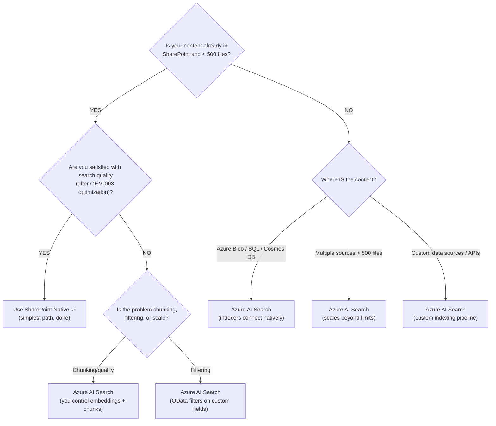
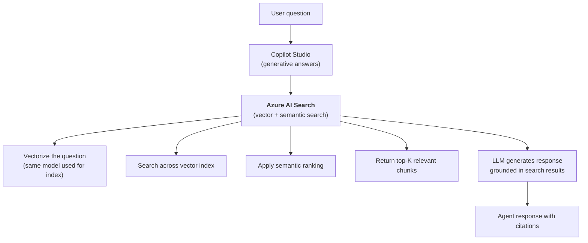
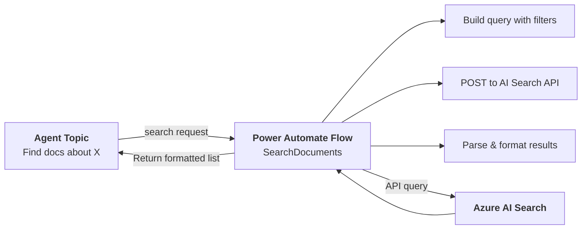

# Gem 026: Azure AI Search Advanced Integration

*When SharePoint knowledge isn't enough — bring enterprise-scale search with vector indexes, semantic ranking, and custom schemas.*

## Classification

| Attribute | Value |
|---|---|
| **Category** | Performance |
| **Complexity** | ⭐⭐⭐ to ⭐⭐⭐⭐ (depends on index sophistication) |
| **Channels** | All |
| **Prerequisite Gems** | [Gem 008](GEM-008-knowledge-source-optimization.md) (knowledge source optimization — the foundational knowledge Gem) |

## The Problem

[Gem 008](GEM-008-knowledge-source-optimization.md) covers optimizing **built-in knowledge sources** — SharePoint sites, uploaded files, public websites. These work well for small-to-medium document collections (hundreds of files). But enterprise agents face scenarios where built-in sources hit their limits.

### When to Use Azure AI Search vs SharePoint Native — Decision Guide

Before diving into Azure AI Search approaches, understand whether you actually need it. SharePoint native knowledge is simpler and sufficient for many agents.

#### How Each Works Internally

| Aspect | SharePoint Native Knowledge | Azure AI Search Knowledge |
|---|---|---|
| **Indexing** | Platform-managed — Copilot Studio ingests via Dataverse, chunks files, creates vector embeddings automatically | You build the index externally — choose embedding model, chunking strategy, schema, and ranking profile |
| **Embedding model** | Platform-managed (you don't choose) | You choose (text-embedding-ada-002, text-embedding-3-small, etc.) |
| **Chunking** | Platform-managed (no control over chunk size or overlap) | You control: chunk size, overlap, boundaries (by paragraph, page, heading) |
| **Semantic ranking** | Built-in but opaque — no configuration | Explicit semantic configuration — you choose which fields are title/content/keywords |
| **Vector search** | Automatic vector embeddings via Dataverse | Configurable: hybrid (vector + keyword), pure vector, or keyword-only |
| **Metadata/filtering** | None — no field-level filtering available | Full OData filters on custom fields (department, date, type, author, etc.) |
| **Index refresh** | Automatic scheduled sync (not manually triggerable) | You control: push API, indexers on schedule, blob change detection |
| **Scale** | Max 500 knowledge objects per agent. Files ≤7 MB without M365 Copilot license. Up to 15 SharePoint lists / 2,048 rows per list | Millions of documents. No practical file count limit. Full enterprise scale |
| **Permissions** | Live checks against SharePoint — user sees only what they can access | Depends on auth type: user-delegated inherits Azure RBAC; API key gives full access |
| **Citations** | Automatic (links back to SharePoint file) | Requires URL field in index (`metadata_storage_path` or equivalent) |

#### The Decision Flow



#### Quick Decision Table

| Scenario | SharePoint Native | Azure AI Search |
|---|---|---|
| < 500 documents, all in SharePoint | ✅ Best choice | Overkill |
| Documents in Word/HTML formats | ✅ Works well with [GEM-008](GEM-008-knowledge-source-optimization.md) | Not needed |
| Need custom chunking (specific section patterns) | ❌ Can't control | ✅ You define boundaries |
| Need metadata filtering ("Engineering docs from Q4") | ❌ Not exposed | ✅ Full OData on any field |
| > 500 documents or > 7 MB files | ❌ Platform limits | ✅ Scales to millions |
| Content NOT in SharePoint (databases, APIs, repos) | ❌ SharePoint only | ✅ Indexes any data source |
| Need hybrid search (keyword + vector) | ❌ Platform decides | ✅ You configure strategy |
| Multi-language with language-specific analyzers | ❌ Platform-managed | ✅ Per-field analyzers |
| Existing Azure AI Search investment | ❌ Would duplicate data | ✅ Reuse existing indexes |
| Need scoring profiles or faceted search | ❌ Not available | ✅ Custom scoring + facets |
| Sensitive permissions (live SharePoint RLS) | ✅ Live permission checks | 🟡 Depends on auth config |

#### The Hybrid Pattern (Recommended for Production)

Most production agents benefit from **both**:

- **SharePoint Native** for general knowledge (policies, FAQs, guides) — automatic sync, live permissions, zero config
- **Azure AI Search** for specialized collections (product catalogs with metadata, support ticket archives, technical docs with custom chunking) — full control, scale, filtering

Both coexist as separate knowledge sources in the same agent. The orchestrator routes to the right source based on the query.

---

### Why Azure AI Search — The Enterprise Scenarios

Beyond the decision guide above, here are the specific scenarios that justify Azure AI Search:

- **Scale**: 50,000+ documents across multiple repositories. Built-in SharePoint indexing may be slow or inconsistent at this scale.
- **Custom schemas**: Your content isn't just "documents" — it's structured data with custom fields (product specs with SKU, price, category, availability), work items with complex metadata, or multi-language content requiring language-specific analyzers.
- **Hybrid search**: You need both keyword-based (BM25) AND vector-based (semantic) search for maximum recall. Built-in knowledge sources offer semantic ranking but limited control over the search strategy.
- **Existing investment**: Your org already has Azure AI Search indexes built by data engineers — indexing CRM data, product catalogs, support tickets, or wiki content. You don't want to rebuild these as SharePoint sites just for Copilot Studio.
- **Precision**: You need field-level filtering ("show me only documents from the Engineering department updated in the last 90 days"), scoring profiles, or faceted search. Built-in knowledge sources don't expose these controls.

**Azure AI Search as a Copilot Studio knowledge source** bridges this gap. It reached GA in May 2025 — and it's specifically designed for consuming pre-built indexes that pro-developers have already created.

## The Ideal Outcome

Enterprise-grade search powering agent responses:

- [ ] **Pre-built index reuse**: Existing Azure AI Search indexes consumed directly — no data duplication
- [ ] **Vector + semantic search**: Integrated vectorization for high-quality semantic matching
- [ ] **Citation quality**: Responses cite specific documents with links to source content
- [ ] **Custom filtering**: Agent can filter by metadata fields (department, date, type, product line)
- [ ] **Scalable**: Handles 10K to 1M+ documents without degradation

## Approaches

### Approach A: Native Azure AI Search Knowledge Source (GA)

**Summary**: Add your Azure AI Search vector index as a first-class knowledge source in Copilot Studio. The platform handles search, ranking, and context injection for generative answers — same as SharePoint or file upload knowledge, but backed by your custom index.  
**Technique**: Copilot Studio knowledge source configuration, Azure AI Search connection (API key or Entra ID), vector index reference, integrated vectorization.

#### How It Works



The key benefit: Copilot Studio uses the **same embedded model** that was used to vectorize your index data. This ensures query-document similarity is optimized — the same semantic space for both the question and the content.

#### Implementation

**Step 1: Prepare your Azure AI Search index**

Your index must be configured for **integrated vectorization**. If you're starting from scratch:

1. In Azure Portal → Azure AI Search service → **Import and vectorize data**
2. Select your data source (Blob Storage, SQL, Cosmos DB, etc.)
3. Choose your embedding model (e.g., `text-embedding-ada-002` or `text-embedding-3-small`)
4. Azure creates a vector index with both text and vector fields
5. Optionally enable **semantic ranker** for re-ranking (improves precision for top results)

If you have an existing index, ensure it includes:

- A **vector field** with embeddings from a supported embedding model
- A **text field** containing the searchable content (must be `searchable`)
- A **title/URL field** for citations (see Step 4)

**Step 2: Add Azure AI Search as knowledge source in Copilot Studio**

1. Open your agent → **Knowledge** → **Add knowledge**
2. Select **Featured** → **Azure AI Search**
3. Select **Create new connection**
4. Choose authentication type:

    | Auth Type | When to Use |
    |---|---|
    | **Access Key** | Simplest. Use the admin key from Azure portal. Good for dev/test. |
    | **Service Principal (Entra ID)** | Production. No key rotation needed. Role-based access. |
    | **Microsoft Entra ID Integrated** | When the agent runs as the signed-in user. Inherits user's search permissions. |
    | **Client Certificate** | High-security environments requiring certificate-based auth. |

5. Enter your **Azure AI Search Endpoint URL** and credentials
6. Click **Create** → **Next**
7. Enter your **vector index name** (only one vector index per connection)
8. Click **Add to agent**

The status shows "In progress" while Copilot Studio indexes the metadata. Once "Ready," you can test.

**Step 3: Configure semantic ranking (recommended)**

Semantic ranking re-ranks the initial search results using a deep learning model for improved precision:

1. In Azure Portal → your AI Search service → **Semantic configurations**
2. Create a semantic configuration specifying which fields contain the title, content, and keywords
3. In Copilot Studio, the semantic ranker is automatically used if configured on the index

> **Note**: Semantic ranker requires the Standard tier or higher on your Azure AI Search service. It's not available on the Free tier.

**Step 4: Configure citations**

For responses to cite specific documents with clickable links:

- Include a `metadata_storage_path` field in your index → Copilot Studio interprets this as the citation URL
- OR include any field containing a complete URL → Copilot Studio uses it as the citation link
- Ensure citation URLs point to locations the user has access to (SharePoint, web app, etc.)

```Text
Index fields for citations:
  metadata_storage_path: "https://contoso.sharepoint.com/docs/HR-PTO-Policy.docx"
  → Copilot Studio shows: "Source: HR-PTO-Policy.docx [link]"
```

**Step 5: Enhance with custom search instructions**

Use `customInstructions` in generative answers to guide how the LLM uses search results:

```yaml
    - kind: SearchAndSummarizeContent
      id: searchAISearch
      variable: Topic.Answer
      userInput: =System.Activity.Text
      customInstructions: |
        ## Search Result Usage Rules
        
        1. ALWAYS cite the source document title and link
        2. If multiple documents contain relevant info, synthesize across sources
        3. If the search returns no results, say: "I couldn't find that in our knowledge base"
        4. For numerical data (dates, amounts), quote exactly from the source
        5. Indicate document recency: "According to [title], last updated [date]..."
```

**Step 6: Test with targeted queries**

Test queries that exercise different search capabilities:

| Test Query | What It Validates |
|---|---|
| "What's the PTO policy?" | Basic text retrieval |
| "Compare PTO policies across regions" | Multi-document synthesis |
| "Engineering documents updated this quarter" | Metadata awareness (if in index) |
| "What does section 3.2 say about carryover?" | Specific document section retrieval |
| "[Query in French for English documents]" | Cross-lingual semantic search |

#### Evaluation

| Criterion | Rating | Notes |
|---|---|---|
| Ease of Implementation | 🟢 | UI-based connection. If index exists, takes 15 minutes. |
| Maintainability | 🟢 | Index managed in Azure. Data pipeline updates content. Agent configuration is static. |
| Channel Compatibility | 🟢 | All channels — knowledge source is backend-only. |
| Search Quality | 🟢 | Vector + semantic ranking. Best search quality available in the platform. |
| Citation Quality | 🟢 | Automatic citations from index URL fields. |
| Scalability | 🟢 | Azure AI Search scales to millions of documents. Built for enterprise. |

#### Limitations

- **One vector index per connection**: You can only add one vector index per Azure AI Search connection. For multiple indexes, create multiple connections — but only one is used per generative answers node.
- **Index must use integrated vectorization**: The index fields must align with what Copilot Studio expects — vector field, text field, and ideally a URL field for citations. Custom or legacy indexes may need restructuring.
- **No direct query control**: You can't specify OData filters, scoring profiles, or search modes from Copilot Studio. The platform manages the search query. If you need query-level control, use Approach B.
- **Virtual networks not supported**: Azure AI Search indexes configured for private endpoints / VNets are not accessible from Copilot Studio's cloud-hosted service.
- **Cost**: Azure AI Search has per-unit pricing. Semantic ranker adds cost. Vector storage adds cost. Factor these into your budget ([Gem 012](GEM-012-cost-estimation-and-token-budget-management.md)).

---

### Approach B: HTTP Node to Azure AI Search REST API

**Summary**: Call the Azure AI Search REST API directly from a topic using `HttpRequest` nodes. Full control over the search query — filters, scoring profiles, facets, search modes, and result transformation.  
**Technique**: `HttpRequest` node with Azure AI Search query API, OData filter expressions, custom result formatting, environment variables for keys.

#### How It Works

```Text
User: "Show me engineering docs about Kubernetes from the last 90 days"
    │
    ▼
Topic extracts: department=Engineering, topic=Kubernetes, dateRange=90days
    │
    ▼
HttpRequest to Azure AI Search:
  POST /indexes/{index}/docs/search
  Body: {
    "search": "Kubernetes",
    "filter": "department eq 'Engineering' and lastModified gt 2025-11-19",
    "select": "title,summary,url,lastModified,department",
    "top": 5,
    "queryType": "semantic",
    "semanticConfiguration": "default"
  }
    │
    ▼
Parse results → format as table/list → display to user
```

This gives you **full OData query power** — something the native knowledge source (Approach A) doesn't expose.

#### Implementation

**Step 1: Store search credentials in environment variables**

```xml
<environmentvariabledefinition schemaname="agent_SearchEndpoint">
  <defaultvalue>https://contoso-search.search.windows.net</defaultvalue>
</environmentvariabledefinition>

<environmentvariabledefinition schemaname="agent_SearchApiKey">
  <defaultvalue>[your-api-key]</defaultvalue>
</environmentvariabledefinition>

<environmentvariabledefinition schemaname="agent_SearchIndexName">
  <defaultvalue>enterprise-content</defaultvalue>
</environmentvariabledefinition>
```

**Step 2: Build the search query topic**

```yaml
kind: AdaptiveDialog
beginDialog:
  kind: OnRecognizedIntent
  id: main
  intent:
    displayName: Advanced Document Search
    triggerQueries:
      - "search documents"
      - "find documents about"
      - "show me docs"
      - "search for"
  actions:
    # Collect search parameters
    - kind: Question
      id: askQuery
      variable: init:Topic.SearchQuery
      prompt: "What are you looking for?"
      entity: StringPrebuiltEntity

    # Execute search via HTTP
    - kind: HttpRequest
      id: http_search
      method: POST
      url: =Concatenate(Env.agent_SearchEndpoint, "/indexes/", Env.agent_SearchIndexName, "/docs/search?api-version=2024-07-01")
      headers:
        - key: "api-key"
          value: =Env.agent_SearchApiKey
        - key: "Content-Type"
          value: "application/json"
      body: |
        {
          "search": "{Topic.SearchQuery}",
          "queryType": "semantic",
          "semanticConfiguration": "default",
          "select": "title,summary,url,lastModified,department,content",
          "top": 5,
          "count": true
        }
      responseType: json
      responseVariable: Topic.SearchResults
      errorHandling:
        continueOnError: true
        statusCodeVariable: Topic.SearchStatus
      timeout: 10000

    # Check results
    - kind: ConditionGroup
      id: checkSearchResults
      conditions:
        - id: hasResults
          condition: =Topic.SearchStatus >= 200 && Topic.SearchStatus < 300
          actions:
            - kind: SendActivity
              id: showResults
              activity:
                text:
                  - "🔍 Found {Topic.SearchResults.@odata.count} results for \"{Topic.SearchQuery}\":\n\n{Topic.FormattedResults}\n\nWould you like me to search for something else?"
      elseActions:
        - kind: SendActivity
          id: searchError
          activity:
            text:
              - "I'm having trouble searching right now. Try again in a moment or browse directly: [Search Portal](https://search.contoso.com)"
```

**Step 3: Add filtered search (metadata-driven)**

```yaml
    # Advanced: filtered search with metadata
    - kind: HttpRequest
      id: http_filteredSearch
      method: POST
      url: =Concatenate(Env.agent_SearchEndpoint, "/indexes/", Env.agent_SearchIndexName, "/docs/search?api-version=2024-07-01")
      headers:
        - key: "api-key"
          value: =Env.agent_SearchApiKey
        - key: "Content-Type"
          value: "application/json"
      body: |
        {
          "search": "{Topic.SearchQuery}",
          "filter": "department eq '{Topic.Department}' and lastModified gt {Topic.DateFilter}",
          "orderby": "lastModified desc",
          "select": "title,summary,url,lastModified,department",
          "top": 10,
          "facets": ["department,count:5"],
          "queryType": "semantic",
          "semanticConfiguration": "default",
          "answers": "extractive|count-3",
          "captions": "extractive|highlight-true"
        }
      responseType: json
      responseVariable: Topic.FilteredResults
      errorHandling:
        continueOnError: true
        statusCodeVariable: Topic.FilterStatus
      timeout: 10000
```

**Step 4: Use LLM to synthesize results**

Instead of just listing results, use a Prompt Tool or the generative answers node to synthesize search results into a coherent answer:

```yaml
kind: PromptTool
id: prompt_synthesizeSearch
displayName: "Search Result Synthesizer"
description: "Synthesizes Azure AI Search results into a coherent answer"
instructions: |
  You are a document analysis assistant. Given search results and a user question,
  synthesize a clear, cited answer.
  
  User Question: {userQuery}
  
  Search Results:
  {searchResults}
  
  Rules:
  1. Answer the question using ONLY the information in the search results
  2. Cite each fact with the document title: "According to [title]..."
  3. If results don't fully answer the question, say what's missing
  4. Keep the answer under 200 words
  5. Include links to source documents for further reading
  
model:
  provider: ManagedModel
  modelNameHint: GPT4Mini
inputs:
  - name: userQuery
    type: string
    required: true
  - name: searchResults
    type: string
    required: true
outputs:
  - name: answer
    type: string
```

#### Evaluation

| Criterion | Rating | Notes |
|---|---|---|
| Ease of Implementation | 🟡 | Requires OData query construction and response parsing. Pro-dev level. |
| Maintainability | 🟡 | Queries embedded in YAML. Index schema changes require query updates. |
| Channel Compatibility | 🟢 | All channels (HTTP backend). |
| Search Quality | 🟢 | Full control: semantic, vector, hybrid, keyword-only. Best precision possible. |
| Filter/Facet Support | 🟢 | Full OData filter, facet, and orderby support. |
| Citation Quality | 🟢 | You control exactly how results are displayed and cited. |

#### Limitations

- **OData query complexity**: Building filtered, semantic, faceted queries in JSON within YAML is verbose and error-prone. Test queries in the Azure Portal Search Explorer first, then port to YAML.
- **No automatic context injection**: Unlike Approach A (where Copilot Studio manages the search-to-LLM pipeline), you must manually pass search results to a Prompt Tool or generative answers node (Step 4).
- **API key management**: The search API key is in an environment variable. For production, consider Managed Identity or service principal authentication.
- **Response parsing**: Search results are deeply nested JSON. Extracting and formatting `@search.answers`, captions, and highlights requires careful Power Fx.

---

### Approach C: Power Automate Search Flow as Agent Tool

**Summary**: Build a Power Automate flow that queries Azure AI Search, processes and formats results, and returns them to the agent. The flow handles the query complexity; the agent gets clean, formatted results.  
**Technique**: Power Automate cloud flow with HTTP action to AI Search REST API, result parsing and formatting, registered as Copilot Studio tool.

#### How It Works



#### Implementation

**Step 1: Create the search flow**

```Text
Trigger: Run a flow from Copilot
  Inputs:
    searchQuery (Text)
    department (Text, optional)
    dateRange (Text, optional: "7d", "30d", "90d")
    maxResults (Number, default: 5)

Action: Compose — Build filter expression
  Expression:
    if(isBlank(department) && isBlank(dateRange), '',
    concat(
      if(isBlank(department), '', concat("department eq '", department, "'")),
      if(isBlank(department) || isBlank(dateRange), '', ' and '),
      if(isBlank(dateRange), '', concat("lastModified gt ", dateRangeToDate(dateRange)))
    ))

Action: HTTP — Query Azure AI Search
  Method: POST
  URI: {SearchEndpoint}/indexes/{IndexName}/docs/search?api-version=2024-07-01
  Headers:
    api-key: {SearchApiKey}
    Content-Type: application/json
  Body: {
    "search": "{searchQuery}",
    "filter": "{filterExpression}",
    "select": "title,summary,url,lastModified,department",
    "top": {maxResults},
    "queryType": "semantic",
    "semanticConfiguration": "default",
    "count": true
  }

Action: Select — Format results
  From: body('HTTP')?['value']
  Map:
    title: item()?['title']
    summary: item()?['summary']
    url: item()?['url']
    modified: formatDateTime(item()?['lastModified'], 'MMM dd, yyyy')
    department: item()?['department']

Action: Create HTML table (or Join to Markdown)
  Format results as readable list

Output:
  resultCount (Number)
  formattedResults (Text)
  hasMore (Boolean)
```

**Step 2: Register as agent tool**

In Copilot Studio → **Tools** → **Add a tool** → Select your search flow → **Add to agent**

Ensure the flow description is clear for routing:
> "Searches enterprise documents with optional filters for department and date range. Use when users ask to find, search, or locate specific documents or information."

**Step 3: Agent instructions for search usage**

```yaml
instructions: |+
  ## Document Search
  
  You have access to the "SearchDocuments" tool for finding enterprise content.
  
  When users ask to find, search, or locate documents:
  1. Extract the search query from their message
  2. If they mention a department, pass it as a filter
  3. If they mention a time period ("recent", "this month", "last quarter"), map to dateRange
  4. Present results as a numbered list with titles, summaries, and links
  5. If no results, suggest broader search terms
  
  Mapping for dateRange:
  - "recent" / "this week" → "7d"
  - "this month" → "30d"
  - "this quarter" / "last 90 days" → "90d"
  - No mention → leave empty (all time)
```

#### Evaluation

| Criterion | Rating | Notes |
|---|---|---|
| Ease of Implementation | 🟡 | Visual flow design. Easier than raw HTTP in YAML, but still requires API knowledge. |
| Maintainability | 🟢 | Flow is visual, reusable. Query changes in one place. |
| Channel Compatibility | 🟢 | All channels (flow is backend). |
| Search Quality | 🟢 | Same API access as Approach B. Full query control. |
| Filter/Facet Support | 🟢 | Full OData in the flow — easier to build/test than in YAML. |
| Result Formatting | 🟢 | Flow handles complex JSON parsing and formatting before returning to agent. |

#### Limitations

- **Flow quota**: Each search consumes a flow run. Heavy search usage will impact your Power Automate quota.
- **Latency**: Power Automate adds 1-3 seconds to each search. Over Approach B's direct HTTP call.
- **Dual infrastructure**: You're maintaining both a flow AND the Azure AI Search index. Two places for things to break.
- **No automatic generative grounding**: Like Approach B, results are returned as data. You must pass them to a Prompt Tool or generative answers for synthesis.

---

## Comparison Matrix

| Dimension | Approach A: Native Knowledge | Approach B: HTTP Direct | Approach C: PA Search Flow |
|---|---|---|---|
| **Implementation Effort** | 🟢 Low (15 min config) | 🟡 Medium (YAML queries) | 🟡 Medium (visual flow) |
| **Query Control** | 🔴 None (platform-managed) | 🟢 Full OData power | 🟢 Full OData power |
| **Generative Grounding** | 🟢 Automatic (SearchAndSummarize) | 🟡 Manual (Prompt Tool) | 🟡 Manual (Prompt Tool) |
| **Filtering** | 🔴 Not exposed | 🟢 Full OData filters | 🟢 Full OData filters |
| **Citation Quality** | 🟢 Automatic from URL fields | 🟡 Manual formatting | 🟡 Manual formatting |
| **Flow Quota Impact** | 🟢 None | 🟢 None | 🔴 1 run per search |
| **Latency** | 🟢 Optimized by platform | 🟢 Direct (~200-500ms) | 🟡 +1-3s (PA overhead) |
| **Index Requirements** | 🟡 Vector index with integrated vectorization | 🟢 Any index type | 🟢 Any index type |
| **Best When...** | Standard search, same experience as SharePoint knowledge | Custom filters, scoring profiles, pro-dev team | Visual flow design, reusable search tool |

## Recommended Approach

**Start with Approach A (Native Knowledge Source)** — if your index uses integrated vectorization, this gives you generative answers grounded in Azure AI Search with zero code. The experience is identical to having a supercharged SharePoint knowledge source — but backed by a scalable Azure search index. For most agents, this is sufficient and dramatically better than built-in SharePoint knowledge.

**Add Approach B or C when you need query control** — specifically when users need to **filter by metadata** (department, date, document type). The native knowledge source (Approach A) doesn't expose filter parameters. If your users say "Show me Engineering documents from last quarter," you need Approach B or C.

**The hybrid pattern (recommended for production)**:

```Text
General knowledge questions  →  Approach A (Native, automatic grounding)
  "What's our data retention policy?"
  "How do I configure SSO?"

Filtered document search     →  Approach B/C (HTTP or Flow, with filters)
  "Show me Engineering docs from Q4"
  "Find compliance reports about GDPR"
  "Latest updates from the Security team"
```

Use **Approach A** as the primary knowledge source (always active, grounding every generative answer). Use **Approach B or C** as an explicit search tool for when users want to **find specific documents** with metadata filters.

## Platform Gotchas

> [!WARNING]
> **Azure AI Search indexes on virtual networks are NOT supported.**  
> Copilot Studio's cloud service cannot access AI Search indexes configured with private endpoints or VNet restrictions. Your index must be publicly accessible (secured by API key or Entra ID). For private indexes, use Approach C (Power Automate flow) — the flow can run with a VNet connection.

> [!WARNING]
> **Only ONE vector index per connection.**  
> You can add only one vector index name per AI Search connection in Copilot Studio. If you have multiple indexes (e.g., HR-policies, Engineering-docs, Product-catalog), you need separate connections — but only one is used per generative answers node. For multi-index search, use Approach B/C with multiple HTTP queries.

> [!WARNING]
> **Semantic ranker requires Standard tier or higher.**  
> The semantic ranker (which dramatically improves search precision) is not available on the Free tier of Azure AI Search. If your index is on the Free tier, you get basic vector search only — no semantic re-ranking.

> [!NOTE]
> **Integrated vectorization is the recommended indexing approach.**  
> Use the Azure Portal's "Import and vectorize data" wizard to create your index. This ensures the same embedding model is used for both index vectorization and runtime query vectorization — critical for search quality.

> [!NOTE]
> **Citations require a URL field in the index.**  
> If your index doesn't include a `metadata_storage_path` or another field with a complete URL, Copilot Studio can't generate citation links. Add a URL field to your index schema that points to the source document's accessible location.

> [!NOTE]
> **Test queries in Search Explorer first.**  
> Before writing HTTP queries in YAML or Power Automate, test them in the Azure Portal's **Search Explorer**. This validates your query syntax, filters, and semantic configuration against live data — then port the working query to your agent.

## Related Gems

- **[Gem 008](GEM-008-knowledge-source-optimization.md)**: Knowledge Source Optimization — Covers document format and chunking for built-in sources. This Gem is "[GEM-008](GEM-008-knowledge-source-optimization.md) Level 2" for enterprise-scale knowledge with Azure AI Search.
- **[Gem 028](GEM-028-grounding-agents-in-enterprise-analytics-data.md)**: Grounding in Enterprise Analytics — For structured data (warehouses, Power BI). This Gem covers unstructured/semi-structured document search.
- **[Gem 018](GEM-018-sharepoint-document-retrieval-and-display.md)**: SharePoint Document Retrieval — For finding and listing SharePoint documents. Azure AI Search can index SharePoint content for more powerful search.
- **[Gem 012](GEM-012-cost-estimation-and-token-budget-management.md)**: Cost Estimation — Azure AI Search has per-unit and per-query costs. Factor into your token budget analysis.
- **[Gem 023](GEM-023-mcp-connector-integration-patterns.md)**: MCP Connector Integration — MCP is for tool integration; AI Search is for knowledge grounding. Different roles in the agent architecture.

## References

- [Microsoft Learn: Add Azure AI Search as knowledge source](https://learn.microsoft.com/microsoft-copilot-studio/knowledge-azure-ai-search)
- [Microsoft Learn: Create a vector index (Azure AI Search)](https://learn.microsoft.com/azure/search/vector-search-how-to-create-index)
- [Microsoft Learn: Integrated vectorization in Azure AI Search](https://learn.microsoft.com/azure/search/vector-search-integrated-vectorization)
- [Microsoft Learn: Semantic ranker overview](https://learn.microsoft.com/azure/search/semantic-search-overview)
- [Microsoft Learn: Azure AI Search REST API (query)](https://learn.microsoft.com/rest/api/searchservice/documents/search-post)
- [Microsoft Learn: OData filter syntax for Azure AI Search](https://learn.microsoft.com/azure/search/search-query-odata-filter)
- [Azure AI Search pricing](https://azure.microsoft.com/pricing/details/search/)

---

*Gem 026 | Author: Sébastien Brochet | Created: 2026-02-17 | Last Validated: 2026-02-17 | Platform Version: current (Azure AI Search knowledge source GA since May 2025)*
