# Gem 027: Deterministic Conversation Flows for Regulated Workflows

*When the LLM's creativity is a liability — build flows that MUST follow the script.*

## Classification

| Attribute | Value |
|---|---|
| **Category** | UX |
| **Complexity** | ⭐⭐⭐⭐ (Complex — architecture decision with legal/compliance implications) |
| **Channels** | All |
| **Prerequisite Gems** | [Gem 022](GEM-022-secure-data-handling-in-conversations.md) (secure data handling for regulated contexts) |

## The Problem

Every other Gem in this collection leverages generative AI — the LLM's ability to understand natural language, synthesize answers, and adapt to context. But some conversations **must not be left to the LLM's judgment**:

- **KYC (Know Your Customer) verification**: "Please confirm your date of birth, government ID number, and address." — The agent MUST collect all three fields. It CANNOT decide to skip one because "the user seems verified."
- **GDPR consent collection**: "Do you consent to data processing as described in our privacy policy? [Yes/No]" — The response MUST be logged with a timestamp. The agent CANNOT paraphrase the consent question or infer consent from context.
- **Medical intake**: "Are you currently experiencing chest pain? [Yes/No]" — The agent MUST ask this exact question in this exact order. It CANNOT reorder the triage questions based on "what seems most relevant."
- **Legal disclaimer acknowledgment**: "By proceeding, you acknowledge that this is not legal advice." — The agent MUST display this text verbatim before providing any legal-adjacent information.
- **Audit procedures**: "Step 4 of 7: Verify that the backup script ran successfully." — The agent MUST NOT allow the user to skip to step 7.

The fundamental tension: **Copilot Studio's generative orchestration is designed to be flexible and adaptive. Regulated workflows require the opposite — rigid, deterministic, and auditable.**

When the LLM decides to "helpfully" skip a consent question because the user said "yeah, sure, whatever," your organization faces legal liability. When the LLM paraphrases a legal disclaimer, the paraphrase may not be legally valid.

## The Ideal Outcome

A conversation flow that meets regulatory requirements:

- [ ] **Deterministic sequencing**: Steps execute in a fixed order. No step can be skipped.
- [ ] **Verbatim messages**: Regulatory text is displayed exactly as written — not paraphrased by the LLM.
- [ ] **Complete audit trail**: Every step, every user response, and every timestamp is logged.
- [ ] **No LLM interpretation of regulated content**: The LLM doesn't process, summarize, or modify regulated text.
- [ ] **Graceful integration**: Regulated flows coexist with generative features in the same agent.

## Approaches

### Approach A: Fully Manual Topic Authoring (No Generative AI)

**Summary**: Build the regulated flow as a 100% manually-authored topic. Every message is a `SendActivity` with static text. Every input is a `Question` with explicit validation. No `SearchAndSummarizeContent`, no Prompt Tools, no generative orchestration.  
**Technique**: Manual `AdaptiveDialog` with sequential nodes, hardcoded text, `LogCustomTelemetryEvent` for audit.

#### How It Works

```Text
Step 1: Display disclaimer    → Static SendActivity (verbatim text)
Step 2: Collect consent       → Question (Boolean, required)
Step 3: Verify identity       → Question (text + validation)
Step 4: Collect data field A  → Question (entity validation)
Step 5: Collect data field B  → Question (entity validation)
Step 6: Confirmation summary  → SendActivity (formatted summary)
Step 7: Submit                → InvokeFlow (persist to Dataverse)
Step 8: Audit log             → LogCustomTelemetryEvent

No LLM is involved at any point. Every message, every question, every response is explicit.
```

#### Implementation

**Step 1: Create a deterministic intake topic**

Example: GDPR consent collection + data processing request.

```yaml
kind: AdaptiveDialog
startBehavior: CancelOtherTopics
beginDialog:
  kind: OnRecognizedIntent
  id: main
  intent:
    displayName: Data Processing Request
    includeInOnSelectIntent: true
    triggerQueries:
      - "data processing request"
      - "process my data"
      - "GDPR request"
      - "data subject request"
  actions:
    # =============================================
    # STEP 1: Legal Disclaimer (VERBATIM — do not modify)
    # =============================================
    - kind: SendActivity
      id: step1_disclaimer
      activity:
        text:
          - "**Important Legal Notice**\n\nThis process collects personal data for the purpose of fulfilling your data subject request under the General Data Protection Regulation (GDPR), Article 15-22.\n\nBy proceeding, you acknowledge that:\n1. You are requesting this action on your own behalf, or you have legal authority to do so.\n2. We will verify your identity before processing.\n3. Processing may take up to 30 calendar days.\n4. Submitted requests cannot be modified after submission.\n\nFor questions about this process, contact privacy@contoso.com."

    # Log: disclaimer displayed
    - kind: LogCustomTelemetryEvent
      id: audit_disclaimer
      eventName: RegulatedFlowAudit
      properties: "={FlowName: \"GDPRDataRequest\", Step: \"1_DisclaimerDisplayed\", UserId: System.User.Id, ConversationId: System.Conversation.Id, Timestamp: Text(Now(), DateTimeFormat.UTC)}"

    # =============================================
    # STEP 2: Explicit Consent (required, no skip)
    # =============================================
    - kind: Question
      id: step2_consent
      variable: init:Topic.UserConsent
      prompt: "Do you acknowledge the above terms and wish to proceed?\n\n**You must select Yes or No to continue.**"
      entity: BooleanPrebuiltEntity
      alwaysPrompt: true

    # Gate: Must consent to continue
    - kind: ConditionGroup
      id: checkConsent
      conditions:
        - id: consentGiven
          condition: =Topic.UserConsent = true
          actions:
            - kind: LogCustomTelemetryEvent
              id: audit_consent
              eventName: RegulatedFlowAudit
              properties: "={FlowName: \"GDPRDataRequest\", Step: \"2_ConsentGiven\", Consent: true, UserId: System.User.Id, ConversationId: System.Conversation.Id, Timestamp: Text(Now(), DateTimeFormat.UTC)}"
      elseActions:
        - kind: SendActivity
          id: consentDeclined
          activity:
            text:
              - "Understood. Your request has been cancelled. No data has been collected or processed.\n\nIf you change your mind, you can start a new request at any time."
        - kind: LogCustomTelemetryEvent
          id: audit_declined
          eventName: RegulatedFlowAudit
          properties: "={FlowName: \"GDPRDataRequest\", Step: \"2_ConsentDeclined\", Consent: false, UserId: System.User.Id, ConversationId: System.Conversation.Id, Timestamp: Text(Now(), DateTimeFormat.UTC)}"
        - kind: EndDialog
          id: endOnDecline
          clearTopicQueue: true

    # =============================================
    # STEP 3: Identity Verification (required)
    # =============================================
    - kind: Question
      id: step3_fullName
      variable: init:Topic.FullName
      prompt: "**Step 1 of 3: Identity Verification**\n\nPlease provide your full legal name as it appears on your employment contract:"
      entity: PersonNamePrebuiltEntity
      alwaysPrompt: true

    - kind: Question
      id: step3_email
      variable: init:Topic.VerifyEmail
      prompt: "Please provide your company email address for verification:"
      entity: EmailPrebuiltEntity
      alwaysPrompt: true

    - kind: Question
      id: step3_employeeId
      variable: init:Topic.EmployeeId
      prompt: "Please provide your Employee ID (format: E-XXXXX):"
      entity: StringPrebuiltEntity
      alwaysPrompt: true

    - kind: LogCustomTelemetryEvent
      id: audit_identity
      eventName: RegulatedFlowAudit
      properties: "={FlowName: \"GDPRDataRequest\", Step: \"3_IdentityCollected\", EmailProvided: !IsBlank(Topic.VerifyEmail), UserId: System.User.Id, ConversationId: System.Conversation.Id, Timestamp: Text(Now(), DateTimeFormat.UTC)}"

    # =============================================
    # STEP 4: Request Details (required)
    # =============================================
    - kind: Question
      id: step4_requestType
      variable: init:Topic.RequestType
      prompt: "**Step 2 of 3: Request Type**\n\nWhat type of data request would you like to make?"
      entity: ChoicePrebuiltEntity
      alwaysPrompt: true
      choiceOptions:
        - value: "Access"
          synonyms: ["view my data", "see my data", "Article 15"]
        - value: "Rectification"
          synonyms: ["correct my data", "fix my data", "Article 16"]
        - value: "Erasure"
          synonyms: ["delete my data", "right to be forgotten", "Article 17"]
        - value: "Portability"
          synonyms: ["export my data", "download my data", "Article 20"]

    - kind: Question
      id: step4_details
      variable: init:Topic.RequestDetails
      prompt: "Please describe what specific data or records this request pertains to:"
      entity: StringPrebuiltEntity
      alwaysPrompt: true

    - kind: LogCustomTelemetryEvent
      id: audit_requestDetails
      eventName: RegulatedFlowAudit
      properties: "={FlowName: \"GDPRDataRequest\", Step: \"4_RequestDetailsCollected\", RequestType: Topic.RequestType, UserId: System.User.Id, ConversationId: System.Conversation.Id, Timestamp: Text(Now(), DateTimeFormat.UTC)}"

    # =============================================
    # STEP 5: Confirmation Summary (all fields displayed)
    # =============================================
    - kind: SendActivity
      id: step5_summary
      activity:
        text:
          - "**Step 3 of 3: Review and Submit**\n\nPlease review your request:\n\n| Field | Value |\n|---|---|\n| **Name** | {Topic.FullName} |\n| **Email** | {Topic.VerifyEmail} |\n| **Employee ID** | {Topic.EmployeeId} |\n| **Request Type** | {Topic.RequestType} |\n| **Details** | {Topic.RequestDetails} |\n\n⚠️ **Once submitted, this request cannot be modified.**"

    - kind: Question
      id: step5_confirm
      variable: init:Topic.FinalConfirm
      prompt: "Submit this request?"
      entity: BooleanPrebuiltEntity
      alwaysPrompt: true

    - kind: ConditionGroup
      id: checkFinalConfirm
      conditions:
        - id: confirmed
          condition: =Topic.FinalConfirm = true
          actions:
            # Submit via Power Automate
            - kind: InvokeFlow
              id: submitRequest
              flowId: "@environmentVariables('SubmitGDPRRequestFlowId')"
              inputs:
                fullName: =Topic.FullName
                email: =Topic.VerifyEmail
                employeeId: =Topic.EmployeeId
                requestType: =Topic.RequestType
                details: =Topic.RequestDetails
                consentTimestamp: =Text(Now(), DateTimeFormat.UTC)
              outputVariable: Topic.SubmitResult

            - kind: SendActivity
              id: submitConfirmation
              activity:
                text:
                  - "✅ **Request Submitted**\n\n**Reference Number**: {Topic.SubmitResult.referenceNumber}\n**Expected Completion**: Within 30 calendar days\n**Status Updates**: You will receive email updates at {Topic.VerifyEmail}\n\nFor questions, contact privacy@contoso.com and reference **{Topic.SubmitResult.referenceNumber}**."

            - kind: LogCustomTelemetryEvent
              id: audit_submitted
              eventName: RegulatedFlowAudit
              properties: "={FlowName: \"GDPRDataRequest\", Step: \"5_Submitted\", ReferenceNumber: Topic.SubmitResult.referenceNumber, RequestType: Topic.RequestType, UserId: System.User.Id, ConversationId: System.Conversation.Id, Timestamp: Text(Now(), DateTimeFormat.UTC)}"
      elseActions:
        - kind: SendActivity
          id: cancelSubmit
          activity:
            text:
              - "Your request has been cancelled. No data has been submitted.\n\nYou can start a new request anytime."
        - kind: LogCustomTelemetryEvent
          id: audit_cancelled
          eventName: RegulatedFlowAudit
          properties: "={FlowName: \"GDPRDataRequest\", Step: \"5_Cancelled\", UserId: System.User.Id, ConversationId: System.Conversation.Id, Timestamp: Text(Now(), DateTimeFormat.UTC)}"

    - kind: EndDialog
      id: endFlow
      clearTopicQueue: true
```

**Step 2: Prevent generative AI override**

Use `startBehavior: CancelOtherTopics` (shown above) to ensure the regulated topic takes full control once triggered. The orchestrator cannot interrupt or reroute.

Also add to agent instructions:

```yaml
instructions: |+
  ## Regulated Workflows
  
  When the user triggers a "Data Processing Request" or any GDPR-related topic:
  - DO NOT attempt to answer their data request yourself
  - DO NOT skip, summarize, or paraphrase any step in the regulated flow
  - Let the dedicated topic handle EVERY step exactly as authored
  - NEVER intervene or "helpfully" complete steps for the user
```

#### Evaluation

| Criterion | Rating | Notes |
|---|---|---|
| Ease of Implementation | 🟢 | Standard topic authoring. No advanced components. |
| Maintainability | 🟡 | Verbose YAML. Every message is hardcoded. Changes require editing and redeploying. |
| Channel Compatibility | 🟢 | Works in all channels (plain text + choice questions). |
| Determinism | 🟢 | 100% deterministic. No LLM involvement. Every step executes exactly as authored. |
| Audit Trail | 🟢 | LogCustomTelemetryEvent at every step. Complete, timestamped trail. |
| Regulatory Compliance | 🟢 | Verbatim text, mandatory steps, explicit consent logging. |

#### Limitations

- **Rigid UX**: The conversation feels robotic. No natural language understanding within the regulated flow — the user can't say "skip to the consent part."
- **Verbose implementation**: A 7-step flow with audit logging at every step creates very long YAML files.
- **No clarification**: If the user's input to a Question doesn't match the expected entity, the re-prompt is generic. No LLM-powered "Did you mean...?" assistance.
- **All or nothing**: The entire flow is deterministic. You can't mix in generative elements for non-regulated parts of the same flow.

---

### Approach B: Hybrid — Deterministic Steps + Generative Clarification

**Summary**: The regulated steps (consent, data collection, audit) are fully manual and deterministic. But within those steps, the LLM can provide clarification and explanation on request.  
**Technique**: Manual topic for the regulated flow structure, `SearchAndSummarizeContent` or Prompt Tool available for "explain this" side queries, clear boundary between regulated steps and optional explanations.

#### How It Works

```Text
STEP 1: Display disclaimer (static, verbatim)
  User: "What does Article 15 mean?"        ← Optional clarification
  Agent: [Generative answer about GDPR Art 15] ← LLM-powered explanation
  Agent: "Now, back to the process..."       ← Returns to deterministic flow

STEP 2: Collect consent (static question, mandatory)
  User: "Yes"
  → Logged, proceed to Step 3

STEP 3: Identity verification (static questions)
  User: "What format should my Employee ID be in?"  ← Clarification
  Agent: "Your Employee ID is in the format E-XXXXX, found on your payslip."
  Agent: "Please provide your Employee ID:"  ← Back to the step
```

The regulated flow is a deterministic backbone. Generative AI is available as a **side channel** for explanations, but never controls the flow progression.

#### Implementation

**Step 1: Build the deterministic backbone (same as Approach A)**

Use the same `AdaptiveDialog` structure from Approach A for all mandatory steps.

**Step 2: Add optional clarification at each step**

After each mandatory message, offer a clarification option:

```yaml
    # STEP 1: Disclaimer
    - kind: SendActivity
      id: step1_disclaimer
      activity:
        text:
          - "**Important Legal Notice**\n\n[...verbatim disclaimer text...]\n\n💡 _If you have questions about any of these terms, just ask before proceeding._"

    # Wait for user: either consent answer OR clarification question
    - kind: Question
      id: step1_response
      variable: init:Topic.Step1Response
      prompt: "Do you acknowledge the above terms? (Yes / No)\n\nOr ask any question about the terms:"
      entity: StringPrebuiltEntity

    # Check: is it a consent answer or a clarification?
    - kind: ConditionGroup
      id: routeStep1
      conditions:
        - id: isYes
          condition: =Lower(Topic.Step1Response) = "yes"
          actions:
            # Proceed to Step 2 (consent logged)
            - kind: SetVariable
              id: setConsent
              variable: Topic.UserConsent
              value: =true
        - id: isNo
          condition: =Lower(Topic.Step1Response) = "no"
          actions:
            # Cancel flow
            - kind: SendActivity
              id: cancelFlow
              activity:
                text:
                  - "Understood. Your request has been cancelled."
            - kind: EndDialog
              id: endOnNo
              clearTopicQueue: true
      elseActions:
        # Clarification requested — use generative AI
        - kind: SearchAndSummarizeContent
          id: clarifyTerms
          variable: Topic.Clarification
          userInput: =Topic.Step1Response
          customInstructions: |
            The user is asking about terms in our GDPR data processing request form.
            Answer their question about the legal terms, GDPR articles, or process.
            Keep the explanation simple and under 100 words.
            After explaining, remind them to respond Yes or No to the consent question.

        - kind: SendActivity
          id: sendClarification
          activity:
            text:
              - "{Topic.Clarification}\n\n---\n\n↩️ **Back to the form**: Do you acknowledge the terms? (Yes / No)"

        # Re-ask the consent question
        - kind: Question
          id: reaskConsent
          variable: Topic.UserConsent
          prompt: "Do you acknowledge the above terms?"
          entity: BooleanPrebuiltEntity
          alwaysPrompt: true
```

**Step 3: Ensure generative AI never modifies the flow**

Key rules for the hybrid pattern:

```yaml
instructions: |+
  ## Hybrid Regulated Flow Rules
  
  When a regulated workflow (GDPR, KYC, medical intake) is active:
  
  1. NEVER skip, reorder, or summarize mandatory steps
  2. You MAY answer clarification questions about terms, process, or requirements
  3. After answering a clarification, ALWAYS return to the current step
  4. NEVER use the user's clarification question as a substitute for their actual answer
  5. Clarification answers are NOT logged as official responses
  6. Only explicit Yes/No or data field answers are logged to the audit trail
```

#### Evaluation

| Criterion | Rating | Notes |
|---|---|---|
| Ease of Implementation | 🟡 | Approach A complexity + clarification routing logic. |
| Maintainability | 🟡 | More complex branching per step (consent vs clarification). |
| Channel Compatibility | 🟢 | Works in all channels. |
| Determinism | 🟢 | Flow backbone is 100% deterministic. Clarification is a non-destructive side channel. |
| Audit Trail | 🟢 | Only mandatory step responses are logged. Clarifications are labeled separately. |
| User Experience | 🟢 | Users can ask questions without leaving the flow. Much less robotic than Approach A. |

#### Limitations

- **Complex per-step routing**: Each step needs: mandatory answer detection, clarification detection, generative answer, return-to-step logic. This multiplies the YAML per step.
- **Clarification scope risk**: The generative AI answering a clarification question may inadvertently provide information that contradicts or modifies the mandatory text. Strict `customInstructions` mitigate this but don't eliminate it.
- **User confusion**: "I asked a question and the bot answered, but now it's asking me the same consent question again" — the UX of returning to the step after clarification can feel repetitive.

---

### Approach C: State Machine with Power Automate

**Summary**: Externalize the flow logic to a Power Automate flow that manages state (current step, completed steps, audit log). The agent topic is thin — it calls the flow at each turn, and the flow tells it what to display and ask next.  
**Technique**: Power Automate flow as state machine, Dataverse records for ongoing request state, agent topic as I/O interface.

#### How It Works



```mermaid
flowchart LR
    A["<b>Agent Topic</b><br/><br/>User triggers flow<br/>User provides answers<br/>All steps complete"] -- "User input" --> B["<b>Power Automate<br/>State Machine</b><br/><br/>Create request record<br/>Validate answer<br/>Update record (Step N ✓)<br/>Determine next step<br/>Finalize request<br/>Generate reference number"]
    B -- "Step instructions /<br/>Confirmation + ref#" --> A
    B -- "Create / Update" --> C["<b>Dataverse</b><br/><br/>Request record<br/>with state tracking"]
    C -- "Current state" --> B
```

The flow is the brain. The topic is just the mouth and ears. All state, validation, sequencing, and audit logic lives in the flow.

#### Implementation

**Step 1: Design the Dataverse state table**

| Column | Type | Description |
|---|---|---|
| `RequestId` | Auto-number | Unique request reference |
| `UserId` | Single line text | Requesting user |
| `CurrentStep` | Integer | Current step number (1-7) |
| `Status` | Choice (InProgress/Completed/Cancelled) | Overall status |
| `ConsentGiven` | Boolean | Step 2 result |
| `ConsentTimestamp` | DateTime | When consent was given |
| `FullName` | Single line text | Step 3 result |
| `Email` | Single line text | Step 3 result |
| `EmployeeId` | Single line text | Step 3 result |
| `RequestType` | Choice | Step 4 result |
| `RequestDetails` | Multi-line text | Step 4 result |
| `AuditLog` | Multi-line text | JSON array of all step events |

**Step 2: Create the state machine flow**

```Text
Trigger: Run a flow from Copilot
  Inputs: requestId (Text, optional), userInput (Text), userId (Text)

# If no requestId — create new request
Condition: IsBlank(requestId)
  Yes → Create Row (Dataverse): new request, CurrentStep = 1
        Set requestId = new row ID
  No  → Get Row (Dataverse): load existing request

# State machine switch on CurrentStep
Switch: CurrentStep
  Case 1 (Disclaimer):
    Output:
      message: "[verbatim disclaimer text]"
      question: "Do you acknowledge? (Yes/No)"
      type: "boolean"
      nextStep: 2

  Case 2 (Consent):
    Validate: userInput is "yes" or "no"
    If "yes":
      Update row: ConsentGiven=true, ConsentTimestamp=utcNow(), CurrentStep=3
      Append to AuditLog: {step: 2, action: "consent", value: true, timestamp: utcNow()}
      Output: next step instructions
    If "no":
      Update row: Status=Cancelled
      Output: cancellation message

  Case 3 (Identity - Name):
    Update row: FullName=userInput, CurrentStep=4
    Append to AuditLog: {step: 3, action: "name_collected", timestamp: utcNow()}
    Output: email question

  Case 4 (Identity - Email):
    Validate: email format
    Update row: Email=userInput, CurrentStep=5
    Output: employee ID question

  # ... cases 5-7 ...

  Case 7 (Submit):
    Update row: Status=Completed
    Generate reference number
    Output: confirmation with reference
```

**Step 3: Thin agent topic**

```yaml
kind: AdaptiveDialog
beginDialog:
  kind: OnRecognizedIntent
  id: main
  intent:
    displayName: Regulated Request
    triggerQueries:
      - "data request"
      - "GDPR request"
  actions:
    # Start or resume the flow
    - kind: InvokeFlow
      id: processStep
      flowId: "@environmentVariables('RegulatedFlowId')"
      inputs:
        requestId: =Global.CurrentRequestId
        userInput: =System.Activity.Text
        userId: =System.User.Id
      outputVariable: Topic.FlowResponse

    # Display what the flow tells us
    - kind: SendActivity
      id: showStep
      activity:
        text:
          - "{Topic.FlowResponse.message}"

    # Save the request ID for next turn
    - kind: SetVariable
      id: saveRequestId
      variable: Global.CurrentRequestId
      value: =Topic.FlowResponse.requestId

    # Ask the question the flow specified
    - kind: ConditionGroup
      id: checkFlowStatus
      conditions:
        - id: isComplete
          condition: =Topic.FlowResponse.status = "Completed" || Topic.FlowResponse.status = "Cancelled"
          actions:
            - kind: SetVariable
              id: clearRequest
              variable: Global.CurrentRequestId
              value: =""
            - kind: EndDialog
              id: endRegulated
              clearTopicQueue: true
      elseActions:
        - kind: Question
          id: collectInput
          variable: init:Topic.UserInput
          prompt: =Topic.FlowResponse.question
          entity: StringPrebuiltEntity
```

#### Evaluation

| Criterion | Rating | Notes |
|---|---|---|
| Ease of Implementation | 🔴 | Complex flow logic + Dataverse state table + thin topic. Most architecture of all approaches. |
| Maintainability | 🟢 | Flow is visual (Power Automate designer). Business logic separate from presentation. |
| Channel Compatibility | 🟢 | Agent topic is minimal — works in all channels. |
| Determinism | 🟢 | Flow controls sequencing absolutely. Agent can't skip steps. |
| Audit Trail | 🟢 | Dataverse row IS the audit trail. Every step recorded with timestamps. Queryable, exportable. |
| Resumability | 🟢 | If conversation drops, user can resume from the last completed step (state persisted in Dataverse). |

#### Limitations

- **Highest implementation complexity**: The state machine flow, Dataverse table, and thin topic pattern require significant design and development.
- **Power Automate latency**: Every step round-trips through Power Automate (1-3 seconds). A 7-step flow has 7 round-trips.
- **Flow quota impact**: Every step consumes a flow run. A 7-step process = 7 flow runs per request.
- **Debugging difficulty**: When something goes wrong, you need to trace through flow run history, Dataverse records, and conversation logs — three different places.
- **Overkill for simple flows**: A 3-step consent collection doesn't need a state machine. Approach A suffices.

---

## Comparison Matrix

| Dimension | Approach A: Fully Manual | Approach B: Hybrid | Approach C: State Machine |
|---|---|---|---|
| **Implementation Effort** | 🟢 Low (2-3 hours) | 🟡 Medium (4-6 hours) | 🔴 High (1-2 days) |
| **Determinism** | 🟢 100% | 🟢 100% (backbone) | 🟢 100% |
| **User Experience** | 🔴 Robotic | 🟢 Natural (clarification) | 🟡 Step-by-step (functional) |
| **Audit Trail** | 🟢 Telemetry events | 🟢 Telemetry events | 🟢 Dataverse records |
| **Resumability** | 🔴 Must restart if drops | 🔴 Must restart if drops | 🟢 Resume from last step |
| **Clarification Support** | 🔴 None | 🟢 Generative side channel | 🔴 None (unless added) |
| **Logic Separation** | 🔴 All in topic YAML | 🟡 Mixed | 🟢 Logic in flow, UI in topic |
| **Best When...** | Simple regulated flows (3-5 steps) | User needs to understand terms | Long flows, resumability, audit emphasis |

## Recommended Approach

**For simple regulated flows (3-5 steps)**: **Approach A (Fully Manual)** — the simplest path to compliance. Verbatim text, mandatory questions, audit logging. Quick to implement, easy to audit.

**For user-friendly regulated flows**: **Approach B (Hybrid)** — when users need to understand what they're consenting to, generative clarification within a deterministic backbone is the best UX. It's the "explain this clause to me" pattern that real users need.

**For complex, long, or resumable regulated flows**: **Approach C (State Machine)** — when the flow has 7+ steps, may take multiple sessions to complete, or when the audit trail must be a permanent, queryable Dataverse record. Worth the investment for high-compliance scenarios.

**Decision guide**:

```Text
3-5 steps, simple consent     →  Approach A (manual, 2 hours)
5-7 steps, user needs help    →  Approach B (hybrid, 4-6 hours)
7+ steps, multi-session       →  Approach C (state machine, 1-2 days)
```

## Platform Gotchas

> [!WARNING]
> **`startBehavior: CancelOtherTopics` is essential for regulated flows.**  
> Without it, generative orchestration may interrupt your regulated topic with a different topic match mid-flow. Always set this for any regulated topic.

> [!WARNING]
> **Generative orchestration can "helpfully" answer before the regulated topic fires.**  
> If a user says "I want to submit a GDPR request," the orchestrator may try to answer with generative content about GDPR rather than triggering your deterministic topic. Add agent instructions: "NEVER answer GDPR-related questions directly. ALWAYS route to the 'Data Processing Request' topic."

> [!WARNING]
> **`alwaysPrompt: true` is required for mandatory questions.**  
> Without `alwaysPrompt`, Copilot Studio may skip a question if it thinks the user already answered it (from conversation context). For regulated flows, EVERY question must be explicitly asked and answered in sequence.

> [!NOTE]
> **LogCustomTelemetryEvent is your audit trail.**  
> For Approach A and B, telemetry events with step names, timestamps, and consent values create a queryable audit trail in Application Insights. Use KQL to generate compliance reports.

> [!NOTE]
> **These flows coexist with generative features.**  
> Your agent can be 90% generative (FAQ, knowledge search, natural conversation) and 10% deterministic (regulated flows). The regulated topics only take over when their trigger phrases fire. The rest of the agent behaves normally.

## Related Gems

- **[Gem 022](GEM-022-secure-data-handling-in-conversations.md)**: Secure Data Handling — Regulated flows often collect sensitive data. Apply [Gem 022](GEM-022-secure-data-handling-in-conversations.md)'s redaction patterns to audit logs.
- **[Gem 006](GEM-006-adaptive-cards-as-multi-field-forms.md)**: Adaptive Cards as Multi-Field Forms — Use cards within regulated flows for multi-field collection in fewer turns.
- **[Gem 004](GEM-004-debug-mode-for-m365-copilot.md)**: Debug Mode — Telemetry pipeline from [Gem 004](GEM-004-debug-mode-for-m365-copilot.md) is the same infrastructure used for compliance audit logging.
- **[Gem 015](GEM-015-dataverse-crud-operations-patterns.md)**: Dataverse CRUD — State Machine (Approach C) uses Dataverse patterns from [Gem 015](GEM-015-dataverse-crud-operations-patterns.md) for request state management.
- **[Gem 021](GEM-021-conversation-branching-and-disambiguation.md)**: Disambiguation — Regulated topics need unique trigger phrases that don't overlap with generative topics.

## References

- [GDPR Article 15-22: Data Subject Rights](https://gdpr-info.eu/chapter-3/)
- [Microsoft Learn: Topic authoring in Copilot Studio](https://learn.microsoft.com/en-us/microsoft-copilot-studio/authoring-create-and-edit-topics)
- [Microsoft Learn: Question nodes](https://learn.microsoft.com/en-us/microsoft-copilot-studio/authoring-ask-a-question)
- [Microsoft Learn: Application Insights custom events](https://learn.microsoft.com/en-us/microsoft-copilot-studio/advanced-custom-analytics)
- [PCI-DSS requirements for conversational AI](https://www.pcisecuritystandards.org/)

---

*Gem 027 | Author: Sébastien Brochet | Created: 2026-02-17 | Last Validated: 2026-02-17 | Platform Version: current*
