# Gem 028: Grounding Agents in Enterprise Analytics Data

*Your agent answers questions from documents. Now make it answer from warehouses, lakehouses, and Power BI too.*

## Classification

| Attribute | Value |
|---|---|
| **Category** | Integration |
| **Complexity** | ⭐⭐⭐ to ⭐⭐⭐⭐ (depends on data source and approach) |
| **Channels** | Teams, Web Chat (M365 Copilot not currently supported for Fabric Data Agent) |
| **Prerequisite Gems** | [Gem 008](GEM-008-knowledge-source-optimization.md) (knowledge source optimization — the document-grounding counterpart) |

## The Problem

Gems 008 and 018 cover grounding agents in **unstructured content** — documents, wikis, SharePoint files. But enterprise users also ask questions that require **structured data**:

- "What were our Q4 revenue numbers by region?" — The answer is in a **data warehouse**, not a Word document.
- "Show me the top 10 customers by order volume this month." — The answer is in a **lakehouse** table.
- "What's the trend for support ticket resolution time over the last 6 months?" — The answer is in a **Power BI semantic model**.
- "How many active IoT devices are reporting errors right now?" — The answer is in a **KQL database**.

These questions can't be answered by searching documents. They require **querying structured data sources** — SQL against warehouses, DAX against semantic models, KQL against analytics databases. The data exists in Microsoft Fabric, but the agent doesn't know how to reach it.

The traditional approach — build Power Automate flows that run specific queries and return results — works for predictable questions. But it fails for **ad-hoc analytics**: the user asks a question nobody anticipated, and there's no pre-built flow for it.

**Microsoft Fabric Data Agents** solve this by translating natural language into data queries dynamically. Copilot Studio can now consume Fabric Data Agents as connected agents — enabling your agent to answer both document questions ([GEM-008](GEM-008-knowledge-source-optimization.md)) AND data questions in a single conversation.

## The Ideal Outcome

An agent that seamlessly handles both document-grounded and data-grounded questions:

- [ ] **Structured data access**: Agent can query warehouses, lakehouses, semantic models, and KQL databases
- [ ] **Natural language queries**: Users ask in plain language; the system translates to SQL/DAX/KQL
- [ ] **Ad-hoc analysis**: Not limited to pre-built queries — handles questions nobody anticipated
- [ ] **Combined grounding**: One agent answers "What's the PTO policy?" (document) AND "How many tickets were opened this week?" (data) in the same conversation
- [ ] **Data security**: Users only see data they're authorized to access

## Approaches

### Approach A: Fabric Data Agent as Connected Agent (Preview)

**Summary**: Create a Fabric Data Agent in Microsoft Fabric that connects to your enterprise data sources (warehouses, lakehouses, semantic models, KQL databases). Add it to your Copilot Studio agent as a connected agent. The orchestrator routes data questions to the Fabric agent automatically.  
**Technique**: Microsoft Fabric Data Agent (published), Copilot Studio connected agent configuration, generative orchestration for routing.

#### How It Works



```mermaid
flowchart TB
    A["User: What were Q4 revenue numbers by region?"] --> B["<b>Copilot Studio Orchestrator</b>"]
    B -->|"Document question"| C["Knowledge Sources (GEM-008)"]
    B -->|"Data/analytics question"| D["<b>Fabric Data Agent</b><br/><br/>NL → SQL/DAX/KQL<br/>Query → Results<br/>Results → Response"]
    D --> E["Q4 Revenue by Region:<br/>EMEA: $2.4M | NA: $3.1M | APAC: $1.8M"]
```

The Fabric Data Agent handles the hard part: translating natural language into the right query language (SQL for warehouses, DAX for semantic models, KQL for analytics databases), executing the query, and formatting the results.

#### Implementation

**Step 1: Create and configure the Fabric Data Agent**

In Microsoft Fabric:

1. Navigate to your Fabric workspace
2. Create a new **Data Agent**
3. Connect it to your data sources:
   - **Warehouse**: SQL-queryable structured data
   - **Lakehouse**: Delta tables for big data
   - **Power BI Semantic Models**: Pre-modeled business metrics (via XMLA endpoints)
   - **KQL Database**: Real-time analytics and telemetry
   - **Ontology**: Business domain definitions
4. Write a **rich, detailed description** for the data agent — this is what Copilot Studio uses for routing
5. Test the data agent in Fabric: ask sample questions, verify SQL/DAX generation
6. **Publish** the data agent

**Step 2: Add the Fabric Data Agent to your Copilot Studio agent**

1. In Copilot Studio → **Agents** tab → **+ Add**
2. Under **Connect to an external agent**, select **Microsoft Fabric**
3. Create or select a Fabric connection
4. Select your published Fabric Data Agent from the list
5. Adjust the **description** to be specific for routing:
   - ❌ "Data Agent" (too vague)
   - ✅ "Enterprise analytics specialist. Handles questions about revenue, sales, customer metrics, ticket volumes, and operational KPIs from our data warehouse and Power BI reports."
6. Click **Add agent**

**Step 3: Configure authentication**

Under the connected Fabric Data Agent's settings, choose:

| Auth Type | When to Use |
|---|---|
| **User authentication** | Users query with their own Fabric permissions. They only see data they're authorized to access. Best for row-level security. |
| **Agent author authentication** | All queries run with the agent author's permissions. Users see the same data regardless of their access level. Simpler but less secure. |

For most enterprise scenarios, **User authentication** is recommended — it inherits existing Fabric security models.

**Step 4: Enable generative orchestration**

In Copilot Studio → **Settings** → **Orchestration** → Select generative orchestration (first option). This is required for the orchestrator to route between knowledge sources and connected agents.

**Step 5: Add routing guidance in agent instructions**

```yaml
kind: GptComponentMetadata
displayName: Enterprise Assistant
instructions: |+
  # Enterprise Assistant
  
  You serve two types of questions:
  
  ## Document Questions
  Questions about policies, procedures, guides, and reference materials.
  Examples: "What's the PTO policy?", "How do I submit an expense report?"
  → Answer from your knowledge sources (SharePoint, uploaded documents)
  
  ## Data/Analytics Questions
  Questions about numbers, metrics, trends, comparisons, and business data.
  Examples: "What was Q4 revenue?", "How many tickets this week?", "Top customers by volume"
  → Route to the Fabric Data Agent for live data queries
  
  ## Routing Rules
  - If the question asks for a NUMBER, TREND, COMPARISON, or METRIC → Fabric Data Agent
  - If the question asks for a POLICY, PROCESS, or GUIDE → Knowledge Sources
  - If unclear, ask: "Are you looking for a policy/document, or for data/numbers?"
```

**Step 6: Test combined grounding**

In the Test panel:

- "What's our PTO policy?" → Should route to knowledge sources
- "How many PTO days were used across the company this year?" → Should route to Fabric Data Agent
- "Show me Q4 revenue by region" → Fabric Data Agent
- "Where's the Q4 financial report document?" → Knowledge sources

#### Evaluation

| Criterion | Rating | Notes |
|---|---|---|
| Ease of Implementation | 🟢 | UI-based: create Fabric agent, publish, add to Copilot Studio. No code. |
| Maintainability | 🟢 | Data agent maintained in Fabric. Schema changes handled by Fabric. |
| Channel Compatibility | 🟡 | Teams and Web Chat. M365 Copilot not currently supported for Fabric connected agents. |
| Ad-hoc Queries | 🟢 | Natural language → SQL/DAX/KQL translation. Handles unpredictable questions. |
| Data Security | 🟢 | User authentication inherits Fabric RLS. Users see only their authorized data. |
| Combined Grounding | 🟢 | Orchestrator routes between documents and data automatically. |

#### Limitations

- **Preview status**: Fabric Data Agent integration with Copilot Studio is in preview. Behavior and availability may change.
- **Fabric capacity required**: Requires F2 or higher Fabric capacity, or Power BI Premium P1+. Not available on free tiers.
- **Same tenant**: Fabric Data Agent and Copilot Studio must be on the same tenant.
- **M365 Copilot not supported**: The connected agent with Fabric Data Agent doesn't currently work in the M365 Copilot channel.
- **Query accuracy**: Natural language → SQL translation isn't perfect. Complex joins, subqueries, or ambiguous column names may produce incorrect results. Always validate with known queries first.
- **Not for transactional writes**: Fabric Data Agents are read-only analytics. For creating/updating records, use [GEM-015](GEM-015-dataverse-crud-operations-patterns.md) (Dataverse CRUD).

---

### Approach B: Power Automate Flows with Pre-Built Queries

**Summary**: Build Power Automate flows that execute specific, pre-defined SQL/KQL queries against Fabric data sources. Register flows as agent tools for specific data questions.  
**Technique**: Power Automate cloud flows with SQL/KQL connector actions, parameterized queries, registered as Copilot Studio tools.

#### How It Works


Each data question maps to a pre-built flow with a specific query. The agent triggers the right flow based on the question.

#### Implementation

**Step 1: Create parameterized query flows**

```Text
Trigger: Run a flow from Copilot
  Inputs: quarter (Text), groupBy (Text, optional)

Action: Execute SQL Query (Azure SQL / Synapse / Fabric)
  Query: 
    SELECT {groupBy}, SUM(revenue) as total_revenue
    FROM dbo.sales_fact
    WHERE fiscal_quarter = '@{quarter}'
    GROUP BY {groupBy}
    ORDER BY total_revenue DESC

Action: Create HTML Table
  From: outputs('Execute_SQL_Query')

Output: formattedTable (Text), totalRevenue (Number)
```

**Step 2: Register flows as agent tools**

Each flow becomes a named tool with a clear description:

```yaml
tools:
  - name: GetQuarterlyRevenue
    description: "Get revenue figures for a specific quarter, optionally grouped by region, product, or team. Use when users ask about revenue, sales numbers, or financial performance."
    inputs: [quarter, groupBy]
    
  - name: GetTicketMetrics
    description: "Get support ticket statistics — counts, resolution times, SLA compliance. Use when users ask about ticket volumes, support performance, or SLA metrics."
    inputs: [dateRange, status, team]
    
  - name: GetCustomerInsights
    description: "Get customer analytics — top customers, churn risk, engagement scores. Use when users ask about customer performance or account health."
    inputs: [metric, topN, segment]
```

**Step 3: Add flows to the agent**

In Copilot Studio → **Tools** → **Add a tool** → Select each Power Automate flow → **Add to agent**

#### Evaluation

| Criterion | Rating | Notes |
|---|---|---|
| Ease of Implementation | 🟡 | One flow per query type. Straightforward but proliferates. |
| Maintainability | 🟡 | Schema changes require flow updates. Each new question type needs a new flow. |
| Channel Compatibility | 🟢 | All channels. |
| Ad-hoc Queries | 🔴 | Only answers questions you've pre-built flows for. No flexibility for novel queries. |
| Data Security | 🟡 | Flow runs with connection's credentials. RLS depends on connector configuration. |
| Combined Grounding | 🟢 | Works alongside knowledge sources in the same agent. |

#### Limitations

- **No ad-hoc queries**: Every question type needs a pre-built flow. "What were Q4 revenues?" works because you built that flow. "What was the average deal size in EMEA for new customers acquired in Q3?" fails unless you anticipated it.
- **Flow proliferation**: 10 data question types = 10 flows. 50 question types = 50 flows. Unscalable for analytics.
- **SQL/KQL expertise required**: You must write the queries yourself. No natural language → SQL translation.
- **Flow quota**: Each data query consumes a flow run against your quota ([GEM-012](GEM-012-cost-estimation-and-token-budget-management.md) consideration).

---

### Approach C: HTTP Node with Fabric SQL Endpoint

**Summary**: Call Fabric's SQL endpoint directly from Copilot Studio topics using `HttpRequest` nodes. Execute parameterized SQL queries against warehouses and lakehouses.  
**Technique**: `HttpRequest` node to Fabric SQL endpoint, bearer token authentication, SQL query in request body, response parsing.

#### How It Works

```Text
Topic YAML → HttpRequest → Fabric SQL Endpoint → Query results → Parse → Display
```

Direct SQL execution without Power Automate in the loop. Fastest performance but requires SQL query construction in YAML.

#### Implementation

**Step 1: Get Fabric SQL endpoint**

From your Fabric workspace → Warehouse or Lakehouse → Settings → SQL connection string.

**Step 2: Execute a query via HTTP**

```yaml
    - kind: HttpRequest
      id: http_fabricQuery
      method: POST
      url: =Concatenate(Env.agent_FabricSqlEndpoint, "/query")
      headers:
        - key: "Authorization"
          value: =Concatenate("Bearer ", Env.agent_FabricToken)
        - key: "Content-Type"
          value: "application/json"
      body: |
        {
          "query": "SELECT region, SUM(revenue) as total FROM sales_fact WHERE fiscal_quarter = '{Topic.Quarter}' GROUP BY region ORDER BY total DESC",
          "maxRows": 20
        }
      responseType: json
      responseVariable: Topic.QueryResults
      errorHandling:
        continueOnError: true
        statusCodeVariable: Topic.HttpStatus
      timeout: 15000
```

#### Evaluation

| Criterion | Rating | Notes |
|---|---|---|
| Ease of Implementation | 🔴 | SQL in YAML, auth management, response parsing. Pro-dev level. |
| Maintainability | 🔴 | SQL queries embedded in topic YAML. Hard to read, test, and update. |
| Channel Compatibility | 🟢 | All channels. |
| Ad-hoc Queries | 🔴 | Queries are hardcoded. Same limitation as Approach B but without flow visualization. |
| Data Security | 🟡 | Token-based auth. Must manage token lifecycle. |
| Combined Grounding | 🟢 | Works in any topic alongside knowledge sources. |

#### Limitations

- **All limitations of Approach B** (no ad-hoc queries, SQL expertise required) **plus** harder to maintain (SQL in YAML vs SQL in a flow's visual editor).
- **Auth token management**: Fabric SQL endpoints require Azure AD bearer tokens. Token acquisition and refresh in Copilot Studio topics is complex.
- **Only justified when**: Sub-second latency matters and you want to eliminate Power Automate overhead.

---

## Comparison Matrix

| Dimension | Approach A: Fabric Data Agent | Approach B: PA + SQL Flows | Approach C: HTTP + SQL |
|---|---|---|---|
| **Implementation Effort** | 🟢 Low (UI-based) | 🟡 Medium (per-flow) | 🔴 High (SQL in YAML) |
| **Ad-hoc Queries** | 🟢 Natural language → SQL/DAX/KQL | 🔴 Pre-built only | 🔴 Pre-built only |
| **Data Sources** | 🟢 Warehouse, Lakehouse, PBI, KQL, Ontology | 🟡 Per connector type | 🟡 SQL endpoints only |
| **Maintenance** | 🟢 Fabric-managed | 🟡 Flow per query type | 🔴 SQL in YAML |
| **Data Security (RLS)** | 🟢 User auth inherits Fabric security | 🟡 Connection-level | 🟡 Token-level |
| **Channel Support** | 🟡 Teams + Web Chat (no M365 Copilot) | 🟢 All channels | 🟢 All channels |
| **Platform Maturity** | 🟡 Preview | 🟢 GA | 🟢 GA |
| **Best When...** | Analytics agent, ad-hoc data questions, Fabric-native org | Known queries, stable schema, PA skills | Max performance, pro-dev, simple queries |

## Recommended Approach

**For analytics-heavy agents**: **Approach A (Fabric Data Agent)** — the only approach that handles ad-hoc natural language data queries. If your users ask unpredictable data questions ("What was the average deal size for EMEA enterprise customers acquired in Q3?"), pre-built flows can't keep up. The Fabric Data Agent translates to SQL/DAX dynamically.

**For predictable, known data queries**: **Approach B (Power Automate Flows)** — when you know the 5-10 data questions your users will ask and the schemas are stable. Build a flow for each. More predictable, GA, and works in all channels.

**Practical hybrid**: Use **Approach A for analytics exploration** and **Approach B for mission-critical data** (where query accuracy must be guaranteed). The Fabric Data Agent handles the long tail of ad-hoc questions; pre-built flows handle the top 5 data questions with validated SQL.

```Text
Ad-hoc analytics questions  →  Approach A (Fabric Data Agent — natural language SQL)
Top 5 predictable queries   →  Approach B (PA Flows — validated, guaranteed correct)
Document questions           →  GEM-008 (Knowledge sources — SharePoint, files)
```

## Platform Gotchas

> [!WARNING]
> **Fabric Data Agent integration is in preview.**  
> Behavior, availability, and configuration may change. Test thoroughly and have fallback plans for production deployments.

> [!WARNING]
> **M365 Copilot channel does NOT support Fabric connected agents.**  
> The connected agent with Fabric Data Agent only works in Teams and Web Chat. Do not rely on this integration for M365 Copilot deployments.

> [!WARNING]
> **Natural language → SQL translation is not 100% accurate.**  
> The Fabric Data Agent generates SQL/DAX/KQL from natural language. Complex queries with ambiguous column names, implicit joins, or business logic may produce incorrect results. Always validate with known questions before launching. Consider adding a "⚠️ Data generated by AI query — verify for critical decisions" disclaimer.

> [!WARNING]
> **Same-tenant requirement.**  
> The Fabric Data Agent and Copilot Studio agent must be on the same Microsoft tenant. Cross-tenant scenarios are not supported.

> [!NOTE]
> **Write a rich description for the Fabric Data Agent.**  
> The orchestrator routes based on the connected agent's description. A vague description ("Data agent") leads to poor routing. Be specific: "Handles questions about sales revenue, customer metrics, ticket volumes, and operational KPIs from our enterprise data warehouse."

> [!NOTE]
> **User authentication is recommended for RLS.**  
> When you choose "User authentication" for the Fabric Data Agent, queries run with the signed-in user's Fabric permissions. Users with row-level security (RLS) defined in Power BI semantic models only see their authorized data. This is the most secure option for multi-user agents.

> [!NOTE]
> **Fabric Data Agents also support Agent2Agent (A2A) and Foundry agents.**  
> Copilot Studio can also connect to Azure AI Foundry agents and agents supporting the A2A open protocol. If your structured data is in a non-Fabric system (e.g., a custom Python agent querying MongoDB), you can expose it via A2A and connect it to Copilot Studio the same way.

## Related Gems

- **[Gem 008](GEM-008-knowledge-source-optimization.md)**: Knowledge Source Optimization — The document-grounding counterpart. [GEM-008](GEM-008-knowledge-source-optimization.md) covers unstructured content; this Gem covers structured data. Same agent, two complementary grounding strategies.
- **[Gem 015](GEM-015-dataverse-crud-operations-patterns.md)**: Dataverse CRUD Operations — For writing data (create, update, delete records). This Gem is read-only analytics. [GEM-015](GEM-015-dataverse-crud-operations-patterns.md) is read-write operations.
- **[Gem 023](GEM-023-mcp-connector-integration-patterns.md)**: MCP Connector Integration — MCP is another way to connect external tools. Fabric Data Agents are a specific connected agent type, not MCP-based.
- **[Gem 021](GEM-021-conversation-branching-and-disambiguation.md)**: Disambiguation — When a query could be either a document question or a data question, the disambiguation pattern helps route correctly.
- **[Gem 007](GEM-007-role-based-feature-gating.md)**: Role-Based Feature Gating — Data access control ties to user authentication. Admins may see all data; regular users see only their segment.

## References

- [Microsoft Learn: Consume a Fabric Data Agent in Copilot Studio (preview)](https://learn.microsoft.com/fabric/data-science/data-agent-microsoft-copilot-studio)
- [Microsoft Learn: Connect to a Microsoft Foundry agent](https://learn.microsoft.com/microsoft-copilot-studio/add-agent-foundry-agent)
- [Microsoft Learn: Connect an A2A protocol agent](https://learn.microsoft.com/microsoft-copilot-studio/add-agent-agent-to-agent)
- [Microsoft Learn: Connect to a Copilot Studio agent](https://learn.microsoft.com/microsoft-copilot-studio/add-agent-copilot-studio-agent)
- [Microsoft Learn: Fabric Data Agent overview](https://learn.microsoft.com/fabric/data-science/data-agent-concept)
- [Microsoft Learn: Agent2Agent (A2A) protocol](https://a2a-protocol.org/)

---

*Gem 028 | Author: Sébastien Brochet | Created: 2026-02-17 | Last Validated: 2026-02-17 | Platform Version: current (Fabric Data Agent in preview)*
